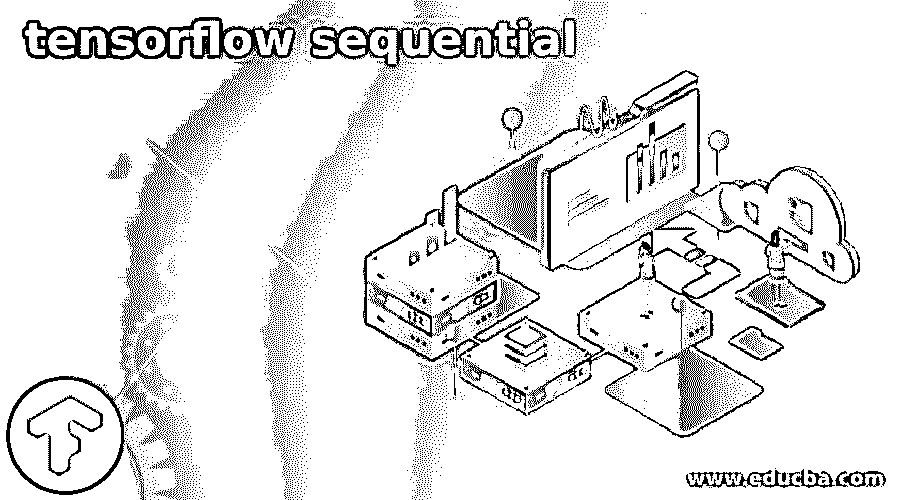
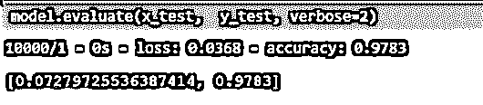
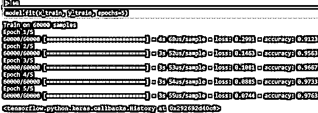

# 张量流序列

> 原文：<https://www.educba.com/tensorflow-sequential/>

## 张量流序列简介

Tensorflow sequential 是包含线性格式堆栈的组，该堆栈由库包 tf.keras.Model 的各个层组成。该顺序类从 Module、Layer 和 Model 类继承而来。顺序的基本功能是提供推理和训练的模块。在本文中，我们将看看什么是张量流序列，张量流序列模型，张量流序列函数，序列方法，张量流序列示例，最后总结我们的陈述。

### 什么是张量流序列？

Tensorflow 顺序模型可以通过使用顺序 API 来实现。构建模型时遵循的方法是一步一步地进行，并在特定时间处理单个图层。顺序 tensorflow API 是我们运行和创建 keras 模型的最简单的方法。与此同时，在创建模型时，它也带来了某些限制。

<small>Hadoop、数据科学、统计学&其他</small>

一些限制可能包括不创建可共享图层的模型、具有多个输出、具有任何分支或具有多个输入。最突出和最常用的顺序架构模型是 VGGNet、AlexNet 和 LeNet。

模型的顺序 API 方法的别名或语法如下所示

`Tensorflow.keras.Sequential( layers = None, name = None)`

上述语法中使用的参数和其中存在的属性将在下面的章节中逐一介绍——

*   **图层**–这是我们需要添加到模型中的图层列表。但是，这是一个可选参数。
*   **Name**–这个参数也是可选参数，帮助指定我们想要创建的模型名称。

**属性——共有四个属性—**

*   **层**–我们想要添加到模型中的层
*   **Distribute _ strategy**–名为 TF . Distribute . strategy 的模型创建在层的类下。
*   **Metrics _ names**–该属性负责为每个输出返回模型的显示标签。一旦我们评估和训练了 keras，这些属性就可用了。模型的实时数据上的模型。
*   如果我们希望我们的模型以急切的方式运行，这意味着我们希望我们的模型像在 python 编程语言中一样一步一步地运行，那么可以使用这个属性并指定值。但是作为一个副作用，这个模型开始工作的时候会慢一点，但是调试和导航到我们需要工作的目标层变得非常容易。编译模型的默认方式是使用静态图，这有助于维护和提高应用程序和模型的性能。

### 张量流序列模型

Tensorflow Sequential Model 是一个非常简单易用的 API，尤其适合初学者。我们称模型为顺序的，因为创建模型包括创建和定义顺序类型的类，并指定要添加到模型中的层。层的添加是一步一步完成的，这意味着从输入到输出同时添加一层。

顺序模型的一个例子是 MLP，它可以提供总共 8 个输入。它由一个隐藏的层组成，其中包含十个节点。最后一层将形成输出层，它有一个节点来帮助预测数值。举个例子，

`from tensorflow.keras import Sequential
from tensorflow.keras.layers import Dense
educbaSeqModel = Sequential()
educbaSeqModel.add(Dense(10, input_shape=(8,)))
educbaSeqModel.add(Dense(1))`

### 张量流序列函数

张量流顺序方法有助于根据我们提到的指定参数和属性创建张量流的顺序模型。该函数将逐个执行并创建每个模型层。input_shape 是顺序函数的参数，可帮助我们定义网络中可见的图层。上面的例子将接受一个包含八个数字的向量。Model.add 方法允许您向顺序模型添加一个层。您可以添加任意多的层。

### 顺序方法

本节将逐一讨论顺序模型中的方法——

*   增加
*   编制
*   评价
*   合适的
*   获取图层
*   负载重量
*   制作预测功能
*   创建测试功能
*   创建列车功能
*   流行音乐
*   预测
*   批量预测
*   预测设置
*   重置指标
*   重置状态
*   救援
*   保存规格
*   减轻重量
*   摘要
*   批量测试
*   测试步骤
*   至 json
*   去 yaml
*   分批训练
*   训练步骤

### 张量流序列示例

下面提到了不同的例子:

#### 示例#1

**代码:**

`def __call__(self, model):
if isinstance(model, educbatensorObj.Model) or isinstance(model, educbatensorObj.Sequential):
self.model = model
else:
raise TypeError(f'Expected model is tensorflow.keras Model, you have got the model {type(model)}')
updatedInput = educbatensorObj.layers.Input(shape=(self.model.input_shape[1:]), name='input')
SequentialModel = educbatensorObj.models.Model(inputs=self.model.inputs, outputs=self.model.outputs)
MeanVariantModelVar = FastMCInferenceMeanVar()(educbatensorObj.layers.TimeDistributed(SequentialModel)(FastMCRepeat(self.n)(updatedInput)))
new_SequentialModel = educbatensorObj.models.Model(inputs=updatedInput, outputs=MeanVariantModelVar)
return new_SequentialModel`

执行上述程序的输出如下图所示

#### 实施例 2

**代码:**

`def build(selfUser, shapeOfInput):
assert isinstance(shapeOfInput, list)
argumentsOfLayer = dict(
kernel_initializer=selfUser.kernel_initializer,
bias_initializer=selfUser.bias_initializer,
kernel_regularizer=selfUser.kernel_regularizer,
bias_regularizer=selfUser.bias_regularizer,
kernel_constraint=selfUser.kernel_constraint,
bias_constraint=selfUser.bias_constraint
)
seqLayers = [] for i, channels in enumerate(selfUser.mlp_hidden):
seqLayers.append(
Dense(channels, selfUser.mlp_activation, **argumentsOfLayer)
)
seqLayers.append(
Dense(selfUser.k, 'softmax', **argumentsOfLayer)
)
selfUser.mlp = Sequential(seqLayers)
super().build(shapeOfInput)`

执行上述程序的输出如下图所示

#### 实施例 3

**代码:**

`def example3SeqModel(shapeOfInput, definationOfNetwork, foundLoss, optimizingParam, metric,
is_supported_layer=has_builder,
default_layer=None) -> seqNeuralNtwkModel:
model = Sequential()
whetherFirstLayer = True
for configurationOfLayer in definationOfNetwork:
layer = configurationOfLayer.get("layer", default_layer)
if layer and is_supported_layer(layer):
del configurationOfLayer["layer"] if whetherFirstLayer:
configurationOfLayer["shapeOfInput"] = shapeOfInput
whetherFirstLayer = False
builder = get_builder(layer)
model.add(builder(**configurationOfLayer))
else:
raise ValueError(f"Suport for this {layer} Not found")
return from_keras_sequential_model(model=model,
foundLoss=foundLoss,
optimizingParam=optimizingParam,
metric=metric)`

执行上述程序的输出如下图所示

#### 实施例 4

我们将使用序列模型在 tensorflow keras 中创建一个回归模型

`def build_educbaModel(shapeOfInput):
educbaModel = keras.Sequential(
[
layers.Dense(
1, biasToBeUsed=False, activation="sigmoid", shapeOfInput=[shapeOfInput] ),
] )
educbaModel.compile(
loss="binary_crossentropy",
optimizer=tf.train.AdamOptimizer(),
metrics=["accuracy"],
)
return educbaModel`

执行上述程序的输出如下图所示

### 结论

Tensorflow Sequential 是帮助创建模型并使用各种方法操作模型的模型、API 和函数。这个模型由不同的层组成；创建模型时，每一层都是单独处理的。

### 推荐文章

这是一个张量流序列的指南。这里我们讨论什么是序列、序列模型、序列函数、序列方法和张量流序列例子。您也可以看看以下文章，了解更多信息–

1.  [张量流估计器](https://www.educba.com/tensorflow-estimator/)
2.  [张量流整形](https://www.educba.com/tensorflow-reshape/)
3.  [张量流 LSTM](https://www.educba.com/tensorflow-lstm/)
4.  [咖啡张量流](https://www.educba.com/caffe-tensorflow/)

