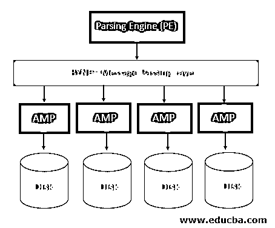

# Teradata 架构

> 原文：<https://www.educba.com/teradata-architecture/>

## Teradata 架构简介

Teradata 的架构提供了大规模并行处理的能力，这无疑遵循了分而治之的方法，即在系统中平均分配任务，而且分配得过于平均。

顾名思义，Teradata 是用于数据仓库需求的 TB 级关系 DBMS。由于其架构，它提供了相当高的速度；其中数据分布在多个 amp 上。它的架构还通过利用其并行处理能力来提供多用户访问。由于类似的原因，所以这么多年一直是市场的佼佼者。

<small>Hadoop、数据科学、统计学&其他</small>

### Teradata 架构的组件

让我们详细讨论每一项，以了解 Teradata 的架构:

#### 解析引擎(PE)

解析引擎主要从客户端接收 SQL 查询。因此，简而言之，无论何时连接到 Teradata 的引擎，您实际上都是在连接解析引擎本身。

解析引擎本身正在创建用于执行查询的执行计划。

解析引擎还在创建执行计划本身之前检查语法错误，并在出现任何语法错误时通知用户。

它还验证用户权限。确保如果用户无权访问某个表或视图。然后根据记录向用户返回用户访问消息。

*   它接收 SQL 查询，
*   检查语法错误，检查用户权限，
*   将执行计划和查询一起传递给 Bynet
*   从 amp 接收结果，并将其写回给用户

#### 消息传递层

这是节点和放大器之间的通信层，称为 BYNET。它从解析引擎接收查询和执行计划，并根据查询中提到的过滤条款，根据所需数据的可用性将其发送到所需的 amp。数据分布在多个放大器上，选择合适的放大器是 BYNET 的工作。有两个 BYNET 可用，BYNET 0 和 BYNET 1，以保持高可用性。如果一个 BYNET 出现故障，另一个就会接管。

**节点:**

节点就是 Teradata 基础设施中的每一台单独的服务器。每个节点由一个独立的:

*   记忆
*   中央处理器
*   Teradata RDBMS 软件的独立副本和
*   光盘空间也是如此

#### 存取模块处理器(AMP)

如上所述，一个放大器被称为访问模块处理器。这些是实际存储和检索数据的重要处理器。BYNET 将从解析引擎(PE)获得的查询和执行计划发送到 AMP。AMP 应该执行诸如聚合、过滤、分组等任务。，然后最终将检索到的结果保存回其相关的光盘。数据基于多个 AMP 中的主索引列均匀分布，并且基于该索引的值仅访问所需的 AMP。

**我们举个例子来详细了解一下这个:**

假设我们有一个员工 ID 列表，它被用作索引，以便在 AMP 上均匀分布数据。

假设我们有 10 个放大器可用，表中员工 ID 的范围从 1 到 1000

现在，前 100 个员工 ID 和相关数据将驻留在第一个 Amp 中

从 101 到 200 的雇员 ID 和相关数据将驻留在第一个 Amp 中

从 201 到 300 的雇员 ID 和相关数据将驻留在第三个 Amp 中

诸如此类，

以及从 901 到 1000 的雇员 ID，相关数据将驻留在第十个 Amp

这就是我们所说的在放大器之间均匀分布数据的含义

现在，如果我们要执行如下查询:

`>> select * from table_name where Employee ID = 998`

### 这将如何执行？

一旦我们提交了查询，解析引擎将检查语法错误并创建执行计划。然后，这个查询和执行计划将被传递到 BYNET，BYNET 最终将连接到所需的 AMP。在为索引表创建索引时，会创建索引表中哪个雇员 ID 可用、哪个 AMP 可用的信息。通过查找这个索引表，我们知道哪个放大器将被引用来获取雇员 ID = 998。是的，只有第十个放大器。

### 为什么这会减少查询执行时间？

考虑这样一种情况，一个查询需要扫描所有 1000 条记录，以获取雇员 ID 为 998 的单个记录的数据。这最终需要一些时间。但在 Teradata 中，由于其当前的架构将数据均匀分布在多个放大器上，我们只需检查整个数据的子集。在这种情况下，AMP 10 只有 100 条记录，而不是完整的 1000 条记录。在这种体系结构中，将节省扫描时间。简而言之，amp 的数量越多，由于要扫描的数据减少，所需的执行时间就越短。这也是 Teradata 利用多重并行处理的方式。放大器在其中起着重要的作用，由于在多个放大器上均匀分布数据的概念，因此可以并行访问多个放大器。

### 结论

顾名思义，Teradata 具有保存大量数据的能力，不仅可以保存，还可以有效地管理庞大的关系数据库管理系统。它的架构有多个组件，即解析引擎(PE)，BYNET:也称为消息传递层，AMP 和 Disc。数据均匀分布在放大器上，因此它也支持并行处理。

### 推荐文章

这是一个关于 Teradata 架构的指南。在这里，我们讨论介绍 Teradata 架构，组件，这将如何得到执行的例子。您也可以浏览我们的其他相关文章，了解更多信息——

1.  [什么是 Teradata？](https://www.educba.com/what-is-teradata/)
2.  [TeraData vs 甲骨文](https://www.educba.com/teradata-vs-oracle/)
3.  [Teradata 面试问题](https://www.educba.com/teradata-interview-questions/)
4.  [在 Teradata 的职业生涯](https://www.educba.com/career-in-teradata/)
5.  [Teradata 分区 by |如何使用？](https://www.educba.com/teradata-partition-by/)
6.  [Teradata 中的主索引指南](https://www.educba.com/primary-index-in-teradata/)