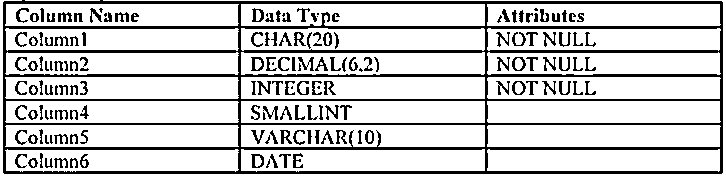

# 插入 Teradata

> 原文：<https://www.educba.com/insert-into-teradata/>

## 插入 teradata 简介

Insert into 语句用于在表中容纳新的行或记录。在该语句的执行过程中，除了提到类似“x”记录的状态已被成功插入之外，没有记录返回给用户。在本主题中，我们将了解插入 Teradata。它说明了表中的所有值，可能是空值或某个数据值。

insert 语句由列和要插入到这些列中的值的列表组成。如果我们按照表的数据结构指定值列表，那么可以跳过列列表，直接指定要插入的值。

<small>Hadoop、数据科学、统计学&其他</small>

### Teradata 中插入的是什么？

让我们看看 Teradata 的 insert into 的语法如下:

`INSERT INTO table_name (col1, col2, col3, col4, col5, col6, col7)
VALUES ( 1, 'EDU', 'CBA', 5, 5, 5.5, 7);`

上述语法符合 ANSI 语法，该语法与 Teradata 配合得非常好。

*   它由两个关键字组成，插入& VALUES
*   table _ nameis 是需要插入行的表的名称
*   table_name 后面是需要插入值的列的列表
*   关键字 VALUES 后面是需要插入到表中的实际值

如果我们按照表结构中列的顺序以特定的顺序提到列值，我们也可以跳过具体提到列名。

让我们考虑下面的表，它有 6 列，包含提到的数据类型，以及定义的属性。

可以跳过列名的替代方法如下:

`INSERT INTO table_name VALUES( 'edu' , 3.2 , 4 , , NULL , '21-01-2020' )`

一旦我们执行了上面的 Insert Into 语句，表中将会有一个新的行

*   值为 edu 的列 1
*   值为 3.2 的列 2
*   值为 4 的列 3
*   依此类推，直到第 6 列的日期值为 21-01-2020

而第 4 列在插入语句时缺少一个值，所以第 4 列也缺少数据

和列 5 将具有 Null，如上面的 Insert into 语句中所指定的。

**让我们开始讨论同样琐碎的语法:**

`INSERT INTO table_name (column1 , column2 , column6 , column3 )
VALUES ( 'edu' , 3.2 , '21-01-2020' , 4)`

这里我们已经明确指定了列名以及每列的相应值

*   列 1 的值为 edu
*   列 2 的值将为 3.2
*   第 6 列是列表中的下一列，这就是它的日期值为 21-01-2020 的原因
*   而列 3 将具有值 4

现在，我们甚至还没有在 insert into 语句中指定第 4 列和第 5 列。

第 4 列和第 5 列将容纳什么？

是的，缺失的列将被假定为 Null，并且在执行该语句后将保存 Null 值。

当文件中的数据没有按照指定的顺序出现，并且与表列的顺序不匹配时，这通常是一种很好的格式

### 如何在 Teradata 中插入？

有多种方法可以让我们为不同的需求编写 Insert 语句。下面我们来讨论其中的一些:

#### 案例 1

我们希望使用 insert 语句插入多条记录

让我们举个例子来理解同样的道理:

`INSERT INTO table_name
VALUES( 'edu' , 3.2 , 4 , , NULL , '21-01-2020' ),
( 'CBA' , 4.2 , 5 , , NULL , '22-01-2020' ),
( 'Learn' , 5.2 , 7 , , NULL , '24-01-2020' ),
( 'Online' , 6.2 , 8 , , NULL , '25-01-2020' ),
( 'data' , 8.2 , 9 , , NULL , '27-01-2020' ),
( 'science' , 9.2 , 99 , , NULL , '28-01-2020' ),
( 'Teradata' , 5.2 , 7 , , NULL , '24-01-2020' ),
( 'Python' , 6.2 , 8 , , NULL , '25-01-2020' ),
( 'Tableau' , 8.2 , 9 , , NULL , '27-01-2020' ),
( 'stats' , 9.2 , 99 , , NULL , '28-01-2020' )`

上面的语句将对表中具有上述值的 10 行感兴趣。

当我们试图使用单个 insert 语句插入多行时，Insert into 语句中的每个新行都用逗号分隔。

如果遗漏了这个逗号，Teradata 将抛出一个异常，或者说是一个语法错误。

#### 案例 2

我们希望使用 insert 语句插入多条记录，但是这些记录来自不同的表

让我们举个例子来理解同样的道理:

`INSERT INTO table_name
SELECT * FROM other_table`

Insert part 的语法类似于我们到目前为止所看到的，但是 values 部分被' SELECT '语句所取代

在这里，这个 Select 语句将间接提供值，并将这些值插入到表中。

*   从 other_table 中选择值的 select 语句应该具有与插入值的表的表结构所期望的相同的列顺序
*   此外，数据类型也需要相同
*   如果列顺序不同，我们可以在 insert 语句中特别提到列名，如下所示:
*   INSERT INTO table_name(列 1、列 2、列 6、列 3 ) SELECT * FROM other_table
*   或者可以从 select 语句本身中选择特定的列，如下所示:
*   INSERT INTO table_name 从 other_table 中选择列 1、列 2、列 6、列 3

在这种情况下，这将作为一种解决方法。

### 结论

*   INSERT INTO 语句用于向 Teradata 表中插入新记录
*   如果要输入的值与表中的列顺序不同，我们可以特别提到列名
*   我们也可以同时输入多条记录
*   单独的表格或文件也可以用作要插入的这些值的来源

### 推荐文章

这是插入 Teradata 的指南。在这里，我们讨论什么是 Teradata 中的 Insert，以及针对不同需求编写 Insert 语句的多种方法。您也可以阅读以下文章，了解更多信息——

1.  [Teradata 架构](https://www.educba.com/teradata-architecture/)
2.  [Teradata 分区依据](https://www.educba.com/teradata-partition-by/)
3.  [Teradata 中的主索引](https://www.educba.com/primary-index-in-teradata/)
4.  [什么是 Teradata？](https://www.educba.com/what-is-teradata/)

