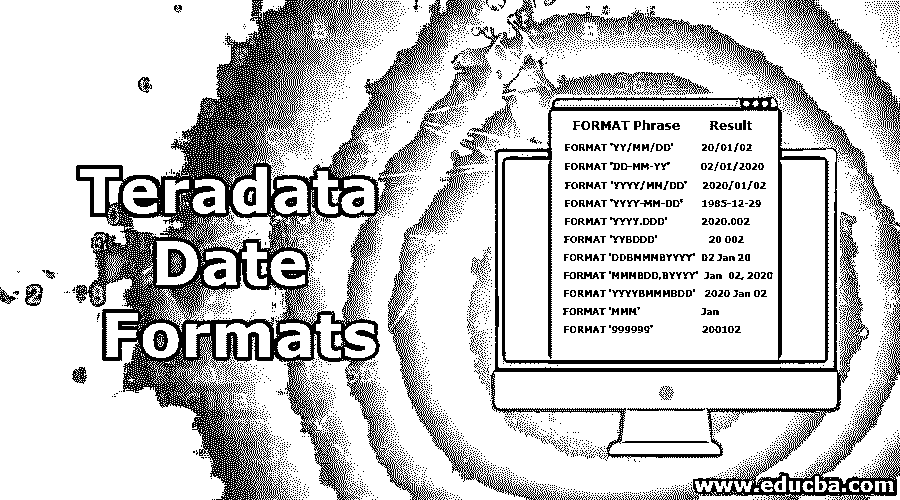
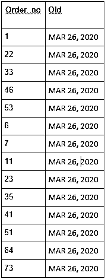

# Teradata 日期格式

> 原文：<https://www.educba.com/teradata-date-formats/>

## Teradata 日期格式简介

日期格式功能用于根据需要更新默认的日期格式。默认情况下，对于 ANSI 日期，Teradata 遵循 YYYY-MM-DD 的日期格式，而对于整数日期，默认日期格式是 YY/MM/DD。格式功能只是覆盖会话用户和系统的日期格式。另一方面，系统管理员可以更改应用于整数数据类型日期的默认格式。这可以通过修改数据格式 SDF 文件的自定义规范中的日期元素来实现。然后，通过使用 tdlocaledef 实用程序，Teradata 系统可以随时使用这些信息。

**日期格式函数的主要语法定义如下:**

<small>Hadoop、数据科学、统计学&其他</small>

`SELECT Date_column  FORMAT '<format_type>'
FROM table_name:`

*   FORMAT 关键字跟在要格式化的日期列后面。
*   这个 format 关键字后面是实际的日期格式，我们希望 date_column 按照要求进行格式化。

根据需要，可以使用多种日期格式。其中一些提到如下:

这些格式被用来代替上述语法中的' **<** 【格式类型】 **> '** ，以获得期望的结果列。

| **格式短语** | **结果** |
| 格式' YY/月/日' | 20/01/02 |
| 格式'年月日-YY ' | 02/01/2020 |
| 格式'年/月/日' | 2020/01/02 |
| 格式' YYYY-MM-DD ' | 1985-12-29 |
| 格式“YYYY”。DDD 的 | Two thousand and twenty point zero zero two |
| 格式' YYBDDD ' | 20 002 |
| DDBMMMBYYYY 格式 | 1 月 20 日 02 |
| 格式“MMMBDD，BYYYY” | 2020 年 1 月 2 日 |
| FORMAT ‘YYYYBMMMBDD’ | 2020 年 1 月 2 日 |
| 格式'嗯' | 一月 |
| 格式' EEE，BM4BDD，BYYYY ' | 2020 年 1 月 2 日星期四 |
| 格式“E4，BMMMMBDD，BYYYY” | 2020 年 1 月 2 日星期四 |
| 格式“E4 db DBM 4 by yyy” | 1985 年 1 月 2 日星期四 |
|  | (Jeudi 是法语中的星期四，扬维尔是法语中的一月。) |
| 格式' 999999 ' | Two hundred thousand one hundred and two |

而下面提到了一些时间戳格式，它们可以用来修改时间戳列。这些格式被用来代替上述语法中的' **<** 【格式类型】 **> '** ，以获得期望的结果列

| **格式短语** | **结果** |
| 格式'月/日/年:MIBT ' | 下午 02/01/20 01:30 |
| 格式“MMMBDD，BYYBHH:MI:SS” | 20 年 1 月 2 日 13:30:00 |
| 格式' E3，BM4BDD，BY4BHH:MI:SSDS(F)' | 2020 年 1 月 2 日星期四 13:30:00.00 |
| 格式' YYYY-MM-DDBHH:MI:SSDS(F)Z ' | 2020-01-02 13:00:00.64+03:00 |

此外，下面提到了一些时间格式，它们可以修改时间戳列。这些格式被用来代替上述语法中的' **<** 【格式类型】 **> '** ，以获得期望的结果列。

| **格式短语** | **结果** |
| 格式' HH:MIBT ' | 下午 01:30 |
| 格式'时:分' | twenty three past one p.m. |
| 格式' HH。米·SS | 13.30.00 |
| 格式'时:分:秒:SSBT ' | 01:30:00 Nachm(Nachm 是德语中 PM 的意思。) |
| 格式' HH:MI:SSDS(F)' | 13:30:00.00 |
| 格式' HH:MI:SSDS(F)Z ' | 13:00:00.00+03:00 |
| 格式' HHhMImSSs ' | 13h20m53s |

格式类型需要一致。如果我们想在 select 语句中随时修改日期格式，那么这些格式需要保持一致，如上所述。否则，我们可能得不到预期的结果。

### 如何使用 Teradata 日期格式函数？

下面举个例子详细了解一下用法:

例如，假设我们想从订单表中筛选出只有特定日期的订单，格式需要是:

`MMM DD, YYYY`

然后，我们可以利用 where 子句中的 FORMAT 函数来过滤相同的内容。

**代码:**

`SELECT order_no, order_date FORMAT 'MMMbDD,bYYYY' as oid
from order_table
where oid = 'MAR 26, 2020'`

**该查询的输出:**

这将按照要求的格式返回 order_no 和别名为 oid 的订单日期。此外，我们合并了 where 子句，只返回相当于 2020 年 3 月 26 日的订单日期。

这就是为什么我们只能看到截至该查询结果的该日期的订单:

### 我们如何比较不同格式的日期？

如果需要在现有的日期列中插入一个字段，那么该特定条目的格式必须是该列保存的数据的格式或 ANSI 日期文字格式。

如果我们想将一个字段与一个日期值进行比较，那么格式必须与下面提到的格式之一相匹配:

*   该列的日期格式。
*   ANSI 文字格式。
*   根据日期表单确定的 SDF & DATE 格式中的默认日期数据类型格式。

例如，如果数据是 CHAR(8)格式的“YY/月/日”,而我们要与之比较的日期列的格式是“YY/月/日”,那么比较就很好。显然，如果要比较的列的格式为 YYYY-MM-DD，比较就会失败。此外，要执行不符合这些准则的特定于日期的比较，建议按照 SQL 函数、表达式、运算符和谓词中的描述来转换值。

让我们讨论一些例子，以便更好地理解 FORMAT 函数如何处理日期。

**举例:**

`SELECT ORDER_DATE (FORMAT 'MMMbdd,bYYYY') (CHAR(12), UC);`

假设该数据使用的日期是 1985 年 9 月 12 日。

**上述查询的输出将是:**

让我们再举一个例子，来理解在根据特定表的字段/列将日期插入到表中之前，如何修改日期的格式。

`INSERT t1 (TIME '11:45:25.123-08:00', TIMESTAMP '2000-12-10 11:45:25.1234');`

这里，时间和时间戳在被插入表 t1 之前被修改。

### 结论

*   FORMAT 函数用于修改 Teradata 中日期、时间、时间戳的格式。
*   Format_type 根据我们要转换的日期、时间或时间戳的格式，我们在 SQL 中的 Format 函数后传递 format_type。
*   根据修改 Teradata 数据格式的需求，可以指定多种格式。

### 推荐文章

这是一个关于 Teradata 日期格式的指南。在这里，我们讨论了 Teradata 数据格式函数的介绍和使用方法，并给出了一些例子。您也可以浏览我们推荐的其他文章，了解更多信息——

1.  [数据分析工具研究](https://www.educba.com/data-analysis-tools-for-research/)
2.  [数据科学工具](https://www.educba.com/data-science-tools/)
3.  [Teradata 当前日期|如何查看？](https://www.educba.com/teradata-current-date/)
4.  [Teradata CASE 语句|如何使用？](https://www.educba.com/teradata-case-statement/)
5.  [Teradata 分区依据](https://www.educba.com/teradata-partition-by/)
6.  [Teradata 架构|组件](https://www.educba.com/teradata-architecture/)
7.  [Teradata 中的主索引](https://www.educba.com/primary-index-in-teradata/)