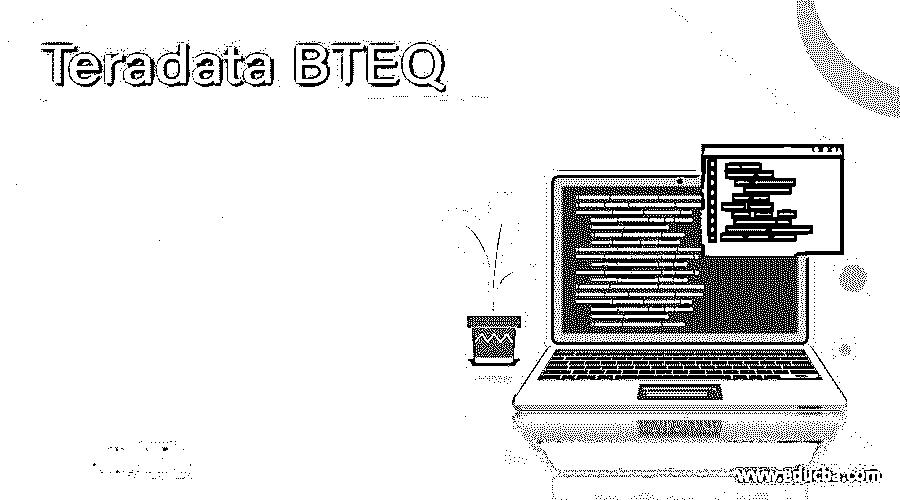
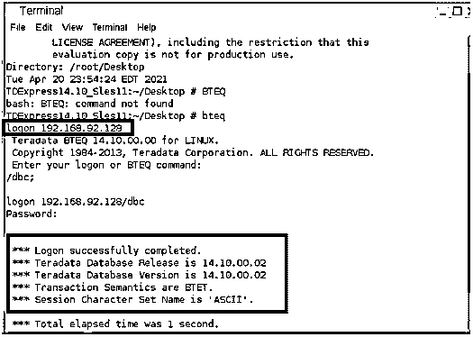
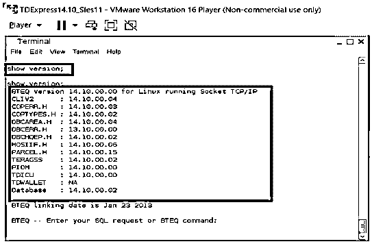
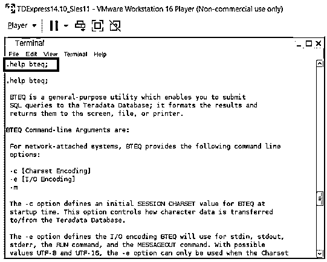
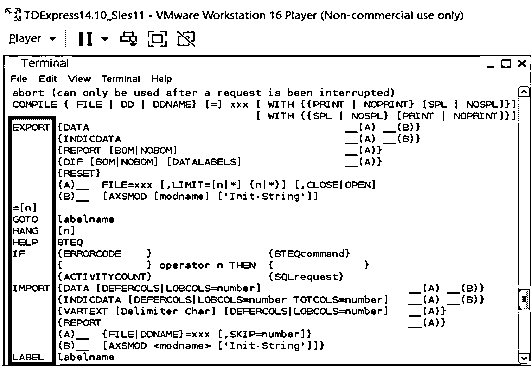
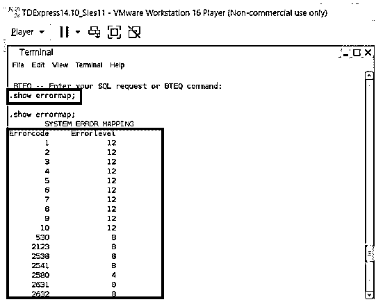

# Teradata BTEQ

> 原文：<https://www.educba.com/teradata-bteq/>

## Teradata BTEQ 简介

CLI 是一个命令行界面，用于与底层系统进行交互。对于 Teradata，BTEQ 是一个 CLI 接口，它允许与多个数据库系统进行通信。BTEQ 接口允许发送 SQL 查询，该接口在后端格式化查询，并将输出打印到同一个控制台。BTEQ 是一个非常强大的 CLI 界面工具，它有能力在批处理和交互模式下工作。这些实用程序在将基于 DLL 的语句、基于 DML 的语句、甚至存储过程和宏发送到在其下工作的数据库系统时非常有用。BTEQ 的输出最有可能被打印到屏幕上，然而它也可以被引导到打印机来选择打印，或者甚至被写入或捕获到特定的文件上。

### BTEQ 如何工作？

BTEQ 可以在批处理和交互模式下运行。

<small>Hadoop、数据科学、统计学&其他</small>

BTEQ cli 通常不安装在服务器系统上，而是安装在相关的客户端系统或工作站上。通常，BTEQ 连接的两个主要环境是大型机和工作站环境。这里，大型机环境可以通过 LAN 或 I/O 通道连接到 BTEQ 会话，而工作站只能通过 LAN 连接。

对于连接到主机终端的系统，BTEQ 使用 TDP(Teradata director 程序),对于连接到工作站的系统，它使用 MTDP(Micro Teradata Director 程序)。BTEQ 会话允许在其界面中提交 SQL 查询和 BTEQ 命令。

一个 Teradata 服务器将在 BTEQ 和后端数据库系统之间运行，该服务器负责解释请求，将它们设置在一个层次结构中，并将请求传递给在后端运行的数据库。

TDP 和 MTDP 负责在服务器和 BTEQ CLI 之间建立连接。

对系统的请求可以有两种不同的类型，第一，单语句请求只有一个特定的请求会被发送。接下来是多语句 Teradata 请求，发送多个特定的 SQL 语句进行处理。

BTEQ 一次向任何连接到 Teradata 数据库会话的人发送最佳的单个请求。如果出现通知请求失败的失误，BTEQ 可能会重新提交请求。BTEQ 承诺不会采取同样的行动。由于 BTEQ 允许数据库对 SQL 进行解码，所以它不支持事务对齐。这个方法不能计算出事务状态的完成情况。因此，状态应该完全通过用于租用开始事务(BT)、中止和结束事务(ET)的技术来确定。因此，顾客应该回忆 BTEQ 在 ANSI 和 Teradata 事务语义模式中积累的不同之处，而与 unity 或更大的默认请求相关的事务是完全可重试的，或者事务应该跨越请求。

当在 Teradata 中使用语义模式时，不管使用什么方法来发现它的事务，请求或声明都会对该事务的回推产生灾难性影响。用户有责任决定如何对这些回滚进行操作。

### 几个 BTEQ 操作

| **操作** | **描述** |
| 注册 | 这有助于用户登录 Teradata 系统 |
| 出口 | 此选项用于将文件导出到 Teradata 数据库系统之外，文件的路径需要与命令一起指定。 |
| 导入 | 当需要将特定文件引入数据库系统或服务器时，使用 import 命令，需要随命令一起指定文件的路径。 |
| Errorcode | 当查询因特定错误而失败或中止时，需要修复该查询。要修复已执行查询的状态代码，可以使用此命令。 |
| 注销 | 该命令用于从数据库注销，并且该命令关闭所有连接到数据库的相关会话。 |
| 运行文件 | 该命令用于执行文件。大多数情况下，该文件将被 SQL 查询和存储过程填充。 |
| 活动计数 | 打印在先前执行的查询中受影响的行数。 |
| 显示版本 | 预计将显示各种 Teradatabase 项目的版本。这是通过 show version 命令实现的。 |
| 数据库ˌ资料库 | 该命令用于设置系统中使用的数据库。 |

### BTEQ 示例

**BTEQ 登录快照:以下示例中的**登录命令用于登录 BTEQ 系统。

**命令:** `logon <Ipaddress>/dbc;`

**BTEQ Show Version:** 在下面的示例中，将显示各种 tera 数据库项目的版本。这是通过 show version 命令实现的。

**命令:** `show versions;`

**BTEQ 帮助:**BTEQ 帮助命令允许显示 BTEQ 终端正在使用的所有主要命令。它还表达了命令的相关语法。

**命令:** `.bteq help;`

**BTEQ 帮助:**显示错误图功能有助于打印错误级别和与每个级别相关的层级。我们可以从打印的快照中看到每个错误代码和相应的错误级别。

**命令:** `.show errormap;`

### 结论

像市场上的任何其他命令行界面一样，BTEQ 具有非常稳定的用户支持能力。这些 BTEQ cli 提供了一组分类的命令，这些命令提供了灵活、高效地运行命令和 SQL 查询的选项。这使得 BTEQ 命令行界面成为在 Teradata 数据库企业系统中执行命令的首选设置。

### 推荐文章

这是 Teradata BTEQ 的指南。在这里我们讨论介绍，语法，参数，BTEQ 如何工作？代码实现示例。您也可以看看以下文章，了解更多信息–

1.  [Teradata 数据类型](https://www.educba.com/teradata-data-types/)
2.  [Teradata 中的快速加载](https://www.educba.com/fastload-in-teradata/)
3.  [Teradata 架构](https://www.educba.com/teradata-architecture/)
4.  [Teradata 案例陈述](https://www.educba.com/teradata-case-statement/)