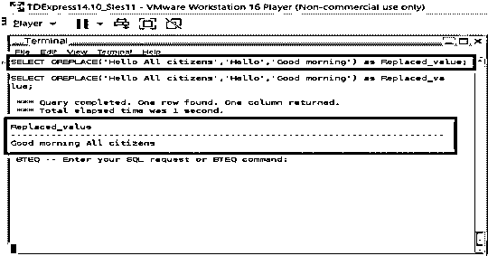
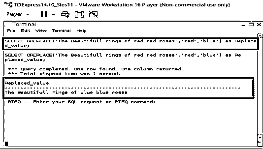
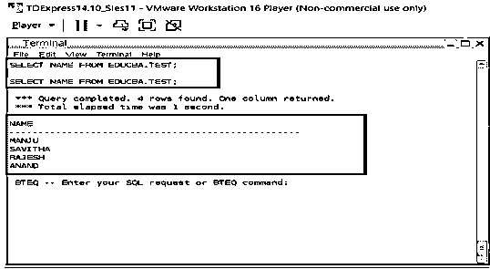
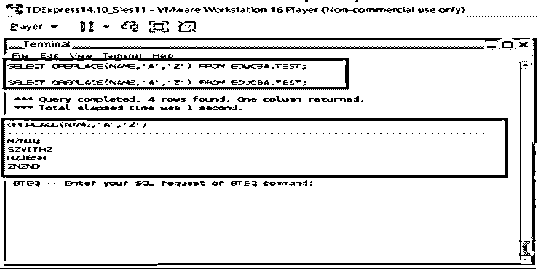

# Teradata 替换

> 原文：<https://www.educba.com/teradata-replace/>

## Teradata 替换简介

字符串级替换是字符串处理中最常见的操作之一。作为一种非常常见的操作，每个顺序数据库中都有这些替换级操作。在 Teradata 中，这个字符串级替换过程是通过 OREPLACE 函数实现的。这个 OREPLACE 函数能够替换一些特定的字符，或者用一个期望的值替换字符串中的一个特定的字符。这里，源字符串、搜索字符串和替换字符串值是 OREPLACE 函数中的关键项。下面从语法的角度讨论这个函数。replace 函数的更重要的特性是，期望被替换的字符串的所有实例都将在给定的源字符串中被替换。

**语法:**

<small>Hadoop、数据科学、统计学&其他</small>

`OREPLACE (Source_string, Search_string, Replace_string)`

| **语法元素** | **描述** |
| 源字符串 | 源字符串是在其中执行搜索操作的字符串值。这里，语法将源字符串项作为 OREPLACE 函数语法中的第一项。在这里，将搜索需要搜索和替换的字符串，并执行替换操作。如果源字符串为空值，则返回的输出值也将为空。 |
| 搜索字符串 | 搜索字符串是期望在相应的源字符串中搜索的字符串。该搜索字符串将是负责搜索和替换操作的值。因此，搜索字符串的值将在源字符串上搜索，然后替换字符串将用于在此基础上的替换操作。这里的语法将搜索字符串项作为 OREPLACE 函数语法中的第二项。当搜索字符串项被空值填充时，OREPLACE 函数将返回给定的源字符串作为输出。 |
| 替换字符串 | 搜索和替换过程中的关键字项的替换字符串。这里，替换字符串负责使替换操作成功发生，替换字符串是期望被定位在所有识别的搜索字符串项目中的替换项目。当替换字符串为空时，搜索字符串将从源字符串中删除。就像当替换字符串为空时，搜索字符串也将从实际字符串中删除。在语法本身没有提到替换字符串的情况下，语法中提到的搜索字符串也会从实际字符串中删除。更重要的是，在替换过程中，搜索字符串的所有实例都会受到影响。 |

**Teradata or place 规则、类型和合规性**

*   OREPLACE 符合 ANSI SQL:2011 标准；
*   OREPLACE 函数在 major 中只支持三种关键数据类型。它们是 CLOB、CHAR 和 VARCHAR 数据类型。当键入除上述类型之外的数据类型时，则需要执行造型操作。隐式数据类型转换最适用于这种类型的数据类型转换操作。
*   支持的各种类型的结果数据类型也特定于键入的数据类型，这意味着如果使用 CHAR 类型的源字符串，则预期的结果类型是 VARCHAR。当给定的字符串本身是 VARCHAR 格式时，那么期望的输出字符串也应该是 VARCHAR 格式。对于像 CLOB 这样的特殊情况，数据类型中的预期结果类型也应该是数据类型 CLOB 格式。
*   源字符串值支持的最大大小总是有限制的，如果给定的字符串大于预期的大小，OREPLACE 函数将抛出一条错误消息。

### Teradata OREPLACE 示例

下一节提到了 OREPLACE 函数的各种例子。

#### 示例#1

下面给出的例子是一个字符串级替换。这里，要搜索、替换和用作源值的实际字符串直接硬编码在实际查询本身中。我们可以从下面给出的查询和输出快照中注意到，在源字符串“Hello All citizens”中搜索值“Hello ”,只要在源字符串中识别出值“Hello ”,这些字符串值就会被替换为字符串“Good morning”。因此，新字符串“早上好，公民”被公式化并打印到控制台上。

**查询:**

`SELECT OREPLACE (‘Hello All citizens’, ’Hello’, ’Good morning’) as Replaced_value;`

**输出:**

#### 实施例 2

下面给出的例子也是一个字符串级替换。我们可以从下面给出的查询和输出快照中注意到，在源字符串“The beautiful rings of red roses”中搜索值“red ”,只要在源字符串中识别出值“blue ”,这些字符串值就会被替换为构成字符串值“The beautiful rings of blue roses”的字符串。在这里，我们可以注意到不止一个字符串实例发生了变化。

**查询:**

`SELECT OREPLACE (‘The beautiful rings of red red roses’, ’red’, ’blue’) as Replaced_value;`

**输出:**

#### 实施例 3

在本例中，不是对字符串值进行硬编码，而是从数据库中选择一个现有列，并更改该数据库列中的所有值。这里，我们打算将 NAME 列中的所有“A”字符都改为“Z”。

**查询:**

`SELECT OREPLACE (NAME, ’A’, ’Z’) from EDUCBA.TEST;
SELECT NAME FROM EDUCBA.TEST;`

**输出:**

### 结论

字符串级函数是预定义函数中最关键的功能之一，Teradata 提供了各种各样的函数来实现这一功能。OREPLACE 就是这些功能之一。它在使用上有很大的灵活性，甚至能够处理大量的字符串和字符值。这些预定义的功能使该企业产品在市场上处于领先地位。

### 推荐文章

这是一个指南 Teradata 替换。在这里，我们讨论简介、语法和参数、Teradata OREPLACE 规则、类型和遵从性，以及代码实现示例。您也可以看看以下文章，了解更多信息–

1.  [Teradata 分区依据](https://www.educba.com/teradata-partition-by/)
2.  [Teradata 架构](https://www.educba.com/teradata-architecture/)
3.  [Teradata 当前日期](https://www.educba.com/teradata-current-date/)
4.  [Teradata 案例陈述](https://www.educba.com/teradata-case-statement/)