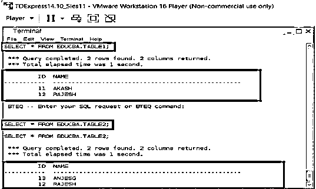
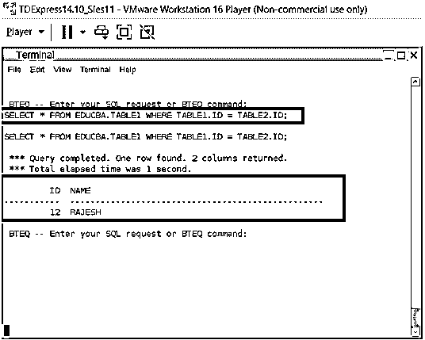
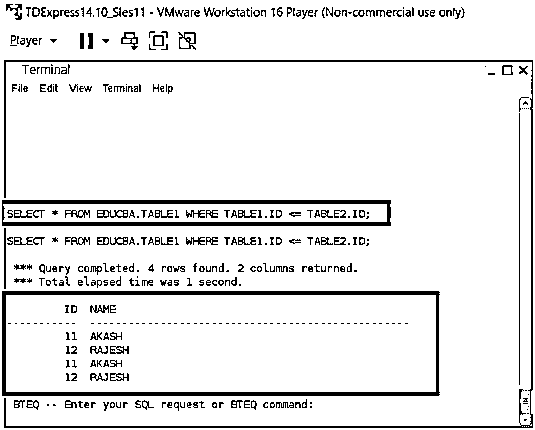
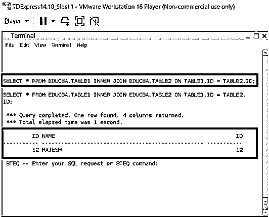
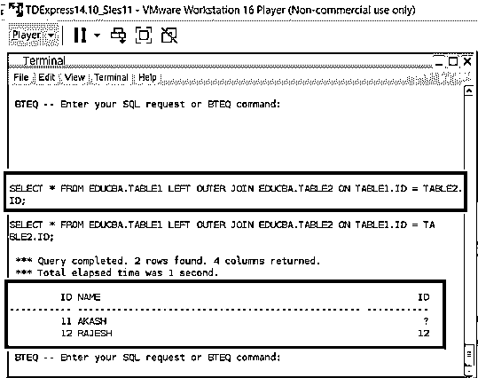
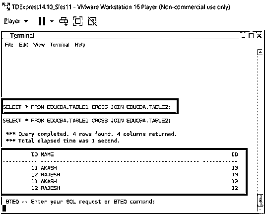

# Teradata 联接

> 原文：<https://www.educba.com/teradata-joins/>

## Teradata 联接简介

当两个或多个表需要连接在一起时，就必须使用连接。这种连接过程主要涉及列级连接，在这种情况下，可以连接多个表中的列。在 Teradata 中，最多可以连接 128 个表。联接功能允许从表中的多个列中检索数据。就 terdata 而言，这种连接过程可以细分为四种主要类型。它们是自然连接，包括θ连接、内部连接和外部连接。在同一查询中，可以将多种类型的连接合并到 Teradata 中。

### 使用连接函数连接

| **合并方法** | **描述** |
| 自然的 | 匹配等号上比较的相同列。 |
| 内部的 | 用比较运算符匹配相同的列。 |
| 外面的 | 基于外部连接类型的左右端表中的记录。 |
| 内部的 | 只有在比较的表之间匹配的记录才会被返回。 |

**示例表快照:**

<small>Hadoop、数据科学、统计学&其他</small>

`select * from educba.table1;
select * from educba.table2;`

**自然连接:**

当连接过程应用于一组匹配的列时，该过程称为自然连接。自然连接过程是 Teradata 系统中最常见的连接类型之一。当两个列都应该是关联表的主索引时，或者当表和相关条件之间存在外部链接映射时，就会触发这些条件。自然连接过程包括在比较的两列之间放置一个等号。这意味着，除了两列应该是相同类型的协议之外，自然连接过程还希望这两列在相等的条件下匹配。因此，当两列属于同一类型并且它们在等号上匹配时，这些列属于自然连接。

**查询:**

`SELECT * FROM EDUCBA.TABLE1 WHERE TABLE1.ID = TABLE2.ID;`

**输出:**

**Theta 联接:**

同样，这里的连接过程应用于一组匹配的列，但是匹配类型因 theta 连接而异。与自然连接过程一样，theta 连接也是 Teradata 系统中最常见的连接类型之一。当两个列都应该是关联表的主索引时，或者当表和相关条件之间存在外部链接映射时，就会触发这些条件。theta 联接过程涉及一个比较运算符，该运算符被放置在列匹配中。比较运算符有:大于运算符、小于运算符、大于等于运算符、小于等于运算符以及等于运算符。
如果θ运算符等于(=)，那么 be 是一个等价连接的一部分。在肯定的情况下，的部分和相等联接是相同的，而每个联接都在相等条件下重新建模，表联接的列名现在不需要在相等联接中出现，同时它们应该在中出现。

**查询:**

`SELECT * FROM EDUCBA.TABLE1 WHERE TABLE1.ID <= TABLE2.ID;`

**输出:**

**内部连接**

这个过程涉及两个或多个表的连接，输出将从表中返回匹配的行。

**查询:**

`SELECT * FROM EDUCBA.TABLE1 INNER JOIN EDUCBA.TABLE2 ON TABLE1.ID = TABLE2.ID;`

**输出:**

**外部连接**

当两个表中的行都要包含在最终输出中时，最好使用外部连接。在这里，连接过程以类似的方式进行，即可以显示两个表中匹配的行，同时还可以根据所选择和执行的外部连接类型检索任意一个表或两个表中不匹配的行。更具体地说，外部连接是内部连接的一种形式，它还能够根据需要从所选的两个表中的一个表添加不匹配的行。

外部连接通常分为三种主要类型，

*   左外连接:右表中的每个匹配行和左表中的所有行。
*   右外连接:左表中的每个匹配行和右表中的所有行
*   完全外部连接:表中的所有行

**查询:**

`SELECT * FROM EDUCBA.TABLE1 LEFT OUTER JOIN EDUCBA.TABLE2 ON TABLE1.ID = TABLE2.ID;`

**输出:**

**自我加入:**

这是自然连接的一部分，在这里，连接是以这样一种方式发生的，即同一个表中的列与生成的结果集相匹配。这是一个非常有趣的加入过程。因为自连接不是一个非常常用的条件。很少有业务场景会触发自连接，这涉及到将表中的列绑定到绑定的新结果集的过程。

**交叉连接:**

这是一种非常罕见的连接类型，其中没有指定连接条件，因此当忽略表的连接条件时，将会导致交叉连接，确切地说，这是一种笛卡尔乘积。这涉及一个乘法过程，其中每个表的每一行都将与所涉及的另一个表的每一行相连接。这种乘法只会以笛卡尔积结束。这种绑定很少执行，但是这个过程在很少的业务条件下产生有效的输出。性能水平基准测试是主要期望交叉连接的一个关键情况。

**查询:**

`SELECT * FROM EDUCBA.TABLE1 CROSS JOIN EDUCBA.TABLE2;`

**输出:**

### 结论

两个表的联合一直是顺序数据库中的关键操作之一。连接过程允许灵活地连接两个不同的表，并以非常灵活的方式从表组合中单独获取所需的行。Teradata 数据库几乎允许高效地放置所有可能类型的顺序连接。这是 Teradata 函数的主要优势之一。这些连接，如 self、cross、outer、inner，可以在表中执行所有可能的连接操作组合。

### 推荐文章

这是一个关于 Teradata 连接的指南。这里我们讨论介绍，使用连接函数的连接，以及连接的类型。您也可以看看以下文章，了解更多信息–

1.  [Teradata 数据类型](https://www.educba.com/teradata-data-types/)
2.  [插入 Teradata](https://www.educba.com/insert-into-teradata/)
3.  [Teradata 架构](https://www.educba.com/teradata-architecture/)
4.  [Teradata 数据格式](https://www.educba.com/teradata-date-formats/)