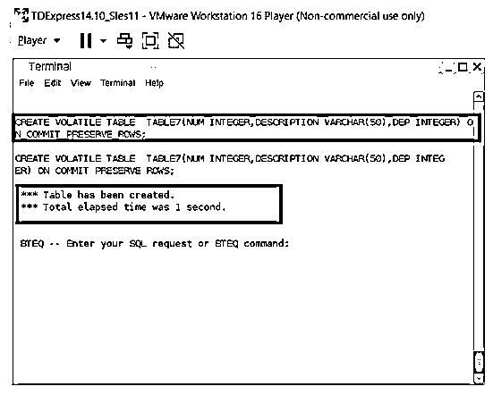
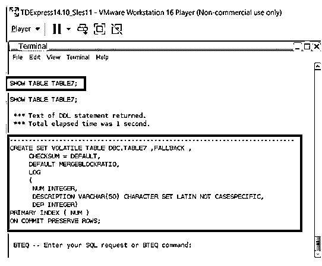
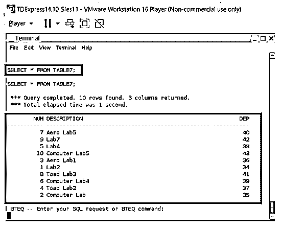
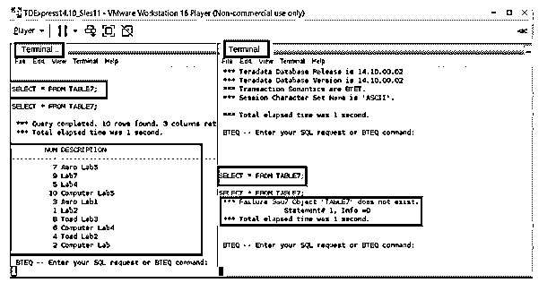

# Teradata 可变表

> 原文：<https://www.educba.com/teradata-volatile-table/>

## Teradata 可变表简介

Teradata 中需要临时表。这意味着可能需要临时测试，或者更重要的是，需要性能分析过程。因此，为了实现这些性能分析过程，需要临时创建一个表并将数据加载到这些表中。该过程完成后，用户可能没有必要保持表活动。这些是 Teradata 可变表发挥作用的情况。这些易变表具有暂时持久的能力。因此，当会话处于活动状态时，这些表也将处于活动状态。当会话关闭时，这些表也将关闭。这个过程称为易变表。每次需要这些表时，都需要重新创建这些表。只有在会话处于活动状态时，才会保留表的所有特征和定义。

**语法:**

<small>Hadoop、数据科学、统计学&其他</small>

`CREATE VOLATILE TABLE Name_of_Table
(Column_Name#1   Column_#1_type,
Column_Name#2   Column_#2_type,
Column_Name#3   Column_#3_type,
Column_Name#4   Column_#4_type,
Column_Name#5   Column_#5_type);`

*   这个临时表创建过程的主要关键字是 VOLATILE 关键字。该关键字在 CREATE 语句和 TABLE 语句中指定。指定 VOLATILE 关键字会使表在会话终止后自动变为非活动状态。
*   一旦 SET 在表简介中被引用，它就不再允许复制行；在多集表的情况下，它的重复值是允许的。这里必须引用数据库调用和表调用。
*   当引用回退时，该工具将产生一个复制的表，并且该复制的表在该工具可能会有所下降时可能是有益的。
*   违约收费是没有退路的。对于数据库内部的每一列，需要声明它们的符合列数据类型；这些数据类型需要保证与列的字符一致。
*   此外，可以创建桌子的主索引，这里是预期使用的列，因为头号索引希望在唯一的头号索引关键字内被引用。

### 易变表中的关键点

*   当生成易失性表时，系统不会大量验证一些关键元素。这些关键项目对于普通表来说通常是经过严格验证的。这些关键项包括与表访问相关的详细信息、与表更改相关的详细信息，甚至表的 drop 特权也没有在系统中得到严格验证。
*   每当发生系统级重置时，与易失性表相关的所有详细信息都会被删除。因此，重置过程将彻底清理系统中的易失性表细节。
*   在这个过程中，可以生成的可变表的总数是有限的。这是因为为了避免任何与空间相关的问题。因此，根据 Teradata systems 的能力，一个活动会话最多可以保持 1000 个临时易失性表。
*   无法为临时表生成哈希值。
*   此外，可以创建桌子的主索引，这里是预期使用的列，因为头号索引希望在唯一的头号索引关键字内被引用。说到索引，Volatile 表支持主索引的创建。这些主索引可以是分区的，也可以是非分区的。而不能为易变表创建辅助索引。因此，对于 Teradata 系统来说，二级索引创建支持是无效的。
*   就每个约束而言，临时表不能既保存与参照完整性相关的约束，又检查与完整性相关的约束。
*   可变表不支持 DEFAULT 和 TITLE 子句。
*   在易变表中不能提到命名索引。此外，这里不允许列分区。

### Teradata 可变表示例

下面给出了 Teradata volatile 表的一个示例:

第一个实例表示引入了一个 VOLATILE 表，因此这个表只有在会话激活时才是活动的。提到 ON COMMIT PRESERVE ROWS 是为了将插入的行存储为活动的。这里为表创建了三列，包括 ID、姓名、年龄。这些列中的每一列都与其对应的数据类型相关。输出捕捉包含所创建的表的捕捉，之后将验证表的模式。在表中完成插入操作之后。插入的事实也显示在捕捉的内部。这里要考虑的关键问题是，当新会话被相邻地打开时，在新打开的会话中，对表 7 的搜索清楚地显示该表不在新打开的会话中。这确保了创建的表是完全可变的。还粘贴了 Show table 查询的快照来描述生成的表的模式。

**查询:**

`CREATE VOLATILE TABLE TABLE7 (NUM INTEGER, DESCRIPTION VARCHAR (50), DEP INTEGER) ON COMMIT PRESERVE ROWS;
INSERT INTO TABLE7(NUM, DESCRIPTION, DEP) VALUES (1,’Lab2’,34)
INSERT INTO TABLE7(NUM, DESCRIPTION, DEP) VALUES (2,’Computer lab’,35)
INSERT INTO TABLE7(NUM, DESCRIPTION, DEP) VALUES (3,’Aero Lab1’,36)
INSERT INTO TABLE7(NUM, DESCRIPTION, DEP) VALUES (4,’Toad Lab3’,37)
INSERT INTO TABLE7(NUM, DESCRIPTION, DEP) VALUES (5,’Lab4’,38)
INSERT INTO TABLE7(NUM, DESCRIPTION, DEP) VALUES (6,’Computer lab4’,39)
INSERT INTO TABLE7(NUM, DESCRIPTION, DEP) VALUES (7,’Aero Lab5’,40)
INSERT INTO TABLE7(NUM, DESCRIPTION, DEP) VALUES (8,’Toad Lab3’,41)
INSERT INTO TABLE7(NUM, DESCRIPTION, DEP) VALUES (9,’Lab7’,42)
INSERT INTO TABLE7(NUM, DESCRIPTION, DEP) VALUES (10,’Computer lab5’,43)
SELECT * FROM TABLE7;`

**输出:**

`SHOW TABLE TABLE7;`

`SELECT * FROM TABLE7;`

我们可以注意到同一个表在相邻的控制台中被声明为不存在，

### 结论

这些易失性表有效地为用户节省了大量空间。它有助于避免永久存储数据；这有助于避免通过系统存储不需要的数据，并节省大量存储空间。上面的文章清楚地描述了 volatile 表的创建和如何使用 volatile 表，以及 volatile 表如何不在任何相邻的会话中列出。

### 推荐文章

这是一个指南 Teradata 易变表。在这里，我们还将讨论 volatile 表的介绍和要点，以及一个不同的示例及其代码实现。您也可以看看以下文章，了解更多信息–

1.  [Teradata 子串](https://www.educba.com/teradata-substring/)
2.  [Teradata 中的快速加载](https://www.educba.com/fastload-in-teradata/)
3.  [插入 Teradata](https://www.educba.com/insert-into-teradata/)
4.  [Teradata 数据类型](https://www.educba.com/teradata-data-types/)