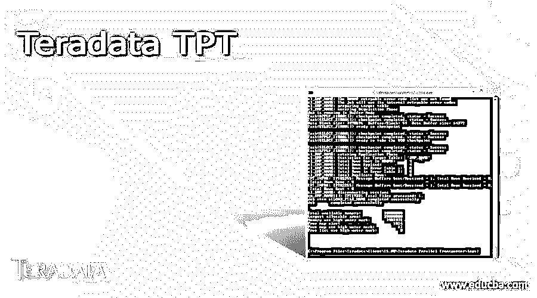
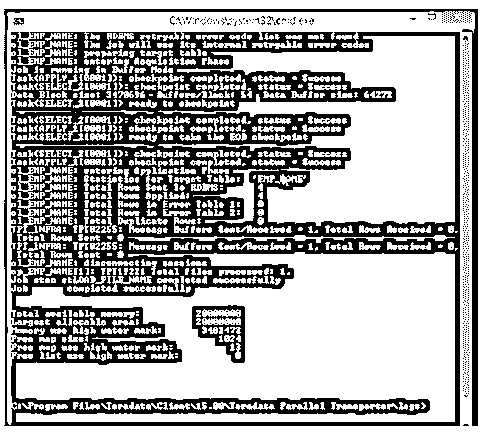
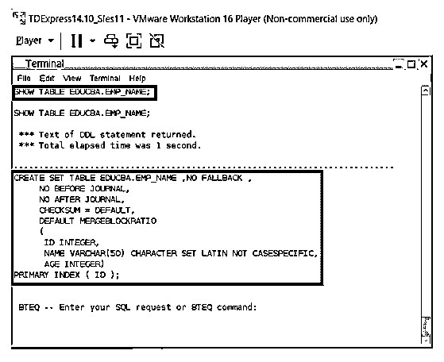

# Teradata TPT

> 原文：<https://www.educba.com/teradata-tpt/>

## Teradata TPT 简介

总是需要从不同的来源加载数据。这意味着存储在一个或其他源中的数据可能需要加载到 Teradata 数据库中。这个过程意味着从 Teradata 数据源加载不同数据源的数据。这个过程有许多实用程序，如 multiload、tpump、fastload 等。但是 Teradata enterprise 本身更喜欢 TPT，而不是其他加载实用程序。TPT 允许执行所有 DML、DDL 和 DCL 操作。更重要的是，Teradata TPT 允许该过程

### TPT 的关键点

share 是专为长期功能开发的，其功能是:两个 Teradata 数据库互相共享统计数据。这些 TPT 系统允许在单个实例中加载大量脚本，这个过程使得数据库和仓库的维护变得非常容易。更重要的是，这里不允许 CPU 运行加载过程，因此，由于 CPU 不会因巨大的负载量而下降，所以许多问题都可以在系统中处理。许多与性能相关的问题可以通过精确的方式得到解决。这些 TPT 系统的另一个非常重要的特征是它们具有到达大量数据资源的能力。因此，TPT 可以灵活地访问这些巨大的资源集是 TPT 处理的关键功能之一。

<small>Hadoop、数据科学、统计学&其他</small>

从特征的角度来看，以下属性嵌入在 TPT 接口中:允许以非常并行的方式处理输入文件。当输入文件被分散时，性能瓶颈可以被克服。这种 IO 处理将在多个输入文件上分割执行。对于目录扫描功能，这些 TPT 可以允许处理多个目录中的多个文件。TPT 系统允许在同一输入文件中读取多个进程的能力。这在很大程度上增加了数据吞吐量。也可以有增加进程总数的能力。这个过程极大地改善了 CPU 时间在不同进程间的分配。即使 TPT 允许导出级别的流程被多个或多个用于同一个单个表。更重要的是，这里不允许 CPU 运行加载过程，因此，由于 CPU 不会因巨大的负载量而下降，所以许多问题都可以在系统中处理。

### TPT 的 Define 语句中执行的操作

| **操作员类型** | **描述** |
| 数据连接器生产商 | 生产者连接器是数据连接器生产者。这用于提取数据。 |
| 数据连接器消费者 | 当数据从 Teradata 源 DATACONNECTOR 使用者移动到目标系统时。 |
| 数据定义语言 | 该运算符用于执行所有 DML 和 DDL 级别的操作。 |
| 出口 | TPT EXPORT utility allows better export of data and comparatively much better performance to TeradataFASTEXPORT。 |
| 快速出口过时了 | 这个过程非常类似于 TERADATA 导出过程。 |
| 快速加载模式 | 这个过程与 TERADATA 导入过程非常相似。 |
| 插件 | 此过程与导入过程非常相似，唯一的区别在于导入的数据量。Teradata 插入器允许将少量数据注入 Teradata 数据库。 |
| 负荷 | 与 FASTLOAD 非常相似，唯一的区别是在数据级别应用了优化。 |
| 多负载模式 | TPT 多负载 inmod 非常类似于 Teradata 多负载 INMOD 设施 |
| 开放式数据库连接性 | 允许按照 ODBC 进程读取和处理数据。 |
| 选择器 | TPT 选择器允许从不同表中选择和查看数据。 |
| 溪流 | 该运算符用于数据流。 |
| 更新 | Update 运算符的工作方式类似于 Teradata MULTILOAD。 |

### Teradata TPT 示例

这是 TPT 系统的一个非常重要的例子，这里触发了 TPT 流程。这是通过激活 TPT 控制台实现的。首先，我们的目标是创建一个表创建查询。因此，这意味着 TPT 设置将有一个文件，该文件的类型将是可由 TPT 系统加载实用程序执行的。那么这个文件将从 TPT 系统执行。执行过程是通过在后端执行 TPT 命令来完成的。因此，当在 TPT 控制台中触发执行命令时，文件将被提交用于 TPT 流程执行。因此，所发生的是，文件中的内容、查询甚至存储过程都将被读取并作为执行的目标。在这里，我们有一个定义语句。define 语句用于在这里创建一个表。表的创建过程是通过在给定的 define 语句中嵌入 create table 查询来实现的。此外，define 语句中有 3 个关键字段。身份证，姓名和年龄。这些字段将是预期创建的表的示意图。因此，当 TPT 语句执行时，它内部的 create 语句将被触发，然后从那里，TPT 实用程序将连接到 Teradata 系统，并在 tera 数据库系统中创建表。第二个快照来自成功创建 Teradata 表的控制台。此处使用 show table 查询显示了表的结构。从表的结构中，我们可以注意到当从基于 TPT 的控制台触发时，表被成功地创建。此外，与其他控制台相比，这一过程非常快速和容易实现。对于高负载和基于数据的流程，这种负载实用程序(如 TPT)往往以非常快的方式工作。

**查询:**

`DEFINE SCHEMA EDUCBA.EMP_NAME
(
ID INTEGER,
NAME VARCHAR(50),
AGE INTEGER
)`

**输出:**

### 结论

尽管 Teradata 系统支持大量用于外部加载和转换过程的实用程序。这个名为 TPT 的加载实用程序是最受欢迎的。他们的偏好来自于高负载数据的高性能能力。这些类型的元素使得 TPT 成为 Teradata 数据库系统中最适合 ETL 类型操作的实用程序。

### 推荐文章

这是关于 Teradata TPT 的指南。这里我们还将讨论 TPT 的 define 语句中的介绍和操作，并给出例子。您也可以看看以下文章，了解更多信息–

1.  [Teradata 连接](https://www.educba.com/teradata-concatenate/)
2.  [Teradata 子串](https://www.educba.com/teradata-substring/)
3.  [Teradata 数据类型](https://www.educba.com/teradata-data-types/)
4.  [插入 Teradata](https://www.educba.com/insert-into-teradata/)