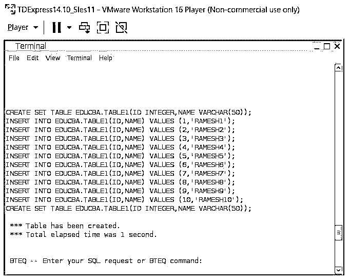
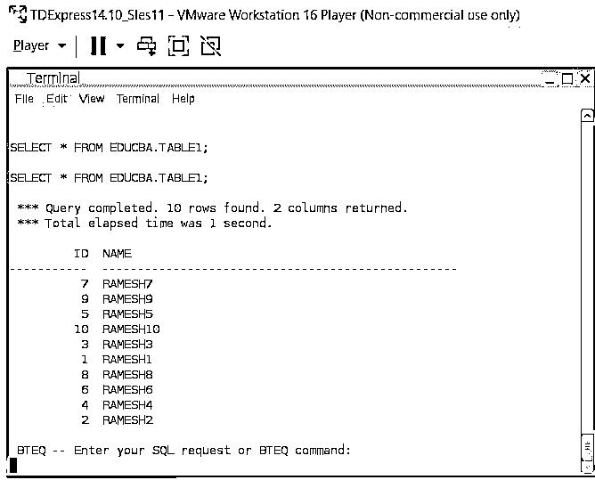
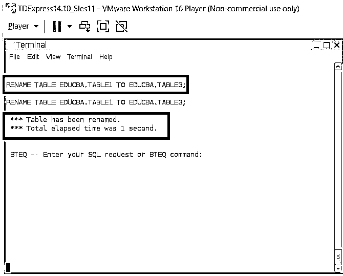
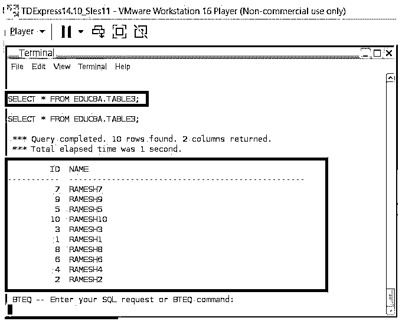
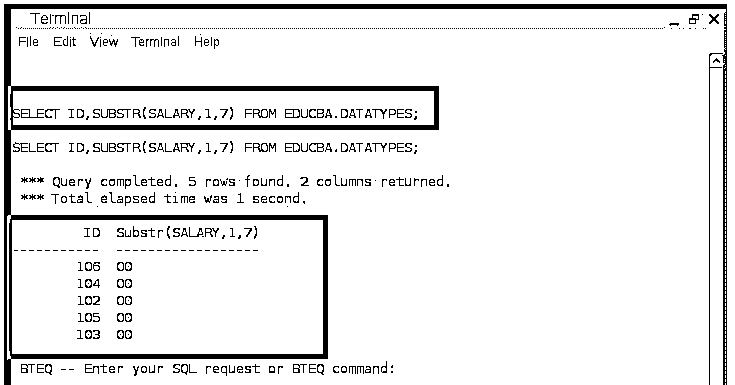
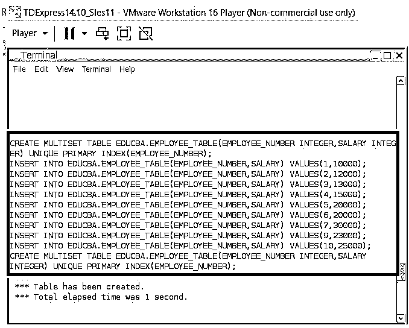
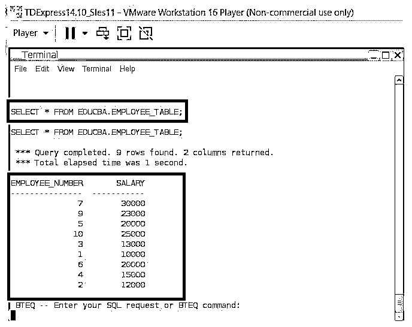
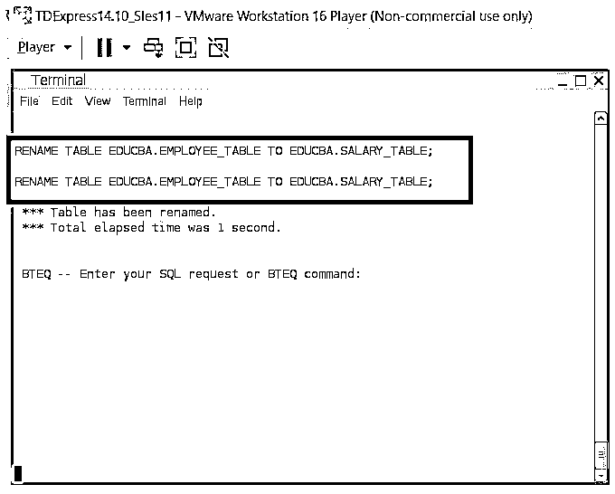
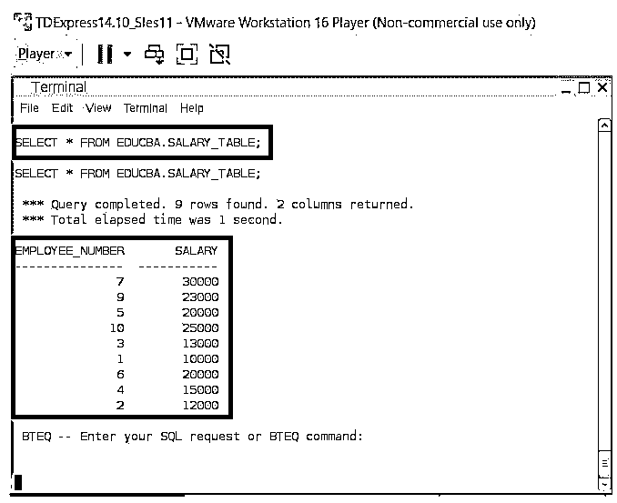

# Teradata 重命名表

> 原文：<https://www.educba.com/teradata-rename-table/>

## Teradata 重命名表简介

下面的文章提供了 Teradata 重命名表的概要。可能有一个需要修改表的过程。这个改变的过程可以是任何类型的。可能会有与表的特征相关联的变化；可能会有与表中的数据相关联的更改。甚至这些变化也可能与表的名称相关联。这里表名的改变只能通过 RENAME table 语句来实现。

基本上，重命名操作可以通过其他顺序数据库中的 ALTER table 语句来实现。但是对于 Teradata 数据库，它主要使用 RENAME 语句。这个 RENAME 语句帮助将一个表从一个特定的名称重命名为另一个特定的名称。因此，结果是表名发生了变化。这意味着在应用 RENAME 语句之后，从那时起，所涉及的表只能通过新的表名来引用。这是重命名操作表的主要过程。

<small>Hadoop、数据科学、统计学&其他</small>

**Teradata 重命名表的语法**

下面给出了提到的语法:

`RENAME TABLE DATABASE_NAME.OLD_TABLE_NAME TO NEW_TABLE_NAME;`

| **语法元素** | **解释** |
| 重新命名 | 语句开头的字符串表示将要执行的操作类型。这意味着语句开始处的 RENAME 字符串提到 RENAME E 操作将被执行。这是上述语法中的关键语句，因为该语句负责精确指示要执行的操作类型。 |
| 桌子 | 这是一个标准的陈述，它提到了被改变的实体的类型。因此，重命名字符串后的表语句描述了应用于操作的下一项。因此，因为 RENAME 语句在这里是一个表级语句，所以使用了关键字 table。 |
| 数据库名称。旧表名 | 这是查询中最重要的语句。这代表了流程的左端。这意味着它表示所涉及的左侧表的名称。因此，这里将提到需要修改名称的旧表名。一个关键的事情是数据库名必须总是与所涉及的旧表名相关联。那么只有操作会按预期进行。 |
| 数据库名称。新表格名称 | 这是查询中另一个最重要的语句。这代表了流程的右端。这意味着它表示所涉及的右侧表的名称。因此，这里将提到需要为其创建新名称的新表名。一个关键的事情是数据库名必须总是与所涉及的旧表名相关联。那么只有操作会按预期进行。 |

### Teradata 重命名表示例

以下是 Teradata 重命名表的示例:

#### 示例#1

表创建过程。

表创建过程包括创建所需表的过程。这个表创建过程包括一个 create 查询，然后是一系列 insert 查询。在 create table 语句中，第一列名为 ID，它与数据类型 Integer 相关联。接下来，已经声明了 Name 列。这个名称列是 VARCHAR 类型，列长度为 50 个字符。在这个创建过程之后，执行插入操作。因为插入操作包括将 ID 和 name 值插入到表中。表中插入了大约 50 条记录。

表格创建:

**代码:**

`CREATE SET TABLE EDUCBA.TABLE1(ID INTEGER, NAME VARCHAR (50));
INSERT INTO EDUCBA.TABLE1(ID, NAME) VALUES (1,’RAMESH1’);
INSERT INTO EDUCBA.TABLE1(ID, NAME) VALUES (2,’RAMESH2’);
INSERT INTO EDUCBA.TABLE1(ID, NAME) VALUES (3,’RAMESH3’);
INSERT INTO EDUCBA.TABLE1(ID, NAME) VALUES (4,’RAMESH4’);
INSERT INTO EDUCBA.TABLE1(ID, NAME) VALUES (5,’RAMESH5’);
INSERT INTO EDUCBA.TABLE1(ID, NAME) VALUES (6,’RAMESH6’);
INSERT INTO EDUCBA.TABLE1(ID, NAME) VALUES (7,’RAMESH7’);
INSERT INTO EDUCBA.TABLE1(ID, NAME) VALUES (8,’RAMESH8’);
INSERT INTO EDUCBA.TABLE1(ID, NAME) VALUES (9,’RAMESH9’);
INSERT INTO EDUCBA.TABLE1(ID, NAME) VALUES (10,’RAMESH10’);`

**输出:**

**代码:**

`SELECT * FROM EDUCBA.TABLE1;`

**输出:**

表格重命名:

**代码:**

`RENAME TABLE EDUCBA.TABLE1 TO EDUCBA.TABLE3;`

**说明:**

*   按照上面给出的 rename 语句，创建的表被命名为 EDUCBA。如果 EDUCBA.TABLE3，TABLE1 将被更改为一个新名称。表 3 被打印出来，我们可以从下面给出的快照中注意到，表名被成功地更改为一个名为 EDUCBA.TABLE3 的新名称。
*   这个过程的结果是生成了新的表名，此外，可以注意到 select 语句打印了所有预期的记录。

**输出:**

**代码:**

`SELECT * FROM EDUCBA.TABLE3;`

**输出:**

**代码:**

`SELECT ID,SUBSTR(SALARY,1,7) FROM EDUCBA.DATATYPES;`

**输出:**

#### 实施例 2

表创建。

**代码:**

`CREATE MULTISET TABLE EDUCBA.EMPLOYEE_TABLE (EMPLOYEE_NUMBER INTEGER, SALARY INTEGER) UNIQUE PRIMARY INDEX(EMPLOYEE_NUMBER);
INSERT INTO EDUCBA.EMPLOYEE_TABLE (EMPLOYEE_NUMBER, SALARY) VALUES (1,10000);
INSERT INTO EDUCBA.EMPLOYEE_TABLE (EMPLOYEE_NUMBER, SALARY) VALUES (2,12000);
INSERT INTO EDUCBA.EMPLOYEE_TABLE (EMPLOYEE_NUMBER, SALARY) VALUES (3,13000);
INSERT INTO EDUCBA.EMPLOYEE_TABLE (EMPLOYEE_NUMBER, SALARY) VALUES (4,15000);
INSERT INTO EDUCBA.EMPLOYEE_TABLE (EMPLOYEE_NUMBER, SALARY) VALUES (5,20000);
INSERT INTO EDUCBA.EMPLOYEE_TABLE (EMPLOYEE_NUMBER, SALARY) VALUES (6,20000);
INSERT INTO EDUCBA.EMPLOYEE_TABLE (EMPLOYEE_NUMBER, SALARY) VALUES (7,30000);
INSERT INTO EDUCBA.EMPLOYEE_TABLE (EMPLOYEE_NUMBER, SALARY) VALUES (8,23000);
INSERT INTO EDUCBA.EMPLOYEE_TABLE (EMPLOYEE_NUMBER, SALARY) VALUES (9,25000);
INSERT INTO EDUCBA.EMPLOYEE_TABLE (EMPLOYEE_NUMBER, SALARY) VALUES (10,23000);`

创建表格

**代码:**

`SELECT * FROM EDUCBA.EMPLOYEE_TABLE;`

**输出:**

表格重命名:

**代码:**

`RENAME TABLE EDUCBA.EMPLOYEE_TABLE TO EDUCBA.SALARY_TABLE;`

**说明:**

*   表创建过程包括创建所需表的过程。在这里，作为上面给出的重命名语句，创建的表被命名为 EDUCBA。如果是 EDUCBA，EMPLOYEE_TABLE 将更改为新名称。薪资 _ 表格。
*   这里是下面给出的快照 EDUCBA。SALARY_TABLE 被打印出来，我们可以从下面给出的快照中注意到，表名被成功地更改为一个名为 EDUCBA 的新名称。薪资 _ 表格。这个过程的结果是生成了新的表名，此外，可以注意到 select 语句打印了所有预期的记录。

**输出:**

**代码:**

`SELECT * FROM EDUCBA.SALARY_TABLE;`

**输出:**

### 结论

从关系数据库的角度来看，我们可以注意到重命名过程总是涉及到 alter table 语句的使用。从 Teradata 表的角度来看，通过使用 rename 命令，这个过程变得非常灵活。这个 renames 命令可以在 Teradata 系统中很好地用于根据需要重命名表实体。这个功能可以被认为是 Teradata 数据库的一个关键功能。

### 推荐文章

这是一个指南 Teradata 重命名表。这里我们分别讨论 Teradata 重命名表的介绍和示例。您也可以看看以下文章，了解更多信息–

1.  [Teradata 数据类型](https://www.educba.com/teradata-data-types/)
2.  [Teradata 分区依据](https://www.educba.com/teradata-partition-by/)
3.  [Teradata 架构](https://www.educba.com/teradata-architecture/)
4.  [什么是 Teradata？](https://www.educba.com/what-is-teradata/)