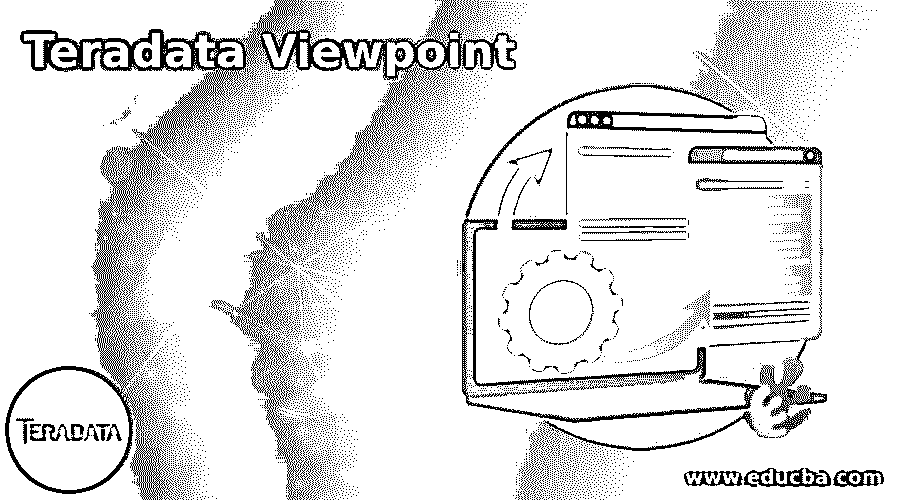
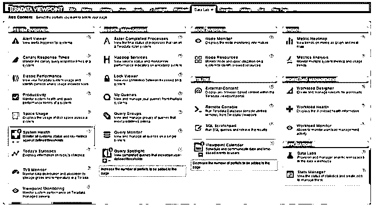
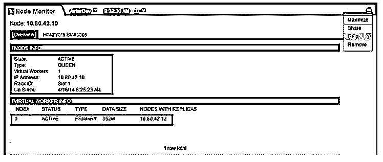
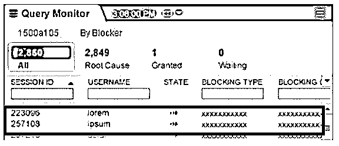
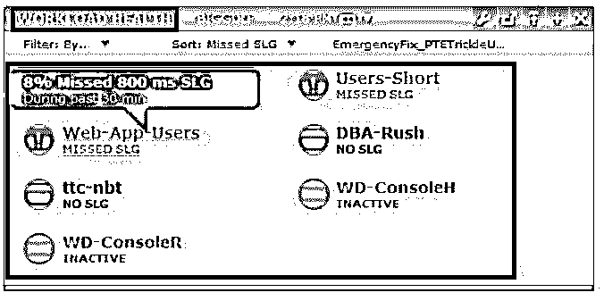

# Teradata 观点

> 原文：<https://www.educba.com/teradata-viewpoint/>

## Teradata 视点简介

Teradata 是一个庞大的平台和系统，由 Teradata 市场中的各种产品组成。每个安装的 Teradata 系统都将由安装在系统中的大量 Teradata 产品组成。这些产品可能包括 Teradata presto、Hadoop 系统、Teradata DB 系统等。当所有这些产品都需要从单个操作系统进行监控时，Teradata 观点是理想的。Teradata 视点有助于获得所有相关系统的统一视图。这些系统有助于为企业级产品和系统级产品提供系统级监控和管理。该服务面向在业务层面使用该系统的管理员和用户。

### Teradata 视点的功能

下面是提到的特征:

<small>Hadoop、数据科学、统计学&其他</small>

*   Teradata 视点系统包括一个名为 portlets 的项目。这些 portlets 允许以非常有效的方式跨各种应用程序进行 Teradata 管理捆绑和工作负载监控。
*   Teradata viewpoint like 产品的主要优势之一是能够同时管理多个系统。这里的关键功能是它的数据结构可以统一和管理。这允许视点系统从一个点管理多个 Teradata 系统。
*   使用这些视点类工具的另一个很大的优势是它能够提供一种基于 web 的应用程序类型的门户。这些基于 web 应用程序的门户。这些 Teradata 视点系统更重要的功能是，每个用户都可以根据自己的需要定制视图板。因此，这种定制仪表板的能力是 Teradata 视点系统的关键功能之一。
*   这些视点系统的另一个主要优点是能够连接各种设备。因此，可以通过这些视点系统访问多个设备。此外，这些设备可以以非常灵活的方式插入和连接到系统。
*   它为数据库管理人员提供了极大的灵活性，允许项目实现，甚至复杂的系统维护，而不管系统中维护的负载如何。因此，所有的管理都可以以非常复杂的方式执行，甚至在系统的高峰期也是如此。
*   在这些视点仪表板中，可以非常精确地监控跨所有系统执行的每个查询。我们可以成功地监控已经执行了多少查询，查询中是否有任何问题，即使查询因任何特定原因而被保留，也可以使用这些 Teradata 视点非常精确地监控。
*   这些 Teradata 视点系统的另一个重要功能是允许每个用户按需访问。
*   与此同时，可以从系统中巧妙地删除 portlets。甚至 portlets 中使用的列也可以根据需要调整大小。

### 通过视点操作

*   视点 portlet 允许用户在 portlet 的仪表板中根据需要访问和设置特定的所需任务。
*   管理员的工作量通过这些系统得到了很大程度的管理。此外，门户页面中的 add content 屏幕允许添加这些 portlets。
*   视点支持的浏览器如下:微软 edge 41.16299.967.0，IE 11，谷歌 Chrome 79，Mozzila firefox 72。
*   Teradata Viewpoint help 是一个设置，它提供了关于如何监控和管理 Teradata 系统的必要信息。
*   为了密切跟踪在视点上执行的每个操作，视点通知将会很有帮助。通知部分提示每个操作的通知。因此，已经执行的每个操作都可以通过通知部分被复杂地跟踪。所显示的通知在 72 小时内可在视点门户中获得。
*   Teradata 视点是用户友好的。也容易操作。即使是浏览门户网站及其界面，键盘功能也更加充分。为了证实这一特性，一个很好的例子是从一个项目导航到另一个项目，可以使用“Tab”键。为了退出对话框，可以使用 Esc 键。
*   当用户希望退出 Teradata 视点时，可以从 Teradata 视点门户本身单击注销选项。
*   使用 portlet 中的 rename 选项可以很容易地更改视点中的每个页面名称。
*   新页面也可以很容易地添加到系统中。
*   通过单击删除选项，可以从视点中删除不需要的页面。
*   可以轻松地将多个 portlet 添加到系统中。与此同时，可以从系统中巧妙地删除 portlets。甚至 portlets 中使用的列也可以根据需要调整大小。
*   为了在 portlets 上执行任何特定的操作，可以执行优先级改变过程甚至查询中止过程。为了执行这些过程，用户需要登录并使用相应的数据库。

### Teradata 视点捕捉

以下是 Teradata 视点快照:

#### 1.数据实验室

下面是 Teradata 视点数据实验室的快照。这里是系统的概述、涉及的各种会话、关于节点的详细信息，甚至将关联工作负载管理器。

#### 2.节点监视器

节点监视器有助于监视与已连接的 Teradata 数据库关联和连接的所有节点。

#### 3.查询监视器

正在执行的查询的主要详细信息显示在查询监视器面板中。

#### 4.工作量监视器

workload monitor 允许监控 Teradata 数据库系统周围的每个组件的健康状况。

### 结论

Teradata 视点是市场上可用的各种监控工具中最有效的 SOE 之一。因为这种 SOE 大大减少了数据库管理员的工作量。缺少这些整合的视点服务器可能会导致为监控与系统相关联的每个项目的状态而进行的忙乱的查询和命令执行。

### 推荐文章

这是一个关于 Teradata 视点的指南。在这里，我们分别讨论简介、功能、操作和 Teradata 视点快照。您也可以看看以下文章，了解更多信息–

1.  [Teradata BTEQ](https://www.educba.com/teradata-bteq/)
2.  [Teradata 替换](https://www.educba.com/teradata-replace/)
3.  [Teradata 连接](https://www.educba.com/teradata-concatenate/)
4.  [Teradata 数据类型](https://www.educba.com/teradata-data-types/)