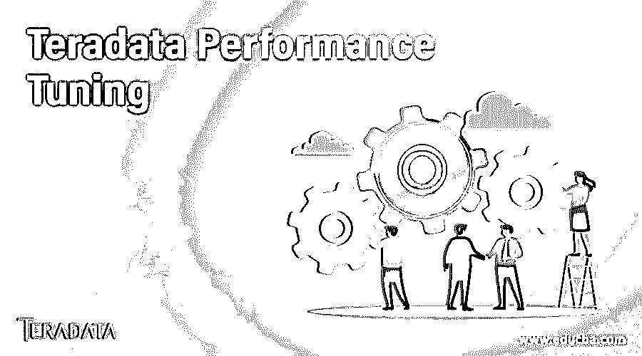

# Teradata 性能调优

> 原文：<https://www.educba.com/teradata-performance-tuning/>

## Teradata 性能调优简介

Teradata 性能调优包括 a .通过规范化关键表、使用正确的数据类型、合理调整列数、避免空值、使用正确的连接操作以及部署正确的索引和服务器缓存来优化数据库 b .通过将 SQL 调整到基准标准并在编写 SQL 语句时遵循某些注意事项和禁忌来微调数据库需求 c .改变计算、存储和网络环境及参数以增强数据库性能。

性能调优对于任何组织来说都是必不可少的，它可以通过更快地从数据库中检索数据来缩短前端响应时间，并减少不必要的数据库活动，从而改善客户体验。数据库中的任何缓慢都会反映在应用程序性能中。在数字业务运营中，任何这种缓慢都会驱使客户远离竞争对手，导致公司的财务损失。

<small>Hadoop、数据科学、统计学&其他</small>

在本文中，让我们研究一下 Teradata 应用程序中性能调优的方式和方法。

### Teradata 的特性

*   著名的关系数据库管理之一，主要用于构建非常大的数据仓库应用程序。
*   由一家名为 Teradata 的公司拥有，始于 1979 年，并在 2014 年前不断升级
*   工作负载由多个处理器分担，并提供丰富的并行处理能力。
*   具有带附加磁盘存储的专用处理器节点，可以均匀地存储记录并独立地检索它们。
*   它可以随着节点的增加而线性扩展，并且可以很容易地连接到大型机或网络系统。
*   它支持 SQL，这是一个将数据上传到 Teradata 数据库的工具主机。

### Teradata 性能调优的步骤

如前所述，Teradata 性能调优可以在三个级别进行，即，a .数据库级，b .优化 SQL 查询，c .微调硬件环境。所有级别中的各个步骤解释如下。

#### 1.数据库调优

数据库结构应该足够健全，能够存储大量数据并更快地检索它们，以确保 Teradata 系统有更好的性能。

**标准化表格**

*   每一列都应该有一个唯一的名称，并且应该只有一个值
*   每个表都应该有一个主键字段，并且表中的所有非键字段在功能上都应该完全依赖于主键。
*   表中的非键字段之间不应该有任何依赖关系
*   应该避免多值依赖。

**标准化的好处是**

*   它避免了连接操作中记录的重复和记录的错误相乘。
*   提高数据的一致性和查询结果的准确性
*   由于零冗余记录和使用索引的快速搜索操作，执行速度更快。

**索引**

索引通过缩短整个表的访问时间，有助于更快地检索记录。有两种类型的索引，即主索引和辅助索引。主索引列应该是唯一的，其他列应该依赖于主索引列。辅助索引的创建取决于数据人口统计以及该列在 where 子句中的使用方式。

**分区**

这个过程将一个大表分割成多个较小的表。表的逻辑分组有助于记录的轻松维护和记录的快速检索，因为搜索仅限于较小的数据量，从而总体减少了响应时间。应该在一个列上对行进行分组和分区，以便用户访问被限制在组内，并且不会跨越分区。

**正确数据类型的使用**

*   对于数值型字段，应根据要存储的最大值选择大小合适的数据类型，对于非数值型字段，应根据最大长度选择。为了获得更好的性能，长度越短的数据类型越好。
*   只要有必要，就应该使用日期和时间类型，以避免浪费转换。
*   连接操作中使用的列在所有表中应该具有相同的类型，以避免连接过程中不必要的转换。

**避免空值**

用数据库的术语来说，Null 是一个没有值的值，一般来说，在涉及算术、聚合、字符串操作和条件操作的列中应该避免使用它，因为结果是不可预测的。避免这种错误的一种方法是在编码中显式检查空值，但这会降低性能水平。

**列太多**

避免在一个表中有太多的列，因为它有很大的开销，并且会降低数据库的性能，只要有可能，就用较少的逻辑拆分列来设计表，以实现更平滑和更快速的操作。

**服务器查询缓存**

这种缓存也称为将表固定在服务器的内存中。频繁访问的表的副本保存在内存中，任何访问该表的查询都将引用内存中的热副本，而不是访问数据库，以快速获得结果并提高性能。表中内容的任何变化都将触发刷新存储器中的内容。

#### 2.查询优化

*   在 where 子句中，应该尽可能只使用带有索引的列，并且应该避免全表扫描。
*   应该避免使用前导通配符，因为在这样的搜索操作中不会使用索引。
*   应该谨慎使用逻辑 OR 条件，如果 OR 条件之一不在索引列上，那么优化器可能会选择全表扫描。或者，可以使用 union 子句。
*   像 expression where 子句应该尽可能避免，优化器可以选择全表扫描。
*   应该使用 EXISTS 而不是 IN 表达式来提高数据库性能。
*   使用 distinct 代替 group by 以节省查询时间
*   避免 UNION 并使用 UNION ALL，因为 UNION 在过滤重复项时会花费更多时间
*   用易于管理的小 SQL 语句来代替大语句。
*   使用具有较少数量表的关节，并对其进行微调。

#### 3.监控数据库性能和微调

*   应该根据数据人口统计为关键列收集统计信息，还应该为 where 子句中使用的非索引列收集统计信息。统计数据应该经常更新。
*   监视执行计划是使用索引还是采用全表扫描，并研究瓶颈。
*   使用 Optimizer 和 Explain 选项以及统计数据来跟踪所创建的索引是否得到有效使用，以及它们对数据库性能的影响。
*   添加新索引并删除现有索引。
*   建议 SQL where 子句中的代码更改以克服瓶颈。

### 结论

应该使用 DB 工具持续监控数据库的性能，并且应该分析和解决任何瓶颈。除了数据库监控，还应该重新审视应用程序设计和编码，以获得稳定的性能水平。

### 推荐文章

这是一个关于 Teradata 性能调优的指南。在这里，我们将讨论 Teradata 应用程序中性能调优的方式和方法，以及特性和步骤。您也可以看看以下文章，了解更多信息–

1.  [插入 Teradata](https://www.educba.com/insert-into-teradata/)
2.  [Teradata 当前日期](https://www.educba.com/teradata-current-date/)
3.  [Teradata 案例陈述](https://www.educba.com/teradata-case-statement/)
4.  [Teradata 分区依据](https://www.educba.com/teradata-partition-by/)