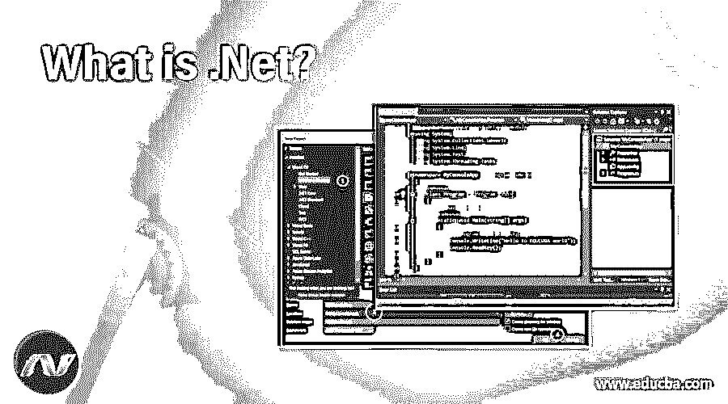
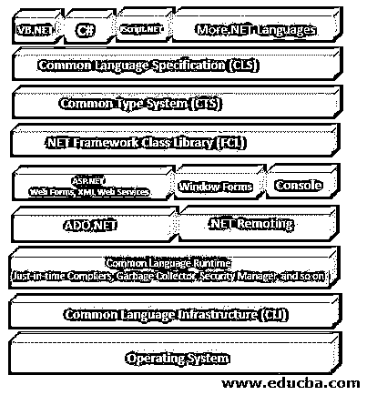
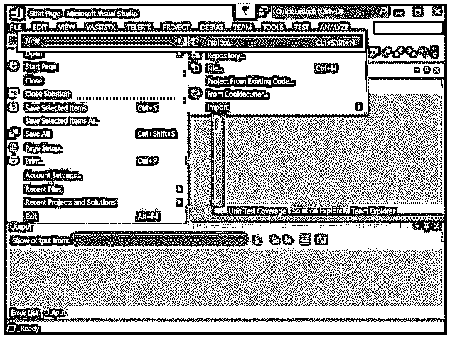
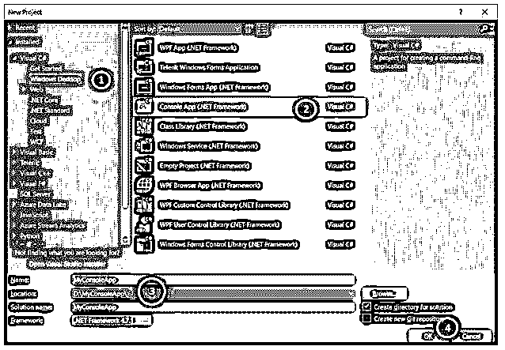
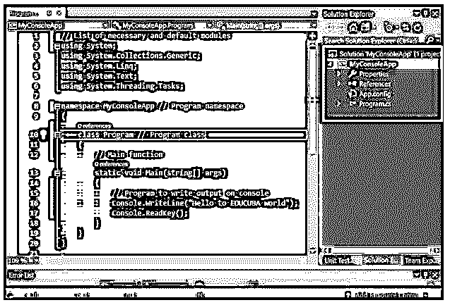
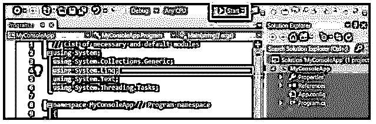
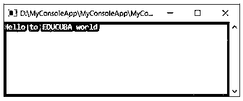

# 什么是。网？

> 原文：<https://www.educba.com/what-is-dot-net/>

## 介绍什么是。网？

当我们说。Net，基本上是微软的技术。几年前，它只有 VC++和 VB 脚本来与 java 竞争。当今世界更加依赖互联网。它是由微软开发的一个框架，包括大量的类库，提供跨各种编程语言的语言互操作性。我们编写的任何程序。Net 框架在一个被称为公共语言运行时(CLR)的软件环境中执行。它提供了安全性、[异常处理](https://www.educba.com/exception-handling-in-java/)和内存管理等功能。Microsoft 为。Net 软件称为 visual studio。

### 点网的框架结构

我们可以看到图中的第一层由所有不同的语言组成。它的架构是模块化的、分层的，或者你可以说是分层的。它有一个抽象层。最抽象的顶层包括。网络语言。

#### 1.公共语言规范

通用语言规范(CLS)是一组基本的语言特性。Net 语言来开发应用程序和服务，这些语言与。Net 框架。通用语言规范(CLS)完全确保了应用程序之间的互操作性，而不管应用程序是用什么语言创建的。

#### 2.普通类型系统

CTS 是的一部分。Net CLR，它负责代码中的类型安全。CTS 主要处理数据类型。我们有各种各样的语言，每种语言都有自己不同的数据类型，其他语言无法理解。然而，。Net 框架语言可以理解所有不同的数据类型。它的主要目的是使它独立于语言。

CTS 是一个目录。网络类型。系统。Int32，系统。十进制，系统。布尔等。开发人员不需要直接使用这些类型。这些类型存在于每种托管语言中，并且这些类型是所提供的特定数据类型的底层对象

#### 3.框架类库

FCL 提供对系统服务的访问。一些可用的服务是远程处理、XML、数据库访问和文件输入/输出。它是一组类、接口、命名空间和值类型，用于。Net 应用程序。它还支持异常处理。它能够创建基于 windows 的 GUI 应用程序、web 客户端和服务器应用程序。

#### 4.公共语言运行时

公共语言运行库接近本机环境，并且在底层中也是最不抽象的。CLR 与操作环境密切合作，管理所有的。Net 应用程序。JIT (Just-In-Time)是一种编译器，用于将托管代码转换为机器指令，这些指令稍后将由计算机的 CPU 执行。基本上，它提供了一个运行。Net 应用程序。

#### 5.公共语言基础设施

它提供了一个虚拟的执行环境。它使用编译器将语言语句(也称为源代码)处理成可执行代码的初级形式。它的设计方式使得开发可用作 web 服务的程序变得更加容易。CLI 程序可以用各种编程语言编写，如 C++、C#、ASP 等。这些语言都编译成 CLI。然后，CLR 编译成机器代码，以便进一步处理。

### 为什么我们使用？网？

*   它具有集中的数据存储，从而提高了效率。
*   信息与用户和设备的同步。
*   容易获取信息。
*   它具有整合媒体、传真、电话和各种通信的能力。
*   它允许开发者使用他们已经创建的可重用模块。
*   由于可重复使用的模块，减少了错误数量并提高了生产率。
*   互操作性的普及。
*   它懂多种语言。所以，这个框架是独立于语言的。

### 构建控制台应用程序

使用 Visual Studio 创建一个控制台应用程序来显示消息“Hello EDUCUBA World”的示例。在开始之前，你只需要在你的机器上安装任何版本的 visual studio。让我们通过以下步骤创建一个应用程序:

首先你需要在 visual studio 中创建一个项目。为此你需要启动一个 visual studio，这里我用的是 visual studio 2019。一旦 visual studio 启动，你就可以进入文件- >新建- >项目，如下所示

**第二步:**下一步你需要做的是选择项目类型为控制台应用。您可以在其中更改项目名称和位置或保留默认名称。

*   我们可以看到在 Visual studio 中创建不同的[项目的多个选项。我们需要从左侧选择 Windows 桌面选项。](https://www.educba.com/what-is-visual-studio-code/)
*   单击 Windows 桌面选项后，我们将看到控制台应用程序选项。只要选择那个选项。
*   现在我们需要给我们的应用程序命名，这里我们给项目命名为 MyConsoleApp。我们可以提供我们的项目位置来存储我们的程序。
*   最后，单击“OK”按钮，让 visual studio 创建我们的项目。

**第三步:**当我们在最后一步点击“确定”时。Visual studio 在给定位置内部创建我们的项目“MyConsoleApp”。这个项目将拥有运行控制台应用程序所需的所有工件。

如果你注意到下图中突出显示的矩形。它显示了 Solution explorer，其中包含我们的项目名称和控制台应用程序所需的文件。

如果我们打开 Program.cs，我们会看到一些默认代码已经放在该文件中。为了方便起见，我添加了第 16 行和第 17 行，它们将用于编写“Hello to EDUCUBA world”。

**代码解释:**

*   “using”语句基本上用于导入. Net 模块。用来跑步的。NET 应用程序。
*   每一个。NET 应用程序围绕类运行。因此，无论我们想执行哪个代码，我们都需要将其定义到类中。同样，每个类都属于一个名称空间。其中名称空间被称为类的逻辑组。
*   当控制台应用程序被执行时，main 函数被自动调用。因此，我们需要在这里输入我们想让程序执行的代码。
*   控制台类存在于系统中。NET 系统命名空间。因此，我们使用 building WriteLine 方法来编写字符串“Hello to EDUCUBA world”
*   ReadKay()用于准备来自控制台的任何键。在我们输入任何键之前，程序将等待该键，并且不会退出。如果没有这一行，程序将在运行后立即退出。

**第四步:**要运行程序，点击开始按钮，如下图所示。

如果程序中没有任何错误，它将成功执行，并在控制台上显示如下输出。

我们可以清楚地看到控制台上的“你好，EDUCUBA world”消息，这是由于控制台。导致向控制台发送字符串的 Writeline 语句。

### 结论

我们已经学会了什么是。网？为什么我们使用？Net 及其使用举例。由于它支持多种语言，开发者可以很容易地选择任何语言来开发他们的应用程序。然而，我们可以说。NET 要灵活得多。此外，编写程序是一项不费吹灰之力的任务。NET 提供了默认的工件。

### 推荐文章

这是一个什么是什么的指南。网？这里我们讨论一下. NET 的简介，框架结构。网？和构建控制台应用程序。您也可以看看以下文章，了解更多信息–

1.  [c#中的集合](https://www.educba.com/collections-in-c-sharp/)
2.  的用途。网络
3.  [ASP.NET 复选框](https://www.educba.com/asp-dot-net-checkbox/)
4.  [ASP.NET 隐藏场](https://www.educba.com/asp-dot-net-hidden-field/)

