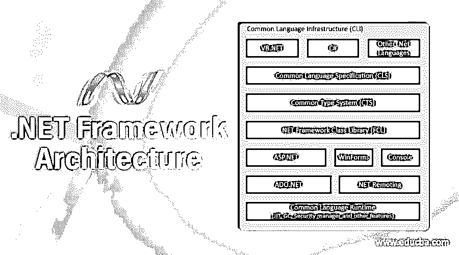
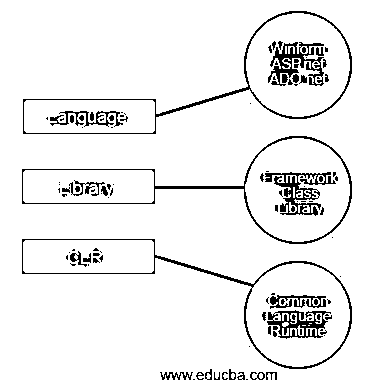

# .NET 框架体系结构

> 原文：<https://www.educba.com/dot-net-framework-architecture/>

## 概述。NET 框架体系结构

本文将帮助您理解。net 框架及其体系结构。

.net 框架不是一个新的框架，但它被许多公司广泛使用。它是微软开发的一个框架，基本上运行在微软的 windows 上。它的第一个测试版本是 1.0，发布于 2002 年。它是用于开发基于控制台、基于窗口的应用程序和基于 web 的应用程序的框架。这个框架[支持许多编程语言](https://www.educba.com/best-programming-languages/)，比如 c#和 visual basics。因此，开发人员很容易选择任何语言来开发他们所需的应用程序。

<small>网页开发、编程语言、软件测试&其他</small>

### 的组件。NET 框架体系结构

的架构。net 框架是基于。净成分。让我们借助它的图表来看看它的组件和对其架构的描述。

#### 1.公共语言运行时

这是一个平台。net 程序被执行。正如我们所说，开发人员可以选择任何。net 编程语言。CLR 管理用任何语言编写的程序的执行。JIT(实时)编译器是 CLR 的一部分，它将编译成中间语言代码的托管代码转换成机器指令，然后在计算机的 CPU 上执行。

编译代码时，编译器将其源代码转换成独立于 CPU 的中间语言(IL)。现在，JIT(即时)编译器将 IL 代码编译成特定于 CPU 的本机代码。它提供了一个健壮和安全的执行环境。它提供了框架[和操作系统](https://www.educba.com/types-of-computer-operating-system/)之间的接口。

中有两种类型的代码。net framework one 管理将在 CLR 环境下运行和执行的代码。另一个是非托管代码，它不会在 CLR 环境中运行和执行。此外，它支持简化应用程序开发的多种语言。

它有许多主要特性，所以让我们来看看它的主要特性。

*   代码访问安全性
*   内存管理
*   螺纹支架
*   调试引擎
*   优化、保护和提供强大功能的能力，如应用程序部署和并行执行。
*   垃圾收集，在不需要时移除不需要的资源
*   [异常处理，包括](https://www.educba.com/exception-handling-in-vb-dot-net/)跨语言异常。异常是程序或应用程序执行时的错误
*   JIT 编译(即时)

假设我们写了一个程序，它需要内存，CLR 现在在范围内为程序分配内存，并在不需要或完成时释放内存。

#### 2.框架类库(FCL)

它是数千个类、接口、命名空间和值类型的集合，用于。这基本上是一个标准的库。它是。提供. net 核心功能的. net 框架。

FCL 是专门为向 Windows API(应用程序编程接口)提供服务而设计的。net 被创建。框架类库有自己的代码库，易于使用，作为托管，面向对象。另一方面，API 是非托管的，模块化的，不好用。它包含许多支持以下功能的类。

*   [异常处理支持](https://www.educba.com/exception-handling-in-java/)
*   流操作和输入/输出
*   基本和用户定义的数据类型
*   获取数据
*   与底层系统的通信
*   创建 web 客户端和服务器应用程序
*   创建基于窗口的 GUI 应用程序
*   为创建 web 服务提供支持
*   碎片帐集
*   安全，数据访问。
*   数据库连接
*   网络通信

它被组织在一个分层的树形结构中，该结构被划分为多个名称空间。基本上，名称空间是类型和组织方式的逻辑分组。net FCL 根据他们的功能，可用性以及他们所属的类别。它内置的安全机制有助于应用程序的验证和确认。

FCL 为我们提供了一致的基类型，它们在所有。支持. net 的语言。FCL 是提供对系统服务的访问的托管类。系统命名空间是。net 框架。FCL 类易于使用并且是面向对象的，我们可以在程序开发中使用它。此外，第三方组件能够与。net 框架。

开发人员或程序员没有任何管理内存的压力，因为它具有内存管理特性和线程管理。FCL 和 java 基础类一样。但是 FCL 面临的主要挑战是了解或识别能够为我们提供所需功能的特定类。如果程序员没有正确使用 FCL 库，那么它将对开发人员的生产力产生负面影响，从而阻碍其使用。

FCL 与管理代码执行的 CLR(公共语言运行时)集成在一起。此外，类和接口被分组到命名空间中，以便于访问。

#### 3.语言

因为我们 know.net 支持多种语言，这就是为什么开发人员很容易选择任何语言来开发所需的应用程序。各种应用程序可以构建在。net 框架，大致分为以下几类。

*   **Winform:** 基于表单的应用程序是在 Winform 的帮助下开发的，它将在最终用户机器上运行。记事本是基于客户端的应用程序的一个例子。
*   ASP。基于网络的应用程序由 ASP .net 开发，它可以在 chrome、internet explorer 或 Firefox 等任何浏览器上运行。安装了 Internet 信息服务，web 应用程序将在此服务器上处理。IIS 用于执行属于微软组件的 ASP.NET 应用程序。这个执行结果现在被发送到客户机，现在这个输出显示在浏览器中。
*   **阿多。Net:** 这是一种开发应用程序的技术，将与 Oracle 或 Microsoft SQL servers 等数据库进行交互。中最常用的语言。net 是 C#和 VB .net。

### 结论

在本文中，您一定已经了解并获得了. net 架构和框架的基本概念。对于开发基于 windows 的应用程序来说，它非常强大、灵活和简单。由于它支持多种语言，开发者很容易选择多种语言。

### 推荐文章

这是一本指南。NET 框架架构。在这里，我们将讨论的概述和前 3 个组件。NET 框架体系结构，即 CLR、FCL 和语言。您也可以阅读以下文章，了解更多信息——

1.  [ASP.NET 的数据绑定](https://www.educba.com/data-binding-in-asp-net/)
2.  [ASP.NET 服务器控件](https://www.educba.com/asp-dot-net-server-controls/)
3.  [ASP.NET 的缓存](https://www.educba.com/caching-in-asp-dot-net/)
4.  [是什么。网？](https://www.educba.com/what-is-dot-net/)

