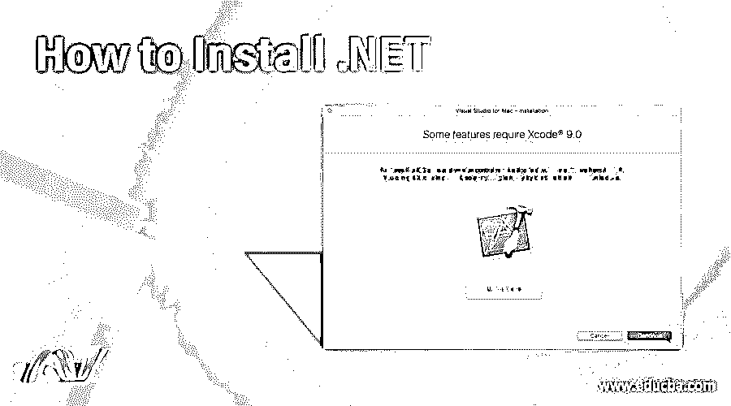
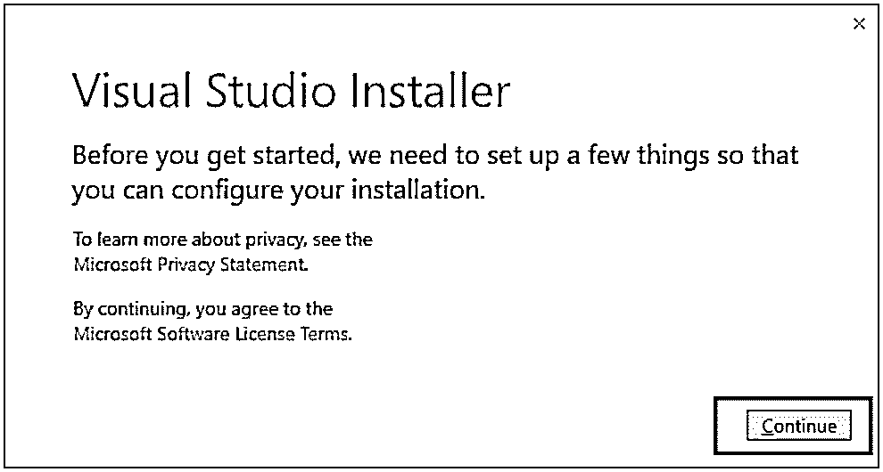
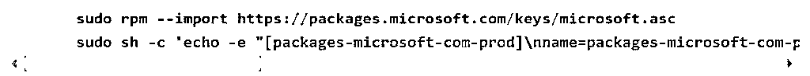
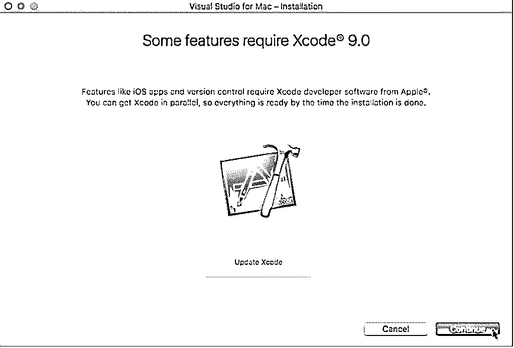

# 如何安装。网

> 原文：<https://www.educba.com/install-dot-net/>

## 什么是。网？

安装。NET，[了。Net 是一个免费的、跨平台的开源平台，可以帮助开发者构建不同的应用程序。.Net 可以帮助构建不同的网络应用、](https://www.educba.com/what-is-dot-net/)、游戏，也可以用于物联网。开发人员可以使用多种语言，并有不同种类的编辑器和库，这使得它易于使用。.Net 框架可以通过微软强大的工具 VC++访问。它有许多数据类型和库，有助于解决兼容性问题，并有助于包括 Windows SDK、MFC、ATL 等。它用的是 Visual basic，非常好用。

### 安装 Visual Studio 的先决条件。网

在安装 Visual Studio 之前，应该注意以下步骤

<small>网页开发、编程语言、软件测试&其他</small>

*   禁用系统上的任何防病毒或反间谍软件。
*   所有正在运行的软件都应该关闭。
*   确保您的系统至少有 1 GB 内存。
*   确保您的系统有 3GB 的可用硬盘空间。

Microsoft Visual Studio 是微软的一个集成开发环境，有助于为 Microsoft Windows 开发程序。它被认为是构建 upon.Net 平台的应用程序的最佳应用程序。开发人员可以使用 Visual Studio 开发、调试和运行不同的应用程序。

### 安装 Visual Studio 的步骤。网

下面是在您的系统上安装 Visual Studio 的步骤。

*   若要下载 Visual Studio，请转到下面的链接。

在这里，您可以下载 Visual Studio 的社区版本，学生、开源开发人员或个人开发人员都可以使用。您将看到的第二个可供下载的选项是[Visual Studio](https://www.educba.com/what-is-visual-studio-code/)Professional 2017 版本，可用于小型团队的专业开发人员工具、服务和订阅优势。让我们寻找安装专业版的步骤。

*   点击下载。exe 文件。

*   当下一个屏幕出现时，点击“继续”。

*   Visual Studio 将开始下载初始化文件。此下载速度可能会因您的互联网连接而异。
*   完成后，单击下一个屏幕，然后单击安装。选择 Visual Studio Professional 2017 包。
*   进入下一个屏幕后，选择。Net 桌面开发。现在点击安装。
*   Visual Studio 现在将根据您在步骤 6 中的选择下载所有相关文件。
*   这将安装所有的软件包，然后你会被要求重新启动电脑。
*   一旦重新启动完成，当系统重新启动时，您将看到 Visual Studio IDE 可用，并且您可以轻松地打开它。
*   您可以通过选择自己喜欢的颜色主题来设置环境。单击开始 Visual Studio。
*   在 Visual Studio 中，您可以导航到“文件”菜单来创建新的。Net 应用程序，并根据您的需要和要求开始使用它们。

开发人员可以选择在哪个操作系统上运行. Net。这种选择可以让他们使用 Linux。Linux 发行版列表。Net Core 能运行的是红帽 Linux、 [Ubuntu、Fedora](https://www.educba.com/ubuntu-vs-fedora/) 等。让我们考虑一下这个装置的[软呢帽。](https://www.educba.com/install-fedora/)

1.  添加。净产品进料。

2)这之后，我们来安装。Net Core SDK 如下。

*   **sudo dnf 更新**
*   **sudo dnf 安装 lib unwind libi Cu compat-OpenSSL 10**
*   sudo dnf 安装。Net-sdk-2.0.0

3)创作。Net 控制台应用程序。Net，您可以创建自己的控制台应用程序。网芯。可以使用以下命令创建新的控制台:

**mkdir hello world&T7】CD hello world
。net 新主机**
**。网络运行**

的’。Net 新控制台帮助创建新的控制台 Hello World。项目名应该与目录名匹配，代码是使用模板构建的。的’。Net run '命令构建代码，每当开发人员调用。net 运行时，您可以检查*。csproj 文件已被修改，请运行。net restore 命令。它还检查源代码是否有任何改动，然后运行 build 命令。开发人员现在可以运行可执行文件了。

像 Linux 一样，开发者也可以在 MAC 操作系统上运行代码。运行的先决条件。NET core 版本的一个问题是 MAC OS 上的默认打开文件限制可能不够，因此开发人员必须提高它。通过使用文本编辑器，创建一个新文件/Library/launch daemons/limit . max files . plist，并使用以下内容保存它

`<?xml version="1.0" encoding="UTF-8"?>
<!DOCTYPE plist PUBLIC "-//Apple//DTD PLIST 1.0//EN" "http://www.apple.com/DTDs/PropertyList-1.0.dtd">
<plist version="1.0">
<dict>
<key>Label</key>
<string>limit.maxfiles</string>
<key>ProgramArguments</key>
<array>
<string>launchctl</string>
<string>limit</string>
<string>maxfiles</string>
<string>2048</string>
<string>4096</string>
</array>
<key>RunAtLoad</key>
<true/>
<key>ServiceIPC</key>
<false/>
</dict>
</plist>`

完成后，运行以下命令:**echo ' ulimit-n 2048 ' | sudo tee-a/etc/profile**。重新启动 MAC OS 以应用这些设置。完成后，请遵循以下步骤。

*   转到浏览器并从该链接下载 Visual Studio for MAC
*   双击这个下载的映像来挂载它。完成后，它会要求您接受隐私和许可条款。点击继续接受它们。
*   完成后，可能会出现一个询问功能更新的屏幕，并且建议在系统中安装这些更新。

*   现在，单击安装继续。无论在哪里被要求，你都可以提供你的证件。
*   可以自定义 MAC OS 上的安装。你可以选择你喜欢的包，比如 Android + Xamarin。表单，。NET Core+ASP.NET Core，macOS 等。的。NET Core+ASP.NET Core 支持使用 ASP.NET Core 进行控制台应用程序开发以及 web 应用程序和服务开发。
*   选择这些包之后，安装就完成了，一旦你点击 Start Visual Studio for MAC，它就会启动。

### 结论

.NET 是最古老的框架之一，现在仍在使用。它有许多新增功能，与以前不同的是，我们现在可以安装。Net 在所有操作系统上运行。作为开源软件，它仍然是最受欢迎的技术之一。因此，开发人员可以利用它来创建各种应用程序和 web 应用程序，并在 Windows、Linux 或 MAC OS 上轻松使用它。

### 推荐文章

这是关于如何安装. Net 的指南。在这里，我们讨论了安装. Net 的基本概念和各个步骤。您也可以看看下面的文章来了解更多信息

1.  的用途。网络
2.  [Windows 面试问题](https://www.educba.com/windows-interview-questions/)
3.  [安装 phpMyAdmin](https://www.educba.com/install-phpmyadmin/)
4.  [安装 PostgreSQL](https://www.educba.com/install-postgresql/)

