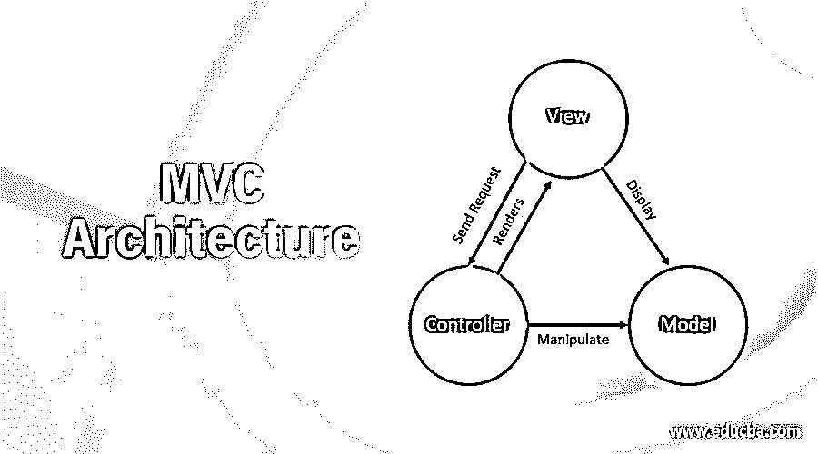
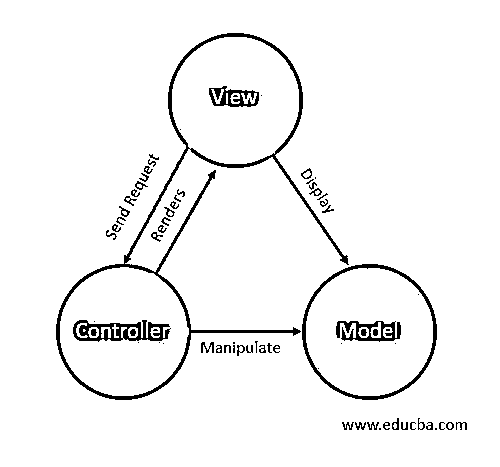

# MVC 架构

> 原文：<https://www.educba.com/mvc-architecture/>

## MVC 架构简介

MVC 不是一种框架或编程语言。它是一种设计模式，帮助你以这样一种方式编写代码，使得任务分配、测试和维护应用程序变得容易。它侧重于根据代码的关注点来分离代码。代码主要分为三部分，即模型、视图和控制器。这就是 MVC 所代表的模型-视图-控制器模式。还有其他类型的设计模式，如 MVC，即模型-视图-视图模型(MVVM)，模型-视图-展示者(MVP)，以及模型-视图-无论什么(MVW)。

### MVC 独立关注点

模型视图控制器设计模式主要关注于将业务逻辑、用户显示界面和数据相互分离。三个独立关注点的目的如下所述。

<small>网页开发、编程语言、软件测试&其他</small>

#### 1.模型

它保存数据和代码的业务逻辑或服务层逻辑。它包含我们需要传输和操作的内容的所有数据结构、属性和特性。它包含实体、领域模型和视图模型。

#### 2.视角

用户界面包含布局并显示代码的逻辑。它使用户与系统进行交互，并帮助接受输入和向用户显示适当的输出。这些代码通常是在基于 web 的应用程序中使用 HTML、CSS 和 javascript 编写的。视图向控制器发送请求，并呈现从控制器收到的响应，显示模型内容。

#### 3.控制器

它路由请求和响应，呈现请求，并在代码的视图和模型部分之间进行通信。控制器呈现并向视图发送响应，并操纵模型。有时，它操纵模型，然后将更新后的模型发送给视图。

### 互动和范例

现在，我们将学习这三个组件如何相互作用，它们各自扮演什么角色，以及它们如何共同帮助代码变得可维护。考虑一个在线购物的例子，我们需要跟踪用户在购物车中添加的商品。我们必须为购物车维护构建一个应用程序。

#### 1.模型

它存储数据，每当其中的数据状态发生变化时，它通常会通知视图我们是否需要向用户或控制器显示数据，以防数据需要进一步处理。在上面的购物车维护示例中，模型的实例将存储商品名称、数量、价格和客户名称等细节。每当内容有任何变化时，它将发送该变化以查看部分代码或控制器，以便在显示 GST 计算之前进行进一步操作。

#### 2.视角

视图处理并包含用户可以用来与系统交互的显示和布局。在我们的购物车应用程序中，视图将显示购物车中的商品列表，并在需要时从模型中检索数据，如果完成了任何新的操作，如从购物车中插入、更新或删除商品，则向控制器发送请求。

#### 3.控制器

控制器包含路由请求和在需要时更新和操作模型或视图的主要逻辑。在上面的例子中，控制器将从视图中收集请求，然后处理和操作模型，然后将更新的数据发送给视图。例如，如果购物车中特定商品的数量增加，那么视图将向控制器发送请求以更新模型中的数量，控制器将更新模型并将响应连同更新后的模型实例一起发送回客户机。可能会出现不需要操纵模型的情况。例如，当用户刚刚刷新他/她的购物车，或者想要根据某个参数(如价格)对购物车数据进行排序时。在这种情况下，没有必要更新模型。控制器将直接执行一个动作并将数据重新发送给视图。

### 基于 Web 的应用程序中的 MVC 架构

*   设计模式基本上是针对最常见问题的解决方案。代码的可维护性一直是一个难点。MVC 模式就是这样一种设计模式和解决方案，它被开发人员用来解决代码维护的问题，使任务更简单，代码更容易理解。
*   这种模式非常流行，最常用于 20 世纪 80 年代的 web 应用程序。以前，这种模式只适用于像 ASP 这样的服务器端编程。Net 也是今天主要使用的。服务器端的代码被分成不同的组件，如处理 API 请求、业务逻辑或服务代码的控制器，以及保存数据的模型部分，这些数据需要存储在数据库中，进行操作并发送到客户端以获得代码的视图部分。
*   但是随着 web 技术的发展和 XMLHttpRequest 的出现，甚至可以根据需要对页面进行部分更新。因此，在 web 应用程序中，大多数时候更多的逻辑是在客户端编写的，以提高应用程序的性能，并对最终用户做出早期响应。这也导致了许多客户端语言对 MVC 设计模式和架构的遵循，包括 Angular.js、Amber.js 和 Node.js。所有这些框架和技术都以相同或不同的方式使用 MVC 设计模式。

### 结论

在为我们的应用程序编码时，我们应该总是尝试使用 MVC 模式和架构。MVC 模式有很多优点，比如它有助于编写干净的代码，关注点的分离使得代码的开发者和维护者更容易理解代码并在其中做任何改变。

劳动的分配和任务的分派变得容易和独立。此外，它有助于解耦您的代码，这进一步使测试更容易。服务器端和客户端技术都可以遵循 MVC 模式。

### 推荐文章

这是 MVC 架构的指南。在这里，我们讨论一个介绍，三个单独的关注与例子和基于网络的应用。您也可以浏览我们的其他相关文章，了解更多信息——

1.  [什么是 MVC 设计模式](https://www.educba.com/what-is-mvc-design-pattern/)
2.  [MVC 中的视图模型](https://www.educba.com/viewmodel-in-mvc/)
3.  [MVC 视图数据](https://www.educba.com/mvc-viewdata/)
4.  [MVC 中的实体框架](https://www.educba.com/entity-framework-in-mvc/)

