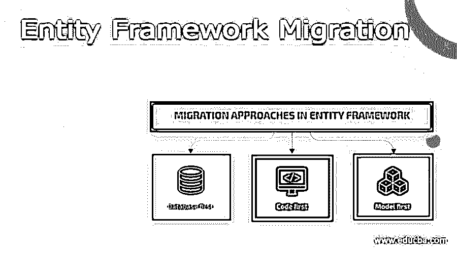
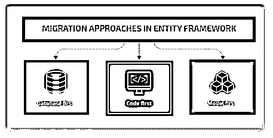
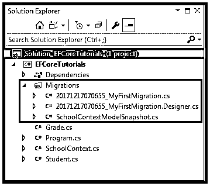
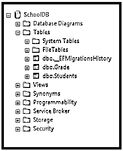

# 实体框架迁移

> 原文：<https://www.educba.com/entity-framework-migration/>

## 实体框架迁移简介

实体框架迁移是一种工具，当模型发生任何变化时，它会自动更新数据库的模式，但不会丢失任何现有数据或任何数据库对象。EF 迁移使用名为 MigrateDatabaseToLatestVersion 的新数据库初始化。迁移允许您在不删除或重新创建数据库的情况下更改数据模型。

### 什么是实体框架迁移？

实体框架迁移允许您在数据模型中进行任何更改，并且它组织和更新对生产环境所做的数据库模式更改，而无需删除任何数据库或重新创建数据库。迁移提供了一组工具，使您能够最初创建与 EF 模型一起工作的数据库，它生成迁移以跟踪我们对 EF 模型所做的更改，并且它还使数据库与模式中所做的更改保持同步。

<small>网页开发、编程语言、软件测试&其他</small>

实体框架迁移从域或实体类创建 EF 模型，EF 迁移基于 EF 模型创建或更新数据库模式。当您在域类中进行任何更改时，我们需要执行迁移来维护数据库模式更新。

### 实体框架迁移命令

实体框架迁移允许您在数据模型中进行任何更改，它组织和更新对生产环境所做的数据库模式更改，而无需重新创建数据库或删除数据库。

实体框架迁移是一组已执行的命令，我们可以在 PMC(软件包管理器控制台)或 CLI(命令行界面)中运行这些命令。让我们看看实体框架迁移的重要命令，

**添加新迁移—**该命令用于通过包含迁移快照来创建迁移，让我们看看以下命令

在软件包管理器控制台，**添加-迁移<迁移名称>**

在 CLI **> dotnet ef 迁移中添加<迁移名称>T1】**

**删除迁移–**该命令用于删除最后一个迁移快照，让我们看看以下命令

在软件包管理器控制台中，**删除-迁移**

在 CLI 中 **>点网 ef 迁移删除**

**更新数据库–**该命令用于根据上次迁移快照更新数据库模式，让我们看看以下命令

在软件包管理器控制台中，**更新数据库**

在 CLI **> dotnet ef 数据库更新**

**脚本迁移–**该命令用于通过使用整个迁移快照来生成 SQL 脚本，让我们看看以下命令

在软件包管理器控制台中，**脚本迁移**

在 CLI 中 **>点网 ef 迁移脚本**

让我们看看添加迁移，

添加-迁移

*   PMC 命令:用于添加新的迁移
*   CLI 命令:是否添加 dotnet ef 迁移

当我们最初创建或更改域类时，我们需要创建迁移，对于新迁移的创建，我们需要使用命令**add-migration 在其他方面，我们也可以使用命令行来添加迁移 **dotnet ef 迁移。**只需打开控制台管理器包并执行如下命令，**

add-migration "initial" //这是到软件包控制台管理器的

点网 ef 迁移添加“初始”//点网 cli

### 实体框架迁移三个实体

实体框架提供了三种处理数据库模式迁移的实体，让我们来看看下面这三种方法

1.  **数据库优先**–数据库优先是一种逆向工程方法，现有数据库生成数据模型并对其进行完全映射。
2.  **代码优先**–代码优先方法在应用程序代码中定义数据模型，然后最终使用代码生成新的数据库。
3.  **模型优先**–模型优先方法使用 EF Designer 创建的数据模型生成数据库。

当我们比较代码优先和数据库优先的方法时，两者都是基于第三种方法，称为模型优先。

### 添加和创建迁移

为了最初添加新的迁移，我们需要定义初始的域类。这里没有应用程序的数据库，所以它可以存储来自域类的数据。相反，我们需要创造迁移。首先从 VS 中的工具获取软件包管理器软件包管理器控制台打开 PMC(软件包管理器控制台),并运行如下命令:

**PM** **à** **添加-迁移 MyFirstMigration**

您使用的是 dotnet 命令行界面，按如下方式运行命令，

*   **dotnet ef 迁移添加 MyFirstMigration**

在上面这些命令中，名称 **MyFirstMigration 是**迁移的名称，一旦我们创建了迁移，它会自动在项目的迁移文件夹中创建三个文件，如图所示，

*   **<时间戳> _ <迁移名称>。** cs 它是主迁移文件，包含了 Up()和 Down()方法中的迁移操作。Up()方法包含创建数据库对象的编码，Down()方法包含消除/删除数据库对象的编码。
*   **<时间戳> _ <迁移名称>。** cs 它是一个迁移元数据文件，包含实体框架核心使用的信息。
*   **< contextclassname >模型快照。** cs 它是当前模型的快照，该文件用于建立在生成后续迁移时所做的更改。

创建迁移快照后，接下来我们必须创建数据库，即创建或更新数据库。要创建和更新数据库，请遵循以下命令，

在软件包管理器控制台中， **PM >更新数据库**

在 CLI **> dotnet ef 数据库更新**

更新命令将在域类和上下文类的基础上生成数据库，并且在使用 add-migration 或 add 命令的帮助下使用迁移快照。

其中这是第一次迁移，因此它创建名为 _ EFMigrationsHistory 的表，该表存储所有迁移的名称，以便将其应用于数据库。

要删除迁移

要删除上次迁移，请使用命令删除上次创建的迁移文件，该文件会恢复模型快照。让我们按照以下两种方式来执行命令，

在软件包管理器控制台中， **PM >删除-迁移**

在 CLI **>中，点网 ef 迁移删除**

以上命令会删除最后创建的迁移，并将快照模型恢复到之前的迁移。

### 结论

在本文中，我们学习了实体框架迁移的过程，它是一个自动管理数据库模式的工具，不会丢失任何数据。希望这篇文章能帮助你理解实体框架迁移的用法。

### 推荐文章

这是一个实体框架迁移的指南。这里我们讨论一下简介，什么是实体框架迁移，命令，添加和创建迁移。您也可以看看以下文章，了解更多信息–

1.  [实体框架面试问题](https://www.educba.com/entity-framework-interview-questions/)
2.  [实体框架插入](https://www.educba.com/entity-framework-insert/)
3.  [ASP.NET 核心实体框架](https://www.educba.com/asp-dot-net-core-entity-framework/)
4.  [ADO.Net vs 实体框架](https://www.educba.com/ado-net-vs-entity-framework/)

