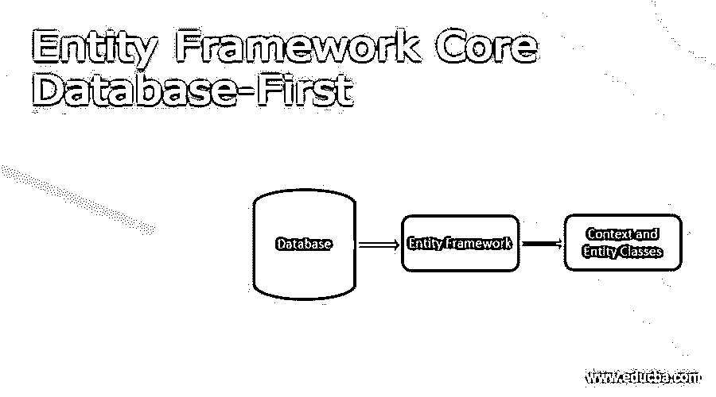
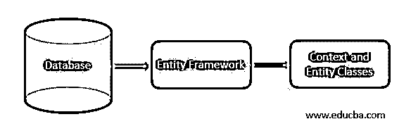

# 实体框架核心数据库-第一

> 原文：<https://www.educba.com/entity-framework-core-database-first/>

## 实体框架核心数据库介绍-首先

entity Framework Core Database-First 易于构建，用于通过 Scaffold-DbContext 的命令，在提供者作为参数和连接字符串的帮助下，从数据库中创建模型。从现有数据库创建上下文类和实体类被称为数据库优先方法；这两个类都是由实体框架从数据库中自动创建的。因此，最初我们必须首先为实体框架核心创建数据库。

### 实体框架核心数据库概述

实体框架核心通过 Scaffold DbContext 命令支持数据库优先的方法。数据库优先的方法就是从现有的数据库中创建模型和 DbContext 类，这两个类都是由实体框架从数据库中自动创建的。因此，最初我们必须首先为实体框架核心创建数据库。

<small>Hadoop、数据科学、统计学&其他</small>

我们将学习如何从实体框架核心中的现有数据库构建上下文类和实体类，从现有数据库创建这两个类被称为数据库优先方法。实体框架核心通过 PMC(软件包管理器控制台)的 Scaffold DbContext 命令支持数据库优先方法，这些命令为所需的数据库搭建实体和 DbContext 类。

### 创建数据库实体框架核心数据库

数据库优先的方法就是从现有数据库创建模型和 DbContext 类。下面我们来看看数据库优先 EF Core 的创建过程，

首先，我们需要了解在 EF 核心数据库中创建的要求-首先，创建要求是

*   我们需要 Visual Studio 2017 或更高版本，如 Visual Studio 2019 中可用的 EF Core 3.1。
*   对于以前的版本，我们需要在中使用 EF Core 2.2。NET Core SDK 2.2 和 EF Core 版。NET Core SDK 3.0
*   使用最新版本的 NuGet 软件包管理器
*   使用最新版本的 Windows PowerShell。

在**之后，在 SQL Server 中创建数据库**以使用实体框架核心，首先在 SQL Server 中创建简单的数据库并给出适当的名称，然后创建包含雇员表和部门表的表，如下所示

**部门表**

创建表[dbo]。[部门](

[Id] [int] IDENTITY(1,1) NOT NULL, [Name] [varchar](50) NOT NULL,

约束[PK_Department]主键聚集

(

[Id] ASC

)WITH (PAD_INDEX = OFF，STATISTICS_NORECOMPUTE = OFF，IGNORE_DUP_KEY = OFF，ALLOW_ROW_LOCKS = ON，ALLOW _ PAGE _ LOCKS = ON)ON[PRIMARY]

)开[主]

**员工表**

创建表[dbo]。[员工](

[Id] [int] IDENTITY(1,1) NOT NULL, [DepartmentId] [int] NOT NULL, [Name] [varchar](100) NOT NULL,[Designation] [varchar](25) NOT NULL,

约束[PK_Employee]主键聚集

(

[Id] ASC

)WITH (PAD_INDEX = OFF，STATISTICS_NORECOMPUTE = OFF，IGNORE_DUP_KEY = OFF，ALLOW_ROW_LOCKS = ON，ALLOW _ PAGE _ LOCKS = ON)ON[PRIMARY]

)开[主]

要在新建对话框中创建新项目 openàVisual studioàfileànewàProject，请选择 Visual C# à。Net Core 在左侧，在右侧选择控制台应用程序。输入项目名称，然后单击确定。

要安装 NuGet 包，一旦创建了一个新项目，我们必须包含必要的包，

点击工具菜单获取软件包管理器控制台。

如果您有 EF 核心版本 5，然后在(PMC)软件包管理器控制台中执行命令

*   安装包微软。实体框架工作核心工具

如果您有 EF 核心版本 3.1，然后在(PMC)软件包管理器控制台中执行该命令

*   安装包微软。EntityFrameworkCore . Tools-版本 1.10

如果您有 EF 核心版本 2.2，然后在(PMC)软件包管理器控制台中执行该命令

*   安装包微软。EntityFrameworkCore . Tools-版本 2.6

如果您有 EF Core 版，请在(PMC)软件包管理器控制台中执行以下命令，

*   安装包微软。EntityFrameworkCore . Tools-版本 1.5

### 从数据库创建类

现在，您在<u>软件包管理器控制台</u>窗口上运行 CLI Scaffold 命令。您可以从 Visual Studio 中的工具➤ NuGet 包管理器➤包管理器控制台打开此窗口。

这里可以在 PMC(包管理器控制台)中执行 CLI Scaffold 命令，只需在 VS 中打开 Toolsà NuGet Package Managerà包管理器控制台，输入以下命令创建实体和上下文类，

**PM**>dot net ef db context scaffold " Server =你的 serverNameDatabase =您的数据库名称；Trusted _ Connection = True 微软。EntityFrameworkCore . SQL server-o 模型

让我们看看实体类是这样创建的，

**员工. cs**

使用系统；

使用系统。集合。泛型；

命名空间 EF_DB_First。模型

{

公共部分类雇员

{

public int Id { get 设置；}

public int DepartmentId { get 设置；}

公共字符串名称{ get 设置；}

公共字符串指定{ get 设置；}

公共虚拟部门 Department { get 设置；}

}

}

**部门. cs**

使用系统；

使用系统。集合。泛型；

命名空间 EF_DB_First。模型

{

公立偏课系

{

公共部门()

{

employee = new HashSet<employee>()；</employee>

}

public int Id { get 设置；}

公共字符串名称{ get 设置；}

公共虚拟 ICollection <employee>雇员{ get 设置；}</employee>

}

}

**公司背景. cs**

使用系统；

使用微软。EntityFrameworkCore

使用微软。EntityFrameworkCore . Metadata

命名空间 EF_DB_First。模型

{

公共分部类 CompanyContext : DbContext

{

上市公司上下文()

{

}

上市公司上下文(DbContextOptions <companycontext>选项)</companycontext>

:基本(选项)

{

}

公共虚拟 DbSet <department>部门{ get 设置；}</department>

公共虚拟数据库集<employee>雇员{ get 设置；}</employee>

受保护的覆盖 void on configuration(dbcontextoptions builder options builder)

{

如果(！选项生成器。已配置)

{

#警告保护连接字符串中潜在的敏感信息

选项生成器。use SQL Server(" Server =–；Database = db _ nameTrusted _ Connection = True);

}

}

模型创建上受保护的覆盖 void(模型构建器模型构建器)

{

模型构建器。实体<department>(实体= ></department>

{

实体。属性(e => e.Name)

.is 必选()

.HasMaxLength(50)

.ISU nicode(false)；

});

模型构建器。实体<employee>(实体= ></employee>

{

实体。属性(e => e .名称)

.is 必选()

.HasMaxLength(25)

.ISU nicode(false)；

实体。属性(e => e.Name)

.is 必选()

.HasMaxLength(100)

.ISU nicode(false)；

实体。HasOne(d => d.Department)

.有许多(p => p .雇员)

.has foreign key(d = > d . DepartmentId)

.OnDelete(DeleteBehavior。ClientSetNull)

.HasConstraintName(" FK _ 员工 _ 部门")；

});

OnModelCreatingPartial(模型构建器)；

}

部分 void OnModelCreatingPartial(模型构建器模型构建器)；

}

}

### Scaffold-DbContext 的参数

让我们看看 Scaffold-DbContext 的参数。scaffold DbContext 有各种参数。Scaffold-DbContext 有各种参数来定制从现有数据库创建的模型。Scaffold-DbContext 中的参数如下:

*   **连接<字符串>**–该参数用于建立与数据库的连接。
*   **提供者<字符串>–**用于指定哪个提供者名称，如 SqlServer、SQLlite 等等。

**例如**:

scaffold-db context "<connection string="">"–提供商微软。EntityFrameworkCore.SqlServer</connection>

*   **output dir<String>**–该参数用于指定构建模型文件的目录名。

**例如**:

脚手架-DbContext " <connection string="">"</connection>

*   提供商微软。EntityFrameworkCore.SqlServer
    *   输出目录型号/数据库

*   **Context dir<String>**–该参数用于表示放置上下文文件的目录名

**例如**:

脚手架-DbContext " <connection string="">"</connection>

*   输出目录型号/数据库

-上下文目录模型/上下文

*   **Context<String>–**该参数用于表示我们使用的 DbContext 名称，在上面的代码中我们使用了公司数据库，所以我们默认指定为 CompanyContext。

**例如**:

脚手架-DbContext " <connection string="">"</connection>

*   上下文公司上下文

*   **模式<字符串[]>–**该参数用于接受具有模式名称的字符串数组，我们可以为需要创建的模型使用所需的模式名称。

**例如**:

脚手架-DbContext " <connection string="">"</connection>

*   架构 dbo，管理

*   **Tables<String[]>–**该参数用于接受数组字符串，该数组字符串包含要创建的模型类的表的名称，有时我们不需要为数据库中的整个表创建模型。表必须有主键，以便使用 Scaffold-DbContext 生成实体类。

**例如** : Scaffold-DbContext " <连接字符串>

*   表类别、订单详情、商店详情

*   **data Annotations—**该参数用于在模型类中设置注释。

**例如**:

脚手架-DbContext " <connection string="">"</connection>

*   提供商微软。EntityFrameworkCore.SqlServer
    *   数据注释
*   **Force—**该参数用于用新的实现覆盖现有模型。

**例如**:

脚手架-DbContext " <connection string="">"</connection>

*   提供商微软。EntityFrameworkCore.SqlServer
    *   力

### 结论

在本文中，我已经解释了使用 Scaffold-DbContext 参数在实体框架中创建数据库优先的方法。数据库优先的方法只不过是借助 Scaffold-DbContext 命令从现有数据库创建模型和 DbContext 类。希望文章能帮助你理解。

### 推荐文章

这是一个指南，以实体框架核心数据库为先。这里我们讨论介绍，概述，如何创建一个数据库实体框架核心数据库，以及与 scaffold-DbContext 的参数。您也可以看看以下文章，了解更多信息–

1.  [ASP.NET 核心实体框架](https://www.educba.com/asp-dot-net-core-entity-framework/)
2.  [ADO.Net vs 实体框架](https://www.educba.com/ado-net-vs-entity-framework/)
3.  [实体框架面试问题](https://www.educba.com/entity-framework-interview-questions/)
4.  [实体框架插入](https://www.educba.com/entity-framework-insert/)

