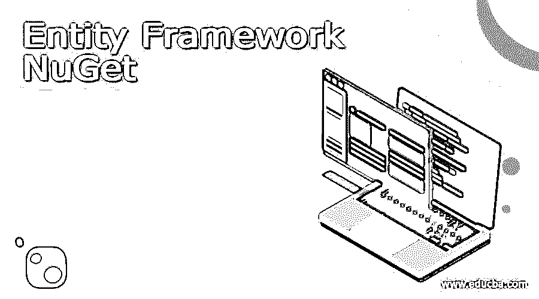
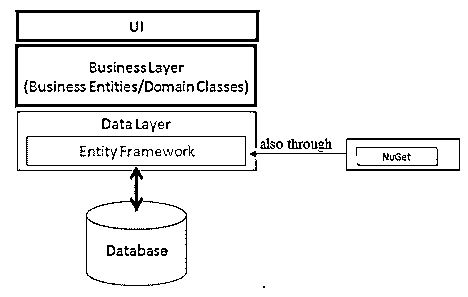
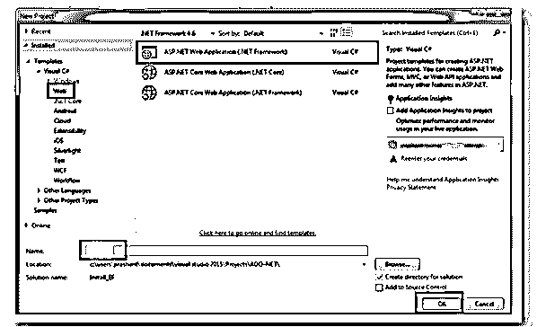
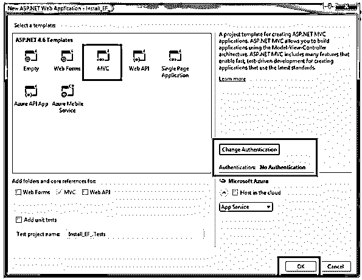
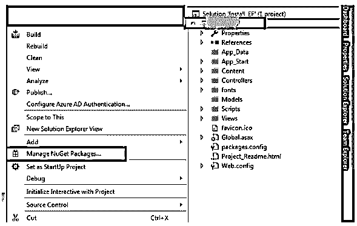
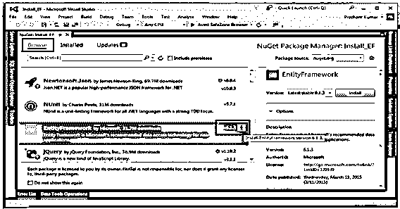
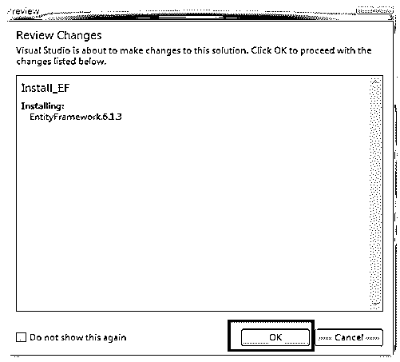
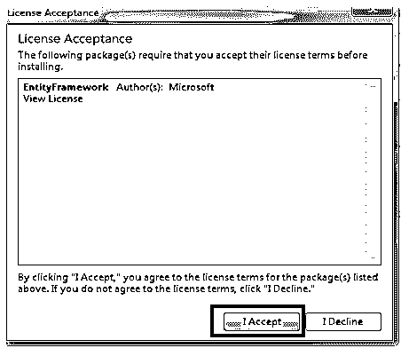
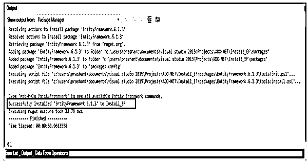
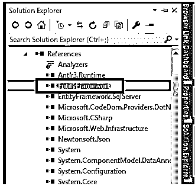

# 实体框架 NuGet

> 原文：<https://www.educba.com/entity-framework-nuget/>

## 实体框架 NuGet 简介

实体框架 NuGet 包是用 EF 工具发明的，用于实体框架运行时和 Visual Studio。EF 是 ADO.Net 的先进水平，它使现在的工作变得更加容易，因为它减少了通过数据库进行的每一个操作的几十行代码，如删除，从表中检索行。实体框架根据代码自动微调数据库和表格。

### 概述实体框架 NuGet

微软提供了一个称为实体框架的框架，它可以自动执行应用程序的整个数据库相关操作。它减少了我们之前所做的代码行。NET 3.5 我们经常用 ADO.NET 的代码来处理一切事情。实体框架是一个 ORM 框架，它是。NET 应用程序。它允许开发人员使用域类对数据进行高级编程，而无需关注存储数据的数据库表和列。与旧版本相比，Entity Framework 减少了代码行。通过这种方式，程序员在使用面向数据的应用程序时，可以从增强的工作体验中获益匪浅。

<small>网页开发、编程语言、软件测试&其他</small>

实体框架是一个 ORM(对象关系映射器),它允许。NET 开发人员使用。NET 对象。ORM 速度更快，效率更高，而且它确切地知道什么进入了数据库。它减少了对高级数据访问编码的需求，开发人员需要编写最多的代码行。实体框架还提供了一系列迁移命令，这些命令可以在 NuGet 包管理器控制台上执行，也可以通过命令行界面来构建或维护数据库模式。

在上图中，EF 介于域类和数据库之间。它将数据存储在业务实体的属性中，并从数据库中检索数据以自动转换业务实体对象。实体框架用 EF 工具为 VS 和 EF 运行时编码。

### 如何安装实体框架 NuGet？

要通过 NuGet 安装 Entity Framework 6 版本，在此之前我们需要在它们所在的机器上安装先决条件。NET Framework 4.5 或更高版本，然后是 Visual Studio 2012 或更高版本，最后是 MS SQL Server 2005/2008/2012 Express 或更高版本。让我们看一下安装过程，如下所示:

**步骤:1** 首先打开 VisualStudio，创建一个新的应用程序 ASP.NET Web 应用程序，给它起一个合适的名字，然后点击 OK。

**步骤:2** 在下一个对话框中选择 MVC，并将认证类型修改为无认证，如下所示。

**步骤:3** 然后打开**解决方案浏览器**，右击项目**选择**管理 NuGet 包**。我们需要激活互联网连接来在你的项目中安装 NuGet 包。**

**步骤:4** 在在线向导中找到合适版本的实体框架，点击安装框架。

**步骤:5** 然后到**在出现的对话框中查看更改**，要求您确认更改，然后点击确定。

**步骤:6** 在下一个对话框中选择**接受**按钮开始安装过程，这只是接受许可。完成后，将进行正确的安装。

**步骤:7** 在这里你可以看到 **Visual Studio 输出窗口**安装实体框架。

通过 NuGet 安装 EF 后，您可以在解决方案浏览器中看到它。只要在**解决方案浏览器**中展开**引用**，就会看到 EF 已经成功安装到项目中。

实体框架是 ADO.Net 的上级，它现在做补充工作，因为它最小化了通过数据库进行的每一个操作的几十行代码，如删除、从表中检索行。实体框架被设计成修改对代码进行处理的数据库和表。

在实体框架中，它与。基于. NET 的应用。让我们来学习安装和使用 EF。NET 应用程序。它在 NuGet 包中是可用的，我们要求安装 NuGet 包，以便在应用程序中使用实体框架

*   **EF DB Provider**–EF 通过 Provider 模型实现数据库访问。有多种 EF 供应商模式。有各种各样的 EF DB 提供程序，可以访问各种数据库。这些提供者出现在 NuGet 包中。最初，我们必须为必须访问它的数据库提供者安装 NuGet 包。我们需要访问 MS SQL Server 数据库，所以我们需要安装 Microsoft。EntityFramework.SqlServer NuGet 包。

要安装 DB Providers NuGet Package，只需在 Visual Studio 的解决方案资源管理器中右键单击该项目，然后选择 Manage NuGet Packages。工具获取程序包管理器管理解决方案的获取程序包。

*   **EF 工具**–在此过程中，我们还需要安装 EF 工具来运行实体框架命令，这使得在搭建、设计时或诸如迁移等项目中执行 EF 任务变得更加容易。

该工具在 NuGet 包中提供，以安装实体框架工具的包，这取决于我们通过使用包管理控制台或使用 dotnet CLI 执行命令的位置。

### 实体框架获取包

实体框架以 NuGet 包的形式提供，应用程序所需的这个包包括正在使用的数据库系统的类型，如 SQL Server、SQLite 等等。所需的 EF 功能。让我们看看安装包的过程

*   定义数据库提供程序并根据需要安装所需的软件包
*   安装微软。EntityFrameworkCore 和微软。EntityFrameworkCore.Relational 使用关系数据库提供程序。
*   它确保了正在使用的版本支持，NuGet 确保并让您知道何时发布新的软件包版本。
*   轻松决定您正在使用的工具，并安装所需的软件包。

### 结论

在这篇文章中，我们已经了解了实体框架 NuGet Packages，其中 EF 是一个我们可以在其上执行的真正的跨平台。任何平台上的 EF . NET 核心应用程序。EF 还提供了在 NuGet 包控制台上执行的迁移命令。

### 推荐文章

这是一个实体框架 NuGet 的指南。在这里我们讨论介绍，概述，如何安装实体框架 NuGet？分别是。您也可以看看以下文章，了解更多信息–

1.  [实体框架核心数据库-第一期](https://www.educba.com/entity-framework-core-database-first/)
2.  [实体框架核心](https://www.educba.com/entity-framework-core/)
3.  [ASP.NET 核心实体框架](https://www.educba.com/asp-dot-net-core-entity-framework/)
4.  [实体框架迁移](https://www.educba.com/entity-framework-migration/)

