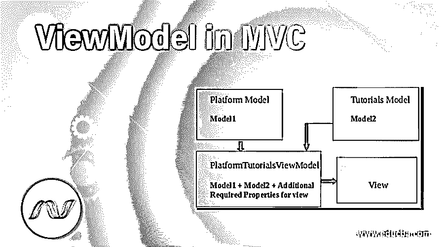
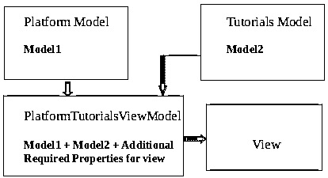
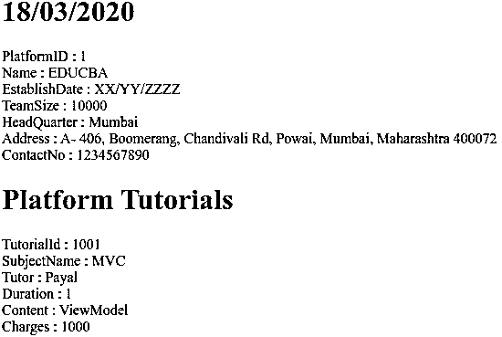

# MVC 中的视图模型

> 原文：<https://www.educba.com/viewmodel-in-mvc/>




## MVC 中的视图模型简介

在本文中，我们将讨论和学习 MVC 框架中的视图模型。为此，有必要了解什么是模型。模型是基本的领域对象，使用它我们可以执行更新、插入、删除和选择等操作。这类似于对象关系映射器(ORM)中的实体，它在关系数据库中表示表。但是很多时候，单个模型不足以在视图上显示数据。在实时应用程序中，我们经常需要显示来自多个模型的数据和一些额外的数据，这些数据在我们代码的视图部分的可用模型中是没有的。这就是 ViewModel 概念的由来。

ViewModel 只不过是一个或多个模型和一些附加数据的集合，这些数据需要在视图部分中呈现，并且需要从控制器传递到视图。ViewModel 的名字本身表明，它是考虑到代码的视图部分中需要呈现的数据的需求而定义的模型。ViewModel 是在牢记特定视图的模型数据要求的情况下生成的，因此它被称为 ViewModel。

<small>网页开发、编程语言、软件测试&其他</small>

### 在 MVC 中实现视图模型的例子

让我们首先借助这个例子的可视化表示来理解 ViewModel 的概念，我们将在下一节中讨论这个例子。考虑一个例子，我们想要存储可用于在线学习的平台的数据以及它们将提供的教程。在这里，我们将有两种模式的平台和教程。现在，我们想在视图上显示 EDUCBA 平台及其教程的数据以及标题和今天的日期。因此，我们将准备一个 ViewModel，它将包含所有平台模型属性和教程模型属性，以及需要在视图上显示的两个新属性，即标题和今天的日期。




让我们同样编码。我们将从创建基本模型开始，我们将进一步需要这些模型来创建建筑视图模型。我们将创建的两个模型分别是 Platform.cs 和 Tutorials.cs

#### 1.平台模型

首先，我们将在名为 Platform.cs 的 Models 文件夹中创建一个新的类文件，该文件将包含教育平台的基本信息，如 id、名称、成立日期、团队规模、总部、地址和联系信息。该文件将包含以下代码，这些代码将把它表示为一个模型。

**代码:**

```
public class Platform
{
public int PlatformId { get; set; }
public string Name { get; set; }
public string EstablishDate { get; set; }
public int TeamSize { get; set; }
public string HeadQuarter { get; set; }
public string Address { get; set; }
public int ContactNo { get; set; }
}
```

#### 2.教程模型

现在，在 ASP.Net 项目的 Models 文件夹下创建一个名为 Tutorials.cs 的新类文件。这个模型将包含关于辅导科目的基本细节，如 id、名称、导师、持续时间、内容和费用。它应该是这样的。

**代码:**

```
public class Tutorials
{
public int TutorialId { get; set; }
public string SubjectName { get; set; }
public string Tutor { get; set; }
public int Duration { get; set; }
public string Content { get; set; }
public int Charges { get; set; }
}
```

### 如何创建 ViewModel？

现在，我们将在应用程序中创建一个视图模型。在 ASP.Net，可以在项目的任何地方创建视图模型。最佳实践是在名为 ViewModels 的文件夹中创建一个 ViewModel。因此，首先创建一个名为 ViewModels 的文件夹，然后在该文件夹中创建一个名为 PlatformTutorialsViewModel.cs 的类文件。该文件将是平台模型 model1、教程模型 model2 以及两个属性(即当前时间和标题)的集合。

**代码:**

```
using FirstMVCDemo.Models;
namespace FirstMVCDemo.ViewModels
{
public class PlatformTutorialsViewModel
{
public Platform Platform { get; set; }
public Tutorials Tutorials { get; set; }
public string Title { get; set; }
public string TodayDate { get; set; }
}
}
```

**说明:**在上面的 PlatformTutorialsViewModel 视图模型中，Platform 代表控制器的名称，Tutorials 代表其中的动作方法。由于它是一个 ViewModel，我们在它的名字后面附加了 ViewModel。这是遵循的一般命名约定。虽然以这种方式命名文件和方法不是强制性的，但这是应该遵循的良好编程实践的一部分。

### 如何创建控制器文件？

在项目的控制器文件夹中创建一个名为 PlatformController.cs 的文件。在这里，我们将为我们的视图模型赋值，并将它作为 View on = bject 的参数返回给视图，该参数将从控制器返回。

**代码:**

```
using FirstMVCDemo.ViewModels;
using FirstMVCDemo.Models;
using System.Web.Mvc;
namespace FirstMVCDemo.Controllers
{
public class PlatformController : Controller
{
public ViewResult Tutorials()
{
//Platform Basic Details
Platform platform = new Platform()
{
PlatformId = 1,
Name = "EDUCBA",
EstablishDate = "XX/YY/ZZZZ",
TeamSize = 10000,
HeadQuarter = "Mumbai",
Address = "A- 406, Boomerang, Chandivali Rd, Powai, Mumbai, Maharashtra 400072",
ContactNo = 1234567890
};
//Tutorial Details
Tutorials tutorials = new Tutorials()
{
TutorialId = 1001 ,
SubjectName = "MVC",
Tutor = "Payal",
Duration = 1,
Content = "ViewModel",
Charges = 1000
};
//Creating the View model
PlatformTutorialsViewModel platformTutorialsViewModel = new PlatformTutorialsViewModel()
{
Platform = platform,
Tutorials = tutorials,
Title = "Platform Tutorials Page",
TodayDate = "18/03/2020",
};
//Pass the PlatformTutorialsViewModel to the view
return View(platformTutorialsViewModel);
}
}
}
```

### 视图文件

现在，我们将获取 ViewModel 的值，并根据我们的选择，在代码的视图部分以我们想要的顺序和结构显示它。为此，在项目的 views 文件夹中创建一个名为 PlatformTutorials.cshtml 的文件。

**代码:**

```
@model FirstMVCDemo.ViewModels.PlatformTutorialsViewModel
@{
Layout = null;
}
<html >
<head>
<title>@Model.Title</title>
</head>
<body>
<h1>@Model.TodayDate</h1>
<div>
PlatformID : @Model.Platform.PlatformId
</div>
<div>
Name : @Model.Platform.Name
</div>
<div>
EstablishDate : @Model.Platform.EstablishDate
</div>
<div>
TeamSize : @Model.Platform.TeamSize
</div>
<div>
HeadQuarter : @Model.Platform.HeadQuarter
</div>
<div>
Address : @Model.Platform.Address
</div>
<div>
ContactNo : @Model.Platform.ContactNo
</div>
<h1>Platform Tutorials</h1>
<div>
TutorialId : @Model.Tutorials.TutorialId
</div>
<div>
SubjectName : @Model.Tutorials.SubjectName
</div>
<div>
Tutor : @Model.Tutorials.Tutor
</div>
<div>
Duration : @Model.Tutorials.Duration
</div>
<div>
Content : @Model.Tutorials.Content
</div>
<div>
Charges : @Model.Tutorials.Charges
</div>
</body>
</html>
```

**输出:**运行此 cshtml 文件后，输出如下




### 推荐文章

这是 MVC 中 ViewModel 的一个指南。这里我们讨论实现两个模型，如何创建视图文件，视图模型和控制器文件。您也可以浏览我们的其他相关文章，了解更多信息——

1.  [什么是 MVC？](https://www.educba.com/what-is-mvc/)
2.  [MVC 面试问题](https://www.educba.com/mvc-interview-questions/)
3.  [什么是 MVC 设计模式](https://www.educba.com/what-is-mvc-design-pattern/)
4.  [MVC 视图数据](https://www.educba.com/mvc-viewdata/)


