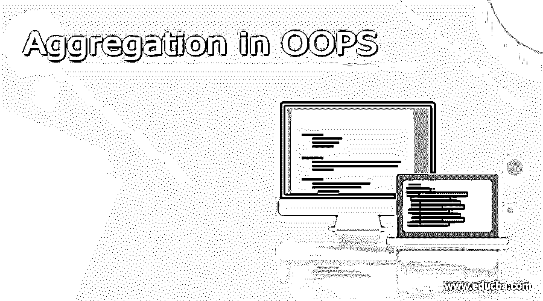
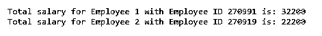

# OOPS 中的聚合

> 原文：<https://www.educba.com/aggregation-in-oops/>




## OOPS 中聚合的定义

OOPS 中的聚合被定义为存在于两个或两个以上对象之间的关系，这两个对象分别具有它们自己的生命周期以及所有权。OOPS 中的聚合由两个词组成(聚合和 OOPS)。聚合是不相关对象之间语义弱关系的一种特殊形式。聚合是统一建模语言(缩写为 UML)中存在的 5 种关系类型之一。现在要理解什么是 UML，简而言之，它是建模任何面向对象编程概念的默认标准。构成本文主题的第二个词 OOPS 是面向对象编程结构的首字母缩写，它是一种将数据与对象联系起来的编程结构，而不是着眼于功能和逻辑。OOPS 考虑到开发人员感兴趣的是对象的操作，而不是操作它们的逻辑，这是任何协作开发的重要基础。

**语法:**

<small>网页开发、编程语言、软件测试&其他</small>

有各种实现 OOPS 的编码语言，如 Python、Java 等。为了文章的一致性，我们将考虑 Python 语言来理解 OOPS 中的聚合概念。

**Python 中的类声明:**

```
class <class name> :
def __init__(self, <value 1>):
self. <variable 1 > = <value 1>
```

**在 Python 中定义函数:**

```
def <function name> (self):
return (|| operation done on self.<variable 1> ||)
```

在这里，< function name >被函数的名字所代替，名字应该表明函数的意图。||对自己完成的操作。 <variable>||是作用于< variable 1 >的运算，产生要返回的变量。例如，如果需要返回个人的年薪，给定月薪，变量应该乘以 12，然后返回。</variable>

**类变量的实例化:**

```
<object variable> = <class name>(<arguments>)
```

这里，< object variable >表示将在代码中作为类的实例化变量使用的变量名。< class name >表示被声明为应用程序的算法和结构的一部分的类名。< arguments >表示需要传递给初始化类的对象的 init 函数的参数。

### OOPS 中的聚合是如何工作的？

当 OOPS 中很难有继承的概念时，聚合作为一个概念就派上了用场。假设有这样一种情况，这些类可能没有父子关系，而是有对等关系，在这种情况下，聚合的概念最适用。例如，简单理解的通用示例，一个员工用例。对于雇员来说，薪金是其中的一个组成部分，但是类别薪金没有父子层次结构，并且具有“部分”或“有”关系。我们可以说薪水是雇员的一部分，或者雇员有薪水。现在，这两个组件大不相同，因为“部分”关系表示组合，而“有”关系表示聚合。

为了理解聚合的概念，我们需要知道类之间的关系类型。从前面的段落中，我们了解到在聚合中雇员“有”薪水，因此我们可以传递 class # 2 的类实例化变量，在 class # 1 中“有”class # 2 关系。类# 2 的相同对象可用于类# 1 中的计算，并且该变量可用于实例化类# 1 中的“self”变量。首先，我们必须实例化 class # 2 并将对象存储在一个变量中。这个对象变量作为另一个类# 1 中的参数传递，我们需要根据应用程序的要求执行操作。传递给类# 1 的类对象将被实例化为类# 1 的变量。一旦这个对象被实例化，就可以使用类变量的任何其他相关函数来执行任务。

使用我们经典的“员工”示例(实际操作示例将在下一节中介绍)，我们首先定义一个工资类别，该类别包含基本月薪、弹性月薪、年度奖金和年度 PF 投资。我们将定义一个净 CTC 函数，它将计算 12*(每月基本+每月灵活部分)+(每年奖金和每年 PF 投资)并返回相同的值。现在，我们还将有一个 employee 类，它将包含姓名、雇员 ID 和 salaried 类的对象变量。我们还将定义另一个函数，其中我们将使用 salary 对象变量的内置函数来最终返回雇员的 CTC。在主代码中，我们将首先用所需的参数实例化 salary 对象，然后将其传递给 employee 类。现在在 employee 类中，变量被传递，它经过实例化，当 employee 函数中的 total CTC 函数被调用时，它依次要求执行 salary 函数，这是该函数中的子调用，最后，值被返回。

在示例部分中，我们将尝试掌握聚合的不同元素，并将对一些元素进行明确的注释，以便更好地理解。

### 例子

薪金-员工合计概念示例

#### 示例#1

**语法:**

```
class Salary:
def __init__(self, basicPay, flexiPay, bonus, PPF):
self.basicPay = basicPay
self.flexiPay = flexiPay
self.bonus = bonus
self.PPF = PPF
def get_ctc(self):
return ((self.basicPay+self.flexiPay)*12+self.bonus+self.PPF)
class Employee:
def __init__(self, name, empId, salaryObj): #The salary object is passed
self.name = name
self.id = empId
self.salObj = salaryObj #The salary object is instantiated
def annualCTC(self):
#Calling the get_ctc function of salary class
return "Total salary for " + str(self.name) +" with Employee ID " + str(self.id) + " is: " + str(self.salObj.get_ctc())
obj_sal1 = Salary(600, 1000, 10000, 3000)
obj_emp1 = Employee("Employee 1", "270991", obj_sal1)
print(obj_emp1.annualCTC())
obj_sal2 = Salary(600, 1000, 0, 3000)
obj_emp2 = Employee("Employee 2", "270919", obj_sal2)
print(obj_emp2.annualCTC())
```

**输出:**




员工 2 的净 CTC 应比员工 1 少 10000，因为他们之间只有奖金部分不同。

### 结论

在本文中，我们研究了 python(实现 OOPS 的语言之一)中聚合的工作方式，并且看到如果我们将一个类的对象传递给另一个类，我们可以在它们之间建立“has a”关系，并且子类的功能可以很容易地实现。

### 推荐文章

这是 OOPS 中的聚合指南。这里我们讨论定义、语法、聚合在 OOPS？代码实现示例。您也可以看看以下文章，了解更多信息–

1.  [在哎呀中覆盖](https://www.educba.com/overriding-in-oops/)
2.  [PHP 循环](https://www.educba.com/php-loops/)
3.  [Java 编程中的循环](https://www.educba.com/loops-in-java-programming/)
4.  [C 中的循环](https://www.educba.com/loops-in-c/)


