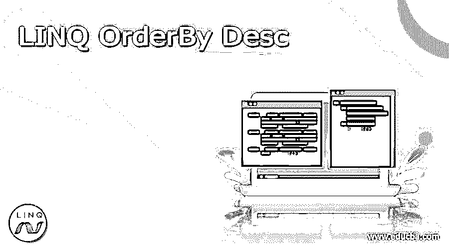
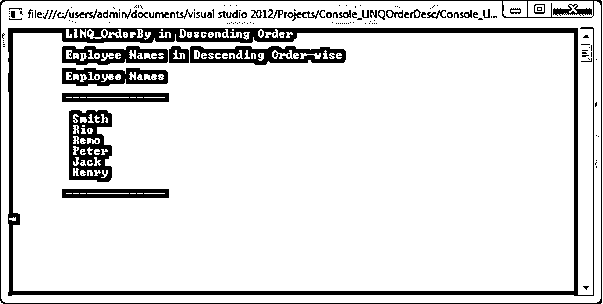
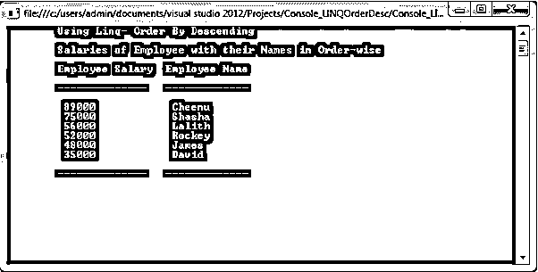

# LINQ·欧德 By Desc

> 原文：<https://www.educba.com/linq-orderby-desc/>




## Desc 的《LINQ 秩序导论》

LINQ 排序通过 Desc 运算符按降序对元素进行排序，它将按降序返回集合。元素序列中的值根据特定字段以降序返回结果。它在查询语法中无效，仅在方法语法中可用。OrderBy Desc 的主要功能是按降序重新排列元素序列。

**语法:**

<small>网页开发、编程语言、软件测试&其他</small>

让我们来看看 OrderBy 降序运算符的语法如下:

```
public static IOrderedEnumerable<TSource> OrderByDescending<TSource, TKey>(this IEnumerable<TSource> source, Func<TSource, TKey> keySelector);
```

这里我们使用了操作符 OrderByDescending，它用于按降序对元素序列进行排序。

### OrderBy Desc 如何在 LINQ 工作？

与 OrderBy 方法一样，我们也可以将 OrderByDescending 方法用于所有数据类型，如字符、整数、字符串、浮点等等。让我们看一个如下的整数集合，

```
List<int> _numList = new List<int>() {100,220,430,440,550,330, 990} ;
var methodSyntax=_ numList.OrderByDescending(n=>n);
foreach(var res in val)
{
Console.Write(res+"");
}
```

对于这个代码，我们将按如下降序得到结果:“990、550、440、430、330、220 和 100”。

元素序列中的值根据特定字段以降序返回结果。OrderBy Desc 的目标是按降序重新排列元素的顺序。让我们看看 OrderByDescending 的一些工作流程如下:

```
IList<Customer> CustomerList = new List<Customer>() {
new Customer() { CustomerID = 1001, CustomerName = "Mithun", Age = 28 } ,
new Customer() { CustomerID = 1002, CustomerName = "Jack", Age = 25 } ,
new Customer() { CustomerID = 1003, CustomerName = "Gates", Age = 15 } ,
new Customer() { CustomerID = 1004, CustomerName = "Shasha" , Age = 30 } ,
new Customer() { CustomerID = 1005, CustomerName = "Jhon" , Age = 29 }
};
```

```
var Customer_InDescOrder = CustomerList.OrderByDescending(c => c.CustomerName);
```

为了理解上面的代码行，它将使用操作符 OrderByDescending 按降序列出客户名称，该操作符不支持查询语法，因为它是唯一的关键字 OrderByDescending，所以我们不能使用它，它仅受方法语法支持。如果我们想在查询语法中使用降序过程就使用降序关键字来代替。

### 例子

在 LINQ_OrderByDescending 方法中用来按降序重新排列元素序列。OrderByDescending 方法支持所有数据类型，如字符、整数、字符串、浮点等等。它在查询语法中无效，仅在方法语法中可用。让我们看看下面的方法语法中升序的例子，如下所示:

#### 示例#1

**代码:**

```
using System;
using System.Collections.Generic;
using System.Linq;
using System.Text;
using System.Threading.Tasks;
namespace Console_LinqOrderByDesc
{
class Program_LINQ_OrderByDesc
{
public class E_Details
{
public int E_ID
{
get;
set;
}
public string E_Name
{
get;
set;
}
public string E_Qualif
{
get;
set;
}
public int E_Salary { get; set; }
public int D_ID { get; set; }
public int E_Age { get; set; }
public static List<E_Details> EmpRecords()
{
return new List<E_Details>()
{
new E_Details() {E_ID = 1000, E_Name = "Henry",D_ID=1,E_Qualif = "MCA", E_Age=21,E_Salary=25000},
new E_Details() {E_ID = 1005, E_Name = "Remo", D_ID=2,E_Qualif = "B.E",E_Age=23, E_Salary=47000},
new E_Details() {E_ID = 1001, E_Name = "Smith",D_ID=1,E_Qualif = "MCA",E_Age=21, E_Salary=60000},
new E_Details() {E_ID = 1007, E_Name = "Rio",D_ID=3, E_Qualif = "B.E",E_Age=27,E_Salary=35000},
new E_Details() {E_ID = 1003, E_Name = "Jack",D_ID=1, E_Qualif = "M.Sc",E_Age=21, E_Salary=30000},
new E_Details() {E_ID = 1004, E_Name = "Peter",D_ID=3, E_Qualif = "B.E",E_Age=27, E_Salary=52000},
};
}
}
static void Main(string[] args)
{
Console.WriteLine("\tLINQ_OrderBy in Descending Order\n");
// here OrderByDescending() is used to sort the employee Names in Descending order
var _descOrderBy = E_Details.EmpRecords().OrderByDescending(emp => emp.E_Name);
Console.WriteLine("\tEmployee Names in Descending Order-wise\n");
Console.WriteLine("\tEmployee Names\n");
Console.WriteLine("\t-------------- \n");
foreach (var val in _descOrderBy)
{
Console.WriteLine("\t {0}\t", val.E_Name);
}
Console.WriteLine("\n\t--------------\n");
Console.ReadKey();
}
}
}
```

在上面的程序中，OrderByDescending()用于通过使用操作符以降序方式获取雇员姓名的详细信息，请参见下面的代码

```
var _descOrderBy = E_Details.EmpRecords().OrderByDescending(emp => emp.E_Name);
```

在上一行中，它以降序描述了雇员姓名。让我们检查如下输出:

**输出:**




#### 实施例 2

**代码:**

```
using System;
using System.Collections.Generic;
using System. Linq;
using System. Text;
using System.Threading.Tasks;
namespace Console_LinqOrderByDesc
{
class Program_LINQ_OrderByDesc
{
public class E_Details
{
public int E_ID
{
get;
set;
}
public string E_Name
{
get;
set;
}
public string E_Qualif
{
get;
set;
}
public int E_Salary { get; set; }
public int D_ID { get; set; }
public int E_Age { get; set; }
public static List<E_Details> EmpRecords()
{
return new List<E_Details>()
{
new E_Details() {E_ID = 1000, E_Name = "Shasha",D_ID=1,E_Qualif = "MCA", E_Age=21,E_Salary=75000},
new E_Details() {E_ID = 1005, E_Name = "Lalith", D_ID=2,E_Qualif = "B.E",E_Age=23, E_Salary=56000},
new E_Details() {E_ID = 1001, E_Name = "David",D_ID=1,E_Qualif = "MCA",E_Age=21, E_Salary=35000},
new E_Details() {E_ID = 1007, E_Name = "James",D_ID=3, E_Qualif = "B.E",E_Age=27,E_Salary=48000},
new E_Details() {E_ID = 1003, E_Name = "Rockey",D_ID=1, E_Qualif = "M.Sc",E_Age=21, E_Salary=52000},
new E_Details() {E_ID = 1004, E_Name = "Cheenu",D_ID=3, E_Qualif = "B.E",E_Age=27, E_Salary=89000},
};
}
}
static void Main(string[] args)
{
Console.WriteLine("\tUsing Linq- Order By Descending\n");
// OrderByDescending() used to sort the employee salary in descending order
var Desc_OrderBy = E_Details.EmpRecords().OrderByDescending(e => e.E_Salary);
Console.WriteLine("\tSalaries of Employee with their Names in Order-wise\n");
Console.WriteLine("\tEmployee Salary\t Employee Name \n");
Console.WriteLine("\t--------------\t ------------- \n");
foreach (var res in Desc_OrderBy)
{
Console.WriteLine("\t {0}\t\t {1}", res.E_Salary, res.E_Name);
}
Console.WriteLine("\n\t--------------\t ------------- \n");
Console.ReadKey();
}
}
}
```

在上面的代码中，操作符 OrderByDescending()用于按降序获取每个雇员的工资，让我们检查下面的代码

```
var Desc_OrderBy = E_Details.EmpRecords().OrderByDescending(e => e.E_Salary);
```

在上面的代码行中，使用 OrderByDescending()方法以降序描述了较高薪水的雇员姓名及其对应的姓名，让我们检查下面的输出以便更好地理解，

**输出:**




### 结论

这篇文章是关于名为 OrderByDescending 的 LINQ 操作符，它用于按照降序重新排列元素集合，在这篇文章中，我已经以编程方式解释了各种示例。希望这篇文章能通过例子帮助你更好地理解。

### 推荐文章

这是 Desc 订购的 LINQ 旅游指南。在这里，我们讨论导言，语法，如何 OrderBy Desc 在 LINQ 工作？以及更好理解的例子。您也可以看看以下文章，了解更多信息–

1.  [LINQ 选择多](https://www.educba.com/linq-selectmany/)
2.  [LINQ 包括](https://www.educba.com/linq-include/)
3.  [LINQ 聚合](https://www.educba.com/linq-aggregate/)
4.  [LINQ 除外](https://www.educba.com/linq-except/)


