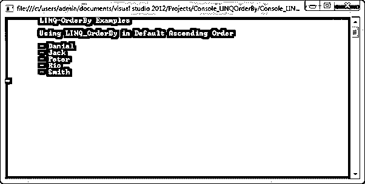
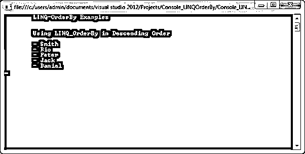
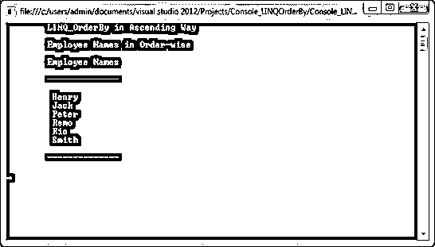
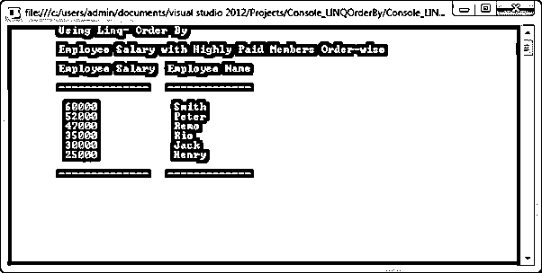

# LINQ·奥德比

> 原文：<https://www.educba.com/linq-orderby/>


## LINQ·奥德比简介

LINQ-排序依据根据指定的字段以升序或降序对集合中的值进行排序。默认情况下，它按升序对元素集合进行排序。这是因为 order_by 运算符的主要目的是按升序重新排列序列中的元素。

**语法**

<small>网页开发、编程语言、软件测试&其他</small>

让我们看看 LINQ-OrderBy 运算符的语法如下:它按升序对元素集合进行排序。

```
Var names=obj_name.orderBy(s=>s.name);
```

order_by 方法支持任何数据类型；我们可以使用整数、字符串、字符、小数等等。

### orderby 在 LINQ 是如何工作的？

LINQ_OrderBy 运算符主要用于按升序重新排列序列中的元素集合。如果我们想让集合按降序排列，可以使用关键字 descending 来按降序检索集合。在 LINQ-OrderBy 方法中，它支持查询和方法语法。

让我们用例子来看看查询语法。OrderBy 按升序或降序对集合中的值进行排序。默认情况下，它按升序对集合进行排序，因为 ascending 关键字在这里是可选的。因此，首先，对用户详细信息集合的列表进行编码，比如 user_name、user_age 等等。

```
Var get_UserDetails = new List<UserData>()
{
new UserData { userName = "Smith", userAge = 23 },
new UserData { userName = "Rio", userAge = 30},
new UserData { userName = "Jack", userAge = 41},
new UserData { userName = "Danial", userAge = 25 },
new UserData { userName = "Peter", userAge = 32 },
};
```

默认排序是升序，因为可选关键字在这里是升序，请参见下面的查询语法和方法语法中的升序示例，如下所示:

**//查询语法**

```
Var orderBy_ = from s in get_UserDetails
orderby s.userName
select s;
```

**//方法语法**

```
Var orderBy_ = get_UserDetails.OrderBy(s => s.userName);
Console.WriteLine("\tUsing LINQ_OrderBy in Default Ascending Order\n");
foreach (var order_by in orderBy_)
{
Console.WriteLine("\t- " + order_by.userName);
}
```




如果我们想按降序排序，使用 descending 关键字来按降序对元素集合进行排序，如下例所示，

**//查询语法**

```
Var orderBy_Descending = from s in get_UserDetails
orderby s.userName descending
select s;
```

**//方法语法**

```
Var orderBy_Descending = get_UserDetails.OrderByDescending(s => s.userName);
Console.WriteLine("\n\tUsing LINQ_OrderBy in Descending Order\n");
foreach (var order_by in orderBy_Descending)
{
Console.WriteLine("\t- " + order_by.userName);
}
```




在方法语法中，不允许使用关键字“descending”对集合进行排序。相反，我们用 OrderByDescending()方法来进行降序排序。同样，OrderByDescending()方法在查询语法中也是无效的，因为它使用了上面示例中显示的升序和降序属性，它只在方法语法中有效。

### LINQ·奥德比的例子

LINQ_OrderBy 运算符主要用于按升序重新排列序列中的元素集合。order_by 方法支持任何数据类型；我们可以使用整数、字符串、字符、小数等等。默认排序是升序，因为可选关键字在这里是升序，请参见下面的方法语法中的升序示例:

#### 示例#1

**代码:**

```
using System;
using System.Collections.Generic;
using System.Linq;
using System.Text;
using System.Threading.Tasks;
namespace Console_LinqOrderBy
{
class Program_LINQ_OrderBy
{
public class EmployeeDetails
{
public int employeeID
{
get;
set;
}
public string employeeName
{
get;
set;
}
public string employeeQualification
{
get;
set;
}
public int empSalary { get; set; }
public int DepartmentID { get; set; }
public int empAge { get; set; }
public static List<EmployeeDetails> Get_Employees()
{
return new List<EmployeeDetails>()
{
new EmployeeDetails() {employeeID = 1000, employeeName = "Henry",DepartmentID=1,employeeQualification = "MCA", empAge=21,empSalary=25000},
new EmployeeDetails() {employeeID = 1005, employeeName = "Remo", DepartmentID=2,employeeQualification = "B.E",empAge=23, empSalary=47000},
new EmployeeDetails() {employeeID = 1001, employeeName = "Smith",DepartmentID=1,employeeQualification = "MCA",empAge=21, empSalary=60000},
new EmployeeDetails() {employeeID = 1007, employeeName = "Rio",DepartmentID=3, employeeQualification = "B.E",empAge=27,empSalary=35000},
new EmployeeDetails() {employeeID = 1003, employeeName = "Jack",DepartmentID=1, employeeQualification = "M.Sc",empAge=21, empSalary=30000},
new EmployeeDetails() {employeeID = 1004, employeeName = "Peter",DepartmentID=3, employeeQualification = "B.E",empAge=27, empSalary=52000},
};
}
}
static void Main(string[] args)
{
Console.WriteLine("\tLINQ_OrderBy in Ascending Way\n");
// OrderBy() used to sort the employee Names in Ascending order
var _ascOrderBy = EmployeeDetails.Get_Employees().OrderBy(a => a.employeeName);
Console.WriteLine("\tEmployee Names in Order-wise\n");
Console.WriteLine("\tEmployee Names\n");
Console.WriteLine("\t-------------- \n");
foreach (var val in _ascOrderBy)
{
Console.WriteLine("\t {0}\t",val.employeeName);
}
Console.WriteLine("\n\t--------------\n");
Console.ReadKey();
}
}
}
```

在这个程序中，OrderBy()用于按升序检索雇员姓名；让我们看看下面的代码

```
var _ascOrderBy = EmployeeDetails.Get_Employees().OrderBy(a => a.employeeName)
```

它按升序显示员工姓名。下面的输出让你明白清楚。

**输出:**




#### 实施例 2

**代码:**

```
using System;
using System.Collections.Generic;
using System.Linq;
using System.Text;
using System.Threading.Tasks;
namespace Console_LinqOrderBy
{
class Program_LINQ_OrderBy
{
public class EmployeeDetails
{
public int employeeID
{
get;
set;
}
public string employeeName
{
get;
set;
}
public string employeeQualification
{
get;
set;
}
public int empSalary { get; set; }
public int DepartmentID { get; set; }
public int empAge { get; set; }
public static List<EmployeeDetails> Get_Employees()
{
return new List<EmployeeDetails>()
{
new EmployeeDetails() {employeeID = 1000, employeeName = "Henry",DepartmentID=1,employeeQualification = "MCA", empAge=21,empSalary=25000},
new EmployeeDetails() {employeeID = 1005, employeeName = "Remo", DepartmentID=2,employeeQualification = "B.E",empAge=23, empSalary=47000},
new EmployeeDetails() {employeeID = 1001, employeeName = "Smith",DepartmentID=1,employeeQualification = "MCA",empAge=21, empSalary=60000},
new EmployeeDetails() {employeeID = 1007, employeeName = "Rio",DepartmentID=3, employeeQualification = "B.E",empAge=27,empSalary=35000},
new EmployeeDetails() {employeeID = 1003, employeeName = "Jack",DepartmentID=1, employeeQualification = "M.Sc",empAge=21, empSalary=30000},
new EmployeeDetails() {employeeID = 1004, employeeName = "Peter",DepartmentID=3, employeeQualification = "B.E",empAge=27, empSalary=52000},
};
}
}
static void Main(string[] args)
{
Console.WriteLine("\tUsing Linq- Order By\n");
// OrderByDescending() used to sort the employee salary in descending order
var _resOrderBy = EmployeeDetails.Get_Employees().OrderByDescending(e => e.empSalary);
Console.WriteLine("\tEmployee Salary with Highly Paid Members Order-wise\n");
Console.WriteLine("\tEmployee Salary\t Employee Name \n");
Console.WriteLine("\t--------------\t ------------- \n");
foreach (var val in _resOrderBy)
{
Console.WriteLine("\t {0}\t\t  {1}",val.empSalary, val.employeeName);
}
Console.WriteLine("\n\t--------------\t ------------- \n");
Console.ReadKey();
}
}
}
```

在这个程序中，OrderByDescending()用于按降序检索雇员工资；让我们看看下面的代码。

```
var _resOrderBy = EmployeeDetails.Get_Employees().OrderByDescending(e => e.empSalary);
```

这里我们需要按顺序显示高薪雇员，所以我们使用 OrderByDescending()方法显示高薪雇员的姓名。下面的输出让你明白清楚。

**输出:**




### 推荐文章

这是 LINQ·奥德比指南。在这里，我们通过几个编程示例来讨论 Linq OrderBy 方法在 C#中的使用。您也可以看看以下文章，了解更多信息–

1.  什么是 LINQ？
2.  [LINQ 内部加入](https://www.educba.com/linq-inner-join/)
3.  [Laravel Orderby](https://www.educba.com/laravel-orderby/)
4.  [PySpark 降序排列](https://www.educba.com/pyspark-orderby-descending/)


