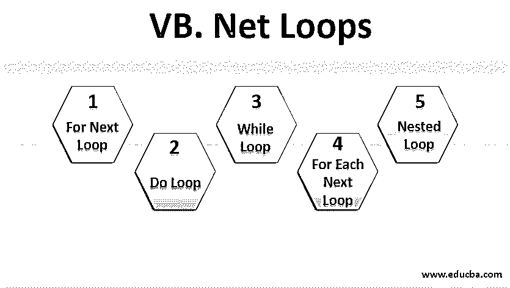
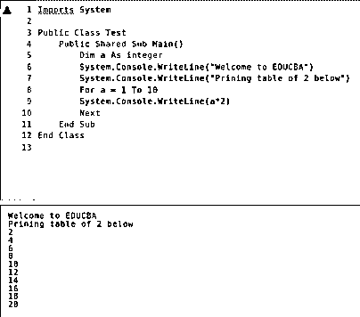
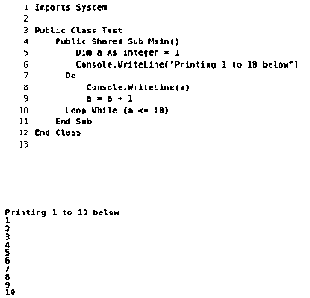
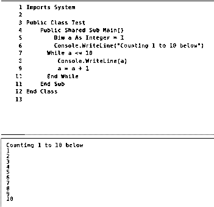
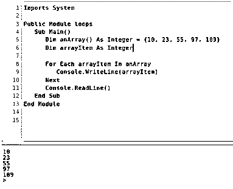
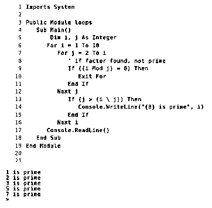

# VB.Net 环线

> 原文：<https://www.educba.com/vb-dot-net-loops/>




## VB.Net 环路简介

编程语言中的循环可以被定义为特定代码集的迭代，直到它满足指定的 condition.VB.Net 循环，其后是必须递归执行的语句行。它有助于减少代码行，因为一行代码可以根据需要执行多次。这些天开发的应用程序大量使用 loop 来提供它们被开发的功能。这个特性不依赖于任何编程语言，因为它在低级和高级语言中都可用。

### VB.Net 不同类型的环路

基于满足特定情况后代码必须执行的方式，下面是几种类型的 VB.Net oops。虽然实现循环的动机是一样的，但是选择合适的循环可以帮助我们减少代码的大小或者可以帮助我们编写一个高效的程序。

<small>网页开发、编程语言、软件测试&其他</small>

#### 1.对于下一个循环

For Next 循环是 Vb.net 最常用的循环。它通常检查条件，如果满足条件，就让它的主体下提到的代码执行，否则就转移到下一个条件。它用于多次执行特定任务的交互。下一个循环在所有编程语言中都可用，但是系统和关键字会有所不同。

**语法**

```
For count_variable [ As datatype ] = begin To last (conditions)
[ statements ]
[ statements ]
.
.
[ statements ]
Next
```

使用它的语法非常简单，可以轻松使用。For 关键字后面是必须满足的条件，以便执行 For 正文中的代码。条件得到满足，for body 下的语句已被执行，next 关键字进行下一步移动，这通常被用来检查下一个操作。它会一直执行，直到满足条件。一旦条件变为 false，它将停止进一步执行，并将控制发送到下一个循环之后编写的语句。

**例子**

下图显示了 for next 循环的工作原理。该示例将使您了解下一个 for 循环的工作方式，以及代码是如何重复的，直到条件变为假。这个例子将展示控件如何在整个循环中不断移动，直到它不断满足条件。




#### 2.Do 循环

do 循环是 VB.NET 中使用的另一个重要循环。尽管它以 next for 循环的方式重复执行代码，但它遵循的方法是不同的。在这个循环中，首先检查条件是否满足，如果满足，则执行写在 do 循环体中的代码，否则循环将终止。当程序必须检查事情是否以确保所有条件都得到满足的方式执行时，这是很有用的。do the loop 在 VB.NET 中的作用类似于它在其他编程语言中的作用，唯一的区别可能是语法和关键字。

**语法**

do 循环的语法非常简单，使用起来不会有任何混淆。好的一面是，它几乎类似于 VB.NET 中的循环，所以记住它的语法非常容易。下面是 do 循环的语法，说明了如何在程序中提到它，以减少出错的风险。每当程序中需要使用语法时，语法保持不变，偏离语法可能会导致错误。有几个语句的 do 循环体只能在满足条件时执行。

```
statements
statements
statements
.
.
statements
Loop
```

需要注意的是，在 do 循环中，你可以根据需要使用 While 或者 Until 关键字。while 和 untill 语句的工作方式完全不同。一方面，while 语句有助于在条件满足时执行代码，另一方面，untill 语句允许在条件不满足时执行代码。它为您提供了足够的选项，可以满足您使用循环的要求。

**例子**

下面的例子显示了如何使用 do 循环来打印从 1 到 10 的数字。while 关键字与 do 循环一起使用，以确保这组代码一直被执行，直到满足条件。程序从打印 1 开始，因为它是循环中的第一个数字。后来，该值增加了 1，并打印出来。




#### 3.While 循环

while 循环是 VB.NET 和其他编程语言中的几个循环之一。while 循环的工作非常简单，因为它只是让代码在条件满足时执行，而一旦条件为假，就终止循环。尽管 while 循环的工作方式类似于 do-while 循环，但在程序中使用时，它有自己的重要性，理解这一点非常重要。如果程序必须以一种要求使用 while 循环的方式编写，那么可以使用 while 循环来确保程序按照预期的方式运行。它给程序带来的好处是，它有助于减少代码的体积。

**语法**

while 循环有一个特殊的语法，在程序中实现 while 循环时必须遵循该语法。与其他循环类似，它具有简单的语法，可以轻松使用。其他循环也遵循特定的语法，while 循环的语法与它们非常相似。如果语法没有被正确使用，程序将会导致错误。在下面的语法中，while 关键字是强制的，它所遵循的条件取决于程序必须执行的功能类型。在 while 循环的末尾，必须使用 end 关键字结束。需要注意的是，与其他循环不同，它不包含 loop 关键字。

```
statements
statements
statements
.
.
.
statements
End While
```

上面的语法显示了如何在程序中使用 while 循环。这个循环的主要部分是满足条件时将执行的语句。该条件受要求的约束。循环末尾的行是为了确保当条件为假时，while 循环终止。

**例子**

下面的例子显示了 while 循环的用法。在这个例子中，我们试图打印从 1 到 10 的数字。这个程序非常简单，信息丰富，足以让你知道如何在程序中使用它。通过理解这个例子，你将能够学习如何在程序中引入 while 循环。




#### 4.对于每个下一个循环

这是 Vb.net 的另一个环路。使用这个循环，可以显示分配给任何变量的所有值。虽然这对于单独获取和处理每个值很有帮助，但也可以使用循环来完成，但使用循环可以使程序看起来更简单，因为它具有非常简单的结构。

**语法**

这个循环的语法非常简单，可以按照下面的语法来使用。在下面给出的语法中，已经引入了 next 关键字的用法来增加到下一步的循环。它将继续工作，直到变量有了值，并将在循环执行了它有值的次数后立即结束。

```
For Each element as Datatype
Statement
Statement
Statement
.
.
Statement
Next
```

**例子**

**

** 

#### 5.嵌套循环

嵌套循环是使用循环的方式，以便让许多循环同时工作。例如，为了处理矩阵中存储的数据，必须同时使用两个循环。我们将使用这个例子来理解有多少个循环同时工作。为了便于理解，当我们同时使用两个循环来使用存储的值时，我们可以考虑使用二维数组。

**语法**

下面是嵌套 for 循环的语法。嵌套循环的语法取决于嵌套循环的类型。我们将看到嵌套的 for 循环的语法，以了解在尝试嵌套 while 或 do 循环时语法可能是怎样的。

```
For count1 as datatype= begin1 To finish1
For count2 as datatype = begin2 To finish2
Statement
Statement
.
.
Statement
Next
Next
```

**例子**




### VB.Net 环路的优势

由于循环被认为是编程语言的主要特性之一，所以可以肯定它一定有一些好处或优点。下面是关于 about 循环的一些重要的东西，在特定的情况下是程序员的首选。

*   **代码重复:**通过利用循环，已经编写过一次的代码集可以多次使用。在这种情况下，程序应该一次又一次地执行同一行代码，这是编程语言唯一允许我们这样做的特性。该代码可以重复，直到它被指定的时间。对于代码可以重复的次数没有限制。基于程序的大小和需求，开发者可以根据需要使用它。
*   **确保条件满足:**在循环中，只有当条件满足时，它才执行其主体中的语句，这是强制性的。因此，通过这种方式，循环确保只有当条件为真时，才会执行特定的代码集。对于程序来说，重要的是要确保只有当条件得到满足时才允许特定的事情发生，而循环可以帮助程序实现这一点。必须注意，所有循环都必须检查条件是否得到满足。
*   减少代码的大小:作为一个循环，让我们一遍又一遍地使用同一套代码，它减少了重复编写同一套代码的冲动，从而帮助程序编写高效的代码。代码行数的减少使得编译器高效处理代码变得非常简单。这是循环的主要特性，它在开发人员中很受欢迎。除此之外，它还导致在编写程序的地方减小文件的大小，帮助系统管理员节省存储空间。
*   **减少编译时间:**编译器是编程环境中最关键的部分，它决定了程序是否适合执行。该循环确保代码较小，因此有助于编译器在短时间内编译代码。代码的行数越少，执行所花费的时间就越少。由于循环有助于我们保持代码的长度较短，因此它可以支持编译器高效地工作并尽早提供输出。

### 结论

循环可以被认为是编程系统的一个非常重要的部分，它在程序中引入了多种功能。它让程序员以一种非常有效的方式开发程序，并且被认为是编写程序的最佳方式。循环给程序带来几个好处，让程序高效工作。你越深入循环，你就能探索越多的新事物。Loop 能够执行非常复杂的事情，复杂的算法是确保这一点的真实例子。循环可以用在任何需要重复执行代码的程序中，这是编程语言易于使用和简单的特性之一。

### 推荐文章

这是 VB.Net 环路的指南。在这里，我们讨论介绍，不同类型的 VB.net 循环，优势，语法以及代码实现。您也可以阅读以下文章，了解更多信息——

1.  [VB.NET 的异常处理](https://www.educba.com/exception-handling-in-vb-dot-net/)
2.  [VB.Net 数据类型](https://www.educba.com/vb-net-data-types/)
3.  [VB.NET 算子](https://www.educba.com/vb-dot-net-operators/)
4.  [VB.Net 事件](https://www.educba.com/vb-dot-net-events/)


