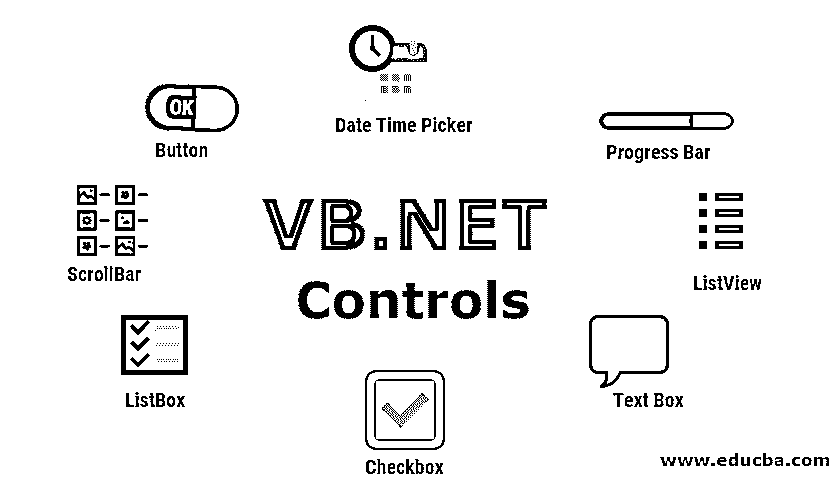

# VB.NET 控件

> 原文：<https://www.educba.com/vb-dot-net-controls/>




## VB.NET 控件介绍

Based 控件是帮助在 Based 快速方便地创建基于 GUI 的应用程序的支柱。这些是可以使用 IDE 中的控件工具箱拖动到窗体上的对象。每个 VB.NET 控件都有一些属性、事件和方法，可以用来根据我们的喜好调整和定制表单。

*   属性描述对象
*   方法用于使对象做一些事情
*   事件描述了当用户/对象采取任何动作时会发生什么。

一旦你在表单中添加了一个 VB.NET 控件，你就可以改变它的外观，文本，默认值，位置，大小等等。利用它的特性。可以通过 Pre parties 窗格或通过将特定属性值添加到代码编辑器中来更改属性。下面是调整控件属性的语法:

<small>网页开发、编程语言、软件测试&其他</small>

```
Object. Property = Value
```

### VB.NET 的常见控制

VB.NET 有多种控件，下面列出了常用的控件。

#### 1.文字框

正如您所猜测的，它用于接受用户的文本输入。用户可以添加字符串、数值以及它们的组合，但不支持图像和其他多媒体内容。

**举例:**

```
Public Class Example1
Private Sub Example1_Load(sender As Object, e As EventArgs) _
Handles MyBase.Load
' Set the caption bar text of the form.
Me.Text = "educba.com"
End Sub
Private Sub btnMessage_Click(sender As Object, e As EventArgs) _
Handles btnMessage.Click
MessageBox.Show("Thanks " + txtName.Text + " from all of us at " + txtOrg.Text)
End Sub
End Class
```

#### 2.标签

它用于向用户显示任何文本，通常标签中的文本在应用程序运行时不会改变。

#### 3.纽扣

它被用作标准的 Windows 按钮。在大多数情况下，按钮控件用于生成一个单击事件，它的名称、大小和外观在运行时不会改变。

**举例:**

```
Public Class Form1
Private Sub ButtonExmaple_Load(sender As Object, e As EventArgs) Handles MyBase.Load
Me.Text = "educba.com"
End Sub
Private Sub quitBTN _Click(sender As Object, e As EventArgs) Handles quitBTN.Click
Application.Exit()
End Sub
End Class
```

#### 4.列表框

顾名思义，这个控件是一种在应用程序上显示项目列表的方式。用户可以从列表中选择任何选项。

**举例:**

```
Public Class example
Private Sub dropexmaple_Load(sender As Object, e As EventArgs) Handles MyBase.Load
ListBox1.Items.Add("India")
ListBox1.Items.Add("Pakistan")
ListBox1.Items.Add("USA")
End Sub
Private Sub BTN1_Click(sender As Object, e As EventArgs) Handles BTN1.Click
MsgBox("The country you have selected is " + ListBox1.SelectedItem.ToString())
End Sub
Private Sub ListBox1_SelectedIndexChanged(sender As Object, e As EventArgs)
Handles ListBox1.SelectedIndexChanged
Textlable2.Text = ListBox1.SelectedItem.ToString()
End Sub
End Class
```

#### 5.组合框

它类似于列表，但对用户来说它是一个下拉菜单。用户可以在框中输入两个文本，也可以点击右侧向下的 aero 并选择任何项目。

**举例:**

```
Private Sub Button1_Click(sender As Object, e As EventArgs) Handles Button2.Click
ComboBox1.Items.Clear()
ComboBox1.Items.Add("India")
ComboBox1.Items.Add("USA")
ComboBox1.Items.Add("Japan")
ComboBox1.Items.Add("China")
ComboBox1.Items.Add("Iceland")
ComboBox1.Items.Add("Shri Lanka")
ComboBox1.Items.Add("Bangladesh")
ComboBox1.Text = "Select from..."
End Sub
```

#### 6.单选按钮

单选按钮是限制用户只能选择一个选项的流行方式之一。如果需要，程序员可以将任何按钮设置为默认按钮。这些按钮组合在一起。

**举例:**

```
Public Class example
Private Sub Form1_Load(sender As Object, e As EventArgs) Handles MyBase.Load
Private Sub Example_RadioButton1_CheckedChanged(sender As Object, _
e As EventArgs) Handles RadioButton1.CheckedChanged
Me.BackColor = Color.Black
End Sub
Private Sub Example_RadioButton2_CheckedChanged(sender As Object, _
e As EventArgs) Handles RadioButton2.CheckedChanged
Me.BackColor = Color.White
End Sub
Private Sub Example_RadioButton3_CheckedChanged(sender As Object, _
e As EventArgs) Handles RadioButton3.CheckedChanged
Me.BackColor = Color.Brown
End Sub
End Class
```

#### 7.检验盒

复选框与[单选按钮](https://www.educba.com/javafx-radio-button/)的相似之处在于它们也用于组中，但是，用户可以在组中选择多个项目。

**举例:**

```
Public Class Form1
Private Sub Submit_Click(ByVal sender As System.Object, ByVal e As System.EventArgs) Handles Button1.Click
Dim msg As String = ""
If ExampleCheckBox1.Checked = True Then
msg = " ExampleCheckBox1 Selected"
End If
If ExampleCheckBox2.Checked = True Then
msg = msg & "  ExampleCheckBox2 Selected "
End If
If ExampleCheckBox3.Checked = True Then
msg = msg & ExampleCheckBox3 Selected"
End If
If msg.Length > 0 Then
MsgBox(msg & " selected ")
Else
MsgBox("No checkbox have beenselected")
End If
CheckBox1.ThreeState = True
End Sub
End Class
```

#### 8.图片盒

该 VB.Net 控件用于显示窗体内的图像和图形。图像可以是任何支持的格式，我们也可以在表单中选择对象的大小。

**举例:**

```
Private Sub Submit_Click(sender As Object, e As EventArgs) Handles Submit.Click
ExamplePictureBox1.ClientSize = New Size(500, 500)
ExamplePictureBox1.SizeMode = PictureBoxSizeMode.StretchImage
End Sub
```

#### 9.滚动条

当表单中的内容太大而无法一次显示时，我们可以使用[滚动条](https://www.educba.com/scrollbar-color/)让用户滚动以查看剩余的内容，根据情况，它可以是垂直的、水平的甚至两者都是。

**举例:**

```
Public Class example
Private Sub Example1_Load(sender As Object, e As EventArgs) _
Handles MyBase.Load
Dim horizontalscroll As HScrollBar
Dim verticalscroll As VScrollBar
horizontalscroll = New HScrollBar()
verticalscroll = New VScrollBar()
horizontalscroll.Location = New Point(15, 300)
horizontalscroll.Size = New Size(185, 20)
horizontalscroll.Value = 10
verticalscroll.Location = New Point(300, 35)
verticalscroll.Size = New Size(20, 180)
horizontalscroll.Value = 50
Me.Controls.Add(horizontalscroll)
Me.Controls.Add(verticalscroll)
Me.Text = "Example"
End Sub
End Class
```

#### 10.日期时间选择器

如果你需要询问用户日期和时间，about 有现成的控件，让用户通过日历和时钟选择日期和时间。这省去了为一个输入创建多个文本框的麻烦。

#### 11.进度条

这是用来显示一个窗口进度条，这个进度条可以代表一个正在进行的过程，如移动文件或导出文件。

#### 12.树形视图

就像在 Windows 资源管理器中一样，treeview 允许我们创建项目的分层集合。

#### 13.列表视图

类似于 Windows 资源管理器中的视图，使用 ListView 控件，我们可以在 4 个不同的视图中显示项目集合。

### 结论

控件是 VB.NET 在设计和创建表单时最有用的功能之一。掌握控件、它们的属性和方法对创建直观和用户友好的用户体验大有帮助。

### 推荐文章

这是 VB.NET 控件的指南。这里我们讨论 VB.Net 控件的基本概念和一些在 VB.NET 最常用的控件以及代码。您也可以浏览我们推荐的其他文章，了解更多信息——

1.  [VB.NET 算子](https://www.educba.com/vb-dot-net-operators/)
2.  [VB.Net 字符串函数](https://www.educba.com/vb-dot-net-string-functions/)
3.  [VB.NET 面试问题](https://www.educba.com/vb-net-interview-questions/)
4.  [在 VB.Net 的遗产](https://www.educba.com/inheritance-in-vb-dot-net/)


