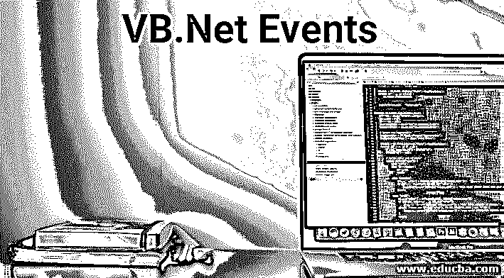

# VB.Net 事件

> 原文：<https://www.educba.com/vb-dot-net-events/>




## VB.Net 事件介绍

Visual Basic。Net 是一种面向对象的、基于多范例的编程语言，在。Net 框架。这是微软在 2002 年推出的，是最流行的 Visual Basic 语言的继承者。微软为处理这种 Visual basic 语言而提供的 IDE 或集成开发环境是 Microsoft Visual Studio。visual studio 速成版和社区版是该工具的非付费未授权版本，因此构成免费软件的一部分。该免费软件包括一个命令行编译器 SDK，被称为 vbc.exe。Mono 也利用了命令行 [VB。NET 编译器](https://www.educba.com/what-is-vb-dot-net/)。visual basic 语言的一个非常重要的特性是它利用了用于指定操作的语句。在这篇文章中，我们将详细讨论关于 about 的事件。

即使您将 visual studio 项目想象为按顺序执行的程序系列，但实际上，它们都是事件的[部分，因此它们是事件驱动的，这意味着执行流程仅由周围发生的所有外部事件(也称为事件)决定。它们基本上是用户操作，如按键、鼠标相关的移动、点击等。或者它也用于执行某些事件，如面向系统的通知和生成的通知。此外，应用程序还需要在所有事件发生时做出响应。这包括单击主页按钮或在文本框中输入某种形式的文本，单击菜单项。它们都是事件示例的一部分。事件可以定义为调用另一个函数或导致另一个事件被触发的动作。另一方面，处理程序是告诉我们如何响应事件的函数。](https://www.educba.com/javascript-events/)

<small>网页开发、编程语言、软件测试&其他</small>

### VB.Net 事件的类型

下面是 VB 的两种类型。网络事件:

#### 1.基于鼠标的事件

当鼠标在控件或窗体中做任何移动时，就会发生鼠标事件。以下是一些与控件类相关的鼠标相关事件。

##### **和。老鼠输入〔t1〕**

当鼠标指针进入控件时，会触发此事件。

**语法:**

```
private sub func_name(alias as Datatype1, alias as Datatype2)
Handles object.MouseEnter
Program Body
End Sub
```

**举例:**

```
//defining a subroutine
Private Sub MouseEnter(sender As ObjectType, e As EventArguments)
Handles abc.MouseEnter
//writes the code for handling mouse enter on abc textbox
abc.BackColor = Color.Blue
abc.ForeColor = Color.Red
End Sub
```

##### 第二次。老鼠洞

当鼠标按钮被按下并且光标被带到它的下方时，这个事件被触发。

**语法:**

```
private sub func_name(alias as Datatype1, alias as Datatype2)
Handles object.MouseDown
Program Body
End Sub
```

**举例:**

```
//defining a subroutine
Private Sub MouseDown(sender As ObjectType, e As EventArguments)
Handles abc.MouseDown
//writes the code for handling mouse down
abc.BackColor = Color.Blue
abc.ForeColor = Color.Red
End Sub
```

##### 第三个。老鼠！老鼠

当鼠标指针位于正在处理它的控件上，并且已经按下的鼠标按钮被释放时，该事件被触发。

**语法:**

```
private sub func_name(alias as Datatype1, alias as Datatype2)
Handles object.MouseUp
Program Body
End Sub
```

**举例:**

```
//defining a subroutine
Private Sub MouseUp(sender As ObjectType, e As EventArguments)
Handles abc.MouseUp
//writes the code for handling mouseUp
abc.BackColor = Color.Blue
abc.ForeColor = Color.Red
End Sub
```

##### 四。老鼠离开

这是当鼠标指针离开控件时触发的事件。

**语法:**

```
private sub func_name(alias as Datatype1, alias as Datatype2)
Handles object.MouseLeave
Program Body
End Sub
```

**举例:**

```
//defining a subroutine
Private Sub MouseLeave(sender As ObjectType, e As EventArguments)
Handles abc.MouseLeave
//writes the code for handling mouseLeave for abc textbox
abc.BackColor = Color.Blue
abc.ForeColor = Color.Red
End Sub
```

##### 动词 （verb 的缩写）鼠标滚轮

当鼠标滚轮移动并且控件获得焦点时，该事件被触发。

**语法**

```
<element onwheel="mytestScript">
object.onwheel = function(){mytestScript};
object.addEventListener("wheel", mytestScript);
```

**举例:**

```
document.getElementById("DIV").addEventListener("wheel", testFunction);
function testFunction() {
this.style.fontSize = "70px";
}
```

#### 2.基于键盘的事件

这些是在键盘上的任何操作触发事件时触发的事件。这包括按键、按键、回车等动作。让我们详细研究一些基于键盘的事件。

##### 一.按键

该事件是一个基于键盘的触发器，当向下方按下一个键并且控件具有焦点时发生。

**语法:**

```
private sub func_name(alias as Datatype1, alias as Datatype2)
Handles object.KeyDown
Program Body
End Sub
```

**举例:**

```
Private Sub KeyDown(sender As Object, e As KeyEventArgs) _
Handles abc.KeyDown
If (KeyDown.IsNumber(Chr(e.KeyCode))) Then
alert.Show("Enter Customer ID number")
abc.Text = " "
End If
End Sub
```

##### 第二次。好好享受吧

该事件是一个基于键盘的触发器，当向上按下一个键并且控件具有焦点时发生。

**语法:**

```
private sub func_name(alias as Datatype1, alias as Datatype2)
Handles object.KeyUp
Program Body
End Sub
```

**举例:**

```
Private Sub KeyUp(sender As Object, e As KeyEventArgs) _
Handles abc.KeyUp
If (KeyUp.IsNumber(Chr(e.KeyCode))) Then
alert.Show("Enter Customer ID number")
abc.Text = " "
End If
End Sub
```

##### 第三个。键击器

当在键盘上按下特定的键时，该事件被触发。

**语法:**

```
Public Class class_name
private sub func_name(alias as Datatype1, alias as KeyPressArguments)
Handles object.KeyPress
Program Body
End Sub
```

**举例:**

```
Public Class testKeyPress
Private Sub KeyPress(Value sender As System.Object, Value e As System.Windows.KeyPressEventArguments) Handles abc1.KeyPress
If !(e.KeyChar = Convert.ToChar(10)) Then
MsgBox("key is not pressed ")
End If
End Sub
End Class
```

### 结论-VB.Net 事件

事件在基于。Net 框架。这种语言提供了丰富的事件集，如果学习并以正确的方式使用，可以用来增强编码和脚本功能。不同的项目根据他们的需求使用不同版本的语言，每个语言版本都随着引入的语法和功能/事件而变化，因此使用适合您的需求并且您拥有熟练资源的正确语言集变得非常必要。

### 推荐文章

这是一本 VB.Net 事件指南。在这里，我们讨论了介绍和两个不同类型的 VB.Net 事件的语法和例子。您也可以浏览我们推荐的其他文章，了解更多信息——

1.  [Java 关键字](https://www.educba.com/java-keywords/)
2.  [Java 部署工具](https://www.educba.com/java-deployment-tools/)
3.  [Java 中的继承](https://www.educba.com/inheritance-in-java/)
4.  [Java 中受保护的关键字](https://www.educba.com/protected-keyword-in-java/)


