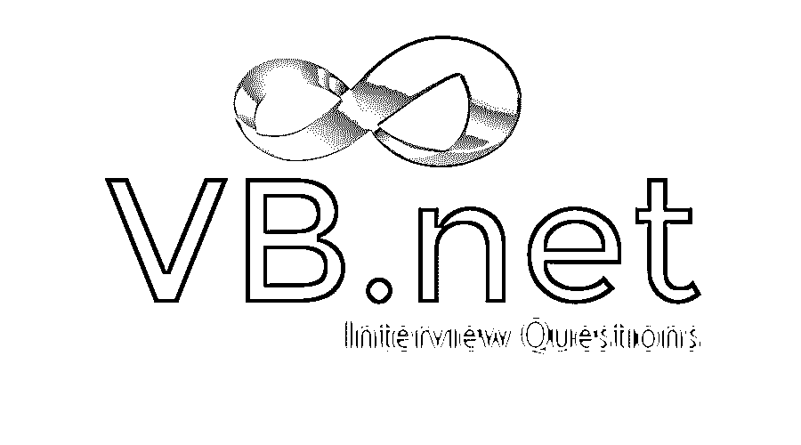

# VB.NET 面试问题

> 原文：<https://www.educba.com/vb-net-interview-questions/>

## VB.NET 面试问答介绍

visual Basic(VB.NET)是一种面向对象的计算机编程语言。NET 框架。VB.NET 用于开发 Windows 应用程序、 [Web 应用程序、](https://www.educba.com/how-to-build-web-applications-using-mongodb/)Web 服务。它是经典的 [Visual Basic 语言](https://www.educba.com/visual-basic-editor-vbe-properties/)的进化，它不向后兼容 VB6，任何用旧版本写的代码都不能在 VB.NET 下编译。VB.NET 完全支持面向对象的概念。也可以在 Mono 上运行 VB.NET 的[程序](https://www.educba.com/vb-dot-net-operators/)，Mono 是微软的开源替代品。NET，不仅在 Windows 下，甚至在 Linux 或 Mac OSX 下。

### 什么是 VB.NET？

*   VB.NET 中的一切都是对象，包括所有的基本类型(短整型、长整型、布尔型、字符串型等)。)和用户定义的类型、事件，甚至程序集。所有对象都继承自基类对象。VB.NET 是由微软开发的。它可以完全访问 the.Net 框架中的所有库。
*   的。Net framework 应用程序是多平台应用程序。该框架被设计成可以在以下任何语言中使用:Visual Basic、C#、C++、JScript 和 [COBOL](https://www.educba.com/what-is-cobol/) 等。
*   所有这些语言都可以访问框架并相互通信。的。Net 框架由一个庞大的代码库组成，这些代码被像[VB.Net](https://www.educba.com/inheritance-in-vb-dot-net/)这样的客户端语言使用。这些语言使用面向对象的方法。

### VB.Net 的组成和优势

以下是 the.Net 框架的一些组件和优势:

<small>网页开发、编程语言、软件测试&其他</small>

#### 成分

*   公共语言运行时(CLR)
*   公共语言规范
*   的。Net 框架类库
*   元数据和程序集
*   普通类型系统
*   Windows 窗体
*   Net 和 ASP.Net AJAX
*   Windows 工作流基金会(WF)
*   网
*   Windows 演示基础
*   [视窗通讯基金会(WCF)](https://www.educba.com/what-is-wcf/)

VB.Net 集成开发环境(IDE)

微软为 VB.Net 编程提供了以下开发工具:

*   Visual Basic 2010 学习版(VBE)
*   可视化 Web 开发人员
*   Visual Studio 2010 (VS)

#### 优势

*   它是现代通用语言。
*   它是一种面向对象的语言。
*   对初学者来说很容易学。
*   VB.NET 是一种结构化语言。
*   它可以在多种平台上编译。
*   它支持条件编译。
*   它有自动垃圾收集，标准库。
*   它支持属性和事件。
*   它支持代理和事件管理。
*   它支持泛型、索引器和简单的多线程。

你终于在 VB.NET 找到了你梦想中的工作，但是你想知道如何通过 VB.NET 的面试，VB.NET 的面试可能会有哪些问题。每次面试都不一样，工作范围也不一样。牢记这一点，我们设计了最常见的 VB.NET 面试问题和答案，以帮助你在面试中取得成功。

以下是 VB.NET 面试中最常被问到的问题。这些热门问题分为以下两部分:

*   [第一部分——VB.NET 面试问题(基础)](#1)
*   [第二部分-VB.NET 面试问题(高级)](#2)

### 第 1 部分-VB.NET 面试问题(基础)

这第一部分包括基本的 VB.NET 面试问题和答案

#### 1.C#、VB 和 VB.Net 有什么区别？

**答案:**

*   **c#和 VB 的区别。净:**

在 VB.Net 中，可选参数是可接受的，不区分大小写，不使用任何东西来释放非托管资源，支持结构化和非结构化错误处理。
在 C#中不接受可选参数，区分大小写，‘Using’用于释放非托管资源，非结构化错误处理。

*   **VB 和 VB 的区别。净:**

VB 是平台相关的，向后兼容的，异常处理由“On Error…..' Goto '解释为无法开发多线程应用程序。
VB.Net 是平台无关的，[VB.Net 不是向后兼容的](https://www.educba.com/vb-dot-net-string-functions/)，编译器语言，[异常处理](https://www.educba.com/exception-handling-in-vb-dot-net/)由‘Try…' Catch '，多线程应用程序可以很容易地开发。

#### 2.解释元数据，名称空间，哪个名称空间用于访问数据，什么是 JIT？

**答:**
元数据被称为“关于数据内容的数据”，它可以在图书馆的目录中找到。实际上，它是用来分析数据库中的数据，也可以用于其他用途。
名称空间是表示类、结构和接口的一种有组织的方式。网语。命名空间是类库的层次结构索引，对所有人都可用。网络语言。

它代表实时编译器，是运行时执行环境的一部分。JIT 有三种类型，它们是:

*   **Normal JIT–**在运行时编译被调用的方法，它们在第一次被调用时被编译。
*   **Pre-JIT—**在部署应用程序时进行编译。
*   **Econo-JIT—**在运行时编译被调用的方法。

让我们转到下一个 VB.NET 面试问题。

#### 3.什么是程序集、它的类型、它的用途以及什么是。NET 程序集？

**答:**
程序集是. NET 应用程序的元素之一，被称为所有元素的基本单元。NET 应用程序。该程序集可以是 DLL 或可执行文件。

有两种类型的装配:-

*   私有:私有程序集通常由一个应用程序使用，它存储在应用程序的目录中。
*   **Public:** 公共程序集或共享程序集存储在全局程序集缓存中，可以由许多应用程序共享。

强名称是 of.Net 的一项重要功能，用于唯一标识共享程序集。强名称已经解决了创建同名不同对象的问题，它可以在 Sn.exe 的帮助下进行分配。这是 VB.NET 面试中最常见的问题。

#### 4.什么是选项严格、选项显式和内部关键字 in.Net 框架？

**答案:**
。Net 通常允许任何数据类型的隐式转换。为了避免数据类型转换期间的数据丢失，使用了
option strict 关键字，它确保了这些类型转换的编译时通知。

Option Explicit 是文件中使用的关键字，它使用 Public、Dim、Private 或 Protected 等声明关键字显式声明所有变量。如果未声明的变量名持续存在，编译时会出错。

INTERNAL 关键字是访问说明符的[之一，该说明符将在 DLL 文件中的给定程序集
中可见。这就形成了一个单一的二进制组件，它在整个组件中都是可见的。](https://www.educba.com/access-specifiers-in-c-plus-plus/)

#### 5.新的关键字 in.Net 框架？

**答:**
一个新的关键字与构造函数一起使用，在构造函数中可以用作修饰语或运算符。
当它被用作修饰符时，它隐藏了基类成员的继承成员。当它用作运算符时，它会创建一个对象来调用构造函数。

### 第 2 部分-VB.NET 面试问题(高级)

现在让我们来看看高级面试问题。

#### 6.解释 VB.Net 的锯齿状排列？

**答案:**
[参差阵列](https://www.educba.com/c-sharp-jagged-arrays/)是阵列中的阵列。数组中的每个条目都是另一个数组，可以容纳任意数量的条目。这是 VB.NET 在面试中经常被问到的面试问题。

#### 7.VB.net 的垃圾收集是什么？

**答案:**
垃圾回收又称自动内存管理，用于自动回收动态分配的内存。垃圾收集由垃圾收集器执行，如果垃圾收集器确定内存不会被使用，它将回收内存。

#### 8.系统之间的差异。字符串和系统。StringBuilder 类？

**答:**
System.string 类是不可更新的，它会创建一个新的 string 对象而不是更新它。
但是对于[StringBuilder 类](https://www.educba.com/stringbuilder-class-in-java/)，在同一个 string 对象中更新是可能的。因此，字符串生成器的操作比字符串类更快更有效。

让我们转到下一个 VB.NET 面试问题。

#### 9.int 和 int32 的区别？

**答:**
Int32 表示 32 位有符号整数，而在 VB.Net 不是关键字。

#### 10.什么是哈希表？

**答案:**
Hashtable 设置为具有键和值对的项。关键字被称为索引，通过搜索关键字可以对值进行快速搜索。

### 推荐文章

这是 VB.NET 面试问题清单的指南。在这里，我们讨论了面试中最常被问到的十大 VB.NET 面试问题及其详细答案。您也可以看看下面的 SEO 文章来了解更多信息——

1.  [计算机编程语言的最佳选择](https://www.educba.com/computer-programming-language/)
2.  [Linux 面试问题](https://www.educba.com/linux-interview-questions/)
3.  [Windows 面试问题|最有用的](https://www.educba.com/windows-interview-questions/)
4.  [jQuery 面试问题](https://www.educba.com/jquery-interview-questions/)
5.  [iOS 面试问题|最常被问到的问题](https://www.educba.com/ios-interview-questions/)

