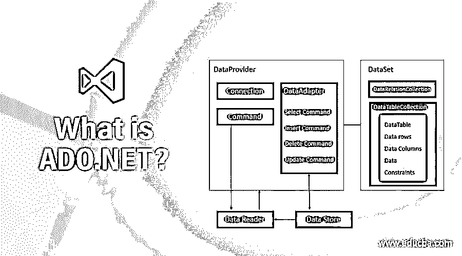

# 什么是 ADO.NET？

> 原文：<https://www.educba.com/what-is-ado-dot-net/>

## ADO.NET 简介

开发人员使用 ADO.NET 来建立连接，以便访问和执行基本的 CRUD 操作，如创建、读取、更新和删除存储在关系数据库和非关系数据库中的数据。此外，ADO.NET 被认为是 ActiveX 数据对象技术的发展。

今天我们要讨论什么是 ADO。网？.如果我们讨论 web 开发，那么它可以大致分为三个部分。第一类是前端技术，用户通过它进行交互，第二类是后端技术，包含我们的业务逻辑，第三类是数据库连接语言(有时通常归入后端技术)。

<small>网页开发、编程语言、软件测试&其他</small>

从数据库中存储和获取任何数据并不简单。后端和数据库之间没有直接的连接或直接通信的方式。对于后端技术(比如 C# )和数据库(比如 SQL)之间的通信，我们需要一个桥梁。ADO.NET 提供了一个桥梁，使得后端和数据库可以顺利通信

### 什么是 ADO.NET？

ADO.NET 是由微软技术公司开发的一项技术，它也是建立在。NET 框架。ADO 的首字母缩写是 ActiveX 数据对象。ADO.NET 为我们提供了在后端技术和数据库之间架设桥梁的便利。然而，这个数据库可以是关系数据库，也可以是非关系数据库。

现在知道了 about 的基本情况，让我们看看维基百科是如何定义它的。

根据维基百科——“阿多。NET 是一种来自 Microsoft.NET 框架的数据访问技术，它通过一组通用的组件在关系系统和非关系系统之间提供通信。ADO.NET 是一组计算机软件组件，程序员可以用它们从数据库中访问数据和数据服务。它是 Microsoft.NET 框架中包含的基本类库的一部分。

### 了解 ADO.NET？

ADO.NET 在前端技术和后端数据库之间架起了一座连接桥梁。ADO.NET 遵循面向对象的封装原则，将所有操作封装起来。这些操作主要承担数据访问责任。ADO.NET 控制器与 ADO 对象交互来显示数据。遵循封装原则，它隐藏了外部世界的数据移动机制。因此，这提供了额外的安全层。

### ADO.NET 是如何让工作变得如此简单的？

ADO.NET 遵循一系列指令，使用这些指令我们可以在后端技术和数据库之间建立连接。为了达到我们的要求，需要遵循七个步骤。因此，我们可以正确地说，在 done 上工作是相当容易的，唯一需要做的事情是遵循一套预先定义的协议。

如前所述，为了使用 ADO.NET 有效地建立链接，需要遵循一组七个规则。

以下是相同的步骤:-

1.  **创建到数据库的 ADO 连接:**在这一步中，我们需要创建到数据库的连接。创建到我们数据库的连接的最简单的方法是使用无 DSN 连接。
2.  **打开数据库连接:**成功创建 ADO 连接后，我们将使用内置的“Open”方法打开数据库连接。
3.  **创建一个 ADO 记录集:**一旦创建了 ADO 数据库连接，我们就需要创建一个 ADO 记录集。
4.  **打开记录集:**一旦 ADO 记录集被创建，我们需要打开它。此外，我们希望您知道，创建的记录集可以有两种类型——ADO 表格记录集和 ADO SQL 记录集。
5.  **从记录集中提取你需要的数据:**现在一旦记录集被打开，我们就可以从记录集中提取数据了。对于这一部分，我们将使用 ADO 记录集对象。这个 ADO 记录集对象将用于从我们的数据库中提取并保存一组提取的记录。
6.  **关闭记录集:**一旦提取了记录，我们需要关闭记录集。
7.  **关闭连接:**一旦记录集关闭，就关闭连接。

### 优势

以下是 ADO.NET 最大的优势，让我们一个一个来看。

1.  **跨越能力:**在异构环境之间通信——ADO.NET 具有在两个异构环境之间建立连接的特殊优势。一旦建立了连接，ADO.NET 就可以轻松地在这两个异构环境之间进行通信。
2.  易于扩展:ADO.NET 是高度可扩展的，这意味着如果需求出现，它足够灵活，易于扩展。
3.  生产率高:ADO.NET 有足够的能力构建健壮的应用程序。
4.  **性能**:没有缺失或延迟，可以快速设置连接获取数据。

### 范围

有一个高范围的 ADO.NET，ADO.NET 是微软的产品之一，足以进一步占领市场。ADO.NET 有大量的社区支持，因此它有相当大的前景。为了有一个更好的视野，你可以学习 ADO.NET 和 hands-on.Net 商品框架。任何一个对[既有前端](https://www.educba.com/what-is-front-end-developer/)又有后端技术掌握的[全栈开发者](https://www.educba.com/full-stack-web-developer/)，都可以很好的学习这种创造性的技术。任何前端或后端开发人员也可以学习它。

### 这项技术将如何帮助职业发展？

正如前面“什么是 ADO.NET”一节中所讨论的那样。我们已经知道，这个 ADO.NET 有一个相当好的范围，因此知道和学习这将总是很有趣。从增长的角度来看，along 以及任何数据库的任何知识都将是非常好的。

### 结论

ADO.NET 是微软在. NET 框架上开发的一项重要技术。ADO.NET 技术的基本角色和职责是在后端语言和我们的数据库之间建立一座桥梁。从开发的角度来看，很好地实践这项有趣的技术将大有用处。

### 推荐文章

这是一本关于什么是 ADO 的指南。网？.在这里，我们讨论 along 的工作，以及 along 的范围和优势。您也可以阅读以下文章，了解更多信息——

1.  [在 ASP.NET 的职业生涯](https://www.educba.com/career-in-asp-dot-net/)
2.  [Asp.Net MVC 面试问题](https://www.educba.com/asp-dor-net-mvc-interview-questions/)
3.  [ASP.NET MVC 路由](https://www.educba.com/asp-dot-net-mvc-routing/)
4.  [ASP.NET MVC 认证](https://www.educba.com/asp-dot-net-mvc-authentication/)

