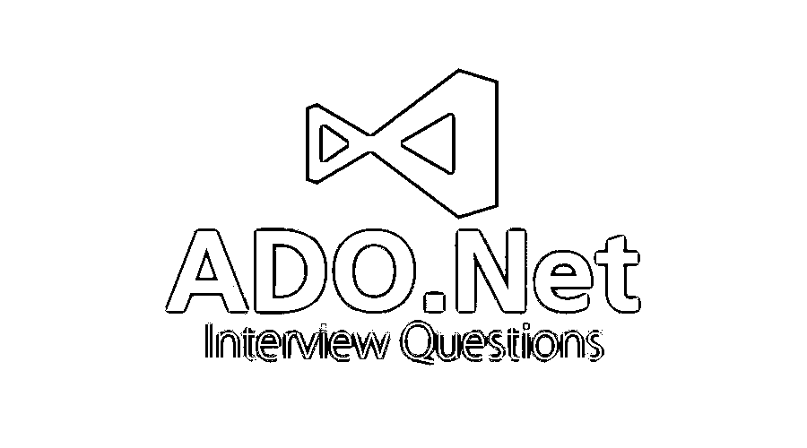

# ADO.NET 面试问题

> 原文：<https://www.educba.com/ado-net-interview-questions/>

## ADO.NET 面试问答介绍

ADO.NET 是一个模块或一组类，提供从托管语言到 Microsoft 的数据访问服务。NET 框架。ADO.NET 为数据访问提供了一套完整的库，它的优势在于允许应用程序使用相同的方法收集或访问不同形式的数据。假设，如果我们知道如何从 ADO.NET 访问 Oracle，我们可以使用 ADO.NET 提供的一组库和类，使用相同的方法从 SQL、MySQL 和其他数据库访问数据。它是微软内部的一部分。NET 框架允许访问 XML、关系、不同类型的应用程序数据。它充当应用程序和数据库之间访问和管理数据的桥梁。ADO.NET 广泛用于数据访问、选择、删除、保存和其他数据管理操作。ADO.NET 是一个活动的数据库对象，它有一个内置的自动驱动程序检测技术，提供了一个可能会降低效率的连接环境。由于 ADO.NET 广泛用于数据管理的. NET 框架，破解面试需要基本的技能和经验。

现在，如果你正在寻找一份与 ADO.NET 相关的工作，那么你需要准备 2022 年 ADO.NET 面试的问题。的确，每个面试都因职位不同而不同，但要通过面试，你仍然需要对 ADO.NET 有一个清晰的了解。在这里，我们准备了重要的 ADO.NET 面试问题和答案，这将有助于你在面试中取得成功。

<small>网页开发、编程语言、软件测试&其他</small>

在这篇 2022 年 ADO.NET 面试问题的文章中，我们将呈现 10 个最重要和最常用的 ADO.NET 面试问题。这些问题将帮助学生建立他们对 ADO.NET 的概念，并帮助他们赢得面试。

### 第 1 部分-ADO.NET 面试问题(基础)

第一部分包括基本的面试问题和答案

#### Q1。在哪个命名空间。NET 有数据功能类。

**答案:**
ADO.NET 为数据管理提供了如下名称空间:

*   **数据。OleDB–**它具有通过 OLE-DB 连接到数据源的对象需求，OLE-DB 将从具有相同属性、方法和事件的公共基类中继承。
*   **数据。SqlClient–**它的对象需要通过 TDS 连接到数据源，TDS 是 Microsoft SQL Server 的一个接口，它提供了比 OLE_DB 更好的性能，因为 SqlClient 删除了 OLE-DB 连接所需的一些中间层。
*   **Data—**它拥有访问、存储来自数据集、数据表和关系的关系数据所需的对象，这些对象独立于数据源类型和连接数据源的方法。
*   **XML–**它拥有根据 W3C 创建、读取、写入、存储和操作 XML 文档所需的对象。
*   **数据。Oracle client–**它包含连接 Oracle 数据库所需的对象/类，如 Oracle command、OracleConnection。

#### Q2。Dataset 和 DataReader 有什么区别？

**答案:**
这是 ADO.NET 面试时问的基本问题。Dataset 和 DataReader 的区别如下:

*   **DataSet:** Dataset 是一个对象，它是一个不连接的体系结构，可以持久保存一个表的内容，并且可以保存来自同一数据源的多个表。
*   **DataReader:** DataReader 是一个对象，它是一个连接的体系结构，不能持久保存表的内容，因为它提供对数据的只进和只读访问。

#### Q3。连接对象有什么用？

**答案:**
连接对象的用途是将数据连接到一个命令对象上。不同的连接对象用于不同的提供程序，例如 OLE-DB 提供程序的 OleDbConnection 对象和 Microsoft SQL Server 的 SqlConnection 对象。

让我们转到下一个 ADO.NET 面试问题。

#### Q4。数据网格和数据转发器有什么区别？

**答案:**
数据网格和数据中继器的区别如下:

*   **数据网格:**数据网格为用户提供了许多特性和功能，可以方便地对表中的数据进行分页、排序。它可以保存文本对象数据，但不能保存嵌入或链接的对象数据。
*   **Data Repeater:**Data Repeater 提供了许多数据网格无法提供的功能，例如，它可以控制嵌入和链接的对象数据，也可以将数据网格嵌入其中，但反之则不可能。它不支持分页功能，但可以通过编程来实现。

#### Q5。ADO.NET 2.0 版本有哪些重要特性？

**答案:**
ADO.NET 2.0 版本的重要特性如下:

*   **批量更新:**批量更新是指在程序的一次调用中更新一个表的 n 行。
*   **数据分页:**数据分页提供了一种从数据库表的给定索引中读取数据的简单方法。
*   **批量复制操作:**提供从一个数据源到另一个数据源的数据批量复制的便利。
*   **连接详细信息:**它提供了关于连接的详细信息，如游标、缓冲区和存储对象等。信息。
*   **DataTable 的加载和保存方法:**它用于 XML 数据交互，基于 W3C 标准存储、写入和操作 XML 数据，并使用 dataset removing format 属性提供二进制的数据集序列化。

### 第 2 部分-ADO.NET 面试问题(高级)

现在让我们来看看高级面试问题。

#### Q6。什么是 ADO.NET 的连接池？

**答:**
连接池是重用数据库连接的能力，也就是说，如果我们在连接对象中提到/启用连接池，就意味着我们可以重用多个用户的连接。它减少了使用连接管理器重复打开和关闭连接的成本，连接管理器维护连接、池和可用连接的列表。

以下是 SQL Server 连接的一些池属性:

*   **连接生存期:**它描述了连接从创建到关闭的生存期。
*   **负载平衡超时:**它描述了一个连接在连接池中可以保持空闲的时间。
*   最大池大小、最小池大小等。

#### Q7。经典 ADO 和新 ADO.NET 有什么区别？

**答案:**
这是高级 ADO.NET 面试中问的一个问题。经典 ADO 和 ADO.NET 的主要区别如下:

*   ADO 有记录集，而 ADO.NET 有数据集
*   在记录集中，如果我们想有更多的表数据，我们需要执行内部连接，而数据集可以有多个表数据。

#### Q8。数据适配器有什么用？

**答:**
数据适配器对象将一个或多个命令对象连接到数据集对象。数据适配器对象为获取数据、存储数据和填充 dataset 对象中的表提供逻辑。

让我们转到下一个 ADO.NET 面试问题。

#### Q9。什么是 SqlCommandBuilder？

**答:**
SqlCommandBuilder 帮助用户为数据适配器在单个表上生成更新、插入和删除命令。每个数据适配器对象都有一个命令生成器类。下面是 CommandBuilder 类的一些示例:

OleDbCommandBuilder、SqlCommoandBuilder 和 OdbcCommandBuilder 类表示 OleDb、SQL 和 ODBC 数据提供程序。

#### Q10。解释一下 ADO.NET 的 ExecuteScalar 方法？

**答案:**
SqlCommand 对象中的 ExecuteScalar 方法对数据源执行查询后，返回第一行的第一列。如果结果集为空，它将忽略该结果集。如果结果集有多列或多行，它将只取第一行的第一列，其余的值将被忽略。

### 推荐文章

这是一个 ADO.NET 面试问题和答案的列表指南，以便候选人可以轻松地解决这些面试问题。在本帖中，我们研究了 ADO.NET 面试中经常被问到的问题。您也可以阅读以下文章，了解更多信息——

1.  [VB.NET 面试问题](https://www.educba.com/vb-net-interview-questions/)
2.  [ASP.Net 面试问题](https://www.educba.com/asp-dot-net-interview-questions/)
3.  [C#面试问题](https://www.educba.com/c-sharp-interview-questions-and-answers/)
4.  [OS 面试问题](https://www.educba.com/os-interview-questions/)

