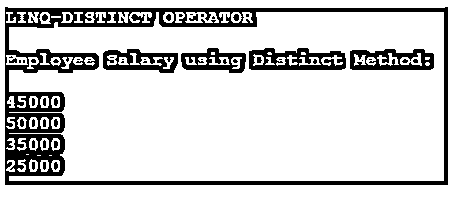
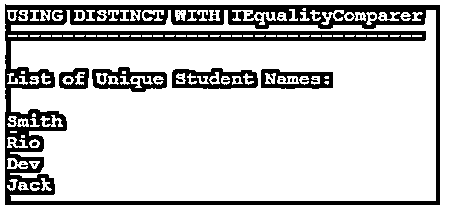

# LINQ 独特

> 原文：<https://www.educba.com/linq-distinct/>

## LINQ 独特的定义

LINQ 相异算子是集合算子下的一种算子。Distinct 方法返回列表集合中的唯一值；它从给定的集合中返回一组新的唯一元素。distinct 运算符从集合中删除所有重复的值，并最终返回不相似或唯一的值。LINQ 非重复运算符仅在方法语法中可用，不支持查询语法。

**语法:**

<small>网页开发、编程语言、软件测试&其他</small>

LINQ 相异运算符语法如下:

`public static IEnumerable<TSource> Distinct<TSource>(this IEnumerable<TSource> source);
public static IEnumerable<TSource> Distinct<TSource>(this IEnumerable<TSource> source, IEqualityComparer<TSource> comparer);`

它包含两个重载方法，其中第一个类型不包含任何参数，第二个包含 IEqualityComparer 参数来检查复杂类型。

### 独特在 LINQ 是如何运作的？

LINQ 非重复运算符从集合中删除所有重复的值，并最终返回不相似或唯一的值。LINQ 非重复运算符仅在方法语法中可用，不支持查询语法。LINQ 相异算子是集合算子下的一种算子。

**例如，**

让我们假设一个集合，List= {2，3，5，5，7，8，7，9}在这个集合中，值 5，7，9 在集合中重复了两次，因此我们需要消除重复并返回结果，为此我们需要在集合中使用 distinct 运算符。distinct 方法返回列表集合中的唯一值。

`Result= List. distinct ();
Result= {2, 3, 5, 7, 8, 9};`

distinct 方法返回列表集合中的唯一值；它从给定的集合中返回一组新的唯一元素。让我们看看下面的程序，

**代码:**

`using System;
using System.Collections.Generic;
using System.Linq;
namespace LINQDistinct_
{
class ProgramSample
{
static void Main(string[] args)
{
List<int>listValues = new List<int>()
{
70,30,40,20,30,40,70,50,60,30,40,50
};
Console.WriteLine("BASIC LINQ DISTINCT EXAMPLE\n");
//use of method_syntax type
varmethod_type = listValues.Distinct();
//use of query_syntax type
varquery_type = (from num in listValues
select num).Distinct();
Console.WriteLine("LINQ DISTINCT- Method_Type\n");
foreach (var result in method_type)
{
Console.WriteLine(result);
}
Console.WriteLine("LINQ DISTINCT- Query_Type\n");
foreach (var result in query_type)
{
Console.WriteLine(result);
}
Console.ReadKey();
}
}
}`

在这个程序中，它使用查询类型和方法类型检索不同的值。在方法类型中，获取集合列表中的值作为 list<int>list values，并使用不同的函数类型作为 varmethod_type = listValues。distinct()；最后，它将结果作为非重复值返回。在查询类型中，因为它在列表<int>中的集合列表中获取值列表值并且它按查询类型使用 distinct，如下所示，</int></int>

`varquery_type = (from num in listValues select num).Distinct();`

**输出:**

### LINQ 独特的例子

distinct 运算符从集合中删除所有重复的值，并最终返回不相似或唯一的值。LINQ 非重复运算符仅在方法语法中可用，不支持查询语法。让我们以编程的方式来看下面的例子，

#### 示例#1

在这个程序中，字符串集合包含如下重复名称的课程，string[] Courses = { "JAVA "，" DOTNET "，" PHP "，" ANDROID "，" JAVA "，" PHYTHOD "，" ANDROID "，" ANDROID" }，通过使用 distinct 运算符，我们可以获得没有重复的元素的新集合。

**代码:**

`using System;
using System.Linq;
using System.Collections.Generic;
class LinqDistinct_class
{
// in main-method
static public void Main()
{
string[] Courses = { "JAVA", "DOTNET", "PHP", "ANDROID", "JAVA", "PHYTHOD", "ANDROID", "ANDROID" };
vardistinctCourses = Courses.Distinct();
Console.WriteLine("Distinct Method - Unique Courses\n");
foreach (varcName in distinctCourses)
{
Console.WriteLine(cName);
}
Console.ReadLine();
}
}`

**输出:**

#### 实施例 2

**代码:**

`using System;
using System.Linq;
using System.Collections.Generic;
// Employee Basic Details
public class EmployeeClass
{
public intemployee_id
{
get;
set;
}
public string employee_name
{
get;
set;
}
public string employee_gender
{
get;
set;
}
public string employee_JoiningDate
{
get;
set;
}
public intemployee_salary
{
get;
set;
}
}
class LinqDistinct_class
{
// in main-method
static public void Main()
{
List<EmployeeClass>employeeList = new List<EmployeeClass>() {
new EmployeeClass() {employee_id = 1001, employee_name = "Sasha", employee_gender = "Female",
employee_JoiningDate = "18/7/2015", employee_salary = 45000},
new EmployeeClass() {employee_id = 1002, employee_name = "Sonali", employee_gender = "Female",
employee_JoiningDate = "02/09/2017", employee_salary = 50000},
new EmployeeClass() {employee_id = 1003, employee_name = "Vishal", employee_gender = "Male",
employee_JoiningDate = "13/06/2015", employee_salary = 50000},
new EmployeeClass() {employee_id = 1004, employee_name = "Chintu", employee_gender = "Female",
employee_JoiningDate = "16/02/2015", employee_salary = 35000},
new EmployeeClass() {employee_id = 1005, employee_name = "Ankath", employee_gender = "Male",
employee_JoiningDate = "09/11/2017", employee_salary = 35000},
new EmployeeClass() {employee_id = 1006, employee_name = "Saniya", employee_gender = "Female",
employee_JoiningDate = "23/07/2016", employee_salary = 25000},
};
// to find the salary of employess in distinct orders - using Distinct_Method
Console.WriteLine("LINQ-DISTINCT OPERATOR\n");
var res = employeeList.Select(e =>e.employee_salary).Distinct();
Console.WriteLine("Employee Salary using Distinct Method: \n");
foreach (var result in res)
{
Console.WriteLine(result);
}
Console.ReadKey();
}
}`

**输出:**

#### 实施例 3

在这个程序中，它使用 LINQ-DistinctIEqualityComparermethod，distinct 运算符不比较任何复杂类型，对于这种方法，我们继续使用 IEqualityCompareris 来比较复杂类型的集合，以唯一地检索列表。它有两个方法 GetHashCode()和 Equals()用于实现。

**代码:**

`using System;
using System.Linq;
using System.Collections.Generic;
class LinqDistinct_class
{
internal class Student
{
public intStudentID{ get; set; }
public string StudentName{ get; set; }
}
//USING DISTINCT WITH IEqualityComparer
internal class StudentNameComparer :IEqualityComparer<Student>
{
public bool Equals(Student a, Student b)
{
if (string.Equals(a.StudentName, b.StudentName, StringComparison.OrdinalIgnoreCase))
{
return true;
}
return false;
}
public intGetHashCode(Student obj)
{
return obj.StudentName.GetHashCode();
}
}
public class Program
{
public static void Main(string[] args)
{
List<Student> students = new List<Student>();
students.Add(new Student { StudentID = 1001, StudentName = "Smith" });
students.Add(new Student { StudentID = 1002, StudentName = "Rio" });
students.Add(new Student { StudentID = 1003, StudentName = "Dev" });
students.Add(new Student { StudentID = 1001, StudentName = "Smith" })
students.Add(new Student { StudentID = 1003, StudentName = "Dev" });
students.Add(new Student { StudentID = 1001, StudentName = "Smith" });
students.Add(new Student { StudentID = 1001, StudentName = "Smith" });
students.Add(new Student { StudentID = 1003, StudentName = "Dev" });
students.Add(new Student { StudentID = 1002, StudentName = "Rio" });
students.Add(new Student { StudentID = 1004, StudentName = "Jack" });
varuniqueStudents = students.Distinct(new StudentNameComparer());
Console.WriteLine("USING DISTINCT WITH IEqualityComparer");
Console.WriteLine("-------------------------------------\n");
Console.WriteLine("List of Unique Student Names:\n");
foreach (varget_student in uniqueStudents)
{
Console.WriteLine(get_student.StudentName);
}
Console.ReadLine();
}
}
}`

**输出:**

### 结论

在本文中，我们学习了 LINQ-DISTINCT，它用于惟一地检索元素集合。通过使用 distinct 方法，我们可以得到没有重复的新的元素集合。希望这篇文章有助于通过编程方式查看上述示例来理解。

页头

表单底部

### 推荐文章

这是 LINQ 独特的指南。在这里，我们还将讨论 linq 中的介绍以及 distinct 是如何工作的？以及不同的示例及其代码实现。您也可以看看以下文章，了解更多信息–

1.  [LINQ 内部加入](https://www.educba.com/linq-inner-join/)
2.  [Oracle XMLTABLE](https://www.educba.com/oracle-xmltable/)
3.  [ASP.NET 更新面板](https://www.educba.com/asp-dot-net-updatepanel/)
4.  [资产支持证券](https://www.educba.com/asset-backed-securities/)

