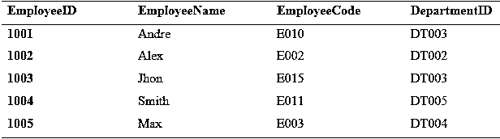
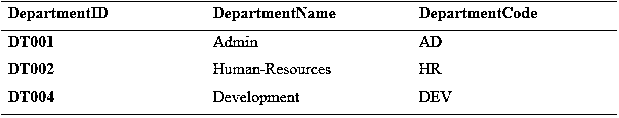
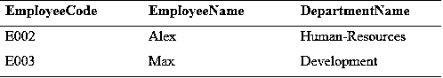

# LINQ 内部连接

> 原文：<https://www.educba.com/linq-inner-join/>


## LINQ 内部连接介绍

LINQ 内部联接只返回两个表中的匹配记录；也就是说，它从两个数据源返回公共数据。不匹配的记录将从结果集中删除。换句话说，假设我们使用它有两个数据源；我们可以只检索存在于剩余的两个数据源中的公共记录，并将它们从结果集中删除。在 LINQ 查询中，使用“join”关键字执行内部连接。

**语法:**

<small>网页开发、编程语言、软件测试&其他</small>

**SQL 内部连接语法**

```
Select Column_Names
From table_1
Inner join table_2 on table_1.colomn_name=table_2.column_name;
```

**LINQ 查询语法**

```
Var _query=from emp in db.EmployeeMaster
Join dept in db.DepartmentMaster
On emp.eID equals dept.empID
Select new
{
emp.eID,
emp.eName,
dept.dName
};
```

### 内部联接在 LINQ 是如何工作的？

在 LINQ 查询中，使用“join”关键字执行内部连接。它返回出现在两个或多个表中的匹配记录或模式；其余不匹配的记录或模式将不被考虑，结果集只返回表中匹配的记录。让我们用图表来理解，


让我们看下面这个简单的例子。

**Table _ 1–employee master**




**表 2-部门主管**




**查询示例**

```
Var _query=from emp in db.EmployeeMaster
Join dept in db.DepartmentMaster
On emp. DepartmentID equals dept. DepartmentID
Select new
{
EmployeeCode=emp. EmployeeCode,
EmployeeName=emp. EmployeeName,
DepartmentName=dept. DepartmentName
};
Result
EmployeeCode EmployeeName DepartmentName
E002 Alex Human-Resources
E003 Max Development
```




### 例子

假设我们有两个数据源，EmployeeMaster 和 DepartmentMaster。使用它们，我们可以只检索存在于两者中的公共记录；留下的数据源将从结果集中删除。让我们看看下面的例子，

#### 示例#1

**代码:**

```
using System;
using System.Collections.Generic;
using System.Linq;
using System.Text;
using System.Threading.Tasks;
namespace Console_LinQ
{
//program_1
class Program
{ // Getting Employee details
public class EmployeeDetails
{
public int employeeID
{
get;
set;
}
public string employeeName
{
get;
set;
}
public string employeeQualification
{
get;
set;
}
} // Employee department details
public class DepartmentDetails
{
public int employeeID
{
get;
set;
}
public string employeeDept
{
get;
set;
}
public int employeeSalary
{
get;
set;
}
}
class LinqProgram
{
static public void Main()
{
List<EmployeeDetails> empDetails = new List<EmployeeDetails>() {
new EmployeeDetails() {employeeID = 1000, employeeName = "Henry",
employeeQualification = "MCA"},
new EmployeeDetails() {employeeID = 1005, employeeName = "Remo",
employeeQualification = "B.E"},
new EmployeeDetails() {employeeID = 1001, employeeName = "Smith",
employeeQualification = "MCA"},
new EmployeeDetails() {employeeID = 1007, employeeName = "Rio",
employeeQualification = "B.E"},
new EmployeeDetails() {employeeID = 1003, employeeName = "Jack",
employeeQualification = "M.Sc"},
new EmployeeDetails() {employeeID = 1004, employeeName = "Peter",
employeeQualification = "B.E"},
};
List<DepartmentDetails> deptDetails = new List<DepartmentDetails>() {
new DepartmentDetails() {employeeID = 1000, employeeDept = "Development",
employeeSalary = 60000},
new DepartmentDetails() {employeeID = 1001, employeeDept = "Development",
employeeSalary = 35000},
new DepartmentDetails() {employeeID = 1002, employeeDept = "Admin",
employeeSalary = 45000},
new DepartmentDetails() {employeeID = 1003, employeeDept = "Graphical-Designing",
employeeSalary = 57000},
};
// by using the inner join we can retrieve the Employee Name and their corresponding Salary
var result = from emp in empDetails
join dept in deptDetails
on emp.employeeID equals dept.employeeID
select new
{
Employee_Name = emp.employeeName,
Employee_Salary = dept.employeeSalary
};
// to view the result
Console.WriteLine("\n\nUsing LINQ Inner Join Method ");
Console.WriteLine("----------------------------");
Console.WriteLine("\n Getting the Employee Names With their corresponding Salary \n\n");
Console.WriteLine("\tEmployee Names\t Salary \n");
Console.WriteLine("\t--------------\t ------ \n");
foreach (var data in result)
{
Console.WriteLine("\t {0}\t\t {1}",
data.Employee_Name, data.Employee_Salary);
}
Console.WriteLine("\n\t--------------\t ------ \n");
Console.ReadKey();
}
}
}
}
In the above program, the EmployeeDetails contains the attributes EmployeeID, Name, and Qualification; likewise, DepartmentDetails contains the attributes EmployeeID, Department name, and salary of an employee. The common attribute in both data is EmployeeID, so we can easily retrieve the matching records exits in both tables by using ID attributes; from that EmployeeID, we can use join to retrieve matching records. Let's check the following output,
```

**输出:**


#### 实施例 2

**代码:**

```
using System;
using System.Collections.Generic;
using System.Linq;
using System.Text;
using System.Threading.Tasks;
namespace Console_LinQ
{
//program_1
class Program
{
// Getting Employee details
public class EmployeeDetails
{
public int employeeID
{
get;
set;
}
public string employeeName
{
get;
set;
}
public string employeeQualification
{
get;
set;
}
public int DepartmentID { get; set; }
public static List<EmployeeDetails> Get_Employees()
{
return new List<EmployeeDetails>()
{
new EmployeeDetails() {employeeID = 1000, employeeName = "Henry",DepartmentID=1,
employeeQualification = "MCA"},
new EmployeeDetails() {employeeID = 1005, employeeName = "Remo", DepartmentID=2,
employeeQualification = "B.E"},
new EmployeeDetails() {employeeID = 1001, employeeName = "Smith",DepartmentID=1,
employeeQualification = "MCA"},
new EmployeeDetails() {employeeID = 1007, employeeName = "Rio",DepartmentID=3,
employeeQualification = "B.E"},
new EmployeeDetails() {employeeID = 1003, employeeName = "Jack",DepartmentID=1,
employeeQualification = "M.Sc"},
new EmployeeDetails() {employeeID = 1004, employeeName = "Peter",DepartmentID=3,
employeeQualification = "B.E"},
};
}
}
// Employee department details
public class DepartmentDetails
{
public int deptID
{
get;
set;
}
public string deptName
{
get;
set;
}
public static List<DepartmentDetails> Get_Departments()
{
return new List<DepartmentDetails>(){
new DepartmentDetails { deptID = 1, deptName = "IT"},
new DepartmentDetails { deptID = 2, deptName = "Human-Resources"},
new DepartmentDetails { deptID = 3, deptName = "Designing"},
};
}
}
class LinqProgram
{
static public void Main()
{
//using Linq query to get the matching records with the help of ID- attribute, with the common attribute we can easily retrieve the data
var result1 = from e in EmployeeDetails.Get_Employees()
join d in DepartmentDetails.Get_Departments()
on e.DepartmentID equals d.deptID
select new
{
EmployeeName = e.employeeName,
DepartmentName = d.deptName
};
Console.WriteLine("\n\nLINQ Query - Inner Join Method ");
Console.WriteLine("------------------------------");
Console.WriteLine("\n\tEmployee Names\t Departments \n");
Console.WriteLine("\t--------------\t ----------- \n");
foreach (var employee in result1)
{
Console.WriteLine("\t\t"+employee.EmployeeName + "\t" +
employee.DepartmentName);
}
Console.ReadLine();
}
}
}
}
```

**输出:**


### 结论

希望这篇文章能帮助你很好的理解。它解释了基本的功能，比如如何使用连接，以及获取数据源中存在的匹配记录的流程的工作流，并提供了几个示例。

### 推荐文章

这是一个 LINQ 内部连接的指南。在这里，我们讨论介绍，语法，以及它如何工作的例子和代码实现。您也可以看看以下文章，了解更多信息–

1.  什么是 LINQ？
2.  [SQL 中的连接查询](https://www.educba.com/join-query-in-sql/)
3.  [MongoDB 加入](https://www.educba.com/mongodb-join/)
4.  [MySQL 交叉连接](https://www.educba.com/mysql-cross-join/)


