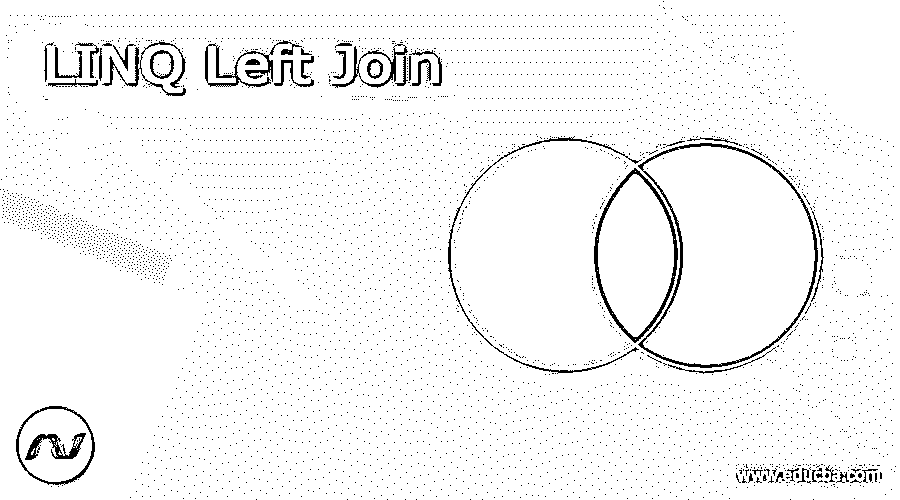
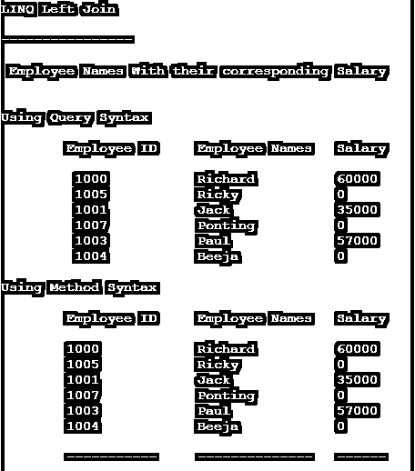

# LINQ 左连接

> 原文：<https://www.educba.com/linq-left-join/>




## LINQ 左连接简介

LINQ 左连接用于返回左侧数据源的所有记录和右侧数据源的匹配记录。如果右表与左表的关系中没有匹配的列，它将返回空值。我们也可以称左连接为左外连接。要实现左连接，必须使用“INTO”关键字和方法“DefaultEmpty()”

**语法:**

<small>网页开发、编程语言、软件测试&其他</small>

让我们看看下面的语法，使用 Left Join 从左侧数据源获取记录，从右侧数据源获取匹配记录，

```
from emp in Employee.GetEmployees()
join addr in Address.GetAddress()
on emp.Address_ID equals addr.ID
into EmployeeAddressList
from address in EmployeeAddressList.DefaultEmpty()
select new {emp,address};
```

### 左加入在 LINQ 是如何运作的？

Left Outer Join 返回左表中的所有记录，从右表中，它只返回匹配的记录。如果右表与左表的关系中没有匹配的列，它将返回空值。
对于查询语法，我们需要对每个序列调用方法 DefaultIfEmpty()来获取匹配的记录；请参见下面的查询语法代码。

```
var query_result = from emp in empDetails
join dept in deptDetails
on emp.employeeID equals dept.employeeID
into data_A
from data_B in data_A.DefaultIfEmpty(new DepartmentDetails())
select new
{
Employee_ID=emp.employeeID,
Employee_Name = emp.employeeName,
Employee_Salary = data_B.employeeSalary
};
```

为了使用 method-syntax 实现左连接，我们需要使用 GroupJoin()以及方法 DefaultIfEmpty()和 SelectMany()，请参见下面的 method-syntax 代码。

```
var method_result = empDetails.GroupJoin(deptDetails,
emp => emp.employeeID,
dept => dept.employeeID,
(emp, dept) => new { emp, dept })
.SelectMany(x => x.dept.DefaultIfEmpty(),(employee, department) => new
{
EmployeeID=employee.emp.employeeID,
EmployeeName = employee.emp.employeeName,
EmployeeSalary = department == null ? 0: department.employeeSalary
}
);
```

### 例子

为了使用查询语法实现左外连接，我们需要调用方法 DefaultEmpty()。让我们看看下面在 LINQ 使用左连接的实现。

#### 示例#1

**代码:**

```
using System;
using System.Collections.Generic;
using System. Linq;
using System. Text;
using System.Threading.Tasks;
namespace Console_Joins
{
class Program_LeftJoin
{
public class BookClass
{
public int Book_ID { get; set; }
public string Book_Name { get; set; }
}
public class OrderClass
{
public int Order_ID { get; set; }
public int Order_BookID { get; set; }
public string Order_PayMode { get; set; }
}
static void Main(string[] args)
{
List<BookClass> BooksList = new List<BookClass>
{
new BookClass{Book_ID=1001, Book_Name="Think and Grow Rich"},
new BookClass{Book_ID=1002, Book_Name="Awaken Giant Within"},
new BookClass{Book_ID=1003, Book_Name="As a Man Thinketh"},
new BookClass{Book_ID=1004, Book_Name="Greatest Salesman"},
new BookClass{Book_ID=1005, Book_Name="Positive Thinking"}
};
List<OrderClass> BooksOrderList = new List<OrderClass>
{
new OrderClass{Order_ID=101, Order_BookID=1001, Order_PayMode="Credit-Card"},
new OrderClass{Order_ID=102, Order_BookID=1005, Order_PayMode="Net-Banking"},
new OrderClass{Order_ID=103, Order_BookID=1001, Order_PayMode="Cheque"},
new OrderClass{Order_ID=104, Order_BookID=1003, Order_PayMode="Cash"},
new OrderClass{Order_ID=105, Order_BookID=1005, Order_PayMode="Credit-Card"},
new OrderClass{Order_ID=106, Order_BookID=1004, Order_PayMode="Net-Banking"}
};
var Order_Books = from book in BooksList
join orders in BooksOrderList
on book.Book_ID equals orders.Order_BookID
into data_A
from data_B in data_A.DefaultIfEmpty(new OrderClass())
select new
{
book.Book_ID,
B_Name = book.Book_Name,
data_B.Order_PayMode
};
Console.WriteLine("LINQ LEFT-JOIN\n");
Console.WriteLine("--------------\n");
Console.WriteLine("BOOK_ID \tBOOK_NAME \t PAYMENT_MODE\n");
Console.WriteLine("------- \t---------- \t ------------\n");
foreach (var item in Order_Books)
{
Console.WriteLine(item.Book_ID + "\t | " + item.B_Name+ "\t | " + item.Order_PayMode +"\t\n");
}
Console.ReadLine();
}
}
}
```

**输出:**


#### 实施例 2

**代码:**

这个程序用语法方法和查询描述了左连接；为了使用查询语法实现左外连接，我们需要调用方法 DefaultEmpty()来获得组连接的结果。

在这个程序中，对于查询语法，我们需要对每个系列调用方法 DefaultIfEmpty()来获取匹配的记录。对于方法语法，我们需要使用 GroupJoin()以及方法 DefaultIfEmpty()和 SelectMany()。让我们看看下面的实现，它包括查询和方法语法，

```
using System;
using System.Collections.Generic;
using System. Linq;
using System. Text;
using System.Threading.Tasks;
namespace Console_LinQ
{
//program_2
class Program
{ // Getting Employee details
public class EmployeeDetails
{
public int employeeID
{
get;
set;
}
public string employeeName
{
get;
set;
}
public string employeeQualification
{
get;
set;
}
} // Employee department details
public class DepartmentDetails
{
public int employeeID
{ get; set; }
public string employeeDept
{ get; set; }
public int employeeSalary
{ get; set; }
}
class LinqProgram
{
static public void Main()
{
List<EmployeeDetails> empDetails = new List<EmployeeDetails>() {
new EmployeeDetails() {employeeID = 1000, employeeName = "Richard",
employeeQualification = "MCA"},
new EmployeeDetails() {employeeID = 1005, employeeName = "Ricky",
employeeQualification = "B.E"},
new EmployeeDetails() {employeeID = 1001, employeeName = "Jack",
employeeQualification = "MCA"},
new EmployeeDetails() {employeeID = 1007, employeeName = "Ponting",
employeeQualification = "B.E"},
new EmployeeDetails() {employeeID = 1003, employeeName = "Paul",
employeeQualification = "M.Sc"},
new EmployeeDetails() {employeeID = 1004, employeeName = "Beeja",
employeeQualification = "B.E"},
};
List<DepartmentDetails> deptDetails = new List<DepartmentDetails>() {
new DepartmentDetails() {employeeID = 1000, employeeDept = "Development",
employeeSalary = 60000},
new DepartmentDetails() {employeeID = 1001, employeeDept = "Development", employeeSalary = 35000},
new DepartmentDetails() {employeeID = 1002, employeeDept = "Admin", employeeSalary = 45000},
new DepartmentDetails() {employeeID = 1003, employeeDept = "Graphical-Designing", employeeSalary = 57000},
};
//use of the left join to retrieve the Employee Name and their corresponding Salary, Employee_ID
//LINQ-Left Outer Join - using Query Syntax
var query_result = from emp in empDetails
join dept in deptDetails
on emp.employeeID equals dept.employeeID
into data_A
from data_B in data_A.DefaultIfEmpty(new DepartmentDetails())
select new
{
Employee_ID=emp.employeeID,
Employee_Name = emp.employeeName,
Employee_Salary = data_B.employeeSalary
};
// LINQ-Left Outer Join - using Method Syntax
var method_result = empDetails
.GroupJoin(
deptDetails,
emp => emp.employeeID,
dept => dept.employeeID,
(emp, dept) => new { emp, dept }
)
.SelectMany(
x => x.dept.DefaultIfEmpty(),
(employee, department) => new
{
EmployeeID=employee.emp.employeeID,
EmployeeName = employee.emp.employeeName,
EmployeeSalary = department == null ? 0 : department.employeeSalary
}
);
// displaying the result
Console.WriteLine("\n\nLINQ Left Join");
Console.WriteLine("\n----------------");
Console.WriteLine("\n Employee Names With their corresponding Salary\n");
Console.WriteLine("\nUsing Query Syntax\n");
Console.WriteLine("\tEmployee ID\tEmployee Names\t Salary \n");
foreach (var data in query_result)
{
Console.WriteLine("\t {0}\t\t{1}\t\t {2}",
data.Employee_ID,data.Employee_Name,data.Employee_Salary);
}
Console.WriteLine("\nUsing Method Syntax\n");
Console.WriteLine("\tEmployee ID\tEmployee Names\t Salary \n");
foreach (var dataVal in method_result)
{
Console.WriteLine("\t{0}\t\t{1}\t\t {2}",
dataVal.EmployeeID,dataVal.EmployeeName,dataVal.EmployeeSalary);
}
Console.WriteLine("\n\t-----------\t--------------\t ------ \n");
Console.ReadLine();
}
}
}
}
```

**输出:**




### 结论

我希望这篇文章有助于以编程方式实现上述示例。在本文中，我解释了如何使用查询语法和方法语法实现 LINQ 左连接。

### 推荐文章

这是一份 LINQ 左加盟指南。在这里，我们讨论了 LINQ 中左连接的介绍、语法、工作原理，以及示例和代码实现。你也可以看看下面的文章来了解更多。

1.  [LINQ 内部加入](https://www.educba.com/linq-inner-join/)
2.  什么是 LINQ？
3.  [Teradata 加入](https://www.educba.com/teradata-joins/)
4.  [PowerShell 加入](https://www.educba.com/powershell-join/)


