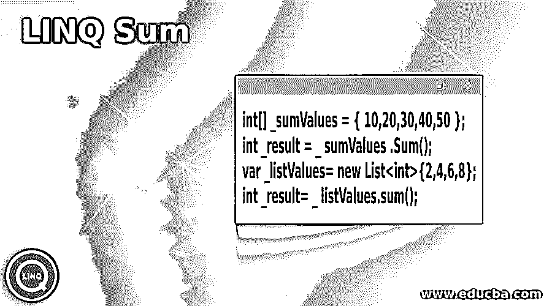
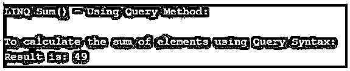
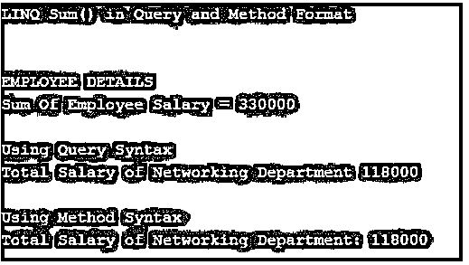

# LINQ 总和

> 原文：<https://www.educba.com/linq-sum/>




## LINQ Sum 简介

LINQ 和是聚合函数下的一种方法；此方法用于计算集合或列表中存在的数值的总和或总数。这个查询语法支持 VB.Net，在 C#中，它在可查询类和可枚举类中可用。可枚举的扩展方法。Sum 来自命名空间 System.Linq。它的返回值是集合或列表中数值的总和。它适用于 int、decimal、double、float、nullable 和 non-nullable 值。

**语法:**

<small>网页开发、编程语言、软件测试&其他</small>

下面给出了提到的语法:

```
int[] _sumValues = { 10,20,30,40,50 };
int _result = _ sumValues .Sum();
var _listValues= new List<int>{2,4,6,8};
int _result= _ listValues.sum();
```

### LINQ 的夏天是怎样的？

sum()方法是 Enumerable 的扩展。Sum 包含在命名空间 System.Linq 中。sum()函数计算列表或集合中出现的项目的总和，并返回数值的总和作为结果。它适用于 int、decimal、double、float、nullable 和 non-nullable 值。

让我们用几个例子来看看工作流程。

首先，我们从整数开始，从整数列表中获取值的总和。

```
var _numValues = new List<int> {2,3,4,5};
int _result = _ numValues.Sum(); // Output – 14
```

接下来，我们继续处理十进制数，从十进制数列表中获取值的总和。

```
var _numValues = new List<decimal> {3.1m, 3.2m, 4.1m, 5.3m};
int _result = _ numValues.Sum(); // Output – 15.7
```

让我们看看方法中的空集合，调用空集合上的 sum，返回 0。

```
var _numValues = new List<int> (); // empty list
int _result = _ numValues.Sum(); // Output – 0
```

如果集合中存在可空整数，那么预期的结果是什么，让我们看看可空整数列表中的值的总和。

```
var _numValues = new List<int> {4, 7, null, 3};
int _result = _ numValues.Sum(); // Output – 14
```

通过使用 LINQ 查询表达式，我们得到集合中数值的总和。

```
var listV = new List<int> {4, 4, 2, 4, 2, 4};
int _result = (from i in listV select i) .Sum(); // Output – 20
```

### LINQ 和的例子

下面是提到的例子:

sum()方法是 Enumerable 的扩展。Sum 包含在命名空间 System.Linq 中。sum()函数计算列表或集合中出现的项目的总和，并返回数值的总和作为结果。

#### 示例#1

**代码:**

```
using System;
using System. Linq;
namespace Example_1
{
class Program_A
{
static void Main(string[] args)
{
int[] _numValues = { 5, 10, 15, 20, 25 };
Console.WriteLine("LINQ Sum() Method:\n");
int _result = _numValues.Sum(); //_numValues.Sum() is used to add the values
Console.WriteLine("To calculating the sum of elements in the list:");
Console.WriteLine("Sum is {0}", _result);
Console.ReadLine();
}
}
}
```

**说明:**

*   上面的程序解释了 sum 函数是用来计算列表“numValues”中元素的总和的。

**输出:**


#### 实施例 2

**代码:**

```
using System;
using System. Linq;
namespace Example_2
{
class Program_B
{
static void Main(string[] args)
{
int[] _numValues = { 15, 10, 8, 9, 7 };
Console.WriteLine("LINQ Sum() - Using Query Method:\n");
//by using Query method
int _query = (from num in _numValues
select num).Sum();
Console.WriteLine("To calculate the sum of elements using Query Syntax:");
Console.WriteLine("Result is: " + _query);
Console.ReadLine();
}
}
}
```

**输出:**




#### 实施例 3

在下面的程序中，该方法是以查询和方法两种格式应用的，这用雇员的详细信息来解释；sum()用于使用这两种格式计算雇员的工资。

**代码:**

```
using System;
using System.Linq;
using System.Collections.Generic;
namespace LINQDemo
{
public class Employee
{
public int empID_ { get; set; }
public string Employee_Name { get; set; }
public int Employee_Salary { get; set; }
public string Employee_Department { get; set; }
public static List<Employee> EmployeeDetails()
{
List<Employee> listStudents = new List<Employee>()
{
new Employee{ empID_ = 1001,Employee_Name = "Smith", Employee_Salary = 25000, Employee_Department = "Networking"},
new Employee{ empID_ = 1002,Employee_Name = "Prem", Employee_Salary = 35000, Employee_Department = " Designing "},
new Employee{ empID_= 1003,Employee_Name = "Peter", Employee_Salary = 50000, Employee_Department = " Designing "},
new Employee{ empID_ = 1004,Employee_Name = "Rock", Employee_Salary = 20000, Employee_Department = " Networking "},
new Employee{ empID_ = 1005,Employee_Name = "Ajmal", Employee_Salary = 35000, Employee_Department = " Networking "},
new Employee{ empID_ = 1006,Employee_Name = "Sijae", Employee_Salary = 25000, Employee_Department = " Networking "},
new Employee{ empID_ = 1007,Employee_Name = "Shasha", Employee_Salary = 38000, Employee_Department = " Networking "},
new Employee{ empID_ = 1008,Employee_Name = "James", Employee_Salary = 18000, Employee_Department = "Designing"},
new Employee{ empID_= 1009,Employee_Name = "Prethiv", Employee_Salary = 52000, Employee_Department = " Designing "},
new Employee{ empID_ = 1010,Employee_Name = "Angath", Employee_Salary = 32000, Employee_Department = " Designing "}
};
return listStudents;
}
static void Main(string[] args)
{
var totalSalary_method = Employee.EmployeeDetails()
.Sum(emp => emp.Employee_Salary );
var totalSalary_query = (from emp in Employee.EmployeeDetails()
select emp).Sum(e => e.Employee_Salary );
Console.WriteLine("\nLINQ Sum() in Query and Method Format\n");
Console.WriteLine("\nEMPLOYEE DETAILS");
Console.WriteLine("Sum Of Employee Salary = " + totalSalary_method);
//Using Method Syntax
var total_Salary = Employee.EmployeeDetails()
.Where(emp => emp.Employee_Department == " Networking ")
.Sum(emp => emp.Employee_Salary );
//Using Query Syntax
var _totalSalary_QS = (from emp in Employee.EmployeeDetails()
where emp.Employee_Department == " Networking "
select emp).Sum(e => e.Employee_Salary );
Console.WriteLine("\nUsing Query Syntax");
Console.WriteLine("Total Salary of Networking Department " + _totalSalary_QS);
var _totalSalary_MS = Employee.EmployeeDetails()
.Where(emp => emp.Employee_Department == " Networking ")
.Sum(emp => emp.Employee_Salary ); //method format
var totalSalary_res = (from emp in Employee.EmployeeDetails()
where emp.Employee_Department == " Networking "
select emp).Sum(e => e.Employee_Salary ); //query format
Console.WriteLine("\nUsing Method Syntax");
Console.WriteLine("Total Salary of Networking Department: " + _totalSalary_MS);
Console.ReadKey();
}
}
}
```

**输出:**




### 结论

在本文中，我们看到了一个名为 LINQ 求和()的聚合函数，它以查询和方法两种格式进行了编程解释；通过使用方法，我们可以很容易地返回集合或列表中数值的总和。

### 推荐文章

这是 LINQ 夏季旅游指南。为了更好地理解，我们在这里讨论介绍、sum 的工作原理和例子。您也可以看看以下文章，了解更多信息–

1.  [C#引用](https://www.educba.com/c-sharp-references/)
2.  [C#动作委托](https://www.educba.com/c-sharp-action-delegate/)
3.  [C#随机](https://www.educba.com/c-sharp-random/)
4.  [C#等待异步](https://www.educba.com/c-sharp-await-async/)


