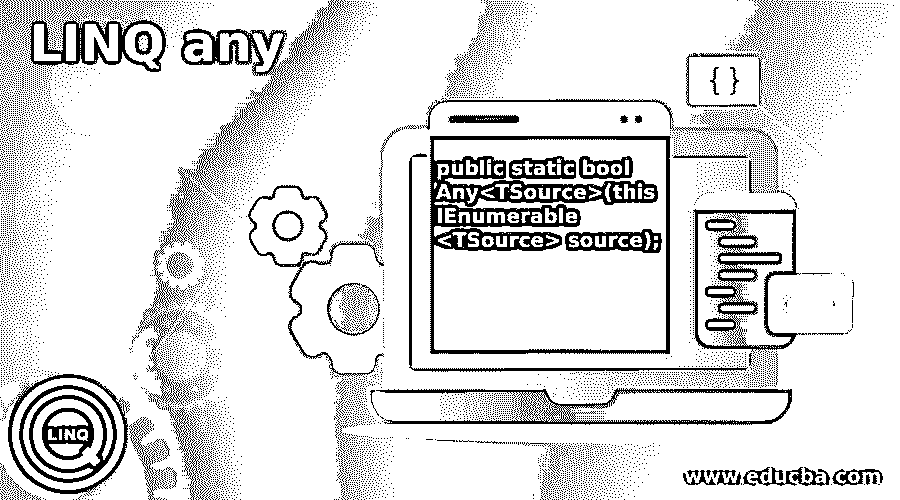

# LINQ 任何

> 原文：<https://www.educba.com/linq-any/>




## LINQ 简介

LINQ any 用于检查给定条件是否满足元素序列。Any 方法返回布尔值作为结果，它来自系统。LINQ。可查询类。如果有任何元素满足条件，则返回 true，否则返回 false。LINQ ANY 是 LINQ 查询运算符中的量词运算符。此运算符仅在方法语法中可用，它不支持查询语法。LINQ ANY 的主要目的是检查集合中的任何单个元素是否满足我们的条件。

**语法**

<small>网页开发、编程语言、软件测试&其他</small>

LINQ Any 有两种格式，如下所示，让我们看看下面的语法，

```
public static bool Any<TSource>(this IEnumerable<TSource> source);
```

这是第一个采用零参数的重载方法，仅用于检查序列是否包含集合中的任何项，取决于它是否返回一个 bool 值作为结果。

```
public static bool Any<TSource>(this IEnumerable<TSource> source, Func<TSource, bool> predicate);
```

这是第二个重载方法，它将谓词方法作为参数，用于检查集合中的任何单个元素是否满足给定的条件。

### 在 LINQ 是如何工作的？

在 LINQ 中，任何操作符最重要的事情是确定或检查集合中的任何单个元素是否满足我们的条件。该运算符只提供方法语法，它不支持查询语法。它返回一个布尔值作为结果，如果它满足条件，它返回真，一旦条件失败，它返回假。Linq Any 有两种格式，下面我们来看看

*   首先，它检查集合是否为空。
*   其次，它检查集合中的任何单个元素是否满足我们给定的条件。

#### 第一个重载方法

这是第一个采用零参数的重载方法，仅用于检查集合中是否包含序列中的任何项。在第一个方法中，我们解释了产品中的项目集合，以检查该集合是否包含任何项目？让我们看看下面的例子，

```
List<ProductMaster> productList=new List<ProductMaster>();
If(productList.Any())
{
Console.WriteLine("Product List has items present in it");
}
Else
{
Console.WriteLine("Empty Product List");
}
```

它显示空的产品列表作为输出，它返回布尔值，因此，请参见下面的代码以仅显示布尔结果，

```
Var _result= productList.Any(); //no items
Console.WriteLine(_result);
```

这里它根据结果返回真或假。产品列表不包含任何项目，因此它返回 **false** 作为结果。

#### 第二个重载方法

在第二个重载方法中，列表包含产品详细信息，以检查是否有任何产品成本的金额小于 500？我们必须检查列表中的任何产品是否包含小于 500 的金额，我们不需要在列表中显示任何名称，只需检查条件并返回布尔值作为结果，让我们看看下面的代码:

```
List<Student> students = new List<Student>();
IList<ProductClass> productList = new List<ProductClass>();
productList.Add(new ProductClass { pName = "Speakers", pCost = 2880 });
productList.Add(new ProductClass { pName = "Disk-Drive", pCost = 4000 });
productList.Add(new ProductClass { pName = "KeyBoard", pCost = 1540 });
productList.Add(new ProductClass { pName = "Processor", pCost = 7590 }); productList.Add(new ProductClass { pName = "Monitor", pCost = 3250 });
productList.Add(new ProductClass { pName = "Pendrive", pCost = 475 });
if (productList.Any(p => p. pCost < 500))
{
Console.WriteLine("Products contains amount less that 500");
}
else
{
Console.WriteLine("No less amount products present in the list");
}
```

它的列表包含的产品成本小于 500，因此它显示“产品包含的金额小于 500”作为输出，它返回布尔值，因此，请参见下面的代码以仅显示布尔结果，

```
Var _result= productList.Any(p => p. pCost < 500); // condition satisfies Console.WriteLine(_result); // returns true
```

这里它根据结果返回真或假。产品列表包含小于 500 的产品成本，因此结果返回 true。

### 例子

LINQ Any 用于检查给定条件是否满足元素序列。此运算符仅在方法语法中可用，它不支持查询语法。让我们以编程的方式来看这个例子，

**代码:**

```
using System;
using System.Collections.Generic;
using System.Linq;
using System.Text;
using System.Threading.Tasks;
namespace Console_LINQAny
{
class ProductDetails
{
public int pID { get; set; }
public string pName { get; set; }
public int pCost { get; set; }
}
class CustomerDetails
{
public string cName { get; set; }
public string cMobile { get; set; }
public int totalProduct { get; set; }
public int totalCost { get; set; }
}
class Program
{
static void Main(string[] args)
{
// Creating the product details List
IList<ProductDetails> productList = new List<ProductDetails>();
productList.Add(new ProductDetails { pName = "Speakers", pCost = 2880 });
productList.Add(new ProductDetails { pName = "Graphics-Card", pCost = 3000 });
productList.Add(new ProductDetails { pName = "Disk-Drive", pCost = 4000 });
productList.Add(new ProductDetails { pName = "KeyBoard", pCost = 1540 });
productList.Add(new ProductDetails { pName = "Processor", pCost = 7590 });
productList.Add(new ProductDetails { pName = "Monitor", pCost = 3250 });
productList.Add(new ProductDetails { pName = "Pendrive", pCost = 475 });
productList.Add(new ProductDetails { pName = "Pendrive", pCost = 650 });
productList.Add(new ProductDetails { pName = "Pendrive", pCost = 870 });
productList.Add(new ProductDetails { pName = "Desktop-Table", pCost = 1350 });
//customer-product details list
IList<CustomerDetails> customerList = new List<CustomerDetails>();
customerList.Add(new CustomerDetails { cName = "Mithran", cMobile = "9898880901", totalProduct = 3, totalCost = 9880 });
customerList.Add(new CustomerDetails { cName = "Peter", cMobile = "900783221", totalProduct = 2, totalCost = 2190 });
customerList.Add(new CustomerDetails { cName = "Prem", cMobile = "9905003421", totalProduct = 1, totalCost = 4000 });
customerList.Add(new CustomerDetails { cName = "Jhon", cMobile = "8900211056", totalProduct = 4, totalCost = 6120 });
//Using Method Syntax
bool result_any = customerList.Any(c => c.totalCost > 5000);
Console.WriteLine("\n\tUsing LINQ - ANY \n");
Console.WriteLine(result_any);
Console.ReadKey();
}
}
}
```

**输出:**


### 推荐文章

这是一本 LINQ 导游手册。在这里，我们讨论了需要一个 LINQ 任何运营商与例子，通过使用这个运营商，我们可以检查我们的条件很容易。您也可以看看以下文章，了解更多信息–

1.  [LINQ 截然不同](https://www.educba.com/linq-distinct/)
2.  什么是 LINQ？
3.  [LINQ 除外](https://www.educba.com/linq-except/)
4.  [LINQ 内部加入](https://www.educba.com/linq-inner-join/)


