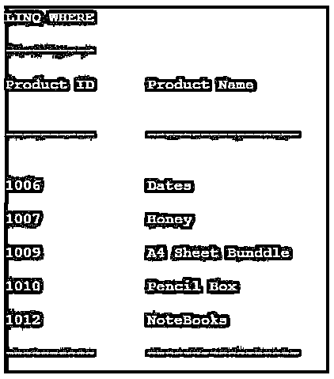

# LINQ 哪里

> 原文：<https://www.educba.com/linq-where/>


## LINQ 介绍在哪里

LINQ，其中是 LINQ 扩展方法，用于根据给定条件过滤元素集合。条件可以是精确的 Func 委托类型或 lambda 表达式。这将适用于方法语法以及查询语法。在一个查询中，我们可以使用多个 where 扩展方法。

### LINQ Where 的语法

下面给出了 Where 子句的语法。

<small>网页开发、编程语言、软件测试&其他</small>

```
public static IEnumerable<TSource> Where<TSource>(this IEnumerable<TSource> source, Func<TSource, bool> predicate);
```

```
public static IEnumerable<TSource> Where<TSource>(this IEnumerable<TSource> source, Func<TSource, int, bool> predicate);
```

这两个方法都允许 Func 委托类型参数。第一种方法需要 Func <tsource bool="">作为输入参数，第二种方法需要 Func <tsource int="" bool="">作为输入参数，这里 int 描述了索引值。</tsource></tsource>

**举例:**

**代码:**

```
var _methodSyntax = employeeList.Where(emp => emp.empAge > 25);
var _querySyntax = from s in employeeList
where emp.empAge > 25
select emp.empName;
```

### 在 LINQ 哪里工作怎么样？

LINQ 的主要用途是根据条件过滤元素。它属于过滤运算符类别。它适用于方法和查询语法，而方法语法需要 lambda 表达式，而查询语法只需要表达式。LINQ，用于限制 select、update、delete 语句中的记录数。

下面给出了几个 LINQ 的例子，其中代码集合中的元素列表。

#### 1.具有单一条件的字符串序列

```
var _courseName=new List<string>() {"C","C++","DotNet", "Java","Android"};
```

在 Lambda 表达式中，我们得到了以字母“C”开头的课程名称的结果。

```
Var result=_courseName.where(c=>c.StartsWith("C"));
```

在查询表达式中，与上述标准相同。

```
Var result=from c in _CourseName
where c.StartsWith("C")
select c;
```

我们可以通过使用 foreach 列出项目来显示结果，输出将是 C 和 C++。

```
foreach(var items in result)
console.WriteLine(item);
```

#### 2.具有多个条件的字符串序列

```
var _courseName=new List<string>() {"C","C++","DotNet", "Java","Android"};
```

在这个集合中，它根据给定的多个标准检索项目，检查超过 3 个字符的字符长度，还检查不应该以“J”开头的首字母。

在 Lambda 表达式中，我们得到的课程名称的条件是首字母不是以“J”开头，并且字符串的长度应该大于 3。

```
Var result=_courseName.where(c=>c.Length>3 && !c.StartsWith("J"));
```

在查询表达式中，与上述标准相同。

```
Var result=from c in _CourseName
where c.Length >3 && !c.StartsWith("J")
select c;
```

我们可以通过使用 foreach 列出项目来显示结果，输出将是“DotNet”，“Android”。

```
foreach(var items in result)
console.WriteLine(item);
```

#### 3.具有单一条件的对象序列

基于单个 where 条件检索记录的 Employee 类。

```
public class EmployeeClass
{
public int emp_id { get; set; }
public string emp_name { get; set; }
public int emp_salary { get; set; }
}
List<EmployeeClass> employeeList = new List<EmployeeClass>()
{
new EmployeeClass() { emp _id = 1001, emp _name = "Smith", emp _salary = 30000},
new EmployeeClass() { emp _id = 1002, emp _name = "Sasha", emp _salary = 27000},
new EmployeeClass() { emp _id = 1003, emp _name = "Ricky", emp _salary = 55000},
new EmployeeClass() { emp _id = 1004, emp _name = "Peter", emp _salary = 95000}
};
```

在 Lambda 表达式中，我们得到 employeeList 的结果，条件是雇员薪金大于 50000。

```
Var result= employeeList.where(emp=>emp.emp_salary>50000);
```

在查询表达式中，与上述标准相同。

```
Var result=from emp in employeeList
where emp.emp_salary >50000
select emp;
```

我们可以通过使用 foreach 列出项目来显示结果；输出将是“里基”、“彼得”。

```
foreach(var items in result)
console.WriteLine(item. emp _name);
```

#### 4.具有多个 where 的数字序列

在此示例中，列出了 Employee 类以使用多个 where 条件检索记录。

**举例:**

```
List<EmployeeClass> employeeList = new List<EmployeeClass>()
{
new EmployeeClass() { emp _id = 1001, emp _name = "Smith", emp _salary = 30000},
new EmployeeClass() { emp _id = 1002, emp _name = "Sasha", emp _salary = 27000},
new EmployeeClass() { emp _id = 1003, emp _name = "Ricky", emp _salary = 42000},
new EmployeeClass() { emp _id = 1004, emp _name = "Peter", emp _salary = 95000}
};
```

在 Lambda 表达式中，我们获得了雇员姓名的结果，条件是首字母以“S”开头，并且雇员薪金必须小于 50000。

```
Var result= employeeList.where(e=>e. emp _salary <50000).where(e=>e.StartsWith("S"));
```

在查询表达式中，与上述标准相同。

```
Var result=from e in employeeList
where e.emp_salary<50000
where e.emp_name.StartsWith("S")
select e;
```

我们可以通过使用 foreach 列出项目来显示结果，输出将是“Smith”、“Sasha”。

```
foreach(var items in result)
console.WriteLine(item.emp_name);
```

### LINQ 的例子

下面是提到的例子:

**代码:**

```
using System;
using System.Collections.Generic;
using System.Linq;
using System.Text;
using System.Threading.Tasks;
namespace Console_LINQWhere
{
class ProductClass
{
public int P_ID {get; set;}
public string P_Category { get; set; }
public string P_Name { get; set; }
public int P_Cost { get; set; }
}
class Program
{
static void Main(string[] args)
{
// Creating the product details List
IList<ProductClass> P_List = new List<ProductClass>();
P_List.Add(new ProductClass { P_ID = 1005, P_Category = "Snacks", P_Name = "Biscuits", P_Cost = 20 });
P_List.Add(new ProductClass { P_ID = 1006, P_Category = "Snacks", P_Name = "Dates", P_Cost = 60});
P_List.Add(new ProductClass { P_ID = 1007, P_Category = "Snacks", P_Name = "Honey", P_Cost = 110 });
P_List.Add(new ProductClass { P_ID = 1008, P_Category = "Snacks", P_Name = "Chips", P_Cost = 35 });
P_List.Add(new ProductClass { P_ID = 1009, P_Category = "Stationery", P_Name = "A4 Sheet Bunddle", P_Cost = 100 });
P_List.Add(new ProductClass { P_ID = 1010, P_Category = "Stationery", P_Name = "Pencil Box", P_Cost = 52});
P_List.Add(new ProductClass { P_ID = 1011, P_Category = "Stationery", P_Name = "Ink-Bottle", P_Cost = 45 });
P_List.Add(new ProductClass { P_ID = 1012, P_Category = "Stationery", P_Name = "NoteBooks", P_Cost = 75 });
var result_where = P_List.Where(p=>p.P_Category.StartsWith("S")).Where(p => p.P_Cost > 50);
Console.WriteLine("\nLINQ WHERE");
Console.WriteLine("\n----------");
Console.WriteLine("\nProduct ID\tProduct Name \n");
Console.WriteLine("\n----------\t----------------- \n");
foreach (var res in result_where)
{
Console.WriteLine("\n"+res.P_ID+"\t\t"+res.P_Name);
}
Console.WriteLine("\n----------\t-----------------\n");
Console.ReadKey();
}
}
}
```

**输出:**




### 结论

在本文中，我们看到了 LINQ，它用于根据给定的条件检索元素集合。通过使用 where 方法，我们可以基于几个标准轻松地限制记录。

### 推荐文章

这是一份 LINQ 旅游指南。在这里，我们讨论介绍，如何在 LINQ 和例子，以便更好地理解。您也可以看看以下文章，了解更多信息–

1.  [LINQ 内部加入](https://www.educba.com/linq-inner-join/)
2.  [LINQ 左加入](https://www.educba.com/linq-left-join/)
3.  [LINQ 截然不同](https://www.educba.com/linq-distinct/)
4.  [LINQ 包括](https://www.educba.com/linq-include/)


