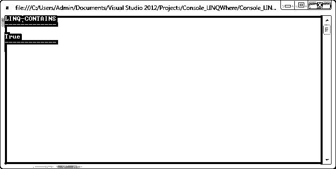

# LINQ 包含

> 原文：<https://www.educba.com/linq-contains/>


## LINQ 简介包含

LINQ 包含运算符用于确定指定的值在元素的集合中是否可用。LINQ 包含运算符属于量词运算符类别，该运算符的主要用途是检查集合中是否存在指定的元素，最后返回布尔值作为结果。查询语法中不支持 LINQ 包含，它仅在方法语法中可用。

**语法:**

<small>网页开发、编程语言、软件测试&其他</small>

让我们来看看 LINQ-Contains 的以下语法，Contains 扩展方法在两个重载方法中可用，

```
public static bool Contains<TSource>(this IEnumerable<TSource> source, TSource value);
```

首先，上面的重载方法只有一个参数，用于检查集合中的元素，

```
public static bool Contains<TSource>(this IEnumerable<TSource> source, TSource value, IEqualityComparer<TSource> comparer);
```

其中，第二个重载方法需要额外的参数，用于包含 IEqualityComparer 的复杂类型比较，以检查复杂类型属性中的任何匹配。

### LINQ 有哪些作品？

LINQ 包含的是量词运算符。在 LINQ 容器中，它还检查数据源，检查列表集合是否包含所需的元素，然后根据结果的预期结果返回 true 或 false。查询语法中不支持 LINQ 包含，它仅在方法语法中可用。在这里，当我们使用复杂类型时，我们使用自定义类来派生包含的 IEqualityOperator，以确保对象在序列/集合中。

让我们来看看 LINQ 的工作流程——包含在两个重载方法中。现在，请看第一个重载方法，如下所示:

```
List<string> userNames=new List<string>();
userNames.Add("Neethu");
userNames.Add("Mithula");
userNames.Add("Naina");
userNames.Add("Neha");
Bool getResult=usernames.Contains("Mithun");
Console.WriteLine(getResult);
```

在上面的代码中，我们检查给定的名字是否出现在列表项、用户名中。包含(" Mithun ")；它检查名称是否包含在其中，并返回布尔结果，给定的用户名出现在列表中，所以它返回结果为“真”。

现在来看第二个重载方法，使用 LINQ-Contains 和 IEqualityComparer，

```
internal class user
{
public int userId { get; set; }
public string userName { get; set; }
public string userMobile { get; set; }
}
internal class UserNameComparer : IEqualityComparer<user>
{
public bool Equals(user x, user y)
{
if (string.Equals(x. userName, y. userName, StringComparison.OrdinalIgnoreCase))
{
return true;
}
return false;
}
public int GetHashCode(user obj)
{
return obj.userName.GetHashCode();
}
}
public class Program
{
public static void Main(string[] args)
{
List<user> userList = new List<user>();
userList.Add(new user { userId = 1001, userName = "Sarav", userMobile = "9004889002" });
userList.Add(new user { userId = 1002, userName = "David", userMobile = "9900887654" });
userList.Add(new user { userId = 1003, userName = "Vicky", userMobile = "9500213461" });
userList.Add(new user { userId = 1004, userName = "Gio", userMobile = "9909983222" });
var getUser = new user { userName = "Sarav" };
var Check_Result = userList.Contains(getUser, new UserNameComparer ());
Console.WriteLine(Check_Result);
}
}
```

在上面的代码中，我们构建了复杂类型的用户列表集合，我们在用户集合中包含了一些用户，以检查特定的用户名是否存在于用户列表的序列中，我们还创建了 UserNameComparer 类，实现了 IEqualityComparer <user>接口。</user>

IEqualityComparer 接口，它包含两个名为 Equals 和 GetHasCode 的方法，这两个方法对于获得准确的结果都非常重要。在 Equals 方法中，我们匹配 username 属性，而在 GetHashCode 方法中，它只返回 name 属性的哈希代码。

```
var getUser = new user { userName = "Sarav" };
var Check_Result = userList.Contains(getUser, new UserNameComparer ());
```

在上面的代码中，我们为用户创建了新的类，并且只加载 name 属性，该属性将 UserNameComparer 传递给 Contains 方法的第二个参数，然后 Contains 运算符使用 UserNameComparer 类的 Equals 和 GetHashCode 来比较 name 属性，以找出确切的用户。它返回 true 作为结果。

### LINQ 的例子包含

在这个示例代码中，我们构建了复杂类型的产品列表，我们包含了许多具有多个属性的产品列表，在这里，我们必须检查产品名称是否存在于集合中，并且我们还创建了类 ProductNameComparer，它实现了 IEqualityComparer <productclass>接口。</productclass>

**代码:**

```
using System;
using System.Collections.Generic;
using System.Linq;
using System.Text;
using System.Threading.Tasks;
namespace Console_LINQContains
{
class ProductClass
{
public int _productID {get; set;}
public string _productCategory { get; set; }
public string _productName { get; set; }
public int _productCost { get; set; }
}
internal class ProductNameComparer : IEqualityComparer<ProductClass>
{
public bool Equals(ProductClass x, ProductClass y)
{
if (string.Equals(x._productName, y._productName, StringComparison.OrdinalIgnoreCase))
{
return true;
}
return false;
}
public int GetHashCode(ProductClass obj)
{
return obj._productName.GetHashCode();
}
}
public class Program
{
static void Main(string[] args)
{
// adding the product details List
IList<ProductClass> _productList = new List<ProductClass>();
_productList.Add(new ProductClass { _productID = 1001, _productCategory = "Electronics", _productName = "Speakers", _productCost = 2880 });
_productList.Add(new ProductClass { _productID = 1002, _productCategory = "Electronics", _productName = "Graphics-Card", _productCost = 3000 });
_productList.Add(new ProductClass { _productID = 1003, _productCategory = "Electronics", _productName = "KeyBoard", _productCost = 1540 });
_productList.Add(new ProductClass { _productID = 1004, _productCategory = "Electronics", _productName = "Pendrive", _productCost = 475 });
_productList.Add(new ProductClass { _productID = 1009, _productCategory = "Stationery", _productName = "A4 Sheet Bunddle", _productCost = 100 });
_productList.Add(new ProductClass { _productID = 1010, _productCategory = "Stationery", _productName = "Pencil Box", _productCost = 52 });
_productList.Add(new ProductClass { _productID = 1011, _productCategory = "Stationery", _productName = "Ink-Bottle", _productCost = 45 });
_productList.Add(new ProductClass { _productID = 1012, _productCategory = "Stationery", _productName = "NoteBooks", _productCost = 75 });
var getProductName = new ProductClass { _productName = "Speakers" };
var containsResult = _productList.Contains(getProductName, new ProductNameComparer());
Console.WriteLine("LINQ-CONTAINS");
Console.WriteLine("-------------\n");
Console.WriteLine(containsResult);
Console.WriteLine("-------------\n");
Console.ReadKey();
}
}
}
```

在这种情况下，我们检查给定的名称是否出现在列表项 _productList 中。包含(getProductName，new product name comparer())；它检查名称是否包含在其中，并返回 booloean 结果，给定的用户名出现在列表中，所以它返回结果为“真”。让我们看看如下输出。

**输出:**




### 结论

文章解释了 LINQ-Contains 的用途，它用于检查特定元素是否存在于集合中；当处理复杂类型时，我们需要实现 IEqualityComparer 接口来检索准确的结果。希望这篇文章有助于你理解 LINQ 的需求——包含编程方面的例子。

### 推荐文章

这是一本 LINQ 导游手册。在这里我们也讨论一下 LINQ 作品的介绍和包含方式？以及一个例子。您也可以看看以下文章，了解更多信息–

1.  [LINQ 聚合](https://www.educba.com/linq-aggregate/)
2.  [LINQ 包括](https://www.educba.com/linq-include/)
3.  [LINQ 左加入](https://www.educba.com/linq-left-join/)
4.  什么是 LINQ？


