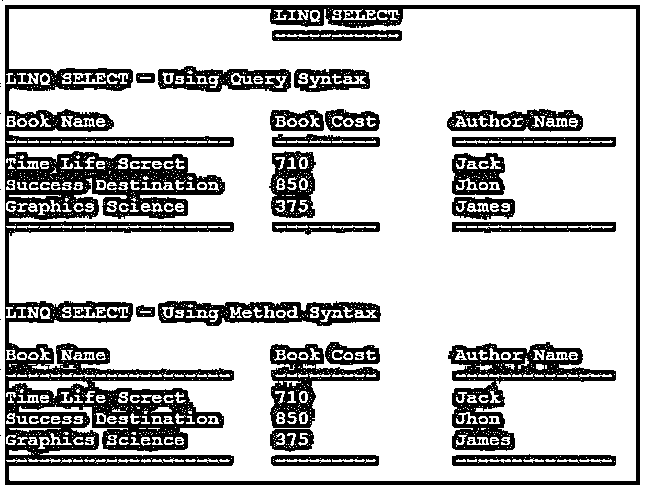

# LINQ 精选

> 原文：<https://www.educba.com/linq-select/>


## LINQ 精选简介

LINQ 选择属于投影操作符，选择操作符用于选择要显示/选择的属性。Select 运算符主要用于检索我们需要显示的所有属性或少数属性。它用于从项目列表或集合中选择一个或多个项目。我们可以使用 LINQ 选择按照我们的要求检索结果。通过使用 Select 操作符，我们可以根据自己的需要调整数据的形状。运算符用于返回项的 IEnumerable 集合，其中包括对方法转换执行的数据。

### LINQ 选择的语法

它用于从项目列表中选择一个或多个项目，或者选择集合中的所有项目。

<small>网页开发、编程语言、软件测试&其他</small>

让我们来看看查询和方法类型的语法，如下所示:

**查询语法:**

```
var varName = from s in ListName
select new { Name = s.name, ClassName= s.class };
```

**方法语法:**

```
var varName = ListName.Select(s => new { Name = s.name ,
ClassName = s.class });
```

这里，我们在两种方法中使用 select 操作符来选择集合的名称和类。

### Select 在 LINQ 是如何运作的？

LINQ 选择运算符用于返回一个 IEnumerable 项集合，包括对该方法的转换执行的数据。通过使用 Select 运算符，我们可以根据自己的需要调整数据的形状。

在其中，我们可以使用两种语法类型；让我们看看每个方法的工作流程。

语句查询语法总是使用 GroupBy 或 Select 子句；有一个返回 Name 的字符串集合的示例代码。

**代码:**

```
IList<CustomerClass> CustomerList= new List<CustomerClass>()
{
new CustomerClass() { Customer_ID = 1001, Customer_Name = "Smith" },
new CustomerClass() { Customer_ID = 1002, Customer_Name = "Mercy" },
new CustomerClass() { Customer_ID = 1003, Customer_Name = "Bridean" },
new CustomerClass() { Customer_ID = 1004, Customer_Name = "Rachel" },
new CustomerClass() { Customer_ID = 1005, Customer_Name = "Don" }
};
var querySyntax = from s in CustomerList
select s.Customer_Name;
```

在上面的代码中，它显示了列表项中所有的客户名称。选择操作符用于按照我们的要求检索数据。select 用于根据我们的要求返回包含属性的项目集合。

**代码:**

```
IList<CustomerClass> CustomerList= new List<CustomerClass>() {
new CustomerClass() { Customer_ID = 1001, Customer_Name = "Smith", CustomerAddress = 13, Sri Colony, Chennai. } ,
new CustomerClass() { Customer_ID = 1002, Customer_Name = "Mercy", CustomerAddress = 21, Spencer Plaza, Chennai } ,
new CustomerClass() { Customer_ID = 1003, Customer_Name = "Bridean", CustomerAddress = 18, Bengaluru } ,
new CustomerClass() { Customer_ID = 1004, Customer_Name = "Rachel" , CustomerAddress = 20, Delhi } ,
new CustomerClass() { Customer_ID = 1005, Customer_Name = "Don" , CustomerAddress = 15, Bengaluru }
};
```

在下面的代码中，我们使用查询语法返回带有客户名称和客户类地址属性的对象集合。

**代码:**

```
Var querySelect = from c in CustomerList
select new { Name = "Mr. " + c.Customer_Name, CustomerAddress = c.CustomerAddress };
```

通过使用 foreach 循环来显示迭代的结果。

**代码:**

```
foreach (var val in selectResult)
Console.WriteLine("Customer Name: {0}, Customer Address: {1}", val.Name, val.CustomerAddress);
```

使用方法语法的选择运算符。

通过使用方法语法，我们也可以检索结果；通过使用 select 操作符，我们可以以我们想要的方式得到结果，因为它塑造了数据。例如，在上面的代码中，我们还可以在方法语法中实现相同的内容，以检索带有客户属性的名称和地址的对象集合。

**代码:**

```
Var selectMethodSyntax = CustomerList.Select(c => new { Name = c.Customer_Name ,
CustomerAddress = c.CustomerAddress });
```

### LINQ 精选的例子

下面提到了不同的例子:

#### 示例#1

**代码:**

```
using System;
using System.Collections.Generic;
using System.Linq;
using System.Text;
using System.Threading.Tasks;
namespace Console_LINQSelect
{
public class Book_Class
{
public int bookID { get; set; }
public string bookName { get; set; }
public string bookAuthorName{get; set;}
public int bookCost { get; set; }
}
class ProgramLINQ_Select
{
static void Main(string[] args)
{
List<Book_Class> bookItems = new List<Book_Class>()
{
new Book_Class(){bookID=1001, bookName="Time Life Screct",bookAuthorName="Jack", bookCost=710},
new Book_Class(){bookID=1002, bookName="Info Tech", bookAuthorName="Brindon", bookCost=545},
new Book_Class(){bookID=1003, bookName="Brilliant", bookAuthorName="Smith", bookCost=680},
new Book_Class(){bookID=1004, bookName="Success Destination", bookAuthorName="Jhon", bookCost=850},
new Book_Class(){bookID=1005, bookName="Graphics Science", bookAuthorName="James", bookCost=375}
};
Console.WriteLine("\t\t\tLINQ SELECT");
Console.WriteLine("\t\t\t-----------\n");
//Query-Syntax
Console.WriteLine("LINQ SELECT - Using Query Syntax");
Console.WriteLine("\nBook Name \t\tBook Cost\tAuthor Name");
Console.WriteLine("--------------------\t---------\t--------------");
var querySelect = from b in bookItems
where b.bookAuthorName.StartsWith("J")
select new { BookName=b.bookName,
BookCost=b.bookCost,
AuthorName=b.bookAuthorName};
foreach (var get_querySelect in querySelect)
{
Console.WriteLine(get_querySelect.BookName + "\t" + get_querySelect.BookCost + "\t\t" + get_querySelect.AuthorName);
}
Console.WriteLine("--------------------\t---------\t--------------\n\n\n");
//Method-Syntax
Console.WriteLine("LINQ SELECT - Using Method Syntax");
var methodSelect = bookItems.Where(s => s.bookAuthorName.StartsWith("J"))
.Select(s => new
{
BookName = s.bookName,
AuthorName = s.bookAuthorName,
BookCost = s.bookCost
});
Console.WriteLine("\nBook Name \t\tBook Cost\tAuthor Name");
Console.WriteLine("--------------------\t---------\t--------------");
foreach (var get_methodSelect in methodSelect)
{
Console.WriteLine(get_methodSelect.BookName + "\t" + get_methodSelect.BookCost + "\t\t" + get_methodSelect.AuthorName);
}
Console.WriteLine("--------------------\t---------\t--------------");
Console.ReadLine();
}
}
}
```

**输出:**




#### 实施例 2

**代码:**

```
using System;
using System.Collections.Generic;
using System.Linq;
using System.Text;
using System.Threading.Tasks;
namespace Console_LINQSelect
{
public class EmployeeClass
{
public int emp_id { get; set; }
public string emp_name { get; set; }
public int emp_salary { get; set; }
}
class ProgramLINQ_Select
{
static void Main(string[] args)
{
List<EmployeeClass> employeeList = new List<EmployeeClass>()
{
new EmployeeClass() { emp_id = 1001, emp_name = "Smith", emp_salary = 30000},
new EmployeeClass() { emp_id = 1002, emp_name = "Sasha", emp_salary = 27000},
new EmployeeClass() { emp_id = 1003, emp_name = "Ricky", emp_salary = 55000},
new EmployeeClass() { emp_id = 1004, emp_name = "Peter", emp_salary = 95000}
};
Console.WriteLine("\t\t\tLINQ SELECT");
Console.WriteLine("\t\t\t-----------\n");
//Query-Syntax
Console.WriteLine("LINQ SELECT - Using Query Syntax");
Console.WriteLine("\nEmployee Name");
Console.WriteLine("---------------");
var result = from emp in employeeList
where emp.emp_salary > 50000
select emp;
foreach(var items in result)
Console.WriteLine(items.emp_name);
Console.WriteLine("---------------\n");
//Method-Syntax
Console.WriteLine("LINQ SELECT - Using Method Syntax");
Console.WriteLine("\nEmployee Name");
Console.WriteLine("---------------");
var methodSelect = employeeList.Where(emp => emp.emp_salary > 50000).Select(emp => new {EmpName=emp.emp_name });
foreach (var items in methodSelect)
Console.WriteLine(items.EmpName);
Console.WriteLine("---------------");
Console.ReadLine();
}
}
}
```

**输出:**


### 结论

在本文中，我们看到了用于投影数据/结果的 LINQ 选择。通过使用 select，我们可以根据自己的需求来调整数据。

### 推荐文章

这是 LINQ 精选指南。在这里，我们讨论介绍，如何选择工程在 LINQ 和例子，以更好地理解。您也可以看看以下文章，了解更多信息–

1.  [LINQ 内部加入](https://www.educba.com/linq-inner-join/)
2.  [LINQ 左加入](https://www.educba.com/linq-left-join/)
3.  [LINQ 截然不同](https://www.educba.com/linq-distinct/)
4.  [LINQ 包括](https://www.educba.com/linq-include/)


