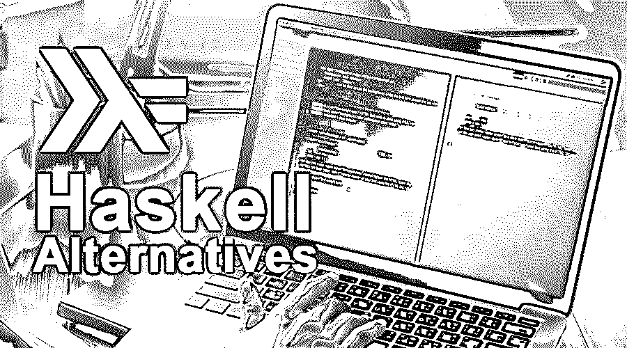

# 哈斯克尔替代方案

> 原文：<https://www.educba.com/haskell-alternatives/>

## Haskell 替代方案介绍

Haskell 完全是纯粹的函数式计算机编程语言，有点懒惰，并且是多态静态类型的。主要部分是它在广泛的方面与其他编程语言完全不同。很难知道，哈斯克尔的掌握需要几个小时，几个月。没有合适的软件科学背景，就更难了。除此之外，Haskell 也不能用于 [iPhone 和安卓](https://www.educba.com/ios-vs-android-comparison-smartphone-app-wars/)的成长。该语言最初是作为以 Haskell brooks curry 命名的数理逻辑函数式语言绘制的。Haskell 也是基于 lambda 演算。Haskell 特别适合需要定期修改和维护的程序。通过这种方式，Haskell 产生了他们的用户，因为他们为用户提供了许多优势:

*   使用 Haskell one 当然可以提高他们的程序员生产率。
*   使用 Haskell 可以编写更短、更简单、高效和可维护的代码。
*   在 Haskell 中，我们得到的错误非常少，可靠性非常高
*   程序员和编程语言之间真的有一条非常细微的语义鸿沟
*   Haskell 的交付周期确实非常短。

但是在今天的时代，Haskell 编程语言有很多替代品。因此，在本文中，我们将简短地讨论八种 Haskell 替代编程语言。我们将要讨论的一些 Haskell 的替代品有 Java，Lua，Dart， [Scala，Kotlin](https://www.educba.com/kotlin-vs-scala/) ，Haxe，Nim，Asp.net 等等。让我们开始简单地讨论它们。

<small>网页开发、编程语言、软件测试&其他</small>

### Haskell 备选方案列表

以下是不同的 Haskell 替代方案:

#### 1.Java 语言(一种计算机语言，尤用于创建网站)

Java 包含更多的内容，从库和依赖管理、开发人员工具和 ide、构建、维护、分析、调试、部署和监控到性能、可伸缩性、稳定性和向后兼容性。Java 的效率比 Haskell 高很多；理解一个特定 Java 软件的 CPU 价格是相当简单的，因为它离设备并不太远。看着大量的 Haskell 代码，很难预测编译器是否准备好优化软件，使之更适合计算机。

*   《《我的世界》》是购买和玩的最卖座的视频游戏之一，它最初是用 Java 编程语言编写的。
*   Java 实现现在在通用公共许可证下公开使用。
*   它是[开源](https://www.educba.com/what-is-open-source/)且免费的。
*   它可能是世界上记录最完整的编程语言。
*   几乎可以在所有操作系统上运行，如 Mac、Windows 或 UNIX 等。

#### 2.大蟒

Python 为程序员提供了丰富的风格，包括过程式、函数式和面向对象的风格。要开发桌面和互联网应用，我们可以使用编程语言。我们还可以使用 Python 开发科学和数字领域的复杂应用。学习 Python 可以让你接触到从系统编程到 web 编程的各种库，这可以让你轻松高效地工作。它也是一种多范式语言，可以灵活适应不同的思维方式。

*   它是一种面向对象的语言
*   它有一个垃圾操作的关键因素。
*   Python 是一种高级语言，如今被用于[机器学习和人工智能](https://www.educba.com/machine-learning-vs-artificial-intelligence/)。
*   Python 是基于现代模块化系统的，所以我们可以进行快速的应用开发。
*   几乎可以在所有操作系统上运行，如 Mac、Windows 或 UNIX 等。
*   它也是开源的和免费的。

#### 3.红宝石

Ruby 有一个大型的工具和库生态系统，几乎可以满足任何用途。如 ORMs (Active Record，DatabMapper)，Web 应用框架(Rails，Sinatra，Volt)，虚拟化编排(docker-API，relic)，CLI 工具(Thor，Commando)和 GUI 框架(Shoes，FXRuby)。Ruby 是最流行的网站开发语言之一。因此，有大量的文档、示例代码和库可用于学习这种语言和运行您的项目。

*   Ruby 列在我的服务器、我的 Windows 软件、#Gamedev 和 Programlarim 中。
*   它也是一种面向对象的编程语言。
*   它也是开源的，免费的，可以在 Windows，Mac，Linux 等几乎所有的操作系统上运行。

#### 4.斯卡拉

Scala 是一种通用编程语言，它支持函数式编程和面向对象编程。它有一个静态类型系统，设计得很简洁。Scala 支持 JVM、 [JavaScript](https://www.educba.com/what-is-javascript/) 和 LL VM。Scala 与 Java 的语言互操作性是一个强有力的卖点，允许大量现有库被重用。

*   它是一种编译语言、函数语言和面向对象语言。
*   它基于 [Java 虚拟机](https://www.educba.com/java-virtual-machine/)。
*   它也是开源的，免费的，可以在 Windows，Mac，Linux 等几乎所有的操作系统上运行。

#### 5.服务器端编程语言（Professional Hypertext Preprocessor 的缩写）

PHP Post 服务是用户友好的，可以用 JSON 信息修改。我们可以通过延迟加载这个服务来维持冗长的信息活动。托管 PHP 并不昂贵。有了 PHP，我们可以很容易地创建网站、互联网应用程序、服务器脚本和特殊用途的程序。

*   PHP 是一种广泛使用的通用脚本语言，特别适合 Web 开发。
*   也可以嵌入 HTML。
*   PHP 在 Linux、MySoft、我的服务器、xenmaster 的学习如何编码工具和 Raspberry Pi 中都有列出。

#### 6.偷

Nim 很像 Haskell，它是一种静态类型的非常强大的编程语言，拥有自己的多通道强大的宏系统，为您提供所有功能，而不会影响运行时效率。它是一种命令式的面向对象编程语言，具有与 python 的跨平台兼容性，就像一个重要的缩进。Nim 的一些特征是:

*   它是一种高性能的垃圾收集语言
*   基于缩进的语法，具有类似 python 的可读性。
*   编译成 javascript，c， [c++](https://www.educba.com/what-is-c-plus-plus/) 。
*   Nim 有一个无依赖性的二进制文件
*   它也是开源的，免费的，可以在 Windows，Mac，Linux 等几乎所有的操作系统上运行。

所以 Haskell 有更多的替代品，如 D、Dart、C、C++、Go、Rust、Perl 等，但在我看来，以上是目前 Haskell 的真正替代品。

### 推荐文章

这是一个关于 Haskell 替代品的指南。在这里，我们已经讨论了 6 大 Haskell 替代方案及其优缺点的简要概述。您也可以阅读以下文章，了解更多信息——

1.  [Linux 替代品](https://www.educba.com/linux-alternatives/)
2.  [WordPress 备选方案](https://www.educba.com/wordpress-alternatives/)
3.  [PHP 替代方案](https://www.educba.com/php-alternatives/)
4.  [GitHub 备选列表](https://www.educba.com/github-alternatives/)

