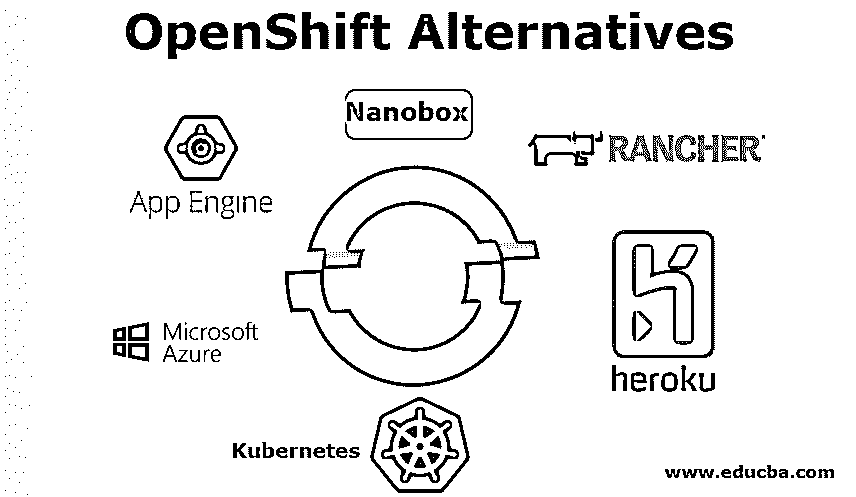

# OpenShift 替代方案

> 原文：<https://www.educba.com/openshift-alternatives/>

## OpenShift 替代方案概述

OpenShift 是 Red Hat 的一个免费的、自动化的、基于应用的(PaaS)平台。OpenShift 将堆栈作为云中的应用平台进行管理，以专注于您的技术。OpenShift Origin 是一个开源的组件集合，在 OpenShift 平台上作为服务使用。OpenShift 容器平台为在政府、私有或[混合云](https://www.educba.com/what-is-hybrid-cloud/)中使用包含 Docker 的系统提供了一个平台。在本主题中，我们将学习 OpenShift 替代方案。

### OpenShift 的首选方案

下面是 OpenShift 的几个首选方案。

<small>网页开发、编程语言、软件测试&其他</small>

#### 1) Heroku

*   Heroku 是一个 Python，Scala，Rails，Ruby，Node.js，Java，Clojure web app 云应用平台。您需要的所有建筑、运营和规模。Heroku run 几乎可以说任何级别的语言。以无缝方式整合和同步销售人员。
*   Heroku 提供互联网应用建设，运行和规模的文书和服务。它允许开发人员专注于设计和生产引人注目的应用程序。强大的开发者平台，让您专注于创建优秀的应用程序。
*   构建和运行您的应用程序。一旦你按下你的实现的源代码，Heroku 通过在你的应用程序中恢复所需的框架和特定于语言的依赖来准备它的执行。

#### 2)库伯内特斯

*   这是 OpenShift 的另一种替代方案。 [Kubernetes](https://www.educba.com/what-is-kubernetes/) 是一个小型 Docker 容器开源编排方案。它管理计算集群中节点的规划，并主动管理工作负载，以保证它们的状态与目标客户一致。
*   这是一个平台，旨在提供可预测性、可扩展性和高可用性的技术，以处理容器化应用的生命周期。作为 Kubernetes 的客户，您可以决定您的应用程序如何工作，以及它们如何与其他应用程序或外部世界通信。
*   我们可以扩大或缩小您的服务，进行适度的滚动更新，并从一个版本转移到另一个版本，以测试特性或回滚问题部署。Kubernetes 提供接口和原始的可组合平台，支持定义和管理应用程序的高度灵活性、功能和可靠性。

#### 3)谷歌应用引擎

*   谷歌应用引擎在谷歌管理的数据中心提供了一个开发和托管网络应用的免费平台。App Engine 提供快速创建和部署、轻松管理、设备、补丁或备份，无需担心任何问题，并且易于扩展。
*   这些应用程序需要用 PHP、Python、Java 和 Go 等语言编写，并由几种语言支持。谷歌查询语言的使用也是必要的，谷歌大表被用作数据库。
*   应用程序必须满足这些标准，因此应用程序必须被创建或修改以满足 GAE 的需求。

#### 4)牧场主

*   Docker 非常适合创建可伸缩的基础设施。它不仅迫使您将请求隔离在合理的块中，还鼓励您将这些部分创建为无状态服务。这对于高可用性和可伸缩性来说非常好，但是手动扩展纯 Docker 基础设施可能很困难。
*   这些问题的“正式”解决方案是 [Docker Swarm](https://www.educba.com/docker-swarm-architecture/) 和 Composite——它们使您能够创建一个巨大而有弹性的 Docker 集群，在一台机器上呈现给您的客户。Compose 还使您能够轻松地将您的请求扩展到几个案例。
*   Tutum 是一项有助于这些剩余部分取得优异成绩的服务。虽然有了 Tutum，您可以使用您的节点，但有时您的自托管服务是可取的。

#### 5)微软 Azure

*   微软 Azure 是一个公共云应用平台。它提供各种计算机、分析、存储和基于网络的云服务。用户可以通过这些设施选择和扩展新的应用程序，或者在政府云中操作当前的应用程序。
*   Azure 门户中的 Azure 将服务分为各种类别。该门户为客户提供对 Azure 所有特性和服务的访问。除了各种 Azure 特性和服务，还有各种 Azure 计算模型。
*   每个人都有自己的职责和角色。不同的模型可以单独使用，也可以组合使用，为您的应用程序创建合适的基础。你选择的策略应该与你试图解决的问题相一致。

#### 6) Nanobox

*   开发人员的完美平台是 Nanobox。将 DevOps 作为您的角色，所以您没有它，Nanobox 创建、配置和管理您的所有基础架构，所以您可以专注于软件而不是配置。
*   创建一致的、隔离的开发环境，可以轻松地与任何人共享并在任何主机上使用。借助 Nanobox 仪表盘，轻松管理制造应用。使用统计面板以及流和历史日志输出，您可以零停机地进行部署和扩展。

#### 7)云化

*   使用 Cloudify 实现平稳的云过渡，并在整个生命周期中自动化最复杂的应用程序。组织您的应用程序以创建整个云基础架构，从计算资源到网络和块存储设备。
*   Cloudify 然后实现你的云应用程序，你不会因为这样或那样的原因而使用 cloud ify；使用您喜欢的自动化和配置管理工具在您的数据中心或您选择的云中安装相同的应用程序。无论拓扑或技术如何，Cloudify 都会监控、管理和扩展您的请求。

### 结论

你们中的一些人可能觉得我是 OpenShift 的忠实粉丝，但是我喜欢使用两个 OpenShift 和 Kubernetes。它们还使我们的容器化应用程序能够以只有 Google 这样的独角兽才能访问的方式进行部署和管理。无论你选择什么，都会让你的生活更加便利，你的云球之旅就此开始

### 推荐文章

这是 OpenShift 替代方案的指南。在这里，我们以简洁的方式讨论 OpenShift 的前 7 个备选方案的简要概述。您也可以看看以下文章，了解更多信息–

1.  [立方结构](https://www.educba.com/kubernetes-architecture/)
2.  [码头工人备选方案](https://www.educba.com/docker-alternatives/)
3.  [什么是 Azure？](https://www.educba.com/what-is-azure/)
4.  [Azure 的替代品](https://www.educba.com/alternatives-to-azure/)

