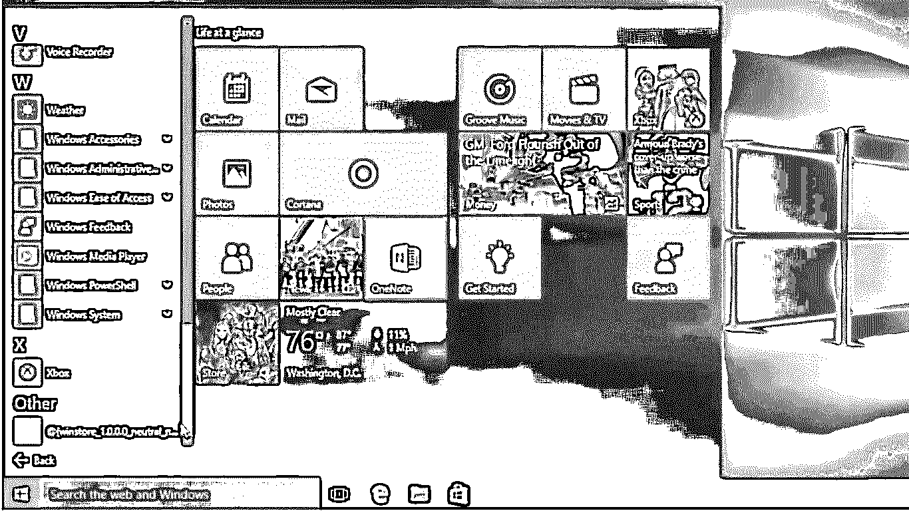
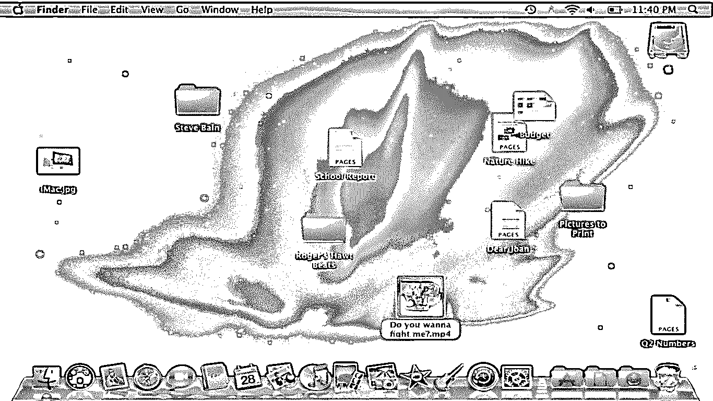
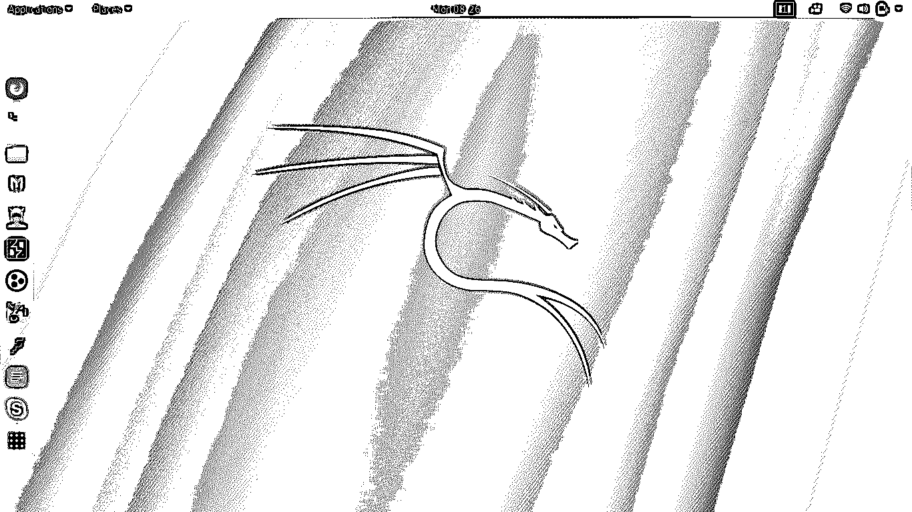
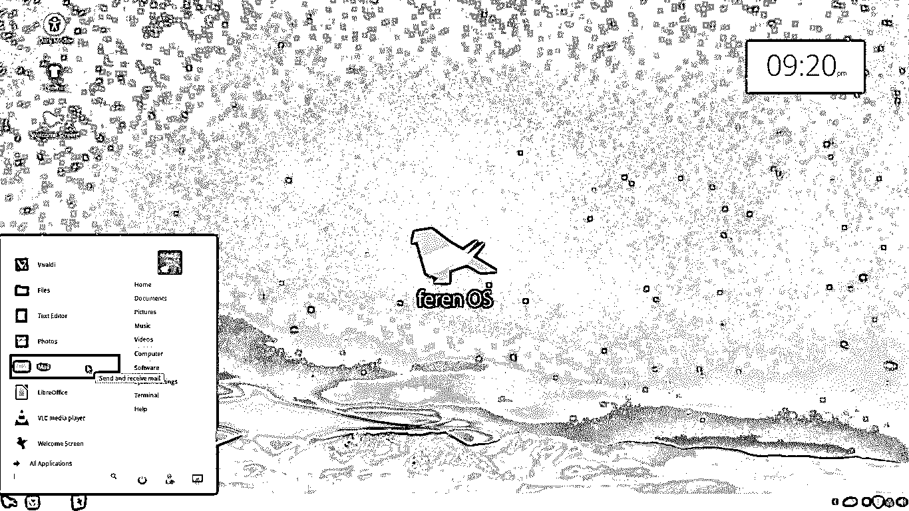
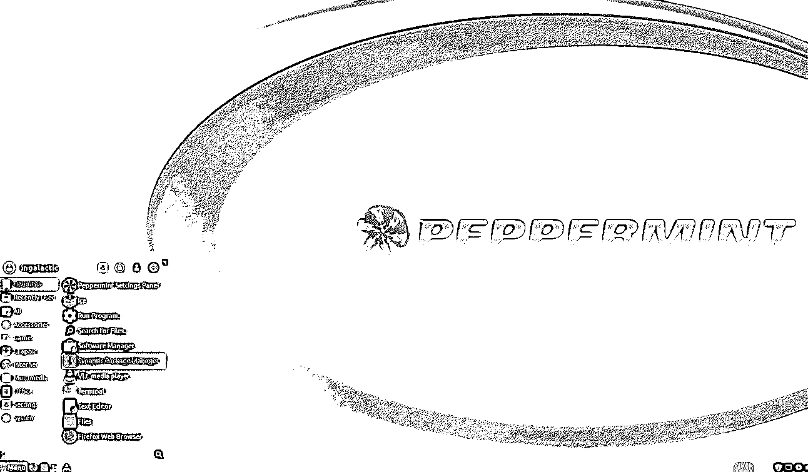
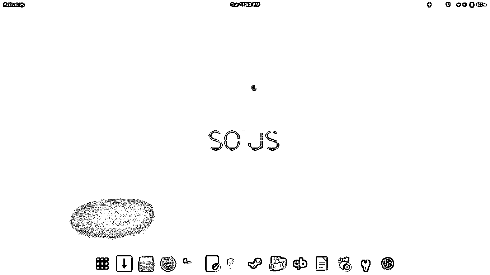

# 操作系统替代品

> 原文：<https://www.educba.com/os-alternatives/>

## 操作系统替代方案介绍

操作系统可以定义为用户和硬件之间的接口。它是在系统启动后立即打开的软件。所以从技术上来说，是那种比所有软件先开始工作的软件。操作系统由各种帮助引导系统的基础文件组成。此外，它有一些系统软件，方便用户和硬件设备之间的通信。

### 什么是操作系统？

需要执行任何功能的每个设备都使用操作系统。如果你对这个话题非常陌生，当你知道像智能冰箱、互联网路由器、智能电视、闭路电视等电子设备都是在操作系统的帮助下运行时，你会感到惊讶。 [Linux](https://www.educba.com/what-is-linux/) 是这些电子设备中最常用的 OS。

<small>网页开发、编程语言、软件测试&其他</small>

### 操作系统替代方案列表

尽管市场上有几种操作系统的替代产品，但主要市场被微软视窗、Mac OS X 和 Linux 所覆盖，其中视窗因其简单的图形用户界面而领先市场。现在，我们将详细了解每种操作系统替代方案。

#### 1.微软视窗软件

这是微软在 1985 年开发的基于 GUI(图形用户界面)的操作系统。实际上，它是 MS-DOS 的图形界面。windows 的第一个版本是 1.1，它通过图形界面简化了磁盘分区功能。网络浏览器首次在 3.0 版本的 windows 中使用，使用户可以轻松访问互联网。

这是当今操作系统最著名的替代品之一，因为它提供了一个可以使用鼠标进行交互的界面。我们可以在整个屏幕上移动鼠标指针，点击它进行选择。Windows 允许用户安装额外的软件来增加额外的功能并提高系统的效率。该窗口的主要目的是提供一个非常体面的界面，任何人都可以在其上轻松地执行所需的任务。

由于其图形界面的简单性，windows 非常受欢迎并覆盖了大量用户。它的设计考虑到了非技术用户。GUI 是在 DOS 上设计的，这意味着它实际上运行 [DOS](https://www.educba.com/what-is-dos/) 中的命令，但是由于 GUI，用户不知道幕后发生了什么。

#### 2.MAC OS X

另一个最好的操作系统选择是苹果公司早在 1984 年开发的 MAC OS。这正好是 Windows 开发的前一年。它是使用第二广泛的操作系统，有 6375 的用户在使用它。第一个桌面版本是在 2001 年推出的，当时是 MAC OS X 10.0，下一个版本 10.1 就在第一个版本发布之后。

它还提供了一个非常交互式的图形界面和 Windows 提供的大多数功能。苹果笔记本电脑预装了不能更改的 MAC OS。虽然它有很好的功能，但比 Windows 贵一些。它被认为是高度安全的操作系统，因为它具有检测威胁并做出相应响应的功能。

由于这种操作系统只能在苹果笔记本电脑上运行，因此无法轻松安装在普通笔记本电脑上。例如，我们可以在联想笔记本电脑或台式机上运行基于 Windows 或 Linux 的操作系统，但如果我们需要运行 MAC OS，那么在这种情况下，我们必须购买苹果台式机或笔记本电脑。

#### 3.Linux 操作系统

与 Windows 和 MAC OS 类似，Linux 也是一种具有一些附加功能的操作系统。根据用户的需求，有多个版本的操作系统，如 Ubuntu、Kali Linux、Parrot Linux、Mint Linux 等等。Linux 也因其命令行界面而闻名，它也因 Linux 中预先存在的工具而受到黑客的喜爱，特别是 Kali Linux。

Linux 操作系统由 Shell、引导装载程序、守护进程、内核和使 Linux 更加高效的应用程序组成。Linux 在服务器中被广泛使用，因为与 windows 相比，它们更具成本效益。它提供了一个高度安全的平台，用户可以在那里存储他们的重要数据。由于其快速处理的质量，当涉及到在很短的时间内非常有效地完成事情时，它是非常有用的。

Linux 操作系统也是一些发行版的基础操作系统。就连现在最流行的手机操作系统“安卓”也是以 Linux 为基础 OS。称为物联网的趋势技术也是使用 Linux 作为其通用操作系统来实现的，该操作系统由几个智能电子设备使用。从程序员或开发者的角度来看，我们应该更喜欢 windows，但从网络管理员和安全主管的角度来看，它是最重要的操作系统。

#### 4.给我们讲讲

Feren 操作系统基于 Linux mint，因此拥有 mint 版本的 Linux 所拥有的一些功能。这个操作系统带有内置工具，如 Feren them 和 GMP 图像编辑器，这些工具通常不会预装在几个 Linux 版本中。它提供了 GUI 交互平台，还提供了与 Linux 终端工作方式相同的终端。

它是 Linux 操作系统最稳定的版本，当非 CLI 爱好者必须以高效的方式使用 Linux 时，可以考虑使用它。它将 windows 的图形用户界面和 Linux 的工作效率和安全性结合在一个平台上，安装时需要大约 3 GB 的 RAM。硬件应该在 20 GB 左右，以使其工作稍微流畅，但对于任何操作系统来说，高存储容量总是推荐的。

Feren OS 确实需要一些配置良好的硬件来顺利工作，因为它带有一些重要的应用程序。在一些基于 CUI 的 Linux 发行版中，我们通常需要为每个任务下载工具，如编辑照片，改变界面的外观，但在这个操作系统中，重要的应用程序已经可用，附加的或其他软件可以很容易地安装。

#### 5.薄荷 OS

Peppermint OS 是基于 Ubuntu 或 Linux 的操作系统的另一个最佳选择，它有 32 位和 62 位两种版本。它是一个非常轻量级的操作系统，因此在任何系统上运行都需要较少的硬件配置。即使是 512 MB 的内存也足以运行这个操作系统。它没有很多内置的系统软件，但肯定可以根据他们的要求添加许多软件。

它还提供了许多不同版本的 Linux 都没有的微软办公套件。使用它，我们可以像在 windows 中一样编辑 office 文档。它提供了许多应用程序的快捷方式，如 Google Drive、Gmail 等，当打开这样一个应用程序时，它将作为一个[网页](https://www.educba.com/web-page-design-layout/)打开，其中没有地址栏选项。当使用内置的快捷方式时，它只是打开浏览器的一个实例，而不是实际打开浏览器，这样的功能使它使用起来非常快。

该操作系统也可以被认为是具有最简单用户界面的操作系统，因为一些可能增加复杂性的功能必须保持抽象。简单来说，这个操作系统会给你你想要的。它不会给你几个选项来选择。通常用户很少使用这个操作系统，但是如果有人想在非常低的硬件能力下使用这个操作系统，那么使用 peppermint 肯定是首选。

#### 6.索鲁斯操作系统

对于新手或精通 Linux 的用户来说，Solus 是各种可供选择的方法之一。它是另一个基于 Linux 的操作系统，提供了与其他基于 Linux 的操作系统非常接近的视图。它配备了 Firefox 作为默认浏览器来处理用户的互联网相关查询。它有自己的包管理器和库，因此与其他的 Linux 发行版非常不同。

它包括一个非常体面的用户界面以及终端的有效功能。在这个操作系统中，底部的 bas 显示正在运行的应用程序，应用程序可以从那里切换，这与其他 Linux 发行版相反。它有一个通知区域，显示系统生成的所有通知，在通知部分旁边，还有一个快速应用程序访问区域。

Solus 最适合新手和有经验的人，因为它可以在任何情况下非常有效地工作。它在并行运行几个应用程序时工作得非常好。用户可以根据自己的需要使用存储和 RAM，但使用 4GB 的 RAM 可以使工作更加愉快。除了 RAM，硬盘也起着至关重要的作用，对于这个操作系统来说，180 GB 可能就够了。

#### 7.Parrot Linux

Parrot Linux 是在处理网络时使用的最好的 Linux 版本之一。通过查看缺省的终端文本颜色，人们可以很容易地认出这个操作系统，因为它由绿色和阅读文本组成。parrot Linux 是一种基于命令行界面的操作系统，因为这个操作系统中的大多数事情都可以使用终端来完成。

这种分布是为了[渗透测试](https://www.educba.com/penetration-testing/)而设计的，因此在[网络安全](https://www.educba.com/invest-in-cybersecurity/)中被非常有效地使用。在大多数网络取证案例中，Parrot Linux 被用作最佳操作系统，因为其内置工具主要是为调查目的而开发的。鹦鹉 Linux 的最新版本是 4.5.1，于 2019 年 1 月发布。

Parrot Linux 也有一些在 [Kali Linux](https://www.educba.com/kali-linux-commands/) 中使用的重要工具。在组织中，parrot Linux 非常频繁地用于 SOC 操作，尤其是利用网络中存在的漏洞。它的工作原理和 Kali Linux 差不多。好的方面是，它装载了许多在[道德黑客](https://www.educba.com/ethical-hacking-tools/)中使用的有用工具，因此用户不需要添加额外的软件来执行渗透测试。

#### 8\. Kubuntu

当我们谈论 Linux 的几个版本时，Kubuntu 是我们必须了解的操作系统。这是一个具有 Ubuntu 操作系统味道的操作系统，并且因为其突出 rush 的特性而广受欢迎。另一方面，通常操作系统使用 GNOME 桌面环境，Kubuntu 操作系统使用 KDE 等离子桌面。

由于它的用户界面与 Ubuntu 几乎相同，同样它也匹配 Ubuntu 提供的大部分功能。由于它的轻量级，它在快速执行方面可能非常强大。虽然它被认为比 ubuntu 好一点，但事实是它是在 Ubuntu 之后生产的。它不需要很高配置的系统就可以安装。如果你真的想看看它，你可以使用虚拟化来获得它的曝光。

### 结论

根据我们的要求，有几种操作系统的替代方案可以使用。由于其易于使用的界面，Windows 是使用最多的操作系统，其他一些操作系统也可以作为它的替代品。简单地总结一下，如果你非常关心安全问题，那么最好使用 Linux 或 MAC OS，如果需要让非技术用户在合适的平台上工作，那么就使用 Windows。

### 推荐文章

这是操作系统替代方案的指南。在这里，我们讨论了基本概念和 8 大操作系统替代方案及其优缺点。您也可以阅读以下文章，了解更多信息——

1.  [Linux 替代品](https://www.educba.com/linux-alternatives/)
2.  [PHP 替代方案](https://www.educba.com/php-alternatives/)
3.  [Linux 替代品](https://www.educba.com/linux-alternatives/)
4.  [Ubuntu 替代品](https://www.educba.com/ubuntu-alternatives/)

