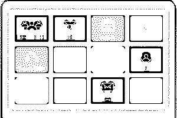
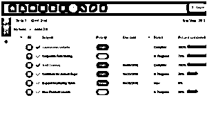
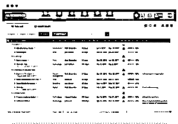
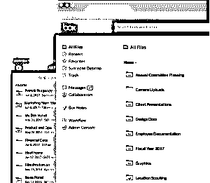
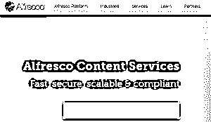
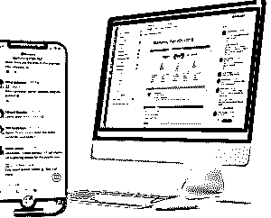

# Sharepoint 备选方案

> 原文：<https://www.educba.com/sharepoint-alternatives/>

## Sharepoint 备选方案简介

以下文章提供了 Sharepoint 替代方案的概述。SharePoint 是由微软公司开发的基于网络的平台，它与微软 Office 集成在一起。它在组织中广泛用于文档管理、存储和许多其他有助于协作的功能。尽管这些年来它因其提供强大协作平台的许多特性而变得流行，但是它也存在某些缺点，例如移植困难、每当新版本上市时用户面临的定制问题以及需要认证用户理解特性和功能。

鉴于 SharePoint 的缺点，其他组织提出了各种协作平台，这些平台根据不同的用途、价格和业务需求提供适合不同用户群的功能。下面是其他组织提供的几种可供选择的协作平台，它们可能会根据用户的需求适合他们。

<small>网页开发、编程语言、软件测试&其他</small>

### 11 大 Sharepoint 备选方案

以下是 Sharepoint 的 11 大替代方案:

#### 1.g 组曲

谷歌已经为一项名为“G Suite”的合作提供了一个强大的集成环境，它提供了共享联系人、日历、表格、表单和文档存储等功能。它使用 Gmail、Hangouts 和 Google+进行交流，使用 Google Drive 进行存储。它是一个基于云的平台，具有无限的存储空间，可以从任何地方访问存储的文件，具有最重要的安全性。

#### 2.汇合

Confluence 是 Atlassian 开发的一个协作软件平台。它非常灵活地适应用户的需求，例如不同的团队规模，提供了一种值得称赞的方式来根据计划、附加组件等共享文档和工作流。Confluence 非常适合其复杂的技术文档，并且可以与其他 Atlassian [产品如 JIRA](https://www.educba.com/jira-interview-questions/) 很好地集成。这是昂贵的，并提供良好的客户支持。

#### 3\. Bitrix24

Bitrix24 是一个完整的包，提供了办公平台的功能，如日历、视频会议、社交网络等。它通过在一个地方组合其他协作工具，使组织内的内部通信更加有效，并通过提供通信功能、工作流和项目管理，创建数字化工作平台。它有一个用户友好的界面，可以从手机和桌面访问。

#### 4.超级办公室

HyperOffice 是一个轻松的协作平台，因为用户不需要下载、安装软件等，因为它完全基于云，并提供用户友好的界面。它包括文档管理、文件存储、电子邮件、日历以及联系人和项目管理工具等协作功能。它适用于中型组织，并提供了一种协作方法，在这种协作方法中，只有特定用户可以访问专用工作区，从而使信息流正常进行。还提供了一个平台，可以轻松管理涉及许多团队的联合项目。

#### 5.工作区

许多组织都使用 Work zone 来管理项目以及在不同的用户之间共享项目。在这里，使用功能强大且易于使用的工具来跟踪项目变得更加容易，并且还提供高质量的培训和支持。它有许多有利的功能，如文件共享，文档，评论，它可以定制，以适应不同的需求。

#### 6.箱子

“盒子”是一个云内容管理平台，它提供了一个良好的用户界面，并支持各种设备和服务。此外，它还提供安全性和合规性，与其他软件提供商集成，并支持各种文件，如 PDF、Excel 等。

#### 7.在户外

Alfresco 是一个信息管理软件平台，它是为 UNIX 和 Windows 等操作系统设计的。它提供了在组织内安全存储和共享文档的功能，并将内容集成到核心业务流程中，以便信息沿着正确的方向流动并轻松完成工作。它在服务方面提供了出色的支持和定制，并且根据客户的需求构建了服务包。

#### 8.加工街

它有一个简单的界面，易于使用，让用户通过使用提供的模板立即创建结构化文档。通过快速创建清单工作流和使用仪表板在任务完成时获得通知，还有助于跟踪团队的进度。团队成员之间的文件共享也变得很容易，这是通过一个与其他应用程序集成的自动化任务平台来完成的。

#### 9.雷德布斯

Redbooth 是一个基于网络的协作工具，具有易于使用的用户界面。它有助于组织任务，以便用户可以正确地对它们进行优先级排序和管理。还提供了高质量的沟通平台，以及简单的视频会议功能和使用仪表板的可视化，其中通过划分为时间线、列表等的任务来跟踪生产力。

#### 10.松弛的

Slack 可能不会被视为 SharePoint 的替代品之一，但它已经成为许多组织广泛使用的最流行的协作工具之一。它的突出特点是让用户创建无限的私人和公共交流渠道。此外，它有一个用户友好的界面，提供用户之间共享文件的功能以及安全性。

#### 11.相同页面

Samepage 的方法是将所有有用的工具整合到一个平台中，这样就节省了从一个工具转移到另一个工具所消耗的时间，这些时间可以有效地用于提高生产率。它提供诸如文件和任务共享、评论、对话和视频会议等功能。此外，这些文件可以从许多设备上访问，如 Mac、Windows 和 Android 等。

上述备选方案各有优势，可以推荐给各种业务需求的用户，如组织规模、定价和运营。现在有许多其他的选择，甚至可以更好地满足用户的需求。

但是，与 SharePoint 相比，替代方案可能被视为更好的协作选项，或者可能不适合 SharePoint 具有突出优势的特定工作环境。这取决于用户是否了解他们的需求、他们需要使用的协作平台的价格，并选择最适合其业务的替代方案或继续使用 SharePoint。

### 推荐文章

这是 Sharepoint 替代品的指南。在这里，我们讨论了基本概念和 11 大 Sharepoint 备选方案。您也可以阅读以下文章，了解更多信息——

1.  [SharePoint 面试问题](https://www.educba.com/sharepoint-interview-questions/)
2.  [SharePoint 中的职业](https://www.educba.com/careers-in-sharepoint/)
3.  [GitHub 替代品](https://www.educba.com/github-alternatives/)
4.  [Wrike 替代方案](https://www.educba.com/wrike-alternatives/)

