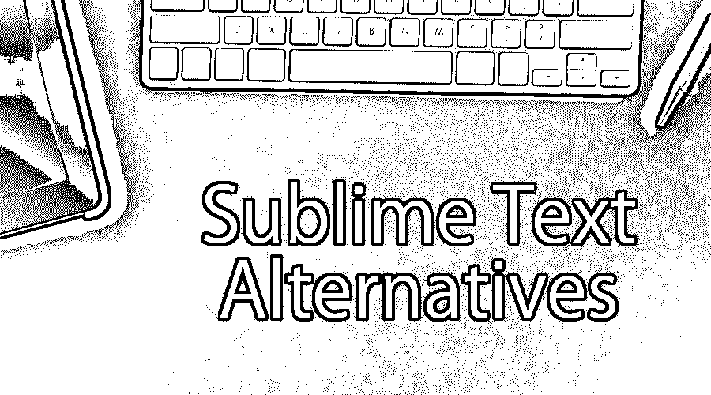

# 崇高的文本选择

> 原文：<https://www.educba.com/sublime-text-alternatives/>

## 崇高文本替代方案介绍

开发人员使用文本编辑器来编写和编辑他们的代码。市场上有很多具有不同功能的编辑器。这些功能根据开发人员的需求和偏好适合不同的开发人员。在这篇崇高的文本替代文章中，我们提出了一些在当今环境中非常受欢迎的文本编辑器。首先，让我们看看 sublime 文本编辑器到底是什么。

### 崇高文本编辑器

Sublime 有一个 [Python 编程](https://www.educba.com/what-is-python/)接口；它支持许多编程语言和标记。用户可以添加定制的插件来增强功能。它是一个跨平台的编辑器(MAC、Windows 和 Linux)。

<small>网页开发、编程语言、软件测试&其他</small>

### 崇高的替代品

以下是不同的崇高替代品:

#### 1\. [Atom](https://atom.io/)

Atom 为用户提供了很多东西，包括免费的开源文本和源代码编辑器，还兼容多平台(macOS、Linus 和 Windows)。它是用 Node.js 编写的[，内嵌 git 控件特性，由 GitHub 开发。开发人员社区对 Atom 文本编辑器有很好的评价，因为它适用于 Python、JavaScript、Ruby、HTML、CSS、PHP 和其他语言。这是一个现代的，时尚的设计和平易近人的核心。它带来了如此多简洁明了的创新特性，使得开发人员和编码人员的工作变得更加容易。](https://www.educba.com/node-dot-js-commands/)

*   免执照
*   平台–Windows、macOS、UNIX 和浏览器

#### 2. [Vim](https://www.vim.org/)

Vim 的语法高亮、单词补全和大量社区贡献的内容使它成为一个非常高级的文本编辑器。Vim 包含在许多苹果 OS X 和 NIX 系统中，就像微软预装的记事本一样。除了上面提到的优点之外，它很容易根据变化的需求进行配置，它还具有多种编辑模式，以提高应用程序的效率。它是一个具有跨平台适应性的开源编辑器。对于用户来说，关于 Vim 的一个重要信息是，由于它是一个复杂的应用程序，因为它处理几个特性，并且适合不同的平台，所以用户在开始使用它之前需要进行大量的预配置。

*   免执照
*   平台——Windows、macOS、UNIX、Linux、Android、iOS、Amigos 和其他一些平台

#### 3. [VS 代码](https://code.visualstudio.com/)

VS Code 是一个文本编辑器加上一个我们大多数人都熟悉的品牌(微软)名称。它是微软为不同平台(如 Windows、Linux 和 macOS)的用户开发的源代码编辑器。使用 VS 代码，用户可以调试、嵌入 Git 控件、执行语法高亮显示、良好快速的代码完成过程、代码片段和代码重构。如果用户需要使用这些语言——C、C#、C++、HTML、JSON、Objective——C、PHP 和其他一些语言，那么他最好使用 VS 代码。

*   免执照
*   平台–Windows、macOS 和 Linux。

#### 4.[记事本++](https://notepad-plus-plus.org/downloads/)

Notepad++是免费的许可软件。它不仅仅是一个编辑器，它的选项卡式编辑功能可以轻松地同时处理多个文件。 [Notepad++是用 C++编写的](https://www.educba.com/notepad-plus-plus-alternatives/),因此它对大型和半大型程序有更高的执行速度。它使用“Scintilla”编辑器组件，这是另一个免费的开源库，为文本编辑和源代码编辑提供了更好的工作。

*   免执照
*   平台–Windows

让我们转向下一个崇高的文本选择。

#### 5.[括号](https://brackets.io/)

这是一个轻量级的现代文本编辑器，具有代码提示、参数提示和定义跳转功能。通过括号，用户可以轻松地使用实时预览功能执行在线编辑工作。它有一个内置的预处理器，增强其性能。Brackets 也是开发者为了设计 [web 应用](https://www.educba.com/what-is-web-application/)或独立应用而首选的开源编辑器。它建立在一些著名的 web 技术之上，如 HTML、CSS 和 JavaScript。使用括号，用户可以很容易地对浏览器进行更改。说到语言兼容性，我们可以看到很多——C、C++、Java、JavaScript、HTML、Python、Perl 和 Ruby。

*   免执照
*   平台–Windows

#### 6. [Geany](https://www.geany.org/)

Geany 是一个带有 GTK 工具包的文本编辑器，它具有适合开发环境的基本到高级功能。基本上，开发它是为了提供一个小而快的 ide，具有较少的依赖性。它很容易操作，并且有一个轻量级的文本编辑器。当谈到这个应用程序支持用户的特性时，用户有几个选项可以探索。让我们看看它们

*   语法高亮、代码折叠、符号自动完成、代码片段、调用提示、 [XML 和 HTML 标签](https://www.educba.com/html-vs-xml/)的自动关闭、符号列表、代码导航、插件接口，以及某种程度上的代码执行。
*   免执照
*   平台–Windows、MAC、Linux

#### 7. [GNU Emacs](https://www.gnu.org/software/emacs/)

GNU 背后的家伙是一个小开发公司，他们有一个叫做 GNU 的操作系统，GNU Emacs 是一个主要适用于 GNU 操作系统的文本编辑器。这个免费文本编辑器最好的部分是它与其他平台的兼容性，如 Windows、Mac、Linux 和 BSD。它是可定制的，支持扩展插件、脚本和语法高亮特性。开发公司声称他们的文本编辑器很容易为几乎所有的人类语言及其脚本工作。易于学习，因为公司提供了理解应用程序所需的所有文档。

*   免执照
*   平台–Windows、MAC、Linux、BSD

#### 8.文字

使用 TextMate code editor，人们可以轻松分析苹果操作系统对全球用户的影响。除了 Windows，Mac OS 可以被认为是用户的第二大首选(这一条件适用于普通用户，不适用于那些有特定理由购买 apple OS 的用户)。这个编辑应用程序仅适用于 MAC 用户。这不是一个 IDE，但是它有强大的代码片断功能，宏功能，这些是大多数 IDE 所没有的。在某种程度上，它可以被认为是项目管理的一个[选项，但是如果这不是它的用户正在寻找的东西，那么它为用户提供了一个简洁的 GUI。](https://www.educba.com/principles-of-agile-project-management/)

*   许可——商业、开源
*   平台–MAC

### 推荐文章

这是一个崇高的文本替代指南。在这里，我们详细讨论了不同类型的崇高文本替代的基本概念。您也可以浏览我们推荐的其他文章，了解更多信息——

1.  [什么是 Visual Studio 代码？](https://www.educba.com/what-is-visual-studio-code/)
2.  [HTML 面试问题](https://www.educba.com/html-interview-questions/)
3.  [手机应用分析工具](https://www.educba.com/mobile-app-analytics-tools/)
4.  [ExtJS 面试问题](https://www.educba.com/extjs-interview-questions/)

