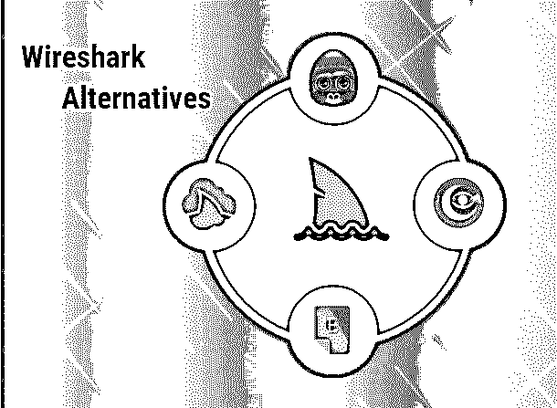

# Wireshark 替代方案

> 原文：<https://www.educba.com/wireshark-alternatives/>

## Wireshark 替代方案简介

Wireshark 是一种数据包分析工具，用于网络监控、软件分析和故障排除。它是用来从网络上收集信息的工具，而不是用来发送信息的。它是由 Wireshark 团队开发的。它的原作者是杰拉尔德·库姆斯。它最初发布于 1998 年。是用 [C 和 C++](https://www.educba.com/c-vs-c-plus-plus/) 写的。它支持跨平台操作系统。这是一个开源的免费包分析工具。在本文中，我们将看到不同的 Wireshark 替代方案。

### Wireshark 的替代品

下面提到了该工具其他替代方法:

<small>网页开发、编程语言、软件测试&其他</small>

#### 1.Cloudshark

它被称为基于网络的平台，用于分析和共享在浏览器中捕获的数据包文件，这有助于以更快的速度解决网络问题。它始终专注于分析，因为它总是监视 web 浏览器。这个工具有很好的特性，因为它可以作为你生成的文件的收存箱。在这种情况下，它将截图拖放到浏览器中，并使用 API 键上传。它还允许读者访问分析，并轻松地与其他工作人员共享。

#### 2.可乐软 Capsa

这是 Wireshark 的另一种替代方案。它是一个数据包分析器和网络监控工具，有助于解释网络流量，并以简洁的形式直观地显示所有细节。这个工具配置了 [Windows Server](https://www.educba.com/windows-server-interview-questions/) ，比 Wireshark 更容易使用。它也是免费的，但是有一些限制。它还允许用户浏览特定时间段的数据。它有助于实时监控网络和数据包。它是帮助节省成本和增强客户体验的替代工具之一。它用于排除计算机或系统中所有类型的漏洞。

#### 3.萨维乌斯·奥米皮克

它被称为用于网络分析和诊断系统性能的最佳工具。它提供了分析安全问题的高级功能。它不能像 Wireshark 一样自由使用。它提供一段时间的免费试用，然后需要购买许可证。它不会收集数据包本身进行分析。有一个插件叫做捕获引擎，它拦截有线网络和用于无线网络的 wifi 适配器上的数据包。它有助于比较、发现和缩短解决问题的平均时间。它扫描数据包以寻找故障迹象，并检测传输速度的变化。分析功能有助于获得端到端的性能结果。

#### 4.智能嗅探

这个工具主要在 windows 环境下工作。这个程序包括收集器。收集器用于有 wifi 系统的无线网络，包括一台托管嗅探器程序的计算机。它有助于在服务器和客户机之间以类似对话的顺序捕获数据。为了收集 WinPcap 需要安装的数据包，并根据需要捕获这些数据包，它可以选择在控制台中打开和关闭，以捕获和跳过特定的数据包。它有助于捕获网络监视器的驱动程序以及来自不安全的无线网络的数据。

#### 5\. SysDig

它用于检查系统、分析软件和调试。它是一个用于监控系统的开源工具，非常灵活，可用于 Mac 和 Windows 操作系统。它被称为两者的安全容器。该工具在 CLI 的帮助下使用，可以实时跟踪系统漏洞。它还支持应用程序的跟踪，并为容器技术提供本机支持。它有助于增强软件的可靠性，并带来理想的问题解决方案。

#### 6.MOJO 数据包

该工具主要用于基于云的 Wifi 分析和故障排除。它具有很容易分析数据包轨迹的效率，有助于找出 WiFi 连接失败的原因。它可以与另一个工具集成。它能够在远程站点捕获数据包跟踪。它将 wifi 连接和编码可视化。

#### 7.德布克

它是仅用于 MacOS 的工具。它帮助用户在微观层面上检查事物。手机也可以用来捕捉数据并传输到其他设备。它用于监控和拦截同一子网中的网络流量。它有助于找到 Wifi 带宽的用户和找到所有连接的设备。

#### 8.以太猿

它被称为图形监控网络工具。这是一个免费的实用程序，用于在 Linux、Unix 和 MacOS 等操作系统上运行。它用于在拾取设备消息的帮助下创建网络图。它支持 WLAN 设备、以太网、ISDN、PPP 和 FDDI。它有助于优化网络数据。它显示完全可配置的节点持续时间。它显示协议摘要对话框，该对话框按协议显示全局流量统计。它实时捕获主机和 IP 地址之间传输的所有数据包。每一次转让都标有颜色，有助于识别其应用或协议。

### 结论

以上是 Wireshark 工具的替代方案。在这些工具中，您将能够找到您需要的功能，有些功能甚至是 Wireshark 中没有的。因此，最好使用一种工具的另一种替代方案，或者你可以说探索其他工具也是一个好主意。它总是取决于您想要进行数据包嗅探的要求和活动，相应地，应该选择的工具可能会比 Wireshark 提供更好的结果。每种工具都有优于其他工具的优点和局限性，没有一种工具是完美的。因此，在选择系统之前，要积极主动地分析工具，并了解特定工具的要求和功能。

### 推荐文章

这是 Wireshark 替代方案的指南。在这里，我们讨论了 Wireshark 的基本概念和八大备选方案，并给出了详细解释。你也可以浏览我们推荐的其他文章来了解更多信息-

1.  [Sharepoint 备选方案](https://www.educba.com/sharepoint-alternatives/)
2.  [Node.js 备选方案](https://www.educba.com/node-dot-js-alternatives/)
3.  [SOA 替代方案](https://www.educba.com/soa-alternatives/)
4.  [操作系统替代品](https://www.educba.com/os-alternatives/)

