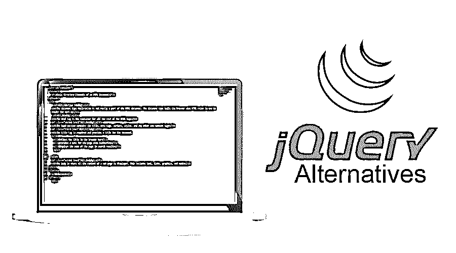
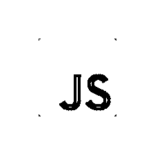
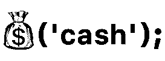
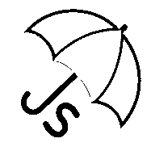
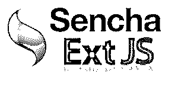

# jQuery 备选方案

> 原文：<https://www.educba.com/jquery-alternatives/>




## 什么是 jQuery？

jQuery 是一个框架，而不是 javascript 的包装器。jQuery 在 web 中变得非常重要，因为它有各种各样的优点，比如与 javascript 相比它非常轻量级，易于学习和实现。jQuery 页面加载速度非常快。

HTML、CSS、Javascript 是 Web 理解的技术。HTML 用于定义页面的布局，CSS 用于网页的样式。Javascript 是网络的编程语言。更新内容，动画，网页与用户的互动，所有这些，事实上，一切都由 javascript 控制。

<small>网页开发、编程语言、软件测试&其他</small>

**jQuery:** 我们为什么或者什么时候应该寻找 jQuery 的替代品！假设您不需要 jQuery API 中的所有方法，并且您只需要其中的一些方法，您可以寻找替代方法。jQuery 大约 250Kb。也许如果您正在寻找一个满足您所有需求的更小的文件，您会想要寻找 jQuery 的替代品。

### jQuery 备选列表

下面是不同的 jQuery 选项:

#### 1.java 描述语言




尽管如此，原生 javascript 是最好的 jQuery 替代品之一，事实上，它是 JS 的框架。Javascript 是最好的，因为任何浏览器都附带 javascript，并且您不需要在应用程序中安装 jQuery。此外，当您不得不处理一些非常旧的浏览器时，JS 是最好的选择之一，这些浏览器只查找特定版本的 jQuery。使用它的唯一缺点是语法不像 jQuery 提供的那样非常友好。

**语法:**

```
var element = document.getElementById("media");
```

```
element.classList.add("my style");
```

#### 2.现金




Cash 是一个支持 IE10+以上浏览器的小插件(大约是 jQuery 的 10%)。它的语法类似于 jQuery。它可能没有 jQuery 的所有特性，但是它几乎拥有我们需要的所有重要的基本特性。

**语法:**

```
var element = $("div");
```

```
$(element).attr ( attrName, attrValue )
```

#### 3.UmbrellaJS




UmbrellaJS 受 jQuery 的影响很大，几乎没有额外的功能，而且与 mobile 相比，它的文件非常小。各大浏览器和 IE11+都支持 UmbrellaJS。与 jQuery 不同，在 UmbrellaJS 中，可以在伞状选择器上使用原生 javascript 方法。

UmbrellaJS 的语法类似于 jQuery，不同之处在于使用了 **u** 而不是 **$**

**语法:**

```
u("button").on('click', function(){
alert("Hello world");
});
```

#### 4.赤壁 JS


ChibiJS 的开发是为了摆脱 jQuery 的大尺寸。ChibiJS 只有 7kb 左右，拥有所有常用的基本方法。说到浏览器支持，这支持所有现代到旧的浏览器。这个插件不提供动画。Chibi 执行 DOM 操作的速度比许多库快 20%到 50%。

Chibi 语法类似于 jQuery，以尊重小型和大型库语法不应该混合的事实

**语法:**

```
$("p").hide()
```

#### 5.ZeptoJS


ZeptoJS 可以认为是极简主义的 javascript 库，与 jQuery 高度兼容。这个库的目标不是与 jQuery 竞争，而是以非常小的规模实现其 API 的最大化。ZeptoJS 的大小只有 5-10kB，下载和执行速度非常快。支持所有主流浏览器和 IE10+。

**语法:**

```
$.camelCase('hello-there')
```

#### 6.MooTools


Mootools 是面向中高级 javascript 程序员的 javascript 实用函数集合。这是一个轻量级的 javascript 框架。其连贯和健壮的 API 允许编写强大和灵活的代码。它有非常好的文档可用，API 是一致的。

Mootools 是有益的，因为它允许用户选择自己定制的组件。它遵循面向对象的实践。MooTools 提供了对 DOM 的增强，使开发者能够添加、修改、删除任何 DOM 元素。MooTools 中也有元素存储

**语法:**

```
$$('div.foo, div.bar’);
var myElement = new Element('div#bar.foo');
myElement.addEvent('click', function(){
alert(clicked!');
});
```

#### 6.ExtJS




ExtJS 代表扩展 Javascript。它是 Sencha 的产品，基于 YahooUserInterface。它基本上是一种桌面应用程序开发编程语言。所有浏览器都支持 ExtJS，如 IE6+，FF，Chrome，Safari，Opera 等..ExtJS 基于 MVC/MVVM 架构。

ExtJS 还提供了大量高性能、可定制的小部件

**语法:**

```
var el = Ext.get("my-div");
```

```
var el=Ext.Element.get("my-div");
```

除此之外，还有许多其他小型框架可以端到端地完成一项任务/功能。MicroJS 是一个有许多可用微框架的站点。在这个网站上，我们可以简单地检查我们的需求是什么，并利用该框架。

### 推荐文章:

这是 jQuery 备选方案的指南。在这里，我们讨论了 jQuery 备选列表及其示例用法。您也可以阅读以下文章了解更多信息:

1.  [JavaScript vs JQuery](https://www.educba.com/javascript-vs-jquery/)
2.  [jQuery 面试问题](https://www.educba.com/jquery-interview-questions/)
3.  [jQuery querySelector](https://www.educba.com/jquery-queryselector/)
4.  [JQuery 进度条](https://www.educba.com/jquery-progress-bar/)


