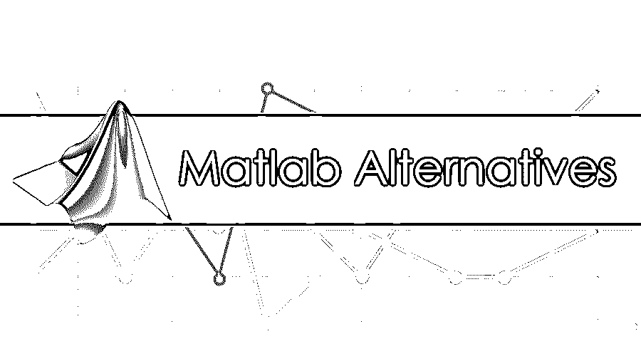

# Matlab 替代品

> 原文：<https://www.educba.com/matlab-alternatives/>

## Matlab 替代品介绍

矩阵实验室又称 MATLAB，是一种高级编程语言。它提供了一个交互式环境来执行各种领域的计算，如数学、科学和工程流。结果可以可视化并生成报告，以供进一步分析。 [Matlab 是结合](https://www.educba.com/matlab-free/)这些东西的先驱。一个专业团队开发工具箱并在严格测试后发布。在使用 Matlab 之前，掌握 Java、C、C++或 Fortran 语言的知识是很有帮助的。各种数学函数和内置的库命令用于分析数据，生成图表和执行复杂的积分和微分。这里我们讨论 Matlab 的替代品列表。

### Matlab 的用途

*   它可以处理数组和矩阵问题
*   2D 和三维物体的绘图
*   解代数中的复杂方程
*   数据分析
*   信号的通信和处理
*   图像和视频的处理
*   不同测量设备的测试

如果不能访问 Matlab 的源代码，就无法理解各种内置函数的全部功能和用例，也无法修改它们。一个许可证文件可能要花费数百美元。对于任何组织之外的人来说，这个数字可能更高。幸运的是，有几个 Matlab 替代品提供免费访问。基于用户的目标，我们可以找到类似于 Matlab 的东西。

<small>网页开发、编程语言、软件测试&其他</small>

### Matlab 备选方案列表

不同的 Matlab 备选方案如下:

#### 1.GNU 八度音阶

如果您正在寻找在兼容性和计算能力方面更接近 Matlab 的东西，那么 Octave 是最佳的 Matlab 替代品。大多数为 Matlab 开发的项目也在 Octave 上运行。它可以在任何操作系统上运行，无需任何修改。

**特性**

*   它可以处理强大的数学语法，并配备了绘图和可视化工具。
*   开源，兼容所有操作系统
*   主要用于复杂的线性和非线性数值计算
*   它可以运行交互式作业和批处理作业
*   兼容 Matlab 脚本和其他用 Java、C++或 Fortran 编写的模块。

#### 2.Scilab

Scilab 是一个开源的类似于 Matlab 的实现。被称为科学计算的近似技术被用来解决数值问题。为了实现这一点，Scilab 开发人员团队利用解算器和算法来构建代数库。Scilab 是 Matlab 和 GNU Octave 的主要替代品之一。

Scilab 的库文件基于以下内容:

*   数据分析
*   复杂算法的开发
*   先前计算的模型

数学计算基于:

*   进展和倒退
*   傅立叶变换
*   微分和积分分析
*   常微分方程

可以使用以下任何一种方法来可视化数据:

*   饼图
*   折线图、条形图
*   直方图
*   MathML 注释

#### 3.MAXIMUM 的复数

Matlab 的另一个替代品是 Maxima，它的灵感来自传奇的代数系统 Macsyma。它是一个用于处理数值表达式的系统，如泰勒级数、拉普拉斯变换、向量、张量和矩阵。通过使用精确的浮点数、小数值和整数，可以得到非常精确的结果。Source Forge 文件管理器由所有预编译的二进制文件组成。源代码可以在 Windows、Mac OS 等上编译。数据和函数可以绘制成二维和三维。它可以公开获得并被积极使用。Maxima 经常进行更新，以消除 bug 并改进编码。活跃的社区成员提供了新的建议。

#### 4\. Sage Math

Sage Math 是另一个软件系统，它提供了 MatLab 的替代品。它用于分析大型数据集，并有助于科学研究。构建在基于 Python 的科学库之上。Python 清晰易读。它在语法上类似于 Matlab。它提供了一个命令行界面和嵌入式工具来执行数学功能。Sage 的安装是免费的，可以定制。我们可以在任何阶段添加模块。Matlab 可以更快地处理大型数据集，因为它有 Fortran 编译的库文件。但是 Sage 具有成本效益，可以忽略时间范围内的微小滞后。

#### 5.任意逻辑

AnyLogic 是 Matlab 的最佳替代方案，它是一个处理任何业务挑战的开源模拟软件。这实际上是一个令人愉快的拖放环境。它包括一个用 Java 编写的图形化建模语言，可以定制。AnyLogic 提供了一个通过模拟需求来解决动态业务挑战的平台。有各种工具来解决复杂的业务模块，并提供优雅的报告和工作流模型。成千上万的商业组织和学术机构都在使用 AnyLogic。提高效率和更好的风险分析来应对复杂的业务挑战，是 AnyLogic 的一个重要特性。它无法与捕捉复杂性和提供如此高的洞察力的灵活性相匹配。

#### 6.企业架构师

它速度很快，能够在几秒钟内加载大型数据模型。模型库以这样的方式设计，大型团队可以看到企业的视图。另一个特点是，全球分布也可以通过基于云的部署做出贡献。使用 JavaScript 编写的防护和效果可用于控制工作流模型。动态建模提供了对行为的更好理解。可以使用简单的方法(如单击按钮)来触发工作流的执行。警卫决定工作流程中要遵循的下一条路径。尝试不同的选择，有助于避免环境中的风险。可以控制执行的速度，并且可以查看中间步骤。在模拟之间的特定时间间隔内进行计算。断点用于分析不同的业务成果和改进模块。

#### 7.朱莉娅

一种动态编程语言，用于对数字和计算科学进行分析。简单的语法使它非常适合数据分析。它能够使用多种 C 和 Fortran 库代码。它允许在分布式集群上并行或顺序计算数据。多重分派是 Julia 的一个特性，它结合了不同参数类型的函数行为。通过调用 Pyfunctions 和 C 函数生成自动的和更专门化的代码。Julia 使用一个内置的包管理器。通过交互式 shell 会话，可以通过 REPL(读取-评估-打印-循环)快速试验测试代码。可以快速加载多维数据，并且可以执行聚合、连接等功能。兼容 Java、R 等其他接口。任何人都可以下载并运行 Julia，安装非常简单。

### 推荐文章

这是一个关于 Matlab 替代品的指南。在这里，我们讨论了 7 大 Matlab 替代品及其用途和特性。您也可以阅读以下文章，了解更多信息——

1.  [从事 MATLAB 职业](https://www.educba.com/career-in-matlab/)
2.  [Matlab 的主要用途](https://www.educba.com/uses-of-matlab/)
3.  [MATLAB 面试问题与答案](https://www.educba.com/matlab-interview-questions/)
4.  [Python 和 Matlab 的不同](https://www.educba.com/python-vs-matlab/)

