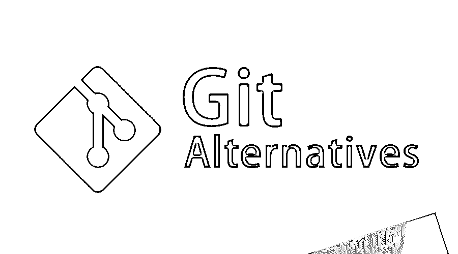
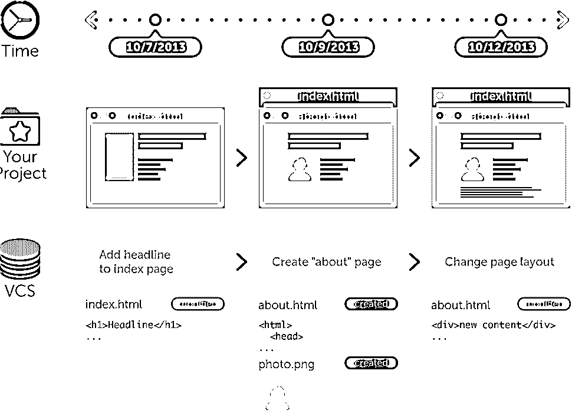
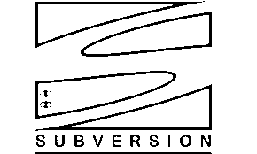
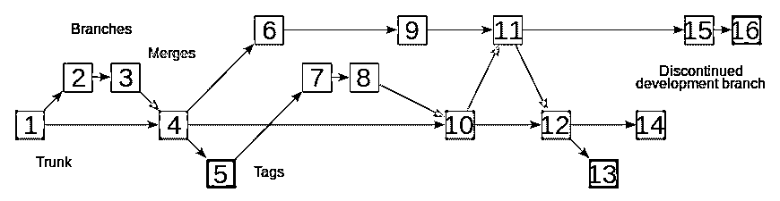
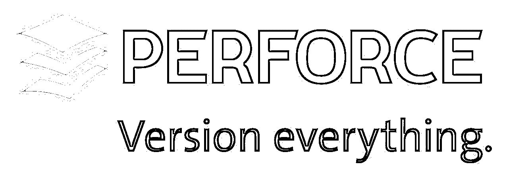
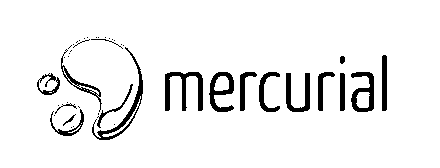

# Git 替代品

> 原文：<https://www.educba.com/git-alternatives/>

## Git 替代品介绍

Git 是 Linus Torvalds 在 2005 年创建的最著名和最安全的版本控制系统之一，主要是在 Linux 上开发的[，它支持其他操作系统，包括 macOS、Windows、BSD 和 Solaris。Git 的所有库都是平等的，这使得它成为最好的版本控制系统之一。它有一个基于网络的](https://www.educba.com/install-linux/)[托管](https://www.educba.com/what-is-hosting/)服务，名为 GitHub，在全球范围内很受欢迎，开发人员不时在 GitHub 上上传他们的代码，以展示他们在任何特定技术上的可信度。就连雇主也把 Github 视为一份虚拟简历，强调一个人的潜力。

### 版本控制系统

让我们先了解一下什么是版本控制系统(VCS)。VCS 是一种数据库，可以让你保存整个项目的快照，稍后当你查看旧的快照时，VCS 会显示你当前的快照与旧的有多么不同。

<small>网页开发、编程语言、软件测试&其他</small>

VCS 不是一个部署系统，在这个系统中，当您开始使用版本控制时，您不必更改或替换工具链的任何其他部分。版本控制系统记录您对项目文件所做的更改。这就是版本控制的意义所在。这听起来很简单。

### Git 是什么？

Git 在开发社区中的流行很大程度上是因为内容可以定期存储和跟踪。[它允许您](https://www.educba.com/what-is-git/)定期向存储的代码中添加新代码，并维护正在通过的每个变更的历史。

Git 的跟踪级别是独特的，因为与其他版本控制系统不同，分支和标签也存储在历史中。但是除了 Git 还有其他选择，Git 被许多公司用作版本控制系统，以保证他们的项目在云存储库中的安全。

### Git 的替代品

和上一节一样，我们已经介绍了 Git。现在，我们将了解 Git 替代方案:

#### 1.SVN

Apache Subversion 是一个软件版本和修订控制系统，在 Apache 的许可下作为开源软件发布。subversion 项目由 CollabNet 于 2000 年创立，旨在创建一个基于 CVS(并发版本系统)的开源系统，该系统修复了一些 bug 并增加了一些新功能。

*   **在 SVN 的分支和标记**

Subversion 使用文件间分支模型来实现分支，分支处理单独的开发和标记行，将标签添加到将来要跟踪的存储库中。

*   **颠覆架构**

目录结构

下面是一个具有多个功能的 SVN 项目的参考

`test_project/path/README.md
test_project/path/lib/widget.rb
test_project/path/new_feature/README.md
test_project/branches/new_feature/lib/widget.rb
test_project/branches/another_new_feature/README.md
test_project/branches/another_new_feature/lib/widget.rb`

**SVN 的优势:**

*   SVN 比其他人快。
*   它支持二进制文件的版本控制
*   它添加了事务提交(要么全部提交，要么什么都不提交)

#### 2.并行版本系统

**

** 

CVS 是一个世界范围内使用的版本控制系统，在它的帮助下，人们可以捕获源文件和文档的历史。它也在许多生产软件项目中使用。

CVS 在 RCS 拓扑下工作，RCS 拓扑存储文件并处理单个文件的多个版本。

### 它是如何工作的？

CVS 是一个中央系统，它跟踪提交的更改，并避免服务器和客户端数据版本之间的冲突。然而，在有任何争议的情况下，会相应地提出更改并进行调整。

**Perforce:** Perforce 是 git 的替代品之一；它是最有效的版本控制系统，可以管理多人同时处理相同的文件，并且它可以跟踪更改，以确保在必要时恢复到以前的版本。

Perforce 的客户机-服务器架构允许一方在本地磁盘上进行更改，然后提交，而另一方可以用他们的文件更新存储库。虽然数据是通过中央存储库共享的，但是失败的提交会回滚到以前的状态，并可以重新提交。

#### Perforce 的优点 **:**

*   Perforce merging 比 Subversion 或 Git 要好。
*   Perforce 拥有[优秀的客户支持](https://www.educba.com/customer-support/)。
*   Perforce 允许将 Subversion 的存储库修订与单个文件修订结合起来。
*   然而，在多个变更列表的情况下，Perforce 比 SubVersion 更好，因为当一个文件从默认的变更列表中移出时，没有不自觉的提交。
*   Perforce 的另一个优点是可以指定工作目录的布局。

Mercurial: Mercurial 的 CLI 是一个功能全面、稳定、优雅的版本控制系统，它遵循单个命令精确执行单个命令的原则。Mercurial 的简单方法产生了流畅简洁的文档。它的架构清晰明了，易于使用。

Mercurial 还简化了工具之间的转换，很像 Subversion。它有助于创建别名，并使它们成为一个令人愉快的界面。

#### Mercurial 的优势:

*   对服务器备份的依赖被最小化，因为可以在本地系统上找到存储库的整个副本。
*   它在线和离线都可以工作，这意味着即使没有互联网连接，工作也可以继续，更改可以提交到本地存储库。
*   Mercurial 版本控制系统的变更集的组织是通过允许代码分支或合并的修订来完成的，这在 SVN 是很困难的。

### 趋势

公司应该采纳软件发布管理中的一些重大变化。

*   第一个趋势是在核心采用敏捷实践，包括自动化，这将允许冲刺和迭代计划，以及对成功发布的所有数据的回顾。此外，公司应该在自动化方面投入时间和金钱，以确保 sprints 的故事和功能的相关性。
*   如今，团队需要在发布之前在多个环境中测试他们的产品，这凸显了云平台在生产环境中的重要性。今天的大多数产品，从操作系统到互联网浏览器，都支持不同的平台，这使得测试在所有情况下都是必不可少的。
*   像 GIT、Mercurial 等分布式版本控制系统的流行。由于它为团队提供了在不同级别工作的灵活性，使得个人更容易在自己的系统上保持一个自包含的存储库。开发人员可以脱机工作，而不需要特权主存储库。

### 推荐文章

这是 Git 替代品的指南。在这里，我们讨论了 Git 的基本概念和不同的替代方案，以及 mercurial 的趋势和优势。您也可以阅读以下文章，了解更多信息——

1.  [吉拉 vs Github](https://www.educba.com/jira-vs-github/)
2.  [Siri 替代品](https://www.educba.com/siri-alternatives/)
3.  [什么是 GitLab](https://www.educba.com/what-is-gitlab/)

