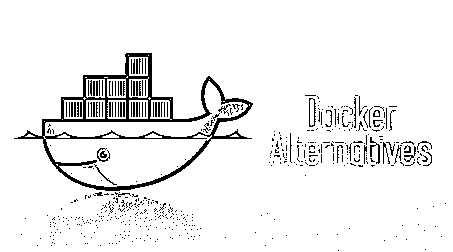
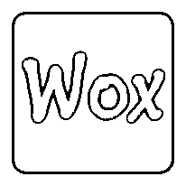
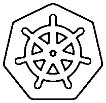

# 码头工人替代品

> 原文：<https://www.educba.com/docker-alternatives/>

## Docker 替代品介绍

Docker 是一个使用容器来运行应用程序的工具。使用该工具可以非常轻松地创建、部署和运行应用程序。现在，开发人员可以将一个应用程序与其他所需的组件和库结合在一起。这确保了应用程序可以在任何机器和环境上运行，因为容器保存了所有需要的文件。

作为虚拟机运行。区别在于它是如何运行的。Docker 不创建虚拟操作系统，但是它提供了运行应用程序所需的所有组件和代码。这优化了性能，并最小化了运行应用程序所需的大小和速度。

<small>网页开发、编程语言、软件测试&其他</small>

### 谁应该使用 Docker？

这个工具对开发人员和管理员都有好处。因此，它是 DevOps 工具链的重要组成部分。开发人员现在不必担心代码运行的环境。因此，开发人员可以专注于编写有效且高效的代码。Docker 为运营团队提供了灵活性，也减少了所需的系统数量，因为它占用的空间相对较小，开销也较低。

### Docker 有哪些利弊？

**优点:**

*   快速的
*   有据可查
*   拥有公共容器注册中心

**缺点:**

*   存储困难
*   监控不力
*   依赖于平台

### 码头工人备选清单

不同的备选方案如下:

#### 1.虚拟盒子

Oracle 的 Virtual Box 工具，顾名思义，创建了一个虚拟环境，允许开发人员在不同的平台上设置和运行他的应用程序。这可以在任何标准 X86 操作系统上运行。开发人员可以使用 Docker 替代方案，直接从自己的系统中创建基于云的在线存储。创建和更新计算机和系统，以及格式化文件以便在任何操作系统上运行，这些都是通过虚拟机器实现的。因此，Virtual Box 是一个为开发者提供灵活解决方案的工具，让他可以跨平台工作。Virtual Box 也让开发者非常方便地[使用云计算](https://www.educba.com/cloud-computing-services/)和在操作系统之间切换。

#### 2.无赖

开源软件流浪者是一个为软件开发构建、支持和维护可移植虚拟[环境而开发的工具。该工具的目标是通过简化虚拟化的软件配置管理来最大限度地提高开发效率。这个程序是用 Ruby](https://www.educba.com/what-is-software-development/) 开发的[。然而，生态系统支持多种语言的开发。](https://www.educba.com/uses-of-ruby/)

#### 3.出口伤

Wox 已经被证明是 Windows 操作系统非常有效的启动器。Wox 是一个开源代码，是一个功能齐全的启动器，帮助开发人员访问程序、web 内容和其他信息，与其他工作并行。这有助于开发人员提高工作效率。在 Github 上可以免费获得 Wox。

#### 4.大牧场主

作为一个开源代码，Rancher 是 Docker 备选方案列表中的另一个，旨在为组织提供他们需要的一切。该软件结合了在生产中采用和运行容器所需的环境。一个牧场主建在 Kubernetes 上。该工具通过简化应用程序的测试、部署和管理来帮助开发团队。运营团队使用牧场主来部署、管理和保护 Kubernetes 的每个部署，而不管它们运行在什么平台上。

#### 5.库伯内特斯

这是专为管理、扩展和部署容器化应用程序而设计的软件。Kubernetes 正在被各种受欢迎的公司使用，如 SAP，雅虎，口袋妖怪 GO，黑石，纽约时报，易贝，培生，Bla Bla Car，高盛，飞利浦，Zulily，华为，WePay，SoundCloud。这个工具甚至有自己的惯例:KubeCon。

#### 6\. Apache Mesos

另一个 Docker 替代品是 Apache Mesos。该工具旨在利用现代内核的特性，以执行资源隔离、优先化、限制和记账等功能。这些功能通常由 Linux 中的组或 Solaris 中的区域来执行。Mesos 的作用是为内存、I/O 设备、文件系统和 CPU 提供隔离。使用 Linux 容器也是可能的，但是 Mesos 受限于 CPU 和内存。

#### 7.LXC Linux 容器

LXC 容器的 3 个主要组件包括运行时组件 LXD LXC，这是一个在 GO 中开发的守护线程。该组件管理容器和图像。第三个组件是 LXFUSE。该组件管理文件系统。LXC 是一套更老、更流行但层次较低的工具。LXD 组件扩展了 LXC，从而为更好地管理容器提供了更好的用户界面和 CLI。LXD 模拟用于操作可用虚拟机的体验，但仅在容器方面。这是在没有任何虚拟机服务器开销的情况下完成的。LXD 组件可以在 Windows 和 MacOS 客户端上配置。这个 Linux 容器有一些缺点，比如缺少 Kubernetes 集成和 LXC 不兼容 PCI。但是 LXRUN 很有可能解决这些缺点。

尽管 Docker 有许多在许多用例中有用的特性，但在选择工具之前理解一个人的业务需求是很重要的。人们应该始终考虑各种可用的工具；提供的功能和特性，并根据业务用例进行比较。然后零开始直到最后的决定。

### 推荐文章

这是码头工人选择的指南。在这里，我们讨论了 8 个码头工人的替代方案，各有利弊。您也可以阅读以下文章，了解更多信息——

1.  [Docker 面试问答](https://www.educba.com/docker-interview-questions/)
2.  [五大 PHP 备选方案](https://www.educba.com/php-alternatives/)
3.  [soap ui 备选列表](https://www.educba.com/soapui-alternatives/)
4.  [AWS 替代品](https://www.educba.com/aws-alternatives/)

