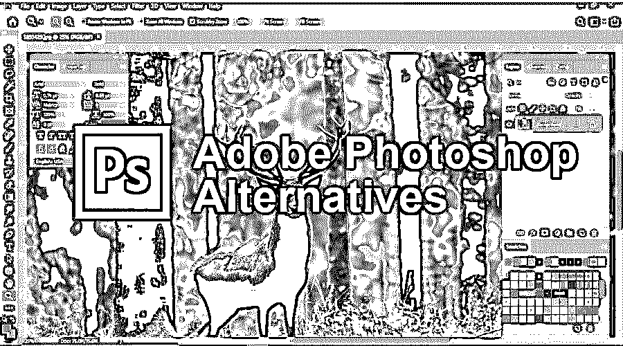

# Adobe Photoshop 替代品

> 原文：<https://www.educba.com/adobe-photoshop-alternatives/>

## Adobe Photoshop 替代品介绍

当我们想到图像编辑时，首先出现在我们脑海中的是 Photoshop。无论是专业人士还是学生，在创意领域，每个人都知道它带来的特点和好处。唯一的问题是购买和在您的系统中使用它需要巨大的成本。对于那些正在寻找类似的编辑和处理图像的软件的人来说，我们在下面列出了那些花费不多但可以成为满足你需求的强大设计工具的应用程序。Affinity Photo，Sketch，Pixlr，GIMP，Inkscape，SumoPaint，Canva，Paint.net，Krita 是你可以考虑的 Photoshop 的替代品。阅读完这篇 adobe photoshop 备选文章后，根据您的需求选择一个合适的。其中一些工具和 Photoshop 一样强大且易于使用。

### Photoshop 是什么？

Adobe Photoshop 是图像编辑和处理方面的行业标准软件。它是由 Adobe 公司开发的基于光栅的图形应用程序，于 1988 年首次发布。它可以在 Windows 和 Mac 操作系统上运行。Photoshop 是全球创意专业人士最喜爱的工具，它让他们的工作变得更加简单有效。Photoshop 的工作区有三个部分，您可以在其中访问各种工具和设置。工具位于左侧，选项位于顶部，面板位于右侧。

<small>网页开发、编程语言、软件测试&其他</small>

### Adobe Photoshop 替代品列表

以下是可以替代 Adobe Photoshop 的图像编辑选项:

#### 1.亲和照片

Affinity Photo 兼容许多文件格式，包括 Photoshop。它可以由设计师和摄影师制作和使用，因为它提供了与 Photoshop 相匹配的专业功能和质量。Affinity Photo 也非常便宜，是 Photoshop 的最佳替代品之一。它拥有卓越的速度，稳定的功能，无限的操作；但是，这些功能中的大部分取决于您的系统硬件。建议至少要四核的。可以在 Windows 和 Mac 中使用 Affinity。

#### 2.素描

sketch 是一个灵活的矢量图形应用程序，专门为设计师提供了一个灵活的工具。它擅长使用矢量形状和无限缩放功能处理多种分辨率。对于你的设计需求，有像原始形状，铅笔等工具。Sketch 的界面非常友好，类似于 Adobe 的 Photoshop 和 Illustrator。它具有层，渐变选项，风格预设，等等。此外，网上有很多插件可供你在项目中使用。

#### 3.Pixlr

Pixlr 的 USP 是它有 600 种效果、叠加和边框。这是一个很好的图像编辑器，拥有你所期望的所有基本功能。您可以裁剪、调整大小和处理颜色，等等。如果一个人熟悉 Photoshop，学习 Pixlr 是很容易的。这款免费的应用程序可以用作网络应用，也可以在 Android 和 iOS 平台上使用。

#### 4.瘸子

与 Photoshop 类似，GIMP 有广泛的预设，用于专业的图像处理。这是一个强大的图形工具，可以免费使用。用户界面与 Photoshop 不同，但有一个类似 Adobe 界面的 GIMP 版本,供那些从 Photoshop 迁移过来的用户使用。GIMP 于 1995 年发布；它很快成为一款广受欢迎的照片编辑应用，受到数百万用户的喜爱。

#### 5.Inkscape

名单上的另一个免费图形工具是 Inkscape。Inkscape 有趣的地方在于它的智能绘图功能。这是一个构建良好的专业应用程序，支持导入/导出多个文件，可定制，并支持多种语言。

#### 6.SumoPaint

一个基于浏览器的软件，SumoPaint 是一个非常强大的图片编辑器。这是一个加载速度很快的轻型工具。它有付费和免费两个版本可供使用。界面包括形状、画笔、铅笔、文本、克隆等。它们在工具栏中提供。您可以处理硬盘上保存的文件。所以 SumoPaint 是 Photoshop 很好的替代品。

#### 7.帆布

Canva 也是一款面向专业人士的基于浏览器的设计应用。它收集了大量的字体、滤镜、图标、照片等。，让您的设计工作更轻松。只需将需要编辑的图像拖放到 Canva 框中，然后开始工作。Canva 拥有超过 1000 万的用户群。

#### 8.Paint.net

Paint.net 是免费使用的开源软件，支持用户创建的插件和工具。它是作为 Paint 女士的竞争对手开发的。今天，它已经发展成为一个有用的图像编辑器。Paint.net 自带自动滤镜和编辑工具。用户可以遮罩、处理图层、处理图像等等。界面也很简单，任何人都可以学习。您可以在 Paint.net 上处理多张照片。您可以从多个标签中提取照片，以简化工作。它还显示缩略图来表示图像。Paint.net 是 Photoshop 的有效替代品，但比它更好；它可以在低配置的计算机上流畅运行。您可以在本地保存任意数量的图像。

#### 9.粉笔吗

Krita 面向概念艺术家；这是一个数字素描程序，允许用户从头开始创作艺术品。商店里有很多功能可以帮助你。Krita 为其用户提供学习资源。因此，你可以很容易地学习新程序。Krita 也支持 PSD 文件。因此，如果你有许多迷人的想法，并且正在寻找将它们变成现实的方法，那么 Krita 就是你的工具。

### 结论

设计软件不需要花费太多。photoshop 是 Adobe 公司的一款有用的设计软件，在创意产业中占有无可匹敌的地位。但是，它不是免费提供的，用户需要为其许可证支付订阅费。如果您不想为 Photoshop 付费，您可以考虑使用提供类似功能和有效用户界面的替代应用程序。这些设计程序也可以免费获得或以经济的方式提供。Affinity Photo，Sketch，Pixlr，GIMP，Inkscape，SumoPaint，Canva，Paint.net，Krita 都是很好的设计工具，可以提供 Photoshop 的功能。您可以使用上述软件来设计徽标、编辑、调整大小、裁剪图像等等。

### 推荐文章

这是一个关于 Adobe Photoshop 替代品的指南。在这里，我们讨论了 9 大 Adobe Photoshop 替代品及其用途和功能。您也可以阅读以下文章，了解更多信息——

1.  [搅拌机替代品](https://www.educba.com/blender-alternatives/)
2.  [CorelDraw 替代品](https://www.educba.com/coreldraw-alternatives/)
3.  [玛雅替代品](https://www.educba.com/maya-alternatives/)
4.  [ZBrush 替代品](https://www.educba.com/zbrush-alternatives/)

