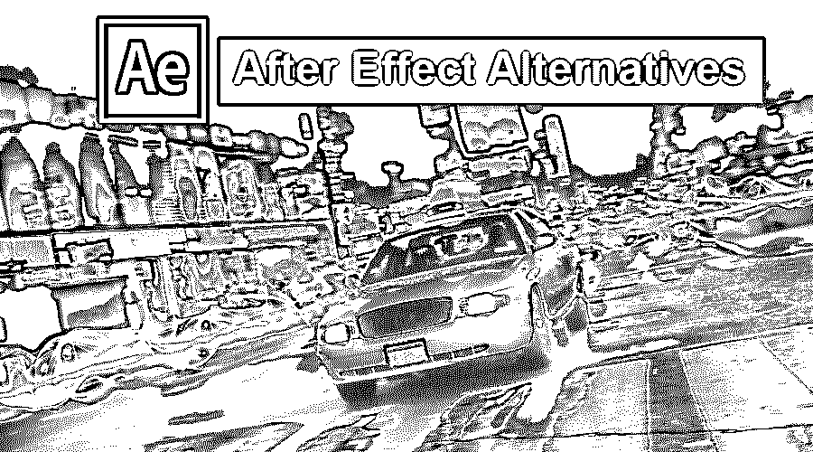

# 后效替代方案

> 原文：<https://www.educba.com/after-effect-alternatives/>

## 后效替代品介绍

借助 Adobe After Effects 替代产品，您可以发挥自己的创造力和想象力来制作明亮的运动图形和梦幻般的视觉效果。但是我的个人经验告诉我，这并不像看起来那么容易。但是是的，如果你做的练习越来越多，你就能做到。那么，有没有可能用强大的效果，比如 [After Effects](https://www.educba.com/what-is-after-effects/) ，快速轻松地改善你的视频呢？

是的，我们可以说 aftereffect 是市场上功能强大的软件编辑器之一。如果你找不到适用于 Windows、Mac 或 Linux 的 Adobe impact。

<small>网页开发、编程语言、软件测试&其他</small>

有各种工具和软件用于创建数字视觉效果、[运动图形](https://www.educba.com/what-is-motion-graphics/)和合成。在这篇文章中，我们将会看到那些后效的替代品。

### 后效替代品列表

以下是 Adobe Premiere 的 10 大替代产品:

#### 1\. Wondershare Filomra Pro

Wondershare Filomra Pro 是 After Effects 的最佳替代品之一，因为如果你认为 After Effect 很难使用，你可以试试这个。Filmora Pro 设计有 50 多种精心组织的效果设置，因此您可以更好地控制视频效果，包括 360°视频、抠像和灯光。此外，Filmora Pro 支持无限的视频和自动音频同步轨道。现在就可以下载试试！它是免费使用的。

**filo MRA Pro 的特点**

*   您可以轻松创建专业的视频效果
*   制作流畅的工作流程动画效果。
*   控制超过五十种效果

#### 2.蜡

WAX 是一个轻量级编辑器。合成和独特的变化，如后效，可以用蜡来完成。这个免费的 After Effects 程序可以作为一个独立的应用程序使用，也可以作为一个软件插件使用，比如 Sony Vegas。与 After Effects 相比，wax 的功能非常有限，但可能足以处理数字视频编辑。这个开源程序有 3D 文本效果、合成和特殊效果，如雨或烟。

**蜡的特性**

*   在 Wax 中，您可以在视频中创建 3D/2D 效果。
*   Wax 可以作为插件使用。
*   对于处理，我们可以使用图形加速。

#### 3.HitFlim

HitFlim，我们可以说都在一个包里。如果你是一名视频编辑，FXhomeHitFilm 工具可能是你整个工具包的一大补充。有许多预设效果可以帮助您快速轻松地创建好莱坞式的视频。

**hit film 的特点**

*   820 + VFX 和热门电影的预设
*   HitFlimEditer 支持所有媒体文件

#### 4.搅拌机

Blender 是像 After Effect 软件一样的开源免费软件。在 Blender 中，您可以创建动画、3D 效果、3D 应用程序以及视频游戏。它有许多功能，如三维建模，纹理，索具，蒙皮和流体，烟雾模拟。它可以在微软的 Windows、MacOS 和 Linux 等操作系统上使用。它通过灵活的 Python 控制的界面提供了数百个插件，包括一个可定制的选项。它与 2 GHz 双四核处理器、8 GB 或更多 RAM、FireGL 和 1920×1200 分辨率显示器配合使用效果最佳。

**搅拌机的特点**

*   它对几乎所有操作系统都是开源的
*   超声渲染是可访问的

#### 5.ButtleOFX

这是一个简单高效的开源合成软件，基于 ButtleOFX 最好的图像处理架构之一。对您的照片和视频的影响是辉煌的。这是一个简单的合成软件，为用户体验设计了许多创造性的功能。

#### 6.泡碱

Natron 是一个数字作曲家，它能以极大的响应能力处理你的 2D 和 3D。它实际上是所有系统(如 MacOS、Linux 和 Windows)上开源应用程序的优秀编辑器。虽然它看起来像是一个简单的应用程序，但其复杂的层次无疑会将您的创造力提升到一个新的水平。

#### 7.核武器

核武器是后效的最佳替代品之一。Github 是一家非常受用户欢迎的公司，正在为 Windows 和 Mac 用户创建这款免费的 After Effects 替代软件以供编辑。出于个人目的，许多用户使用这款软件，其中大多数人仍然使用 NUKE 来获得视觉效果。这是因为购买版权需要大量资金。我们仍然建议我们的用户使用 NUKE，因为这个软件有不同的视觉效果和其他效果。

#### 8\. 3DS Max by Autodesk

Autodesk 的 3DS Max 是一个用于创建精彩游戏和电影的应用程序。在 3D 角色建模、动画和渲染功能等方面，该工具比 After Effects 效果更好。虽然 After Effects 对合成和特效很好。

#### 9.Autodesk 烟雾

用户可以获得 Autodesk Smoke 的 30 天免费试用，但在此期限后，您必须支付订阅费。你可以免费使用上面提到的其他一些软件供私人使用。Autodesk Smoke 支持基于节点的系统，该系统提供各种功能 3D 合成、运动图形效果、颜色校正等。Autodesk Smoke 很受未来想成为专业摄影师的青少年的欢迎，这也是我们把它放在最后的原因。

#### 10.Corel VideoStudio Pro X6

如果你想用智能手机制作电影，Corel 的 VideoStudio Pro X6 是一个很好的选择。这个程序支持智能手机的视频输入。由于其可定制的模板，添加效果更容易。

### 结论

在这篇文章中，我们看到了 Mac/Windows/Linux 操作系统的顶部特效选项。我希望你会喜欢它们，并选择一个供自己使用。找到上面提到的软件，类似于 After Effects，不是一件简单的工作，但是在那里肯定会对你有帮助。

### 推荐文章

这是一个关于后效替代品的指南。在这里，我们讨论了 10 大后效替代方案及其目的和特点。您也可以阅读以下文章，了解更多信息——

1.  [搅拌机替代品](https://www.educba.com/blender-alternatives/)
2.  [CorelDraw 替代品](https://www.educba.com/coreldraw-alternatives/)
3.  [ZBrush 替代品](https://www.educba.com/zbrush-alternatives/)
4.  [玛雅替代品](https://www.educba.com/maya-alternatives/)

