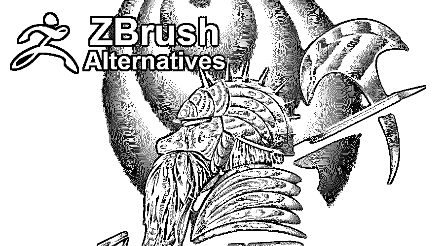
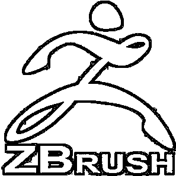
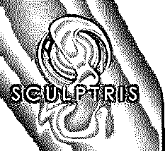
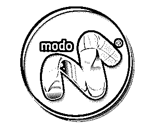

# ZBrush 替代品

> 原文：<https://www.educba.com/zbrush-alternatives/>

## Zbrush 替代品概述

在我们了解 ZBrush 替代品之前，让我们先了解一下什么是 ZBrush
ZBrush 是 Pixologic 开发的 3D 动画包和数字 3D 雕刻工具。游戏、插图和电影等许多行业都认为它是非常重要的组成部分。与迄今为止市场上的任何其他 3D 软件相比，ZBrush 是唯一能够同时在屏幕上显示数百万个多边形的软件。这是因为它处理相机的方式，因为它将所有东西都视为 2.5D 对象，而不是真正的 3D 对象。

电影和游戏产业已经将 ZBrush 整合到他们的生产管道中。随着许多艺术家开始将 3D 融入他们的工作流程，它也成为了插画领域的主导者。角色艺术家多年来一直在使用 ZBrush，目前正在不同类型的面向细节的领域中使用它，如环境、对象或角色建模。

<small>网页开发、编程语言、软件测试&其他</small>

ZBrush 使用基于画笔的雕刻，以便允许艺术家快速地将特征添加到模型中。作为非常详细的模型的一部分的数百万个多边形可以以更快的方式产生。这里使用了像素等技术。像素可以定义为在创建后保持其方向和深度数据的像素。这使你能够改变照明，并将影响像素的阴影。

ZBrush 为艺术家提供了一个工具，允许你在你的模型中产生一定数量的细节，这在以前是不可能实现的。大多数艺术家能够迅速创造出非常精细的模型，这是因为他们用画笔以一种本能的方式创造了模型。

### ZBrush 的替代品

以下是不同的备选方案:

#### 1.搅拌机

Blender 是一个免费的 3D 动画和建模工作室包。它有助于制作可以在电影中使用的角色。它提供了强大的纹理工具，帮助绘制模型的外部部分。它带有强烈的动画和操纵目的。然后，您可以在您已经创建的模型周围移动。它可以被认为是一个合适的电影灯光工作室，也有自己的渲染引擎。

LuxRender 和 YafaRay 等外部渲染器接受 Blender 的支持。与其他 3D 软件包相比，Blender 自带合成模块，因此您可以混合电影镜头。使用独特的视频序列编辑器，可以剪切和编辑电影片段，而不必依赖其他第三方应用程序进行最终的制作编辑阶段。你还可以得到一套游戏创作的套件。

#### 2.雕刻家

Sculptris 是 Pixologic 开发的一款简单的 3D 雕刻软件，可以认为是 ZBrush 的简化版，可以免费获得。123D 和 TinkerCAD 设计软件生产的模型似乎优势明显。为了生成简单自然的形状，如植物和动物，需要对 Sculptris 中的模型进行额外的处理。尽管它很清晰，但它仍然具有强大的功能。

在 Sculptris 中建模就像混合粘土一样本能。它有一个非常干净的操作用户界面。雕塑模型可以从 Sculptris 中导出，设计可以使用 3D 打印机打印出来。Sculptris 的基础是粘土建模的概念。在 Sculptris 的帮助下，虚拟粘土球体可以被推、拉、扭曲、挤压并塑造成所需的形状，就像制作模型粘土一样。

#### 3.4D 电影院

就 3D 图形而言，4D 影院是一个理想的应用程序，尤其是对于那些 3D 领域的新手来说。在 4D 电影院可以很容易地制作出好的 3D 图形。

界面是你观察和操作场景的地方，也是你首先看到的东西。4D 电影院的界面是本能的，可以根据需要定制。使用布局属性可以对界面进行更改，并且可以保存界面的多个设置。也可以创建多种布局，并且可以在彼此之间轻松切换。

#### 4.模式

Modo 可以被定义为一个帮助你获得创造性成果的 3D 建模软件。它由帮助你雕刻、绘画、动画、着色等的模块组成。界面是用户友好的，已经成为众多用户最喜欢的选择。

MODO 是一个非凡的 3D 图形设计软件，由 Foundry 出品。提供了装配、动画、绘画、雕刻和建模工具的适应性贡献，大大扩展了 3D 设计领域。它可以在电影和游戏行业中专业使用。解决问题的人发现这个工具非常有用。可定制性得到了增强。硬面和自然建模以及游戏中的一些高级工具可以在这里找到。

#### 5.Autodesk Mudbox

Autodesk Mudbox 是另一个世界性的 3D 绘画和数字雕刻程序，允许艺术家使用该程序作为画笔来绘制和雕刻数字模型。Mudbox 帮助你制作实用而全面的角色、载具、道具、布景，取悦用户的假设。用户界面本能地有序，这是角色创造流程的重要部分。

Maya(顶级动画、建模、渲染和特效软件)允许您在自身和 Mudbox 之间创建链接。这有助于您在 Maya 中对[对象进行更改，然后您可以将更改应用到 Mudbox，而无需恢复几何体。](https://www.educba.com/what-is-maya/)

### 结论

其他一些类似的软件可以命名为油漆三维，火箭 3F，军械库，雕塑，三维外套，雕塑+，CrackArt，马里和许多更多。Zbrush 经常被引用为列表中第一个可以用于雕刻的材料。为了执行一些繁重的雕刻，3D 艺术家更喜欢 ZBrush。它的功能包括雕刻图层、噪波雕刻和一些重要的重新地形工具。用户界面需要一些时间来理解，并且是非常可定制的。理解艺术家的工作流程需要时间，这可能会使事情变得复杂，而不是在初始阶段使用时有所帮助。同理，透视图也有点棘手。所以，ZBrush 有自己的利弊要处理。

### 推荐文章

这是 ZBrush 替代方案的指南。这里我们讨论 ZBrush 替代品的概念和不同类型。您也可以浏览我们推荐的其他文章，了解更多信息——

1.  [搅拌机替代品](https://www.educba.com/blender-alternatives/)
2.  [AutoCAD 备选方案](https://www.educba.com/autocad-alternatives/)
3.  [CorelDraw 替代品](https://www.educba.com/coreldraw-alternatives/)
4.  [胆大妄为的替代品](https://www.educba.com/audacity-alternatives/)

